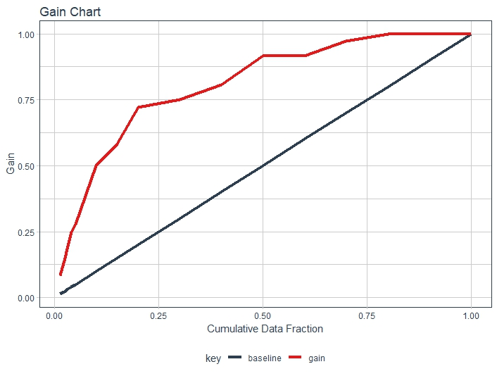
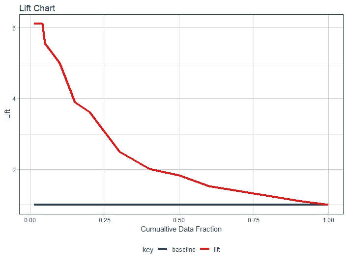
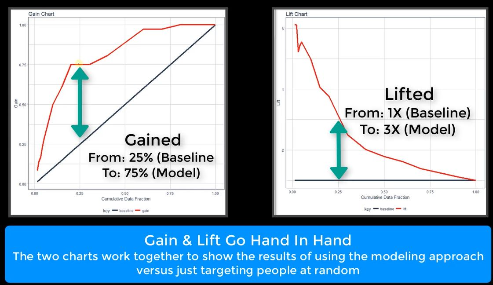

This document expands of the Gain/Lift part of Chapter 5.5.

```{r echo=FALSE, warning=FALSE, message=FALSE}
if(!require(easypackages)){install.packages("easypackages")}
library(easypackages)
packages("plyr", "dplyr", "ggplot2", prompt = FALSE)
```

Need to rerun Lift Plot video to create the content for this document.
    
```{r, out.width = "600px", echo=FALSE}

```

```{r, out.width = "600px", echo=FALSE}

```

```{r, out.width = "600px", echo=FALSE}

```

```{r, out.width = "600px", echo=FALSE}

```


```{r setup, include=FALSE}
knitr::opts_chunk$set(echo = TRUE)
```


