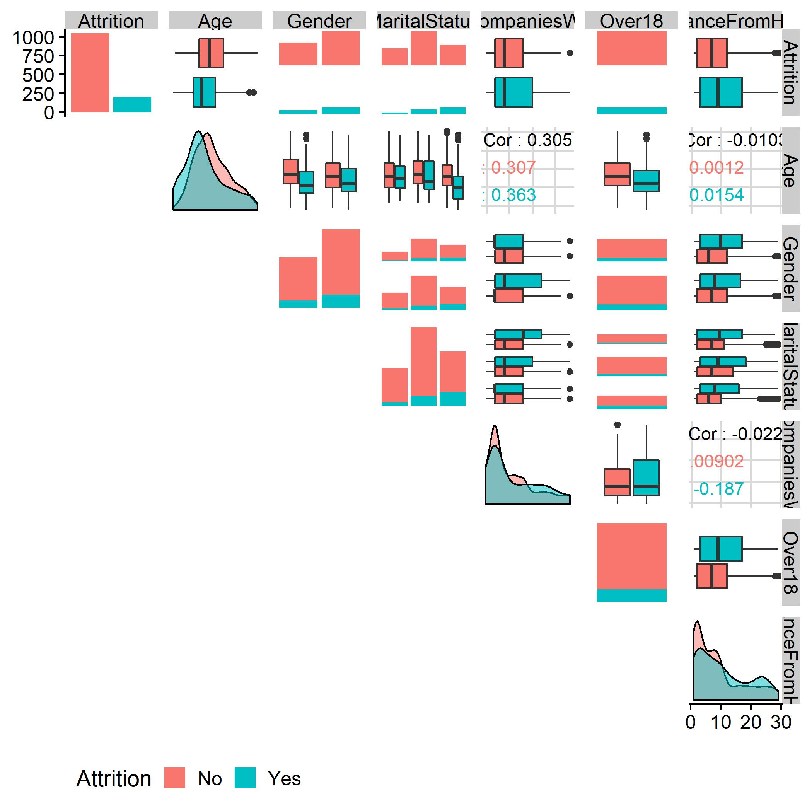
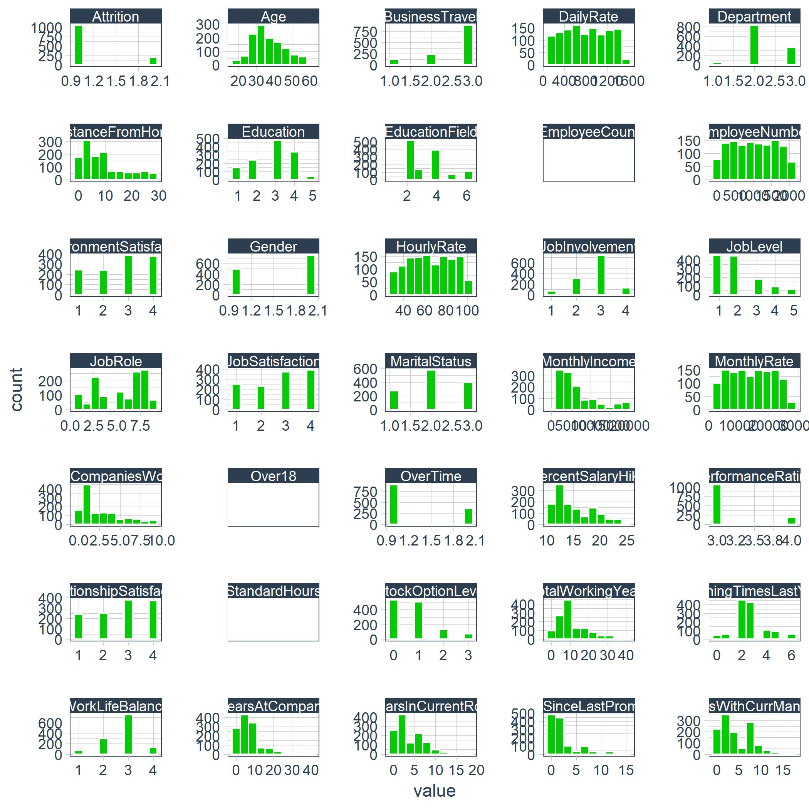
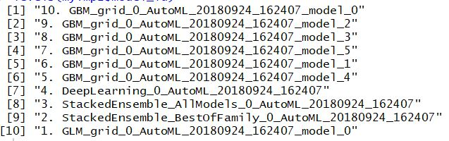

```{r echo=FALSE, eval=FALSE}
#Alt YAML for printing
output:
     word_document
always_allow_html: yes

# Original
output:
  html_document:
    toc: true
    toc_depth: 3
    toc_float: true
    toc_collapsed: true
    code_folding: hide
    number_sections: true  ## if you want number sections at each table header
    theme: united  # many options for theme, this one is my favorite.
    highlight: tango 
```

```{r newH2O, eval=FALSE, echo=FALSE}
#Use only when needed.  H2O is finicky about staying current.  But old models will not load.
# Remove
if ("package:h2o" %in% search()) { detach("package:h2o", unload=TRUE) }
if ("h2o" %in% rownames(installed.packages())) { remove.packages("h2o") }

# download packages 
pkgs <- c("RCurl","jsonlite")
for (pkg in pkgs) {
  if (! (pkg %in% rownames(installed.packages()))) { install.packages(pkg) }}

# Download and install the H2O package for R
install.packages("h2o", type="source", repos=(c("http://h2o-release.s3.amazonaws.com/h2o/latest_stable_R")))

#Will need to rerun any saved models - PITA

# Note, H2O and the H2O R package must be in sync less this error:
# Error in h2o.init() : 
#   Version mismatch! H2O is running version 3.20.0.2 but h2o-R package is version 3.23.0.4464.
#          Install the matching h2o-R version from - http://h2o-release.s3.amazonaws.com/h2o/rel-wright/2/index.html
install.packages("h2o")
```


```{r setWD, echo=FALSE, message=FALSE, warning=FALSE}
setwd("~/GitHub/CourseWork/BusSciUniv/EeeAttrition")

options(scipen = 999)
options(digits = 2)

source("00_Scripts/required_packages.R")
packages("kableExtra", prompt = FALSE)

# Load Data
path_train <- "00_Data/telco_train.xlsx"
train_raw_tbl <- read_excel(path_train, sheet = 1)

# Data Subset
dept_job_role_tbl <- train_raw_tbl %>% 
     select(EmployeeNumber, Department, JobRole, PerformanceRating, Attrition)
```

# Functions TOC

A list of the functions created in this document.

ToDo:

Add:  calculate_attrition_cost, count_to_pct, plot_attrition in scrips - assess_attrition

```{r FunctionTOC, echo=FALSE}
#Visualizations
plot_attrition_link <- paste0("[", "plot_attrition", "](", "#plot_attrition", ")")
plot_ggpairs_link <- paste0("[", "plot_ggpairs", "](", "#plot_ggpairs", ")")
plot_hist_link <- paste0("[", "plot_hist", "](", "#plot_hist", ")")
plot_cor_link <- paste0("[", "plot_cor", "](", "#plot_cor", ")")
plotH2oLeaderboard_link <- paste0("[", "plot_leaderboard", "](", "#plt_leaderboard", ")")
precisionrecallplot_link <- paste0("[", "Precision_Recall_plot", "](", "#precisionrecallplot", ")")
ROCplot_link <- paste0("[", "ROC_Plot", "](", "#ROCplot", ")")
ploth2operf_link <- paste0("[", "H2O_Performance_Plot", "](", "#ploth20perf", ")")
plotlimefeaturetq_link <- paste0("[", "Plot_Lime_Feature_Explain", "](", "#plotlimefeaturetq", ")")
plotlimefeaturestq_link <- paste0("[", "Plot_Lime_Features_Explanations", "](", "#plotlimefeaturestq", ")")
confusionMatrixPlot_link <- paste0("[", "Confusion_Matrix_Plot", "](", "#confusionMatrixPlot", ")")
correlationAnalysis_link <- paste0("[", "Correlation_Analysis", "](", "#correlationAnalysis", ")")

#Function Code
get_cor_link <- paste0("[", "get_cor", "](", "#get_cor", ")")
extract_h2o_model_name_by_position <- paste0("[", "extract_h2o_model_name_by_position", "](", "#extract_model", ")")
modelmetrics_fn <- paste0("[", "Model_Metrics", "](", "#modelmetrics", ")")
calculate_savings_by_thresh_2_link <- paste0("[", "calculate_savings_by_thresh_2", "](", "#calculate_savings_by_thresh_2.jpg", ")")

#Code Snippets
Tidy_Eval_link <- paste0("[", "Tidy_Eval", "](", "#Tidy_Eval", ")")
Tidy_Eval_link2 <- paste0("[", "Tidy_Eval", "](", "#tidy_eval2", ")")
rlang_link <- paste0("[", "rlang", "](", "#rlang", ")")
anonymous_link <- paste0("[", "anonymous", "](", "#anonymous", ")")
fct_recode_link <- paste0("[", "fct_recode", "](", "#fct_recode", ")")
case_when_link <- paste0("[", "case_when", "](", "#case_when", ")")
gather_example_link <- paste0("[", "gather_example", "](", "#gather_example", ")")
fct_reorder2_link <- paste0("[", "fct_reorder2", "](", "#fct_reorder2", ")")
add_column_link <- paste0("[", "add_column", "](", "#add_column", ")")
partial_link <- paste0("[", "partial", "](", "#partial", ")")
firstMap_link <- paste0("[", "firstMap", "](", "#firstMap", ")")
secondMap_link <- paste0("[", "secondMap", "](", "#secondMap", ")")
expand_limits_link <- paste0("[", "expand_limits", "](", "#expand_limits", ")")
scale_x_continuous_link <- paste0("[", "scale_x_continuous", "](", "#scale_x_continuous", ")")
cross_df_link <- paste0("[", "cross_df", "](", "#cross_df", ")")
scale_fill_gradient2_link <- paste0("[", "scale_fill_gradient2", "](", "#scale_fill_gradient2", ")")
str_detect_link <- paste0("[", "str_detect", "](", "#str_detect", ")")


Artifact <- c(plot_attrition_link, plot_ggpairs_link, plot_hist_link, plot_cor_link, 
              plotH2oLeaderboard_link, precisionrecallplot_link, ROCplot_link, ploth2operf_link,
              plotlimefeaturetq_link, plotlimefeaturestq_link, confusionMatrixPlot_link, correlationAnalysis_link,
              #12
              get_cor_link, extract_h2o_model_name_by_position, modelmetrics_fn, calculate_savings_by_thresh_2_link,
              # 12 + 4 = 16
              paste(Tidy_Eval_link, Tidy_Eval_link2, sep = "\n"), rlang_link, anonymous_link, 
              fct_recode_link, case_when_link, gather_example_link, fct_reorder2_link, 
              add_column_link, partial_link, paste(firstMap_link, secondMap_link, sep = "\n"), expand_limits_link, 
              scale_x_continuous_link, cross_df_link, scale_fill_gradient2_link, str_detect_link)
              #16 + 15 = 31


Thumbnail <- c("{width=30%}",
               "{width=30%}",
               "{width=30%}", 
               "{width=30%}", 
               "{width=30%}", 
               "{width=30%}",
               "{width=30%}",
               "{width=30%}",
               "{width=30%}",
               "{width=30%}", 
               "{width=30%}", 
               "{width=30%}", 
               #12
               "{width=30%}",
               "{width=30%}",
               "{width=30%}",
               "{width=30%}",
               #4
               "quos, enquo and !!!", 
               "rlang::sym turns a single character string into an expression.  The expression is typically captured in enquo() or quos() to delay evaluation",
               "If you choose not to give the function a name, you get an 
               [anonymous function](http://adv-r.had.co.nz/Functional-programming.html#anonymous-functions).",
               "mutate(OverTime = fct_recode1(OverTime, 'No' = 'Yes')",
               "mutate(above_industry_avg = case_when(pct > 0.088 ~ 'Yes', TRUE ~ 'No')", 
               "Gather takes multiple columns and collapses into key-value pairs", 
               "fct_reorder() is useful for 1d displays where the factor is mapped to position; fct_reorder2() for 2d displays where the factor is mapped to a non-position aesthetic", 
               "This is a convenient way to add one or more columns to an existing data frame.", 
               "partial allows you to preload a function with arguments that do not change. Part of purrr", 
               "mutate and map are a powerful combination enabling row-wise iteration in a tidy way:  
               mutate(metrics = map(model_id, get_model_performance_metrics, newdata_tbl))",
               "Change the range of axis values in ggplot:  expand_limits(x = c(-1, 1))", 
               "scale_x_continuous(label = scales::dollar) ", 
               "cross_df from `purr` is really helpful.  From a list of variables, it produces all combinations of the list.", 
               "scale_fill_gradient2 uses 2 gradient transitions by specifying low, mid and high arguments along with a midpoint to specify the middle transition point.  There are variations like scale_fill_gradient that offers only a low and high point. scale_fill_gradient_n allows for any number of gradients.", "filter(str_detect(terms, 'YearsAtCompany'))")

DF_toc <- data.frame(Artifact, Thumbnail)

kable(DF_toc, caption = "") %>% kable_styling(bootstrap_options = c("striped", "hover", "condensed", "responsive"), full_width = F) %>% 
     group_rows("Visualizations", 1, 12, label_row_css = "background-color: #666; color: #fff;") %>% 
     group_rows("Functions", 13, 16, label_row_css = "background-color: #666; color: #fff;") %>% 
     group_rows("Code Snippets", 17, 31, label_row_css = "background-color: #666; color: #fff;")
rm(list = ls(pattern = "_link"))
```

# Employee Turnover:  A $15M Problem

Differentiating between productive and non-productive employees is difficult and highly subjective. Some employees are in the top 20% (all stars), some are in the middle 60% (productive), and some are in the bottom 20%. The bottom 20% can be OK or can be poor depending on the overall level of talent in your organization. Sometimes just because they are bottom 20% they are still good employees because the organization is such a high performing organization that everyone they employee is good. However, most organizations do have bad employees. 

Now, in terms of defining productivity, if on a 1 to 4 scale with 1 being poor and 4 being the best that managers rate employees 3 to 4, you can usually be OK in viewing the 4's as productive. They may not always be all stars, especially if 50% of people reviewed get 4's but in reality only 20% should by the bell curve. However, if a manager rates someone as a 1, there is definitely a problem. These people need to either have immediate corrective actions taken or need to be cut loose. This is good attrition because the employee is a poor job/culture fit.

The analysis we are doing specifically looks at bad attrition, losing people that are 3's and 4's. I call them high performers, but in reality, I should be saying productive employees. This group is probably driving 80% of the business results. 

Non-profits will need to be handled based on what the business finds important. While maximizing profit may not be the goal, there are still goals. For example, one goal might be to increase high school graduation rates in schools. This could be set up showing that the percentage of student dropouts are much higher in the district of focus and that increasing graduation rates is expected to reduce crime and increase workforce productivity. Crime reduction would have a savings associated with it. Workforce productivity would have a financial benefit associated with it. These are possible ways we can show financial value for a non-profit.

Non-Profit Cost Analysis: https://www.bridgespan.org/bridgespan/Images/articles/nonprofit-cost-analysis-toolkit/NonprofitCostsAnalysisToolkit.pdf

Non-Profit Strategic Planning:
https://knowhownonprofit.org/organisation/strategy

The tools are quite similar to what you might find in a for-profit scenario. The maximization will be to maximize the financial delta between cost and benefit (to public) versus cost and revenue (for organization). 

## What Happens When Good Employees Leave

*You takeaway our top 20 employees and we become a mediocre company* --Bill Gates

- All employees turnover, some just faster
- Impact of Attrition
     - Varies based on employee productivity
     - Can be measured
- Bad turnover costs the organization

```{r, out.width = "600px", echo=FALSE}
knitr::include_graphics("./images/CostValueEmployee.JPG")
```

[Employee Retention Now a Big Issue: Why the Tide has Turned](https://www.linkedin.com/pulse/20130816200159-131079-employee-retention-now-a-big-issue-why-the-tide-has-turned/)

When a good employee quits, costs are incurred.

```{r, out.width = "600px", echo=FALSE}

```

- Quits
- Vacancy during search
- Cost to train new employee

Not all attrition is bad

```{r, out.width = "600px", echo=FALSE}
knitr::include_graphics("./images/NotAllBad.JPG")
```

## Calculating the Cost of Turnover

- Direct Costs
     - Average Separation (Exit Interviews, Separation Pay, Admin Costs) ($500)
     - Average Vacancy (Temp Help & OT) ($10,000)
     - Average Acquisition (Ads, Travel, Interviews, Physicals, Drug Testing, Bonuses, Reference Checks, etc) ($4,900)
     - Average Placement (New Supplies, Onboarding, Training) ($3,500)
     
$$500+10,000+4,900+3,500=18,900$$

- Productivity Costs (Hidden Costs - only recognized when the problem becomes large. Much higher than direct costs.)
     - Annual revenue per Employee - less COGS (250,000)
     - Workdays per Year (240)
     - Average Workdays Position Open (40)
     - Average Onboarding/Training Period (60 ~ 12 weeks)
     - Effectiveness During Onboarding/Training (50%)
     
$$(250,000/240)*(40+(60*.5))=72,917$$  

- Salary & Benefits
     - Average Salary + Benefits (80,000)
     - Workdays per Year (240)
     - Average Workdays Position Open (40)
     
$$(80,000/240)*40=13,333$$
$$Total Costs = 18,900+72,917+13,333=78,483$$

If there 200 productive employees leave each year, then $200 * 78,483 = 15,000,000$ is the financial cost of turnover.

> Just a 10% reduction (using data science) saves the organization $1.6M/year!
  
# Toolbox Supporting Analysis
  
## Integrated Data Science Frameworks: BSPF & CRISP-DM

Business Science Problem Framework
```{r, out.width = "600px", echo=FALSE}
knitr::include_graphics("./images/DS_Framework.JPG")
```

- Framework provide
     - Consistency across projects
     - Critical Step Checklist
     - Clarity to stakeholders
     - Keeps project on track

BSPF is aligned with industry standard CRISP-DM

# Frameworks 
  
## CRISP-DM

[CRISP-DM](https://www.the-modeling-agency.com/crisp-dm.pdf) is a high level industry-standard framework for data mining.

```{r, out.width = "600px", echo=FALSE}
knitr::include_graphics("./images/CRISP-DM.JPG")
```

> A high level plan that is adaptable but lacks the detail to drive data science projects

CRISP-DM Process Cycle

1. Business Understanding
     - Critical - sets stage for all downstream events
     - Problem solving and project scope development with the business
     - Combines discovery and project management
     - Documents current state and the business success metric
2. Data Understanding
     - 20% of project time typically consumed by data collection
3. Data Preparation
     - 60% of your time cleaning and organizing data
4. Modeling
     - information turned into insight
     - Model Understanding
     - Model Assessment
5. Evaluation
     - Assess degree which the data insights meet business objectives (ROI)
6. Deployment
     - REST API
     - Shiny App
     - Markdown file output
  
## Business Science Problem Framework

The goal is to make good decisions. Systematic decision making starts with measurement and analysis which leads to improvement.

The DSBF is based on [Principles by Ray Dalio](https://www.principles.com/)

BSPF has 7 steps:

```{r, out.width = "600px", echo=FALSE}
knitr::include_graphics("./images/BSPF7Steps.JPG")
```

1. Business as a Machine

```{r, out.width = "600px", echo=FALSE}
knitr::include_graphics("./images/BusAsMachine.JPG")
```

Each part of the business has Objectives --> Machine --> Outcomes.

- Objectives are the goals that serve a inputs or instructions to the machine
- Machine - performs the work and is made of people and processes
     - If People or process is not right, the machine produces questionable output
     - People have biases
     - Process issues abound in all organizations
     - People/process design fit may be poor
- Outcomes - what the machine produces
     - Provides feedback to determine is the objectives are being met

> Our goal is to understand the machine using data

> When you have exhausted all possibilities, remember this - you haven't.

- Thomas Jefferson

# Business Understanding: BSPF & Code Workflows 
  
## Problem Understanding With BSPF 
  
### Business Understanding

The BSPF includes the following steps of the the CRISP-DM Framework:

1. View the Business as a Machine
2. Understand the Drivers
3. Measure the Drivers
4. Uncover Problems & Opportunities

```{r, out.width = "600px", echo=FALSE}
knitr::include_graphics("./images/BusUnderstanding.JPG")
```

### View The Business As A Machine 

> Review business_understanding.R file in 01_Business Understanding folder

Business Units:  Department and Job Role
Define Objectives:  Retain high performers
Assess Outcomes: TBD - Feedback from the business

*Known* - 16.1% attrition in the current state - is this a bad thing?

## Understand The Drivers: By Dept 

Investigate the Objectives:  16% Attrition
Synthesize Outcomes:  High counts and high percentages (learned after hypothesizing drivers). See below under *Understand the Drivers*.
Hypothesize Drivers:  Job Role and Departments

```{r echo=FALSE}
# By Department
dept_job_role_tbl <- train_raw_tbl %>% select(EmployeeNumber, Department, JobRole, PerformanceRating, Attrition)
dept_job_role_tbl %>% group_by(Department, Attrition) %>%  summarise(n = n()) %>%  ungroup() %>% group_by(Department) %>% mutate(pct = n/sum(n))
```
  
Department and Job Roles are common cohorts to evaluate.

HR has 24% attrition, Sales 21% - might be something going on by department.

## Understand The Drivers: By Job Role

```{r}
dept_job_role_tbl %>% group_by(Department, JobRole, Attrition) %>%  summarise(n = n()) %>% ungroup() %>% 
     group_by(Department, JobRole) %>% mutate(pct = n/sum(n)) %>% ungroup() %>% filter(Attrition %in% c("Yes"))
# Used Attrition %in% instead of == because the former is more flexible - can add mutiple categories :  c("cat1", "cat2", . . .)
```

Note there are different roles with each department.  Perhaps certain roles have greater attrition issues than others?  
Note the HR 30%; Note Sales Executive - only 18.3% but there are 50 leaving; Sales Representative may be a problem too.

## Measure The Drivers: Collect Data

> Now in the BSPF - Measure the Drivers Step

This is an iterative task that is ongoing.

You may not have all the data initially. Further, you don't want all the data since many of the features are a distraction prior to understanding if a problem exists. During the Business Understanding phase we need to isolate the critical features that relate to business outcomes and determine if a problem exists such that when solved it provides real value in terms of financial benefit.

There are 35 features to consider:

```{r}
names(train_raw_tbl)
```

### Group Features

Some features related to one and other.  
 
 > It is always helpful to breakdown data collection activities in to strategic areas.
 
- Descriptive Features: 
     - Age, DistanceFromHome, Gebder, MaritalStatus, NumComaniesWorked, Over18
- Employment Features:
     - Department, EmployeeCount, EmployeeNumber, JobInvolement, JobLevel, JobRole, JobSatistfaction
- Compensation Features:
     - DailyRate, HourlyRate, MonthlyIncome, MonthlyRate, PercentSalaryHike, StockOptionLevel
- Survey Results:  
     - EnvironmentSatisfaction, JobSatisfaction, RelationshipSatisfaction, WorkLifeBalance
- Performance Data:
     - JobInvolvement, PerformanceRating
- Work-Life Balance
     - BusinessTravel, OverTime
- Training and Education
     - Education, EducationField, TrianingTimesLastYear
- Time-Based Features
     - TotalWorkingYears, YearsAtCompany, YeasInCurrentRole, YearsSinceLastPromotion, YearsWithCurrentManager

## Measure The Drivers: Develop KPIs

Often review turnover statistics in your industry.  We know our is 16% but we do not know if this is good or bad without [research](http://www.air-prehire.com/blog/industries-high-employee-turnover-rates/.  
Perhaps it simply fails an internal KPI.  

Via web searching, *8.8% average turnover for utility companies* (useful for this data).  (Banking is around 17.2%)
{#case_when}
```{r echo=FALSE}
dept_job_role_tbl %>% group_by(Department, JobRole, Attrition) %>%  summarise(n = n()) %>% ungroup() %>% group_by(Department, JobRole) %>% 
     mutate(pct = n/sum(n)) %>% ungroup() %>% filter(Attrition %in% c("Yes")) %>% arrange(desc(pct)) %>% mutate(above_industry_avg = case_when(pct > 0.088 ~ "Yes", TRUE ~ "No"))
```

Note the Dept and Job Role with high percentages and counts.  To make this more impactful, add cost to this table.

## Uncover Problems & Opportunities

### calculate_attrition_cost()

Create a function the mimics the Excel Calculator.

```{r calc_attrition_cost, echo=FALSE}
calculate_attrition_cost <-  function(
     
     n = 1,
     salary = 80000,
     
     # Direct Results
     separation_cost = 500,
     vacancy_cost = 10000,
     acquisition_cost = 4900,
     placement_cost = 3500,
     
     # Productivity Costs
     net_revenue_per_employee = 250000,
     workdays_per_year = 240,
     workdays_position_open = 40,
     workdays_onboarding = 60,
     onboarding_efficiency = 0.50){
     
     # The code below is the R interpretation of the Excel Spreadsheet
     direct_cost <- sum(separation_cost, vacancy_cost, acquisition_cost, placement_cost)
     
     productivy_cost <- net_revenue_per_employee / workdays_per_year *
          (workdays_position_open + workdays_onboarding * onboarding_efficiency)
     
     salary_benefit_reduction <- salary / workdays_per_year * workdays_position_open
     
     cost_per_employee <- direct_cost + productivy_cost - salary_benefit_reduction
     
     total_cost <- n * cost_per_employee
     
     return(total_cost)}
```

The function includes default values that equal the defaults that were introduced in *Calculating the Cost of Turnover*.  So if we call the custom function `calculate_attrition_cost` with the default values, it returns `r calculate_attrition_cost()`.  If we change the default value of `n = 1` (representing 1 employee) and change it to `n = 200` then the function returns `r calculate_attrition_cost(n=200)`.

### Calculating Cost By Job Level

Using code that we have already seen above and modified it slightly to focus on `JobRole` rather than `Department`, we can begin this part of the journey reviewing `JobRole` data.  Note the we reuse a custom function - `calculate_attrition_cost` to return the cost_of_attrition column below.

```{r}
dept_job_role_tbl %>% count(JobRole, Attrition) %>% group_by(JobRole) %>% mutate(pct = n/sum(n)) %>% ungroup() %>% 
     filter(Attrition %in% c("Yes")) %>% arrange(desc(pct)) %>% mutate(above_industry_avg = case_when(pct > 0.088 ~ "Yes", TRUE ~ "No")) %>% 
     mutate(cost_of_attrition = calculate_attrition_cost(n = n, salary = 80000))
```

Note the costs associated with Sales Executive and Laboratory Technician.

## Streamlining The Attrition Code Workflow 

> This section is dedicated to streamlining the code developed above.
  
### Streamlining The Counts 

This is code commonly used:

```{r}
dept_job_role_tbl %>% 
     
     group_by(JobRole, Attrition) %>%  summarise(n = n())
```

The code above is replaced with this simpler code:

```{r}
dept_job_role_tbl %>% count(JobRole, Attrition) 
```

`count` is part of `dplyr`!

> Do not forget about the `dplyr::tally` function - very useful

*tally() is a convenient wrapper for summarize that will either call n() or sum(n) depending on whether you're tallying for the first time, or re-tallying. count() is similar but calls group_by() before and ungroup() after.*

### Streamlining The Count To Percentage Calculation

> Pay attention - this is really good code using tidy evaluation!

We have this code so far in streamlining the attrition code:

```{r}
dept_job_role_tbl %>% count(JobRole, Attrition) %>% group_by(JobRole) %>% mutate(pct = n/sum(n))
```

Calculating percentages from counts is a *common programming requirements*.  Why not create a function that generalizes this?

```{r}
count_to_pct <- function(data, ..., col = n){
     
     grouping_vars_expr <- quos(...)
     col_expr <- enquo(col)
     
     ret <- data %>% group_by(!!! grouping_vars_expr) %>% 
          mutate(pct = (!! col_expr)/sum(!! col_expr)) %>% ungroup()
                 
     return(ret)     
}
```

- tidy functions always requires the data to take the first position of the function{#Tidy_Eval}
- `...` enables passing multiple, un-named arguments to a function
     - Because the dots are not preselected, the user can flexibly add variables and the function will adapt!
- The 3rd function argument is a column name, in this case n since we are calculating a percentage from the counts in the `n` column

1. `...` must be enclosed on `quos` or `enquo` for multiple columns or single columns, respectfully.  The saves the column names as unevalutated expressions.  They can be called later in the processing.  Use `quos` for multiple columns and `enquo` for the single column we have called `n`
2. `!!!` called bang-bang-bang splices multiple grouping variables and evaluating them.  (Use `!!` for single columns.)

Demo:

```{r}
dept_job_role_tbl %>% count(Department,JobRole, Attrition) %>% count_to_pct(Department, JobRole)
```

### Streamlining The Attrition Assessment

Continuing the development of a streamlined function, review where we are so far:

```{r}
dept_job_role_tbl %>% count(Department, JobRole, Attrition) %>% count_to_pct(Department, JobRole) %>% 
     filter(Attrition %in% c("Yes")) %>% arrange(desc(pct)) %>% 
     mutate(above_industry_avg = case_when(pct > 0.088 ~ "Yes", TRUE ~ "No"))
```

Generalize `filter` - `arrange` - `mutate` statements:

```{r}
assess_attrition <- function(data, attrition_col, attrition_value, baseline_pct){
     
     attrition_col_expr <- enquo(attrition_col)
     data %>% filter((!! attrition_col_expr) %in% attrition_value) %>% arrange(desc(pct)) %>% 
          mutate(above_industry_avg = case_when(pct > baseline_pct ~ "Yes", TRUE ~ "No"))}
```

- As always, tidy eval starts with a data (tibble)
- Next argument is the name of the `Attrition` column - it may not always be called `Attrition`
- 3rd argument are the values of the `attrition_col` - in our case the values are `Yes` and `No`.
- `baseline_pct` is hopefully self-explanatory!

1. Recall `enquo` saves a single column name as an expression that can be evaluated later.  This way the name of the `Attrition` column can be whatever the user chooses!
2. `pct` does not change because that is created consistently in the `count_to_pct` function.  (Of course this could be changed as an enhancement!)
3. Simple substitution for `0.088` to `baseline_pct`.

> Use parenthesis to give Tidy Eval evaluations priority!

> Function inputs in text format (attrition_value = "Yes") do not require Tidy Eval

Demo the new code:

```{r}
dept_job_role_tbl %>% 
     
     count(Department, JobRole, Attrition) %>% count_to_pct(Department, JobRole) %>% 
     assess_attrition(Attrition, attrition_value = "Yes", baseline_pct = 0.088) %>% #New code line
     mutate(cost_of_attrition = calculate_attrition_cost(n = n, salary = 80000))
```

## Visualizing Attrition With ggplot2 
  
Create impactful visualization like this:

```{r, out.width = "600px", echo=FALSE}

```

- The plot above combines Department and JobRole together as labels for the y-axis.
- Need to change the type of the string manipulated in #1 to a factor and order it from high to low based on cost_of_attrition to make the plot readable.
- Need to format the text labels to make the plot easy-to-read and professional!
  
### Data Manipulation For Visualization 

Here is the code so far plus some data manipulation so we can produce the plot.
{#fct_reorder}
```{r}
dept_job_role_tbl %>% 
     
     count(Department, JobRole, Attrition) %>% count_to_pct(Department, JobRole) %>% 
     assess_attrition(Attrition, attrition_value = "Yes", baseline_pct = 0.088) %>% 
     mutate(cost_of_attrition = calculate_attrition_cost(n = n, salary = 80000)) %>% 

     # Data Manipulation 
     mutate(name = str_c(Department, JobRole, sep = ": ") %>%  as_factor()) %>% #LINE 1
     mutate(name = fct_reorder(name, cost_of_attrition)) %>% # LINE 2
     mutate(cost_text = str_c("$", format(cost_of_attrition / 1e6, digits = 2), "M", sep = "")) # LINE 3
```

- LINE 1: `str_c` from `stringr` concatenates `Department` and `JobRole` with a colon in between them. 
     - factors are required in `ggplot` because they are used to order categorical variables (text will not work)
     - `as_factor` is part of `forcats`.  This function creates levels in the order in which they appear, which will be the same on every platform. (Base R sorts in the current locale which can vary from place to place.)
- LINE 2:  `fct_reorder` also from `forcats` reorders a factors numeric values by the magnitude of a different numeric value, in this case, `cost_of_attrition`.
- LINE 3:  `str_c` concatenation again - pretty simple - but effective!

### Visualization With ggplot2

OK, the data manipulation to plot the cost or attrition is complete. Now review the `ggpolt` code to produce the plot shown in the beginning on this section.  It is easy - provided you do one step at a time!

```{r}
dept_job_role_tbl %>% 
     
     count(Department, JobRole, Attrition) %>% count_to_pct(Department, JobRole) %>% 
     assess_attrition(Attrition, attrition_value = "Yes", baseline_pct = 0.088) %>% 
     mutate(cost_of_attrition = calculate_attrition_cost(n = n, salary = 80000)) %>% 

     # Data Manipulation 
     mutate(name = str_c(Department, JobRole, sep = ": ") %>%  as_factor()) %>% #must be factors to order
     mutate(name = fct_reorder(name, cost_of_attrition)) %>% # orders the names by cost
     mutate(cost_text = str_c("$", format(cost_of_attrition / 1e6, digits = 2), "M", sep = "")) %>% 
     
     # Plotting
     ggplot(aes(x = cost_of_attrition, y = name)) +
     geom_segment(aes(xend = 0, yend = name), color = palette_light()[[1]]) + # LINE 1
     geom_point(aes(size = cost_of_attrition), color = palette_light()[[1]]) + # LINE 2
     scale_x_continuous(label = scales::dollar) + # LINE 3
     geom_label(aes(label = cost_text, size = cost_of_attrition), hjust = "inward", color = palette_light()[[1]]) + # LINE 4
     theme_tq() + scale_size(name = c(4,5)) + # LINE 5
     labs(title = "Estimated Cost of Attrition: By Dept and Job Role", y = "", x = "Cost of Attrition") +
     theme(legend.position = "none")
```

- LINE 1: `geom_segment` adds lines to the plot canvas.  The first `ggplot` statement locates the end of the line - at the cost_of_attrition.  `xend` defines the start of the line segment at `x = 0`.  `yend` make sure the line segment aligns with the correct y-axis label. Simple!
     - `palette_light()[[1]]` defines the color [#2c3e5](http://www.color-hex.com/color/2c3e50) from the `tidyquant` package.
     - the other colors in `palette_light` are: `r palette_light()`
     
- LINE 2:  `size = cost_of_attrition` adjusts the size of the segment endpoint to the attrition cost magnitude (could have included this in the first aes statement)
- LINE 3: Formatting the x-labels with the `scales` package to get the values in dollar format.  Remember the `scale_x_continuous` ggplot function!
- LINE 4: `geom_label` simply adds labels to points on the plot using cost_text` that was created easier in the plot data manipulation.
     - Cool the label size can be dynamically set by the attrition cost.
- LINE 5: `theme_tq` from `tidyquant` is a general theme that adjusts background, faceting palette, legend position and more.  Works well for conservative business publications.
     - `scale_size` adjusts the max and min size of elements to prevent large/small values from becoming too large/small.  The label sizes are now limited to `size = 3` making the lower values label text now readable.  Cool!

## Making A Custom Plotting Function
  
The goal is to replace the code below - copied from the last plotting exercise:

```{r results='hide'}

dept_job_role_tbl %>% 
     
     count(Department, JobRole, Attrition) %>% count_to_pct(Department, JobRole) %>% 
     assess_attrition(Attrition, attrition_value = "Yes", baseline_pct = 0.088) %>% 
     mutate(cost_of_attrition = calculate_attrition_cost(n = n, salary = 80000)) %>% 
###<b>
     #Data Manipulation 
     mutate(name = str_c(Department, JobRole, sep = ": ") %>%  as_factor()) %>%
     mutate(name = fct_reorder(name, cost_of_attrition)) %>% # orders the names by cost
     mutate(cost_text = str_c("$", format(cost_of_attrition / 1e6, digits = 2), "M", sep = "")) %>% 
     
     #Plotting
     ggplot(aes(x = cost_of_attrition, y = name)) +
     geom_segment(aes(xend = 0, yend = name), color = palette_light()[[1]]) +
     geom_point(aes(size = cost_of_attrition), color = palette_light()[[1]]) +
     scale_x_continuous(label = scales::dollar) +
     geom_label(aes(label = cost_text, size = cost_of_attrition), 
                hjust = "inward", color = palette_light()[[1]]) + 
     theme_tq() + scale_size(name = c(4,5)) +
     labs(title = "Estimated Cost of Attrition: By Dept and Job Role",
          y = "", x = "Cost of Attrition") + theme(legend.position = "none")
###</b>
```

Do no be intimidated - it is not as hard as it might appear initially!

## Developing plot_attrition() {#plot_attrition} {#tidy_eval2} {#rlang}

First, an explanation of quosures and tidy evaluation:

There are four functions:
- `quo()` and `enquo()`: singular, captures one variable, stored as unevaluated expression
- `quos()` and `enquos()`: plural, captures multiple variables, stored as list of multiple unevaluated expressions

Explanation:
`enquo()` is singular and used inside a function. It is comparable to `quo()` which is used outside of functions. Both functions do roughly the same thing, which is quote (meaning capturing the unevaluated variable as an expression before it gets updated). The "quoted" variable is stored for evaluation later. The main difference between `quo()` and `enquo()` is `quo()` should be used outside functions and `enquo()` should be used inside. The reason why is not important and really complex. 

The `rlang` library now has an `enquos()` function that is plural (rlang did not always have `enquos()` which is why `I used `quos()` was used.. Both capture multiple variables as expressions contained inside a list. This is useful when you don't know how many arguments the user will supply. For example several columns. The difference between `quos()` and `enquos()` is, again, that `quos()` is meant to be used external to functions whereas `enquos()` is meant to be used internal. However - This is not what the tutorial shows because of an inconsistency with early versions of `rlang` that did not include the `enquos()` function. 

`rlang::sym` turns a single character string into an expression.  The expression is typically captured in     enquo()` or `quos()` to delay evaluation.
The `sym()` and `syms()` functions are only necessary when converting a string to a symbol. Generally the user will supply a symbol, such as a column name. They don’t typically supply a string. Therefore, we only need to use `sym`/`syms` in this special case where we have a string that represents one or more column names. 

In summary:
- Use `quo()` / `enquo()` when capturing one variable. 
- Use `quos()` / `enquos()` when capturing multiple variables. 
- Use `quo()` / `quos()` outside of functions. 
- Use `enquo()` / `enquos()` inside of functions.

```{r plot_attrition_fn}
plot_attrition <- function(data, ..., .value, # ... capture the departments - mutate(name = str_c(Department, JobRole....; .value - cost_of_attrition
                           fct_reorder = TRUE, # order the function by the .value argument
                           fct_rev = FALSE, # ascending vs descending y lables
                           include_lbl = TRUE,
                           color = palette_light()[[1]],
                           units = c("0", "K", "M")) {
                           #sometimes the untis will not be in millions, default is 0 - no units
# Inputs

     group_vars_expr <- quos(...) #perhaps department and JobRoles
     if(length(group_vars_expr) == 0) # Then just use the first column name - these drive the y labels in the plot so there has to be something!
          group_vars_expr <- quos(rlang::sym(colnames(data)[[1]]))
          
     value_expr <- enquo(.value)# for data manipulation (its cost_of_attrition - used in data manipulation and plotting)
     value_name <- quo_name(value_expr)# for ggplot - makes a character string in quotes (opposite of rlang::sym()); ggplot is not ready for tidy eval
     
     units_val <- switch(units[[1]], "M" = 1e6, "K" = 1e3, "0" = 1) #work like nested if functions
     if (units[[1]] == "0") units <- "" #Make it empty because it would get appended to labels in the plot
     
# Data Manipulation
     
     #Function factory - a function that produces a function, usd is the function factory - try it usd(1000)
     usd <- scales::dollar_format(prefix = "$", largest_with_cents = 1e3)

     data_manipulated <- data %>% 
          mutate(name = str_c(!!! group_vars_expr, sep = ": ") %>% as_factor()) %>% 
          #Above () removed around !!! group_vars_expr otherwise str_c sees it a single input - it is a psuedo bug in str_c
          mutate(value_text = str_c(usd(!! value_expr / units_val), units[[1]], sep = ""))
     
     if(fct_reorder){data_manipulated <- data_manipulated %>% 
          mutate(name = fct_reorder(name, (!! value_expr))) %>% 
          arrange(name)} # arrange() is used because fct_reorder() does not actually sort the data, arrange() does the sorting
     
     if(fct_rev){data_manipulated <- data_manipulated %>% 
          mutate(name = fct_rev(name)) %>% 
          arrange(name)}
          
# Visualization
# NOTE:  ggplot does not work with tidyeval framework - requires use of aes_string
     
     g <- data_manipulated %>% 
          ggplot(aes_string(x = value_name, y = "name")) +
          geom_segment(aes(xend = 0, yend = name), color = color) +
          geom_point(aes_string(size = value_name), color = color) +
          scale_x_continuous(label = scales::dollar) +
          theme_tq() +
          scale_size(name = c(4,5)) + #c(3,5) should work but I am not satifies with the output.
          theme(legend.position = "none")
     
     if(include_lbl){
          g <-  g + geom_label(aes_string(label = "value_text", size = value_name), hjust = "inward", color = color)
     }
     return(g)
} 
```

> A  potential problem with an error when trying to use this function on a grouped data set. 

The warning thrown looks like this:
`mutate_impl(.data, dots) : binding character and factor vector, coercing into character vector`
The solution is to add `ungroup()` before the factoring within the Data Manipulation step. 

## More Realistic Attrition Cost

Using estimated average salary and average productivity (revenue) by Job Role and Department, create a more realistic attrition cost estimate.

> See homework_1_assignment.R for some relatively complex dplyr data code.

Here is a peek at the new Excel file that provides the source information.

```{r}
dept_jobrole_tbl <- train_raw_tbl %>%
    select(EmployeeNumber, Department, JobRole, PerformanceRating, Attrition)
kpi_industry_turnover_pct <- 0.088
# Productivity Cost by Role ----
productivity_cost_by_role_tbl <- read_excel("Challenges/productivity_cost_by_role.xlsx")
productivity_cost_by_role_tbl
```

```{r}
dept_jobrole_productivty_tbl <- dept_jobrole_tbl %>% 
     count(Department, JobRole, Attrition) %>% 
     count_to_pct(Department, JobRole) %>% 

     left_join(productivity_cost_by_role_tbl, by = c("Department", "JobRole")) %>% 
     
     assess_attrition(Attrition,attrition_value = 'Yes',baseline_pct = 0.088) %>%
     
     mutate(attrition_cost = calculate_attrition_cost(n = n, salary = Salary_Average,
                                                      net_revenue_per_employee = Revenue_Average))

dept_jobrole_productivty_tbl %>% plot_attrition(Department, JobRole, .value = attrition_cost)
```

```{r}
dept_productivty_tbl <- dept_jobrole_tbl %>% 
     count(Department, JobRole, Attrition) %>% 
     count_to_pct(Department, JobRole) %>% 
     assess_attrition(Attrition, "Yes", kpi_industry_turnover_pct) %>% 
     
     left_join(productivity_cost_by_role_tbl, by = c("Department", "JobRole")) %>% 
     
     group_by(Department) %>% 
     summarise(n = sum(n),
               Salary_Average = sum(Salary_Average), Revenue_Average = sum(Revenue_Average)) %>% 
     mutate(attrition_cost = 
                 calculate_attrition_cost(n = n, salary = Salary_Average, 
                                          net_revenue_per_employee = Revenue_Average))

dept_productivty_tbl %>% plot_attrition(Department, .value = attrition_cost)
```

# Data Understanding

This is the start of the 2nd phase of CRISP-DM - Data Understanding.

```{r, out.width = "600px", echo=FALSE}
knitr::include_graphics("./images/dataunderstanding1.JPG")
```

1. Collect Data is complete - the Excel files have been provided.
2. EDA to explore the critical properties of the underlying features and potential relationships to attrition.

This section introduces `skimr` - a tool for feature exploration by data type.  `GGally` is also introduced to visualize feature interaction relationships using `ggpairs`.

May want to review the feature grouping introduced earlier. [Group Features](#Group Features)

## EDA: Exploring Data By Data Type 
  
### Character Data

`skimr` does provide a good overview of the data automatically separating character and numeric data.  For character data, it is simple to see if any features have more than perhaps 9 unique features, it might suggest binning.  The numeric data with histograms makes it easy to see which variable might be categorical data very quickly.

```{r}
skim(train_raw_tbl)
```

### Character Data

```{r}
train_raw_tbl %>% select_if(is.character) %>% glimpse()
```

Character data does not have levels so use `unique` instead.  `map` from `purrr` maps `unique` across each feature.
```{r}
train_raw_tbl %>% select_if(is.character) %>% map(unique) %>% head()
```

This improves upon `unique` by including the counts for each character feature.

```{r}
train_raw_tbl %>% select_if(is.character) %>% map(table) %>% head()
```

Counts are nice but proportions are better!  Below, `anonymous function` is used. {#anonymous}

> The `~` indicates a formula starts

Also understand that 
`train_raw_tbl %>% select_if(is.character) %>% map(~ table(.))` 
is the sames as 
`train_raw_tbl %>% select_if(is.character) %>% map(table)`.

```{r}
# Anonymous function with ~  
train_raw_tbl %>% select_if(is.character) %>% map(~ table(.) %>% prop.table()) 
```

### Numeric Data

> map_df provides a much cleaner output!  Outputs a dataframe rather than a list.

```{r}
train_raw_tbl %>% select_if(is.numeric) %>% map_df(~ unique(.) %>% length())
```
{#gather_example}
```{r}
train_raw_tbl %>% select_if(is.numeric) %>% map_df(~ unique(.) %>% length()) %>% 
     gather() %>% arrange(value) %>% filter(value <= 10) # features with more than 10 might be nonessential or categorical
```

Numeric features that have fewer levels are likely to be discrete and numeric variables with more are likely continuous.  (Note above the features where `value = 1` may indicate non-essential or zero-variance variables.)  Above are features that might be converted to factors.  The table below suggests the features remain continuous.  

```{r}
train_raw_tbl %>% select_if(is.numeric) %>% map_df(~ unique(.) %>% length()) %>% 
     gather() %>% arrange(value) %>% filter(value > 10) # features with more than 10 might be nonessential or categorical
```

### Visualizing The Feature-Target Interactions 
  
To begin the visualization of the data, select the descriptive variables (serves as an example).  There is a mix of character and continuous features.

```{r}
train_raw_tbl %>% select(Attrition, Age, Gender, MaritalStatus, NumCompaniesWorked, Over18, DistanceFromHome)
```

Apply `ggpair` function:

```{r message=FALSE, out.width="100%", out.width="100%"}
train_raw_tbl %>% select(Attrition, Age, Gender, MaritalStatus, NumCompaniesWorked, Over18, DistanceFromHome) %>% ggpairs()
```

[Customize](http://ggobi.github.io/ggally/#matrix_sections) the output to make it a bit easier to interpret.

 - It colors the Attrition to make it stand out
 - Removes the lower triangle - it is not quite as helpful or understandable
 - customizes what is shown on the diagonal and changes `alpha`

```{r message=FALSE, out.width="100%", out.width="100%"}
train_raw_tbl %>% select(Attrition, Age, Gender, MaritalStatus, NumCompaniesWorked, Over18, DistanceFromHome) %>% 
     ggpairs(aes(color = Attrition), lower = "blank", legend = 1, diag = list(continuous = wrap("densityDiag", alpha = 0.5))) +
     theme(legend.position = "bottom")
#ggsave("./images/plot_ggpairs.jpg")
```  

### Custom Function: plot_ggpairs {#plot_ggpairs}

Take the visualization above and create a function.

- `color= NULL` will output normal grey.  However, best to select a feature to highlight (typically the label)
     - `rlang::quo_is_null` simply tests for if `color_expr == NULL`.  Test by simply typing `color_expr` in the console
- Because color_name is a string after using `quo_name`, `aes_string` must be used

```{r}
plot_ggpairs <- function(data, color = NULL, density_alpha = 0.5){
     color_expr <- enquo(color)
     if(rlang::quo_is_null(color_expr)){gdata %>% ggpairs(lowe = "blank")
     } else {
          color_name <- quo_name(color_expr)
          g <- data %>%
               ggpairs(mapping = aes_string(color = color_name),
                       lower = "blank", legend = 1, diag = list(continuous = wrap("densityDiag", 
                                   alpha = density_alpha))) + theme(legend.position = "bottom")}
     return(g)}
```

### Evaluate ggpairs Output

Evaluate the data features by category and understand the importance of the features using the new `ggpairs` function.  How great is that?
  
1. Descriptive Features: age, gender, marital status, etc
```{r message=FALSE}
train_raw_tbl  %>% select(Attrition, Age, Gender, MaritalStatus, NumCompaniesWorked, Over18, DistanceFromHome) %>% plot_ggpairs(Attrition)
```
**Observations**

- AgeYounger people seem to leave more than older workers.  
- DistanceFromHome appears skewed - further away leave more frequently
- Num Companies Worked appears more skewed for workers that have had more jobs
- Marital Status interesting:  No goes small large medium where Yes goes small medium large (height of histogram bars)

2. Employment Features
```{r message=FALSE, warning=FALSE}
train_raw_tbl %>% select(Attrition, contains("employee"), contains("department"), contains("job")) %>% plot_ggpairs(Attrition)
```

> Contains is NOT case sensitive.  Also provides `end_with` option

**Observations**

- EmployeeCount and EmployeeNumber are not useful - will not be used in model
- Department:  Higher proportion evident in Dept-Dept histogram in far right histogram bar
     - Recall there only only 3 departments in this data (HR, Research and Sales)
- JobInvolvement:  Density Plot shows higher 3rd spike and 4th to less extent - more likely to stay
- JobLevel:  Density plot shows deviation
- JobRoles - some roles appear to have higher attrition rate by evaluating the histogram
- JobStatisfaction:  1 - higher density of attrition than others

3. Compensation Features

```{r message=FALSE}
train_raw_tbl %>% select(Attrition, contains("income"), contains("rate"), contains("salary"), 
                         contains("stock")) %>% plot_ggpairs(Attrition)
```

**Observations**

- MonthlyRate: Those that are leaving have a lower Monthly Income
- PercentSalaryHike:  It's difficult to deduce anything based on the visualization
- StockOptionLevel:  Those that are staying have a higher stock option level 

4. Survey Results

```{r message=FALSE}
train_raw_tbl %>% select(Attrition, contains("satisfaction"), contains("life")) %>% plot_ggpairs(Attrition)
```

**Observations**

- EnvironmentSatisfaction:  A higher proportion of those leaving have a low environment satisfaction level 
- WorkLifeBalance:  Those that are staying have a higher density of 2's and 3's

5. Performance Data

```{r message=FALSE}
train_raw_tbl %>% select(Attrition, contains("performance"), contains("involvement")) %>% plot_ggpairs(Attrition)
```

- Observations:
- JobInvolvement:  Those that are leaving have a lower density of 3's and 4's

6. Work-Life Features

```{r message=FALSE}
train_raw_tbl %>% select(Attrition, contains("overtime"), contains("travel")) %>% plot_ggpairs(Attrition)
```

**Observations**

- Overtime:  The proportion of those leaving that are working Over Time are high compared to those that are not leaving

7. Training and Education

```{r message=FALSE}
train_raw_tbl %>% select(Attrition, contains("training"), contains("education")) %>% plot_ggpairs(Attrition)
```

**Observations**

- TrainingTimesLastYear:  People that leave tend to have less annual training

8. Time-Based Features

```{r message=FALSE}
train_raw_tbl %>% select(Attrition, contains("years")) %>% plot_ggpairs(Attrition)
```

**Observations**

- YearsAtCompany:  People that leave tend to have less working years at the company
- YearsSinceLastPromotion:  It's difficult to deduce anything based on the visualization 

# Data Preparation

There are to goals for this section:

1. How does the data have to be formatted for people to visualize and understand?

- Prepare a preprocessing data pipeline for people.

2. How does the data have to be formatted for machine learning algorithms to process and for other types of analysis like correlation analysis?

- Use `recipies` to build machine learning preprocessing templates.

## Data Preparation For People

Must merge the `telco-train.xlsx` and `telco_definitions.xlsx` files to present data in a meaningful way and that is the purpose of the processing pipeline is.

Look at an example:

```{r}
train_raw_tbl %>% ggplot(aes(Education)) + geom_bar()
```

The plot above is not very readable.

- The Education numbers on the x-axis do not mean anything to most people.

The human readable pipeline will correct this and other pieces to make the plots more user-friendly.

### Tidying The Data

Explore the data definitions file - note that many of the features are coded - numbers used as values for descriptions for categorical data.

```{r}
path_data_definitions <- "00_Data/telco_data_definitions.xlsx"
definitions_raw_tbl <- read_excel(path_data_definitions, sheet = 1, col_names = FALSE)
definitions_raw_tbl
```

> X__1 = Feature Name;  x__2 = Feature Code + Feature Description

Tidying this data will allow us to replace numbers with something more meaningful using tidyverse functions.

- `fill` replaces missing values (NAs) with the closet entry (previous if `.direction = "down"` or next if `.direction = "up"`)
     - For example, this will fill NAs in `Education` under `X__1` with `Education` - very cool!
- Remove NAs under X__2
- Break `X__2` into 2 columns:  one with the number, the other with the description
     - `separate` is from tidyr
     - `remove` simply removes the original `X__2` column
     -  **Need to start using this!**
- Rename columns to make them more friendly - X__1 does not mean anything!
- Remove the trailing tick mark from the new `value` column
     - `str_replace` replaces a matched pattern in a string with a replacement argument

```{r}
 definitions_tbl <- definitions_raw_tbl %>% fill(X__1, .direction = "down") %>% filter(!is.na(X__2)) %>% 
     separate(X__2, into = c("key", "value"), sep = " '", remove = TRUE) %>% 
     rename(column_name = X__1) %>% mutate(key = as.numeric(key)) %>%  
     mutate(value = value %>% str_replace(pattern = "'", replacement = ""))
definitions_tbl
```

### Mapping Over Lists

`definitions_tbl` has multiple datasets in one dataframe.  They will need to be integrated separately into the training and testing datasets.  This will make more sense in a bit.  This process starts by making `definitions_tbl` into a list.

> This concept is new - read and study carefully!

- `split` splits a dataframe into multiple dataframes contained within a list.  Supply a column name as a vector (meaning `.$column_name`).  Therefore, `Education`, `EnvirnmentSatisfaction` and `JobInvolvement` will be separated into individual dataframes.  Example:

```
definitions_list[[3]]
# A tibble: 4 x 3
  column_name      key value    
  <chr>          <dbl> <chr>    
1 JobInvolvement     1 Low      
2 JobInvolvement     2 Medium   
3 JobInvolvement     3 High     
4 JobInvolvement     4 Very High
```
- Use `map` and an anonymous function (the `~`) to remove `column_name from each of the dataframes stored in the newly created list
     - Example:
```
> definitions_list[[3]]
# A tibble: 4 x 2
    key value    
  <dbl> <chr>    
1     1 Low      
2     2 Medium   
3     3 High     
4     4 Very High
```
- Use map again with an anonymous function to each entry in the column `value` into a factor

```{r}
definitions_list <- definitions_tbl %>% 
     split(.$column_name) %>% #split df into multiple dfs within a list
     map(~ select(., -column_name)) %>% # remove column_name col leaving key and value
     map(~ mutate(., value = as_factor(value)))# Creates factors in the order they appear - not alphabetically like as.factor
definitions_list[[3]]
```

> IMPORTANT:  **forcats::as_factor** is different from base::as.factor.  The former creates factor in the order in which they appear as opposed to alphabetically with base::as.factor

- Rename the names from `key` and `value` to something like `Education` and `Education_value`
     - first get the name of the dataframe in the list and assign it the variable `list_name`
     - Then set the column names using `list_name` and making the value column into `list_name` pasted with `_value` - really not that hard!

```{r}
for(i in seq_along(definitions_list)){
     list_name <- names(definitions_list)[i]
     colnames(definitions_list[[i]]) <- c(list_name, paste0(list_name, "_value"))}
definitions_list[[3]]
```

This can now be merged with the training dataset!

Iteratively join the dataframes within the definitions list with the main dataframe (training data)

> This is new - study and learn!

- Make the `train_raw_tbl` at list and call it HRData - weird, huh!
     - make a list but the original training DF is the only entry called HRData
- `append` adds elements to a vector or **list**
     - The list grows because the first element is the training DF followed by all the elements in the definitions list
     - everything is in one list - **helpful to use lists to collect objects that need to be iterated over with `purrr`**
     - recall we are doing this so values are replaced by descriptions in the training data
- Use `reduce` which iteratively applies a user specified function to successive binary sets of objects.  A 3-element vector would have a function applied to the first 2 elements and that output would then have the function applied with the 3rd element
     - here it adds columns like `EducationField` joined on the `Education` numerical value - human readable!

- Remove the original training data field names, like `Education` since we have just joined the more descriptive fields like `Education_value`
     - Using negative `one_of` to remove them
- Rename the remaining fields like `Education_value` to a more useful nomenclature
     - using `set_names` from `base` to do this leverage `str_replace_all` to remove `_value`
- Resort the dataframe 

```{r message=FALSE}
data_merged_tbl <- list(HRData = train_raw_tbl) %>% append(definitions_list, after = 1) %>% 
     reduce(left_join) %>% 
     select(-one_of(names(definitions_list))) %>% 
     set_names(str_replace_all(names(.), pattern = "_value", replacement = "")) %>% 
     select(sort(names(.)))
glimpse(data_merged_tbl)
```

### Factoring Character Data

There are still some character variables:

```{r}
data_merged_tbl %>% select_if(is.character) %>% glimpse()
```

Need to transformed into factors.  Evaluate if the features are ordered.

```{r}
data_merged_tbl %>% distinct(BusinessTravel)
```

The natural order should be:  Non_Travel --> Travel_Rarely --> Travel_Frequently.  Change it!

Evaluate the levels of the factors:

```{r}
# Reorder some factors
data_merged_tbl %>% mutate_if(is.character, as.factor) %>%  select_if(is.factor) %>% map(levels) %>% head()
```

`BusinessTravel`  and `MartitalStatus` are the only factor that need to be re-leveled.

```{r}
data_processed_tbl <- data_merged_tbl %>% mutate_if(is.character, as.factor) %>%
     mutate(BusinessTravel = BusinessTravel %>% fct_relevel("Non-Travel", "Travel_Rarely", "Travel_Frequently"),
            MaritalStatus = MaritalStatus %>% fct_relevel("Single", "Married", "Divorced"))

data_processed_tbl %>% select(BusinessTravel, MaritalStatus) %>% map(levels)
```

## Making The Processing Pipeline

The pipeline below assumes the source files meet specific formats.  It is unlikely that other company data will be different.  Modify the code below as needed to fit your specific file format needs.

```{r}
process_hr_data_readable <- function(data, definitions_tbl){
     
     definitions_list <- definitions_tbl %>% fill(X__1, .direction = "down") %>% 
          filter(!is.na(X__2)) %>% 
          separate(X__2, into = c("key", "value"), sep =  " '", remove = TRUE) %>% 
          rename(column_name = X__1) %>% 
          mutate(key = as.numeric(key)) %>% 
          mutate(value = value %>% str_replace(pattern = "'", replacement = "")) %>% 
          split(.$column_name) %>% 
          map(~ select(., -column_name)) %>% 
          map(~ mutate(., value = as_factor(value)))
     
     for(i in seq_along(definitions_list)){
          list_name <- names(definitions_list)[i]
          colnames(definitions_list[[i]]) <- c(list_name, paste0(list_name, "_value")) }
     
     data_merged_tbl <- list(HRData = data) %>% append(definitions_list, after = 1) %>% 
          reduce(left_join) %>% 
          select(-one_of(names(definitions_list))) %>% 
          set_names(str_replace_all(names(.), pattern = "_value", replacement = "")) %>% 
          select(sort(names(.))) %>% 
          mutate_if(is.character, as.factor) %>%
          mutate(BusinessTravel = BusinessTravel %>% fct_relevel("Non-Travel", "Travel_Rarely", "Travel_Frequently"),
                 MaritalStatus = MaritalStatus %>% fct_relevel("Single", "Married", "Divorced"))
     
     return(data_merged_tbl)
}
```

## Data Preparation With Recipes! {#startRecipes}

This chapter is about preparing data for correlation analysis.  Correlation Analysis is a great way to determine if you are getting good features prior to modeling.  Always start with a correlation analysis.

```{r echo=FALSE, message=FALSE}
rm(list = ls())
if(!require(easypackages)){install.packages("easypackages")}
library(easypackages)
pkgs <- c("tidyverse", "tidyquant", "stringr", "forcats", "readxl")   
packages(pkgs, prompt = FALSE)

# Load Data
path_train <- "00_Data/telco_train.xlsx"
path_test <- "00_Data/telco_test.xlsx"
path_data_definitions <- "00_Data/telco_data_definitions.xlsx"

train_raw_tbl <- read_excel(path_train, sheet = 1)
test_raw_tbl <- read_excel(path_test, sheet = 1)
definitions_raw_tbl <- read_excel(path_data_definitions, sheet = 1, col_names = FALSE)

# Processing Pipeline
source("00_Scripts/data_processing_pipeline.R")
train_readable_tbl <- process_hr_data_readable(train_raw_tbl, definitions_raw_tbl)
test_readable_tbl <- process_hr_data_readable(test_raw_tbl, definitions_raw_tbl)
```

### Custom Function: plot_hist_facet {#plot_hist}

To inspect feature distributions and identify transformations needed to make them properly formatted for correlation analysis.

- palette()[[3]] is just a hex code "18BC9C" 
- as.factor orders factors alphabetically (as_factor maintains the order in which they appear)
- using as.factor and as.numeric covers cases for characters and/or factors - noting special here
- gather does wide df to long df
- fact_rev simply reverses the order of the factors
- facet_wrap splits data into multiple graphs by a categorical columns - or set of columns -.  Use functional format to specify facets (~key)

```{r}
# Plot Faceted Histogram Function ----
plot_hist_facet <- function(data, bins = 10, ncol = 5, fct_reorder = FALSE, fct_rev = FALSE, 
                            fill = palette()[[3]], color = "white", scale = "free"){
     
     data_factored <- data %>% mutate_if(is.character, as.factor) %>% mutate_if(is.factor, as.numeric) %>% 
          gather(key = key, value = value, factor_key = TRUE)
     
     if(fct_reorder){data_factored <- data_factored %>% mutate(key = as.character(key) %>% as.factor())}
     
     if(fct_rev){data_factored <- data_factored %>% mutate(key = fct_rev(key))}
     
     g <- data_factored %>% ggplot(aes(x = value, group = key)) + geom_histogram(bins = bins, 
               fill = fill, color = color) + facet_wrap(~ key, ncol = ncol, scale = scale) + theme_tq()
     return(g)}
```

Here is the output as an example:
```{r message=FALSE, warning=FALSE}
train_raw_tbl %>% select(Attrition, everything()) %>% plot_hist_facet(bins = 10, ncol =5, fct_rev = F)
#ggsave("./images/plot_hist.jpg")
``` 
> Useful to make the label the first plot

### recipes: Preprocessing Data For Machines

The idea of the [recipes package](https://tidymodels.github.io/recipes/) is to define a recipe or blueprint that can be used to sequentially define the encodings and preprocessing of the data (i.e. *feature engineering*). 

```{r, out.width = "200px", echo=FALSE}
knitr::include_graphics("./images/recipes1.JPG")
```

```{r, out.width = "200px", echo=FALSE}
knitr::include_graphics("./images/recipes2.JPG")
```

```{r, out.width = "200px", echo=FALSE}
knitr::include_graphics("./images/recipes3.JPG")
```

In recipes, there are no constraints related to the order in which steps are added to the recipe. However, there are some general suggestions that you should consider:

- If using a Box-Cox transformation, don’t center the data first or do any operations that might make the data non-positive. Alternatively, use the Yeo-Johnson transformation so you don’t have to worry about this.
- Recipes do not automatically create dummy variables (unlike most formula methods). If you want to center, scale, or do any other operations on all of the predictors, run step_dummy first so that numeric columns are in the data set instead of factors.
- You should make dummy variables before creating the interactions.
- If you are lumping infrequently categories together with step_other, call step_other before step_dummy.

Here is a suggested order of potential steps that should work for most problems:

1. Impute
2. Individual transformations 
     - changes to the data to remove skew (e.g. log), stabilize variance (e.g. Box Cox) or make stationary (e.g. difference for time series)
     - Normality is required for linear models that depend on correlation (correlation analysis, linear and logistic regression)
     - Non-linear models like random forest handle non-linear data because they depend on how the data can be segregated
3. Discretize (if needed and if you have no other choice)
     - discretation can hurt correlations.  Often best not to discretize unless there is a specific need to do so
          - Example:  Explain the difference between cohorts like Millennials vs Generation X
4. Create dummy variables
5. Create interactions
     - When 2 features have a relationship to each other there are said to *interact*.  Example:  The ratio between height and weight of a person is related to obesity.  Height and weight *interact*.
     - Some advanced modeling - deep learning - detect interactions automatically
6. Normalization steps (center, scale, range, etc) **Prefer to make this #4 before dummy variables**
     - Some ML algorithms (PCA, KNN, Deep Learning) require scaled data
7. Multivariate transformation (e.g. PCA, spatial sign, etc)
     - Useful when data is wide and can be susceptible to over-fitting

For our data, here is the recipe plan we will implement:

- Plan:  Correlation Analysis
     - Always do correlation analysis before modeling
     - Impute/Zero Variance
          - Imputation:  The act of filling in missing values within features.  
          - Common methods are:  
               - filling in by recency - tidyr:  fill
               - filling by similarity - knn impute
     - Transformations
     - Center and scale
     Dummy Data

We do not have missing values in the current data. However there are features with no variance.

**recipes:  Setup**

First create a recipe from the original data and then specify the processing steps.  Recipes can be created manually by sequentially adding roles to variables in a data set. If the analysis only required outcomes and predictors, the easiest way to create the initial recipe is to use the standard formula method:

```{r}
recipe_obj <- recipe(Attrition ~., data = train_readable_tbl)
recipe_obj
```

The data contained in the data argument need not be the training set; this data is only used to catalog the names of the variables and their types (e.g. numeric, etc.).

**recipes: Zero Variance Features**

To add a step to remove zero variance features, it is simple to do:

```{r}
recipe_obj %>% step_zv(all_predictors())
```

`prep()` prepares the recipe performing preliminary calculations.  Useful to see what the step is doing.

- `prep()` does not transform the data - it just determines is is needed to transform
- `bake()` performs transformation in new data (even if it is the same data you have already used)
      - `bake` takes as its `newdata` argument the name of the dataset typically used in the setup: `recipe_obj <- recipe(Attrition ~., data = train_readable_tbl)`.  Useful to apply the recipe to any data set (commonly `test` and `train`)
- Essentially 3 steps:
     1. Create the instructions with the recipe and steps
     2. Prepare the recipe (`prep()`)
     3. bake the recipe (`bake(newdata = testdataname)')

```{r}
recipe_obj %>% step_zv(all_predictors()) %>% prep()
```

It is helpful to know 3 features will be removed when the recipe is implemented.
  
**recipes: Transformations**

Identify which features have high skewness.  Could use the facet plot illustrate above or compute using code (helpful when you have many features):

> High Value --> fat tail on left | Low Value --> fat tail on right

`skewness` is a function from `PerformanceAnalytics` (package is loaded with `tidyquant`) computes the skewness of an univariate distribution.

> `factor_key` preserves the order of the variables

```{r}
train_readable_tbl %>% select_if(is.numeric) %>% map_df(skewness) %>% gather(factor_key = TRUE) %>% arrange(desc(value))
# NOTE:  high value --> fat tail on left, very low --> fat tail on right
```

Judgment is used to determine a cutoff for what is/not skewed.  Evaluate the values from above:

- Appears to be a big difference between `YearsWithCurrManager = 0.802` and `TrainingTimesLastYear = 0.55`

The facet plot indicates this too.  `as.character` is used so we can plot. . . . 

```{r}
skewed_feature_names <- train_readable_tbl %>% select_if(is.numeric) %>% map_df(skewness) %>% 
     gather(factor_key = TRUE) %>% arrange(desc(value)) %>% filter(value >= 0.8) %>% 
     pull(key) %>% as.character()
skewed_feature_names
```

With this information, plot the features:

```{r message=FALSE}
train_readable_tbl %>% select(skewed_feature_names) %>% plot_hist_facet()
```

> The plot shows `JobLevel` and `StockOptionLevel` are factors and therefore are not transformed here (wait for dummying)

```{r}
factor_names <- c("JobLevel", "StockOptionLevel")

skewed_feature_names <- train_readable_tbl %>% select_if(is.numeric) %>% map_df(skewness) %>% 
     gather(factor_key = TRUE) %>% arrange(desc(value)) %>% filter(value >= 0.8) %>% 
     filter(!key %in% factor_names) %>% pull(key) %>% as.character()
```

We now have the information we need to continue building our recipe:

```{r}
recipe_obj <- recipe(Attrition ~., data = train_readable_tbl) %>% step_zv(all_predictors()) %>% 
     step_YeoJohnson(skewed_feature_names) %>% 
     step_num2factor(factor_names)
recipe_obj %>% prep()
```

> step_YeoJohnson - power transformation.  Instead of sqrt, looks for diff roots b/t -5 to 5 to eliminate skew

To make sure the recipe worked, facet plot the numeric features that were the target of the `YeoJohnson` transformation:

```{r message=FALSE}
recipe_obj %>% prep() %>% bake(train_readable_tbl) %>% select(skewed_feature_names) %>% plot_hist_facet()
```

Skewness is significantly reduced!

**recipes: center & scale**

Required for algos that require scaling including kmeans, Deep Learning, PCA, SVMs.

> Scaling does not typically hurt algos - so do it

```{r message=FALSE, warning=FALSE}
train_readable_tbl %>% select_if(is.numeric) %>% plot_hist_facet()
```

> Note the x axis values are different from one and other - different ranges.  `DailyRate` would likely dominate!

> Must do in order:  Center then Scale (C before S)

Note - H2O does not require centering and scaling - more on this later.

```{r}
recipe_obj <- recipe(Attrition ~., data = train_readable_tbl) %>% step_zv(all_predictors()) %>% 
     step_YeoJohnson(skewed_feature_names) %>% step_num2factor(factor_names) %>% 
     step_center(all_numeric()) %>% 
     step_scale(all_numeric())
recipe_obj
```

The output from the recipe object is helpful but we are interested in understanding what it is really doing behind the scenes:

```{r}
recipe_obj %>% prep()#Note:  recipe output is a list
```
```{r}
recipe_obj %>% prep() %>% bake(newdata = train_readable_tbl) %>% select_if(is.numeric) %>% plot_hist_facet()
```

All the x-axis scales are updated for the independent features!

**recipes: dummy variables**

One hot encoding - expands categorical variables into separate columns of 1/0.  Important to detect patterns in unordered data.

> `all_nominal()` selects only categorical/factor data

To see what output we will get, evaluate only `JobRole` as our example:

```{r}
dummied_recipe_obj <- recipe(Attrition ~., data = train_readable_tbl) %>% step_zv(all_predictors()) %>% step_YeoJohnson(skewed_feature_names) %>% 
     step_num2factor(factor_names) %>% step_center(all_numeric()) %>% step_scale(all_numeric()) %>% 
     step_dummy(all_nominal()) %>% prep() %>% bake(newdata = train_readable_tbl) %>% select(contains("JobRole")) %>% plot_hist_facet(ncol = 3)
```

`JobRole` has been expanded to 8 columns (1 less than the number of unique values in `JobRole`.  `Healthcare Representative Manager` was left out).

> `recipe::step_dummy` was updated with a new option - `one_hot`:  A logical. For C levels, should C dummy variables be created rather than C-1? Very useful for plotting!


```{r}
recipe_obj <- recipe(Attrition ~., data = train_readable_tbl) %>% step_zv(all_predictors()) %>% step_YeoJohnson(skewed_feature_names) %>% 
     step_num2factor(factor_names) %>% step_center(all_numeric()) %>% step_scale(all_numeric()) %>% 
     step_dummy(all_nominal())
```

**recipes: Final Recipe**

Transform the data. . .. first review what the recipe will do . . . .

```{r}
recipe_obj <- recipe_obj %>% prep()
recipe_obj
```

```{r}
train_tbl <- bake(recipe_obj, newdata = train_readable_tbl)
```
```{r}
test_tbl <- bake(recipe_obj, newdata = test_readable_tbl)
```

All of this effort is so we can perform a correlation analysis.

Note that the recipe changes our target label:

```{r}
class(train_tbl$Attrition_Yes)
```


## Correlation Analysis 

Note:  Good introduction found [here](http://www.sthda.com/english/wiki/correlation-test-between-two-variables-in-r).  May also help expand this to include non-linear relationships.

> Correlation analysis only identifies linear relationships - if there is an exponential relationship

(A random forest will find the non-linear relationship.)

If there are no features with relatively strong correlation, it might be wise to collect more data.

> Correlation is a good barometer but not necessarily a definitive answer - it is a guide.

### get_cor {#get_cor}

A function to take data and measure correlation.

- `pairwise.complete.obs` is not the default but it is what you nearly always want to use
     - If you use the default - "everything" - risk of getting missing value errors
- fct_reorder reorders factor by another column. Changes the levels of a factor but not the DF - use arrange for that
- correlation analysis only works with numeric data
- `quo_name` changes the stored value to "Attrition_Yes" from a quosure
- `mutate_if(is.character, as.factor) %>% mutate_if(is.factor, as.numeric)` prevents function from failing is there is character data
- `cor` from `stats` returns a square correlation df correlating every feature against all the others.  The return is square meaning the $number of rows = number of columns$
     - `use` is an optional character string giving a method for computing covariances in the presence of missing values. 
          - This must be (an abbreviation of) one of the strings "everything", "all.obs", "complete.obs", "na.or.complete", or "pairwise.complete.obs"
          - If use is "everything", NAs will propagate conceptually, i.e., a resulting value will be NA whenever one of its contributing observations is NA.
          - If use is "all.obs", then the presence of missing observations will produce an error. If use is "complete.obs" then missing values are handled by casewise deletion (and if there are no complete cases, that gives an error). 
          - "na.or.complete" is the same unless there are no complete cases, that gives NA. 
          - If use has the value "pairwise.complete.obs" then the correlation or covariance between each pair of variables is computed using all complete pairs of observations on those variables. This can result in covariance or correlation matrices which are not positive semi-definite, as well as NA entries if there are no complete pairs for that pair of variables. 
- The `(.)` in the `names` function simply represents the data in the function.  This creates a new character column called `feature`.  this makes is square.
- `select(feature, !! feature_expr)` produces a tibble with 2 columns - the new `feature` column and the `Attrition_Yes` values
- `filter(!(feature == feature_name))` simply removes the value in the `feature` column that equals `Attrition_Yes` - it simply is not needed/redundant
- Recall `as_factor` maintains the order in which the values appear - not alphabetized
- `fct_reorder` reorders a factor by another column.  In this case, reorder by the `Attrition_Yes` value.  Helpful!  Requires `arrange()` to update the df.
- `fct_rev` reverses the ordering from the previous line of code

> `fct_reorder` and `fct_rev` is useful for plotting

```{r}
get_cor <- function(data, target, use = "pairwise.complete.obs", fct_reorder = FALSE, fct_rev = FALSE){
     
     feature_expr <- enquo(target)
     feature_name <- quo_name(feature_expr)
     
     data_cor <- data %>% mutate_if(is.character, as.factor) %>% mutate_if(is.factor, as.numeric) %>%
          cor(use = use) %>% as.tibble() %>% mutate(feature = names(.)) %>% 
          select(feature, !! feature_expr) %>% filter(!(feature == feature_name)) %>%
          mutate_if(is.character, as_factor)
     
     if(fct_reorder){data_cor <- data_cor %>% mutate(feature = fct_reorder(feature, 
                                                            !! feature_expr)) %>% arrange(feature)}
     
     if(fct_rev){data_cor <- data_cor %>% mutate(feature = fct_rev(feature)) %>% arrange(feature)}
     
     return(data_cor)}
```

Example of `get_cor()`

```{r}
train_tbl %>% get_cor(Attrition_Yes, fct_reorder = T, fct_rev = T)
```

- Good correlation with real-world data could be +/-0.1 or greater. It just depends on the problem. It's very often that the data is messy, but if you get one good feature or a few moderately good features (e.g. 0.2 or more) then this could be good.
- The goal with the preprocessing is to help improve the correlation even if the relationship is nonlinear. For example that is why we do YeoJohnson on some of the skewed data. However, there may be other ways. *We could definitely run a random forest and that will pick up any non linearity. We could then try to get feature importance.*

### Note on Multicolinearity

Multicolinearity is when two features in a model are highly correlated because it relates to whether or not the coefficients are uniquely identified. This relates to explanatory power of the model. 

The goals are different for machine learning and traditional statistics, which is why multicolinearity is not traditionally checked for in ML but is in statistics. 

**Machine Learning**:
Assessing multicolinearity is not typically a concern in machine learning where the goal is to get a high performance prediction and more features helps in this pursuit. ML models can be linear or nonlinear and typically have regularization which fights over fitting, a situation that can be caused by many features that are correlated.  This enables extreme accuracy, but the feature weights (coefficients) get lost, which reduces the explainability of the model. 

In machine learning, we will have hundreds of features, but a few of the features will likely dominate for any given observation. This is where LIME comes in. LIME is a tool that allows us to cut through to the core of the features that are driving the explanation for any given model. It approximates nonlinear models locally, which enables us to detect which features are driving the prediction. It's not impervious to colinear features but this is why we need to understand what features are going into a model from a business-intuition standpoint and discuss features with Subject Matter Experts. See this resource for more discussion on the LIME topic: https://github.com/marcotcr/lime/issues/178

**Traditional Statistics**:
In traditional statistics it's very common to inspect for multicolinearity and remove features. This is because the goal is to build a model using few features that explain the majority of the variance. When removing features, we can assess multicolinearity 

**The Debate**:
Because of the two sides, it's debatable and it depends on your goals of high performance vs ability to explain with as few features as possible. 

**My Opinion**:
When it comes to modeling, my opinion is that we should strive for a high performing model once we know we have good features (features that have some predictive power based on a correlation assessment). When it comes to selecting features, we should meet with Subject Matter Experts and pick reasonable features to build a model around doing our best to not include the same feature twice, which is often where multicolinearity arises from (e.g. including birth year and age in the same model). When it comes to explaining, we should use tools like LIME that have the ability to hone in on the features that are contributing most to the prediction.  

For more on this topic: https://stats.stackexchange.com/questions/168622/why-is-multicollinearity-not-checked-in-modern-statistics-machine-learning

### plot_cor {#plot_cor}

The data produced by `get_cor()` is terrific, but understanding the data quickly is accomplished by creating a visualization.

The function below produces an informative visualization of the `get_cor()` output.  Do not be overwhelmed by the function.  Many of the parameters are simply `ggplot` parameters.

- The beginning of the function looks much like `get_cor()`
- `feature_name_text` is simply the `Attriiotion_Yes` value rounded to the number of digits specified by `lbl_precision`
- New feature named `Correlation` is created based on the value of `Attrition_Yes` and outputs a factor =  `Positive` or `Negative`
- Experiment with the `ggplot` code to understand how it works.  (First set values for the function parameters.)

```{r message=FALSE, warning=FALSE}
plot_cor <- function(data, target, fct_reorder = FALSE, fct_rev = FALSE, include_lbl = TRUE, lbl_precision = 2, lbl_position = "outward",
                     size = 2, line_size = 1, vert_size = 1, color_pos = palette_light()[[1]], color_neg = palette_light()[[2]]) {
     
     feature_expr <- enquo(target)
     feature_name <- quo_name(feature_expr)
     
     data_cor <- data %>%
          get_cor(!! feature_expr, fct_reorder = fct_reorder, fct_rev = fct_rev) %>%
          mutate(feature_name_text = round(!! feature_expr, lbl_precision)) %>%
          mutate(Correlation = case_when((!! feature_expr) >= 0 ~ "Positive", TRUE ~ "Negative") %>% as.factor())
     
     g <- data_cor %>% ggplot(aes_string(x = feature_name, y = "feature", group = "feature")) +
          geom_point(aes(color = Correlation), size = size) +
          geom_segment(aes(xend = 0, yend = feature, color = Correlation), size = line_size) +
          geom_vline(xintercept = 0, color = palette_light()[[1]], size = vert_size) +
          expand_limits(x = c(-1, 1)) + theme_tq() + scale_color_manual(values = c(color_neg, color_pos)) 
     
     if (include_lbl) g <- g + geom_label(aes(label = feature_name_text), hjust = lbl_position)
     
     return(g)}

train_tbl %>% plot_cor(target = Attrition_Yes, fct_reorder = T, fct_rev = F)
#ggsave("./images/plot_cor.jpg")
```

### Evaluating `plot_cor` Output

Data have been prepared and we developed a visualization function to easily evaluate feature correlations.  

1. Descriptive Features: age, gender, marital status, etc

```{r}
train_tbl %>% select(Attrition_Yes, Age, contains("Gender"), contains("MaritalStatus"), NumCompaniesWorked, contains("Over18"), DistanceFromHome) %>% 
     plot_cor(target = Attrition_Yes, fct_reorder = T, fct_rev = F)
```

Observations:

     - As age increases, less likely to leave company
     - DistanceFromHome has a relationship as dsitance from home supports someone more likely to leaeave the company

2. Employment Features

```{r}
train_tbl %>% select(Attrition_Yes, contains("employee"), contains("department"), contains("job")) %>% 
plot_cor(target = Attrition_Yes, fct_reorder = T, fct_rev = F)
# contains is NOT case sentitive
```

Observations:

     - Certain jobs either support or contradict the lieklihood to leave

3. Compensation Features

```{r}
train_tbl %>% select(Attrition_Yes, contains("income"), contains("rate"), contains("salary"), 
                     contains("stock")) %>% 
     plot_cor(target = Attrition_Yes, fct_reorder = T, fct_rev = F)
```

Observations:

     -`MonhtlyIncome` `StockOptionLevel` are impactful
     
4. Survey Results

```{r}
train_tbl %>% select(Attrition_Yes, contains("satisfaction"), contains("life")) %>% 
     plot_cor(target = Attrition_Yes, fct_reorder = T, fct_rev = F)
```

5. Performance Data

```{r warning=FALSE, message=FALSE}
train_tbl %>% select(Attrition_Yes, contains("performance"), contains("involvement")) %>% 
     plot_cor(target = Attrition_Yes, fct_reorder = T, fct_rev = F)
```

6. Work-Life Features

```{r}
train_tbl %>% select(Attrition_Yes, contains("overtime"), contains("travel")) %>% 
     plot_cor(target = Attrition_Yes, fct_reorder = T, fct_rev = F)
```

7. Training and Education

```{r}
train_tbl %>% select(Attrition_Yes, contains("training"), contains("education")) %>% 
     plot_cor(target = Attrition_Yes, fct_reorder = T, fct_rev = F)
```

8. Time-Based Features

```{r}
train_tbl %>% select(Attrition_Yes, contains("years")) %>% plot_cor(target = Attrition_Yes, 
                                                            fct_reorder = T, fct_rev = F)
```

# Automated Machine Learning With H2O 
```{r echo=FALSE, message=FALSE}
rm(list = ls())
setwd("~/GitHub/CourseWork/BusSciUniv/EeeAttrition")

packages <- c("h2o", "recipes", "readxl", "tidyverse", "tidyquant", "stringr", "forcats", "cowplot", "fs", "glue")
if(!require(easypackages)){install.packages("easypackages")}
library(easypackages)
packages(packages, prompt = FALSE)

# Load Data
path_train            <- "00_Data/telco_train.xlsx"
path_test             <- "00_Data/telco_test.xlsx"
path_data_definitions <- "00_Data/telco_data_definitions.xlsx"

train_raw_tbl       <- read_excel(path_train, sheet = 1)
test_raw_tbl        <- read_excel(path_test, sheet = 1)
definitions_raw_tbl <- read_excel(path_data_definitions, sheet = 1, col_names = FALSE)

# Processing Pipeline
source("00_Scripts/data_processing_pipeline.R")
train_readable_tbl <- process_hr_data_readable(train_raw_tbl, definitions_raw_tbl)
test_readable_tbl  <- process_hr_data_readable(test_raw_tbl, definitions_raw_tbl)

# ML Preprocessing 

recipe_obj <- recipe(Attrition ~ ., data = train_readable_tbl) %>% step_zv(all_predictors()) %>% step_num2factor(JobLevel, StockOptionLevel) %>%
    prep()

train_tbl <- bake(recipe_obj, newdata = train_readable_tbl)
test_tbl  <- bake(recipe_obj, newdata = test_readable_tbl)
```

A few random H~2~O notes:

- H~2~O automatically centers and scales the data. Most transformations are unnecessary.
- The dummy variables are handled internally by H~2~O provided that the format supplied is a factor.
- H~2~O may not complain, but LIME certainly will. My rule on missing data (and outliers) - Don't ever leave missing data (or outliers) to chance, handle it yourself.
- Recommend doing feature engineering yourself because it's usually better to apply some business knowledge rather than leave up to an algorithm that supposedly handles feature engineering.
- AutoML performs cross validation and grid search automatically! (We will learn about it anyway because you must know this as a data scientist!)

H~2~O has great [documentation](http://docs.h2o.ai/h2o/latest-stable/h2o-docs/index.html).

```{r, out.width = "200px", echo=FALSE}
knitr::include_graphics("./images/BSPFEncode1.JPG")
```

## H2O Modeling

**Update Since Original Modeling**
The `leaderboard_frame` is a legacy argument that is not necessary and the data is better served being used for the training and/or validation. Therefore, you should only perform one split (training and validation) as opposed to two (training, validation, test - used for leaderboard_frame). This should increase model performance on the data set. You can try it both ways to see what happens. The leaderboard rankings performed later will be made on the Cross Validation metrics.

The main issue is that it reduces the amount of training data unnecessarily by using the leaderboard. The leaderboard used to be used for creating the Stacked Ensemble models. Now it is a legacy because of using the cross validation as a ranking mechanism. So what happens is that if we split off a set for the leaderboard, then we lose data that could have been used for training.  Instead of doing the 70% training, 15% validation (test), and 15% leaderboard (test), we can now combine the leaderboard and training sets to get a higher accuracy model and just ranking by Cross Validation, which is performed on the training set internally within `h2o.automl()`.  The split should be between 85% training and 15% validation. Leave the leaderboard = NULL, which is the preferred approach now.

```{r message=FALSE, warning=FALSE, results='hide'}
h2o.init()
h2o.no_progress()
split_h2o <- h2o.splitFrame(as.h2o(train_tbl), ratios = c(0.85), seed = 1234)

train_h2o <- split_h2o[[1]]; valid_h2o <- split_h2o[[2]]
test_h2o  <- as.h2o(test_tbl)

y <- "Attrition"; x <- setdiff(names(train_h2o), y)

automl_models_h2o <- h2o.automl(x = x, y = y, training_frame = train_h2o, validation_frame = valid_h2o,
    leaderboard_frame = NULL, max_runtime_secs = 30, nfolds = 5)
```

- max_runtime_secs = 30: default is 3600 = 1 hour.  Once results look promising, increase run time to get more models with highly tuned parameters
- nfolds = 5: 10 folds more standard but trying to reduce model runtimes for this experiment

### Inspecting The Leaderboard

There is much data produced by the individual models - the leader is shown below:

```{r}
automl_models_h2o@leader
```
H~2~O even provides a leaderboard - how cool is that?

```{r}
automl_models_h2o@leaderboard
```

### Extracting Models From The Leaderboard

Getting the leader is pretty simple:

```{r}
automl_models_h2o@leader
```

To evaluate a model other than the leader, you must use the `model_id` in the leaderboard:

```{r}
#h2o.getModel("StackedEnsemble_BestOfFamily_0_AutoML_20181028_112225")
```

The code above is commented only because when the RMD is knitted, different models will be built and the `model_id` will change.

### Custom Function: extract_h2o_model_by_position {#extract_model}

```{r}
extract_h2o_model_name_by_position <- function(h2o_leaderboard, position = 1, verbose = TRUE){
     
     model_name <- h2o_leaderboard %>% as.tibble() %>% slice(position) %>% pull(model_id)
     if(verbose) message(model_name)
     return(model_name)}
```

```{r}
# Test new function
extract_h2o_model_name_by_position(automl_models_h2o@leaderboard, position = 3, verbose = T) %>% h2o.getModel()
```

### Saving & Loading H2O Models

Saving models is simple.  First use `h2o.getModel` then save it by running `h2o.saveModel`.  Easy!
Below the code is not evaluated because each time the RMD is knitted, the models will change.

```{r eval=FALSE}
h2o.getModel("GLM_grid_0_AutoML_20181028_112225_model_0") %>%
     h2o.saveModel(path = "04_Modeling/h2o_models/")

h2o.getModel("StackedEnsemble_BestOfFamily_0_AutoML_20181028_112225") %>%
     h2o.saveModel(path = "04_Modeling/h2o_models/")
```

Loaded as saved model is equally simple using `h2o.loadModel`:

```{r}
#h2o.loadModel("04_Modeling/h2o_models/GLM_grid_0_AutoML_20181028_112225_model_0")
```
> `getModel` returns a reference to an existing model in the H2O instance. `loadModel` loads a saved H2O model from disk. 

### Making Predictions

Load a model:
```{r}
stacked_ensemble_h2o <- h2o.loadModel("04_Modeling/h2o_models/GLM_grid_0_AutoML_20181028_112225_model_0")
```

Make predictions with the model using `test_tbl` and `h2o.predict` - again, simple!
```{r}
predictions <- h2o.predict(stacked_ensemble_h2o, newdata = as.h2o(test_tbl))
predictions_tbl <- predictions %>% as.tibble() 
predictions_tbl %>% head()
```

For H~2~O Binary Classification, H~2~O provides 3 columns of data:

1. Class prediction
2. 1st class probability
3. 2nd class probability
  
## Advanced Concepts 
  
### Train, Validation, & Leaderboard Frames

The models are trained on the training data and then sends the results to the validation data set and learns from the differences.

**Repeated Note**:  The leaderboard_frame is a legacy argument that is not necessary and the data is better served being used for the training and/or validation. Therefore, you should only perform one split (training and validation) as opposed to two (training, validation, test - used for leaderboard_frame).

```{r, out.width = "200px", echo=FALSE}
knitr::include_graphics("./images/validation.JPG")
```

### H2O AutoML Model Parameters

When extracting the model parameters, there sufficient information so the model can be run outside of the H2o framework.H2O automated ML model leaderboard returns a bunch of models. Each model can be extracted and the contents can be opened up to determine the exact model parameters. The only one that will be difficult to recreate is stacked ensemble since this is a combination of models. Others such as GLM, GBM, and Deep Learning can be inspected and recreated.  The Bonus Lecture on [Grid Search](#gridSearch). 

#### Deep Learning Parameters

Use the `@parameters` option with the model:

```{r}
automl_models_h2o@leader@parameters
```

You can then select a parameter of interest:

```{r}
automl_models_h2o@leader@parameters$nfolds
```
 
H~2~O provides complete access to the model parameters so you can recreate the model or tweak model parameters easily.
 
### Cross Validation (K-Fold CV)

[H~2~O Documentation](http://docs.h2o.ai/h2o/latest-stable/h2o-docs/cross-validation.html)

`nfolds` is K-fold validation.  K-fold validation is used in model development to determine what parameters affect prediction performance by performing multiple sub-tests rather than just one test. The end result is parameter selections based on model performance stability that generalizes better with new data.

For example, for nfolds=5, 6 models are built. The first 5 models (cross-validation models) are built on 80% of the training data, and a different 20% is held out for each of the 5 models. Then the main model is built on 100% of the training data. This main model is the model you get back from H2O in R, Python and Flow (though the CV models are also stored and available to access later).

```{r, out.width = "200px", echo=FALSE}

```

All 5 cross-validation models contain training metrics (from the 80% training data) and validation metrics (from their 20% holdout/validation data). To compute their individual validation metrics, each of the 5 cross-validation models had to make predictions on their 20% of of rows of the original training frame, and score against the true labels of the 20% holdout.

For the main model, this is how the cross-validation metrics are computed: The 5 holdout predictions are combined into one prediction for the full training dataset (i.e., predictions for every row of the training data, but the model making the prediction for a particular row has not seen that row during training). This “holdout prediction” is then scored against the true labels, and the overall cross-validation metrics are computed.

Each cv-model produces a prediction frame pertaining to its fold. It can be saved and probed from the various clients if keep_cross_validation_predictions parameter is set in the model constructor.

These holdout predictions have some interesting properties. First they have names like:

`prediction_GBM_model_1452035702801_1_cv_1`

and they contain, unsurprisingly, predictions for the data held out in the fold. They also have the same number of rows as the entire input training frame with 0s filled in for all rows that are not in the hold out.

```{r, out.width = "200px", echo=FALSE}

```

Retrieve the AUC for a classifier with the `xval` argument to retrieve the average cross validation AUC:

```{r}
h2o.auc(automl_models_h2o@leader, train = T, valid = T, xval = T)# xval-cross-validation AUC
```


### Grid/Hyperparameter Search {#gridSearch}

[H~2~O Documetnation](http://docs.h2o.ai/h2o/latest-stable/h2o-docs/grid-search.html)

H2O supports two types of grid search – traditional (or “cartesian”) grid search and random grid search. In a cartesian grid search, users specify a set of values for each hyperparameter that they want to search over, and H2O will train a model for every combination of the hyperparameter values. This means that if you have three hyperparameters and you specify 5, 10 and 2 values for each, your grid will contain a total of 5*10*2 = 100 models.

In random grid search, the user specifies the hyperparameter space in the exact same way, except H2O will sample uniformly from the set of all possible hyperparameter value combinations. In random grid search, the user also specifies a stopping criterion, which controls when the random grid search is completed. The user can tell the random grid search to stop by specifying a maximum number of models or the maximum number of seconds allowed for the search. The user may also specify a performance-metric-based stopping criterion, which will stop the random grid search when the performance stops improving by a specified amount.

Once the grid search is complete, the user can query the grid object and sort the models by a particular performance metric (for example, “AUC”). All models are stored in the H2O cluster and are accessible by model id.

**Grid Search**

Note the use of `h2o.grid` and `hyper_params`

```{r eval=FALSE}
# GBM hyperparamters
gbm_params1 <- list(learn_rate = c(0.01, 0.1), max_depth = c(3, 5, 9), sample_rate = c(0.8, 1.0),
                    col_sample_rate = c(0.2, 0.5, 1.0))

# Train and validate a cartesian grid of GBMs
gbm_grid1 <- h2o.grid("gbm", x = x, y = y, grid_id = "gbm_grid1", training_frame = train, 
                      validation_frame = valid, ntrees = 100, seed = 1,
                      hyper_params = gbm_params1)

# Get the grid results, sorted by validation AUC
gbm_gridperf1 <- h2o.getGrid(grid_id = "gbm_grid1", sort_by = "auc", decreasing = TRUE)
print(gbm_gridperf1)

# Grab the top GBM model, chosen by validation AUC
best_gbm1 <- h2o.getModel(gbm_gridperf1@model_ids[[1]])

# Now let's evaluate the model performance on a test set
# so we get an honest estimate of top model performance
best_gbm_perf1 <- h2o.performance(model = best_gbm1,
                                  newdata = test)
h2o.auc(best_gbm_perf1)  # 0.7781932

# Look at the hyperparamters for the best model
print(best_gbm1@model[["model_summary"]])
```

**Random Grid Search**

Note the use of `seq`, `search_criteria`: `search_criteria <- list(strategy = "RandomDiscrete", max_models = 36, seed = 1)` and `hyper_parameters`
```{r eval=FALSE}
gbm_params2 <- list(learn_rate = seq(0.01, 0.1, 0.01), ax_depth = seq(2, 10, 1),
                    sample_rate = seq(0.5, 1.0, 0.1), col_sample_rate = seq(0.1, 1.0, 0.1))
search_criteria <- list(strategy = "RandomDiscrete", max_models = 36, seed = 1)

# Train and validate a random grid of GBMs
gbm_grid2 <- h2o.grid("gbm", x = x, y = y, grid_id = "gbm_grid2", training_frame = train,
                      validation_frame = valid, ntrees = 100, eed = 1,
                      hyper_params = gbm_params2, earch_criteria = search_criteria)

gbm_gridperf2 <- h2o.getGrid(grid_id = "gbm_grid2", srt_by = "auc", decreasing = TRUE)
print(gbm_gridperf2)

# Grab the top GBM model, chosen by validation AUC
best_gbm2 <- h2o.getModel(gbm_gridperf2@model_ids[[1]])

# Now let's evaluate the model performance on a test set
# so we get an honest estimate of top model performance
best_gbm_perf2 <- h2o.performance(model = best_gbm2,
                                  newdata = test)
h2o.auc(best_gbm_perf2)  # 0.7811332

# Look at the hyperparamters for the best model
print(best_gbm2@model[["model_summary"]])
```

> Specify the `RandomDiscrete` strategy to perform a random search of all the combinations of your hyperparameters. `RandomDiscrete` should be combined with at least one early stopping criterion, `max_models` and/or `max_runtime_secs`

Examples:

```{r eval=FALSE}
list(strategy = "RandomDiscrete", max_models = 10, seed = 1)
list(strategy = "RandomDiscrete", max_runtime_secs = 3600)
list(strategy = "RandomDiscrete", max_models = 42, max_runtime_secs = 28800)
list(strategy = "RandomDiscrete", stopping_tolerance = 0.001, stopping_rounds = 10)
list(strategy = "RandomDiscrete", 
     stopping_metric = "misclassification", stopping_tolerance = 0.0005, stopping_rounds = 5)
```

To learn everything about this topic, must visit this [tutorial](https://blog.h2o.ai/2016/06/h2o-gbm-tuning-tutorial-for-r/)

> H~2~O deep learning model sets `nfolds = 0` by default!

## Visualizing The Leaderboard 

Develop code to improve the output of H~2~O leaderboard:

```{r}
automl_models_h2o@leaderboard
```

`AUC` is a way of measuring the performance of a binary classifier by comparing the false positive rate to the true positive rate.
`Logloss` or logarithmic loss measures the performance of a classifier by comparing the class probability to actual value (1 or 0)

> The `AUC` and `Logloss` metrics may suggest different models.

### Custom Function: plot_h2o_leaderboard {#plt_leaderboard}

- `str_split` `simplify` makes the output a matrix rather that a list.  Makes it easier to extract data `[,1]`.  This allows us to get the type of model from each model ID in the leaderboard.
- `rownames_to_column` adds row names of a data frame to a column.  Gives us a column with the row name as a `character`.  In this case it is very help because it identifies the order in which the models appear in the leaderboard.
- Note the use of `as_factor` and `as.factor`.  `'as_factor` allows us to order the data by `AUC`.  Recall `as.factor` would order alphabetically.
- Use `gather` to take advantage of `ggplot` color and group aesthetics.  Data must be in long format.  Long format has each faceting values stacked on top of each other making the data frame long rather than wide.
      - the `key column will have the values `auc` and `logloss`.  The `value` column will have the values of `auc` and `log`loss`.  `gather` transposes `auc` and `logloss` from two columns to one - `key` and their associated values will be in the `value` column
      - Before:

```{r}
automl_models_h2o@leaderboard %>% as.tibble() %>% 
     mutate(model_type = str_split(model_id, "_", simplify = T)[,1]) %>% slice(1:10) %>% 
     rownames_to_column() %>% 
     mutate(model_id = as_factor(model_id) %>% reorder(auc), model_type = as.factor(model_type)) 
```
     - After:
```{r}
automl_models_h2o@leaderboard %>% as.tibble() %>% 
     mutate(model_type = str_split(model_id, "_", simplify = T)[,1]) %>% slice(1:10) %>% 
     rownames_to_column() %>% 
     mutate(model_id = as_factor(model_id) %>% reorder(auc), model_type = as.factor(model_type)) %>% 
     gather(key = key, value = value, -c(model_id, model_type, rowname), factor_key = T)
```

- `factor_rev()` reverses the factor levels.
     - Without `fct_rev`:

```{r, out.width = "100px", echo=FALSE}

```

     - With `fct_rev`:

```{r, out.width = "100px", echo=FALSE}
knitr::include_graphics("./images/levels2.JPG")
```

- `scales` in the `ggplot`: scales can be fixed ("fixed", the default), free ("free"), or free in one dimension ("free_x", "free_y")

> The course example used a deep learning model where only `auc` and `logloss` were available metrics.  Other models may return those plus `mean_per_class_error`, `rmse`, and `mse`.  

```{r h2o_leaderboard}
# Visualize the H2O leaderboard to help with model selection
plot_h2o_leaderboard <- function(h2o_leaderboard, order_by = c("auc", "logloss"), 
                                 n_max = 20, size = 4, include_lbl = TRUE) {
     # Setup inputs
     order_by <- tolower(order_by[[1]])
     leaderboard_tbl <- h2o_leaderboard %>% as.tibble() %>%
          mutate(model_type = str_split(model_id, "_", simplify = T) %>% .[,1]) %>%
          rownames_to_column(var = "rowname") %>%
          mutate(model_id = paste0(rowname, ". ", as.character(model_id)) %>% as.factor())
     
     # Transformation
     if (order_by == "auc") {
          data_transformed_tbl <- leaderboard_tbl %>% slice(1:n_max) %>%
               mutate(model_id = as_factor(model_id) %>% reorder(auc),
                      model_type = as.factor(model_type)) %>%
               gather(key = key, value = value, 
                      -c(model_id, model_type, rowname), factor_key = T)
          
     } else if (order_by == "logloss") {
          data_transformed_tbl <- leaderboard_tbl %>% slice(1:n_max) %>%
               mutate(model_id = as_factor(model_id) %>% reorder(logloss) %>% fct_rev(),
                    model_type = as.factor(model_type)) %>%
               gather(key = key, value = value, -c(model_id, model_type, rowname), factor_key = T)
          
     } else {stop(paste0("order_by = '", order_by, "' is not a permitted option."))}
     
     # Visualization
     g <- data_transformed_tbl %>%
          ggplot(aes(value, model_id, color = model_type)) + geom_point(size = size) +
          facet_wrap(~ key, scales = "free_x") + theme_tq() + scale_color_tq() +
          labs(title = "Leaderboard Metrics", subtitle = paste0("Ordered by: ", toupper(order_by)),
               y = "Model Position, Model ID", x = "")
     
     if (include_lbl) g <- g + geom_label(aes(label = round(value, 2), hjust = "inward"))
     return(g)}
```

```{r}
# Test Model Visualization
automl_models_h2o@leaderboard %>% plot_h2o_leaderboard(n_max = 10, order_by = "auc")
#ggsave("./images/plotH2oLeaderboard.jpg")
```

> The number of facets changes with the model type.  Deep Learning models might provide AUC and Logloss.  Other models may return rmse, mse, etc.

# Modeling Churn: Assessing H2O Performance

In this chapter, AUC, Logloss, Precision - Recall Plots, ROC Plots, Gain and Lift Charts.

A consolidated plot will also be created - one that is suitable for executive presentation.

## H2O Performance For Binary Classification 

Create an H~2~O performance object.  Could use `h2o.loadModel()` but it is simpler just to reuse the current leader.  Also, lets get a deep learning model too. 

```{r}
myModel_GLM <- automl_models_h2o@leader
myModel_Deep <- extract_h2o_model_name_by_position(automl_models_h2o@leaderboard, position = 4, verbose = F) %>% h2o.getModel()
```

`h2o.performance()` makes an H~2~O performance object by providing a model and new data.

```{r}
perf_h2o_GLM <- h2o.performance(myModel_GLM, newdata = as.h2o(test_tbl))
perf_h2o_GLM
```

The performance object is verbose!

```{r}
perf_h2o_GLM@metrics
```

Accessing the information from the performance object is simple!

Some metrics are directly available like `auc`: **A**rea **U**nder the **C**urve, referring to the **R**eciever **O**perating **C**haracteristics (ROC) plot that measures the true positive rate (TPR) and the false positive rate (FPR)
```{r}
h2o.auc(perf_h2o_GLM)
```

> `h2o.auc() provides options for returning values for train, validation, and cross validation.  However, these options are valid only for models, not performance objects.

This works:

```{r}
h2o.auc(myModel_GLM,train = T, valid = T, xval = T)
```

This does not return multiple values:

```{r}
h2o.auc(perf_h2o_GLM, train = Tt, valid = T, xval = T)
```

### Gini Coefficient:

$AUC = (GiniCoeff + 1)/2)$ | $Gini=(1-AUC)*2$

The Gini Coefficient is a popular metric on Kaggle, especially for imbalanced class values. 

The Gini coefficient is one of many to measure divergence, i.e. the difference in the distribution of two variables in a data set. Values range from -1 to 1 to indicate total divergence one direction or the other, and 0 percent representing no divergence.

```{r}
h2o.giniCoef(perf_h2o_GLM)# again gives result based on the test data
h2o.giniCoef(myModel_GLM, train = T, valid = T, xval = T)
```

### Logloss

Logloss is a metric that measures the class probability from the model against the actual value in binary format (0/1).  See [this for more information](https://www.r-bloggers.com/making-sense-of-logarithmic-loss/).

Log Loss quantifies the accuracy of a classifier by penalizing false classifications. Minimizing the Log Loss is basically equivalent to maximizing the accuracy of the classifier.  A perfect classifier would have a Log Loss of precisely zero. Less ideal classifiers have progressively larger values of Log Loss. 

Log Loss heavily penalizes classifiers that are confident about an incorrect classification. For example, if for a particular observation, the classifier assigns a very small probability to the correct class then the corresponding contribution to the Log Loss will be very large indeed. Naturally this is going to have a significant impact on the overall Log Loss for the classifier. The bottom line is that it’s better to be somewhat wrong than emphatically wrong. Of course it’s always better to be completely right, but that is seldom achievable in practice! There are at least two approaches to dealing with poor classifications:

1. Examine the problematic observations relative to the full data set. Are they simply outliers? In this case, remove them from the data and re-train the classifier. 
2. Consider smoothing the predicted probabilities using, for example, [Laplace Smoothing](https://en.wikipedia.org/wiki/Additive_smoothing). This will result in a less “certain” classifier and might improve the overall Log Loss. 

```{r}
h2o.logloss(perf_h2o_GLM)
h2o.logloss(myModel_GLM, train = T, valid = T, xval = T)
```

### Confusion Matrix

```{r}
h2o.confusionMatrix(perf_h2o_GLM)# test data
```
```{r}
h2o.confusionMatrix(myModel_GLM)#training data
```

Must understand threshold, precision and recall:

- Top Row - Predictions; Left Column - Actual
- Threshold is the value that determines which class probability is a 1 or 0
     - Example:  if a 1 is assigned if the probability is above the threshold value - which is a probability
- F1 is the optimal balance between precision and recall.  The threshold  maximizes F1.  However,
this is not always the best case.  An expected value optimization is required when the costs of
false positives and false negatives are known.
     - F1 = ( * (precision * recall))/ (precision + recall) - hence balances precision & recall
- PRECISION - Measures false positives (eg, predicted to leave but actually stay)
Precision = TP/(TP + FP) :  It detects how frequently the algo over-picks the YES class
- RECALL - Measures false negatives (eg, predicted to stay but actually leave)
     - Recall = TP/(TP + FN) - It provides a metric for under-picking YES
- Because there are different costs associated with FN and FP; FN often cost a company more.  
This is where Expected Value (EV) comes into play - this discussion is coming.

```{r, out.width = "400px", echo=FALSE}
knitr::include_graphics("./images/contingencytable.png")
```

## H2O Metrics: Analyze Confusion Matrix

Review the output from the confusion matrix.

```{r}
h2o.confusionMatrix(myModel_GLM)
```

How does the threshold max f1 affect the models?  Use the `h2o.metric`.  Make the metric easier to read by turning it into a tibble.

```{r}
performance_tbl <- perf_h2o_GLM %>% h2o.metric() %>% as.tibble()
performance_tbl
```
  
## Precision, Recall, F1 & Effect Of Threshold

**Precision**

$$Precision = TP/(TP + FP)$$

In other words, Precision detects how frequently we over-pick the `Yes` class.  In the confusion matrix above, `r h2o.confusionMatrix(myModel_GLM)[[1,2]]` records were over picked - these employees were predicted to leave but did not.  (No real harm in this - the company did not lose money.)

```{r}
118/(51+118)
```
This is the percent of time the algorithm predicted someone would leave correctly.

**Recall**

$$Recall = TP/(FN + TP)$$
Recall provides a metric for under-picking `Yes` class.

```{r}
118/(58 + 118)
```

This measures how often will miss people that leave by predicting they will stay.

Recall is typically more important than Precision because you usually would rather give up some false positives (inadvertently target stayers) to gain false negatives (accurately predict quitters).

**F1**

F1 balances precision and recall.

$$F1 = (2 * (Precision * Recall))/(Precision + Recall)$$
```{r}
(2 * (0.7 * 0.67))/(0.7 + 0.67)
```

The threshold is the limit that maximizes F1 across all possibilities.

**Threshold**{#precisionrecallplot}

Note the use of a new `H~2~O` function called `h2o.find_threshold_by_max_metric`.

```{r}
performance_tbl %>% ggplot(aes(x = threshold)) + 
     geom_line(aes(y = precision), color = "blue", size = 1) +
     geom_line(aes(y = recall), color = "red", size = 1) +
     geom_vline(xintercept = h2o.find_threshold_by_max_metric(perf_h2o_GLM, "f1")) +
     theme_tq() + labs(title = "Precision vs Recall", y = "value")
```

## Performance Charts For Data Scientists {#modelmetrics}
  
To compare models, we need to load a few more models.  A Deep Model has already been saved.  Lets save one of the Stacked Models.

```{r}
automl_models_h2o@leaderboard
```

```{r}
myModel_stacked <- extract_h2o_model_name_by_position(automl_models_h2o@leaderboard, position = 2, verbose = F) %>% h2o.getModel()
```

Next collect the performance metrics for the Deep Learning and Stacked models.  Develop a new functions: `load_model_performance_metrics` and `Model_Metrics`.

```{r load_model_performance_metrics}
load_model_performance_metrics <- function(path, test_tbl){
     
     model_h2o <- h2o.loadModel(path)
     perf_h2o <- h2o.performance(model_h2o, newdata = as.h2o(test_tbl))
     perf_h2o %>% h2o.metric() %>% as.tibble() %>% mutate(auc = h2o.auc(perf_h2o)) %>% 
          select(tpr, fpr, auc)}
```
```{r model_metrics_tbl, results='hide'}
model_metrics_tbl <- fs::dir_info(path = "04_Modeling/h2o_models/") %>% 
     select(path) %>% 
     mutate(metrics = map(path, load_model_performance_metrics, test_tbl)) %>% 
     unnest()#it was a list now its flat
```

```{r echo=FALSE}
#Code to provide fewer results than we would get from using the function above.  Makes maintaining the RMD easier.
model_metrics_tbl_GLM <- perf_h2o_GLM %>% h2o.metric() %>% as.tibble() %>% 
     mutate(auc = h2o.auc(perf_h2o_GLM)) %>% select(tpr, fpr, auc) %>% mutate(model = "GLM") %>% select(model, everything())

perf_h2o_DEEP <- h2o.performance(myModel_Deep, newdata = as.h2o(test_tbl))
perf_h2o_STACKED <- h2o.performance(myModel_stacked, newdata = as.h2o(test_tbl))

model_metrics_tbl_DEEP <- perf_h2o_DEEP %>% h2o.metric() %>% as.tibble() %>% 
     mutate(auc = h2o.auc(perf_h2o_DEEP)) %>% select(tpr, fpr, auc) %>% mutate(model = "DEEP") %>% select(model, everything())
model_metrics_tbl_STACKED <- perf_h2o_STACKED %>% h2o.metric() %>% as.tibble() %>% 
     mutate(auc = h2o.auc(perf_h2o_STACKED)) %>% select(tpr, fpr, auc) %>% mutate(model = "STACKED") %>% select(model, everything())
model_metrics_tbl <- rbind(model_metrics_tbl_GLM, model_metrics_tbl_DEEP, model_metrics_tbl_STACKED)

```

### ROC Plot {#ROCplot}

The ROC Plot compares the TPR (y-axis) against the FPR (x-axis).  TPR is the rate which people are leaving correctly identified as leaving.  FPR is the rate people that stay are incorrectly identified as leaving.

```{r eval=FALSE}
# Data prep for plotting; # recall numeric to factor must first convert to character
model_metrics_tbl %>% mutate(
     path = str_split(path, pattern = "/", simplify = T)[, 3] %>% as_factor(),
     auc = auc %>% round(3) %>% as.character() %>% as_factor()) %>% 
     
     ggplot(aes(x = fpr, y = tpr, color = path, linetype = auc)) + geom_line(size = 1) + theme_tq() + scale_color_tq()+
     theme(legend.direction = "vertical") + labs(title ="ROC Plot",   subtitle = "Performance of Top Performing Models") +
     annotate(geom = "text", x = 0.6, y = 0.25, label = "TPR - Rate people correctly identified as leaving") +
     annotate(geom = "text", x = 0.6, y = 0.20, label = "FPR - Rate people that stay incorrectly identified as leaving")
```

```{r echo=FALSE, fig.height=6}
#This replicates the output from above but maintains the ability to build the RMD
model_metrics_tbl %>% 
     mutate(auc = auc %>% round(3) %>% as.character() %>% as_factor()) %>% 
     
     ggplot(aes(x = fpr, y = tpr, color = model, linetype = auc)) +
     geom_line(size = 1) + theme_tq() + scale_color_tq() + theme(legend.direction = "vertical") + 
     labs(title ="ROC Plot",   subtitle = "Performance of Top Performing Models") +
     annotate(geom = "text", x = 0.6, y = 0.25, label = "TPR - Rate people correctly identified as leaving") +
     annotate(geom = "text", x = 0.6, y = 0.20, label = "FPR - Rate people that stay incorrectly identified as leaving")
```

### Precision vs Recall Plot

Turn precision / recall trade off into performance.  This is another multiple model evaluation.

```{r eval=FALSE}
load_model_performance_metrics <- function(path, test_tbl){
     
     model_h2o <- h2o.loadModel(path)
     perf_h2o <- h2o.performance(model_h2o, newdata = as.h2o(test_tbl))
     
     perf_h2o %>% h2o.metric() %>% as.tibble() %>% mutate(auc = h2o.auc(perf_h2o)) %>% 
          select(tpr, fpr, auc, precision, recall)}
```

```{r echo=FALSE}
#Code to provide fewer results than we would get from using the function above.  Makes maintaining the RMD easier.
model_metrics_tbl_GLM <- perf_h2o_GLM %>% h2o.metric() %>% as.tibble() %>% 
     mutate(auc = h2o.auc(perf_h2o_GLM)) %>% select(tpr, fpr, auc, precision, recall) %>% mutate(model = "GLM") %>% select(model, everything())

model_metrics_tbl_DEEP <- perf_h2o_DEEP %>% h2o.metric() %>% as.tibble() %>% 
     mutate(auc = h2o.auc(perf_h2o_DEEP)) %>% select(tpr, fpr, auc, precision, recall) %>% mutate(model = "DEEP") %>% select(model, everything())
model_metrics_tbl_STACKED <- perf_h2o_STACKED %>% h2o.metric() %>% as.tibble() %>% 
     mutate(auc = h2o.auc(perf_h2o_STACKED)) %>% select(tpr, fpr, auc, precision, recall) %>% mutate(model = "STACKED") %>% select(model, everything())
model_metrics_tbl <- dplyr::bind_rows(model_metrics_tbl_GLM, model_metrics_tbl_DEEP, model_metrics_tbl_STACKED)
```

```{r eval=FALSE}
# Data prep for plotting; # recall numeric to factor must first convert to character
model_metrics_tbl %>% mutate(
     path = str_split(path, pattern = "/", simplify = T)[, 3] %>% as_factor(),
     auc = auc %>% round(3) %>% as.character() %>% as_factor()) %>% 
     
     ggplot(aes(x = recall, y = precision, color = path, linetype = auc)) + geom_line(size = 1) + theme_tq() + scale_color_tq()+
     theme(legend.direction = "vertical") + labs(title ="Precision vs Recall Plot",  
                                                 subtitle = "Performance of Top Performing Models") +
     annotate(geom = "text", x = 0.6, y = 0.25, label = "Precision - Predicting employees to leave buy actually stay") +
     annotate(geom = "text", x = 0.6, y = 0.20, label = "Recall - Predicting employee to stay but actually leaves")
```

```{r echo=FALSE, fig.height=6}
#This replicates the output from above but maintains the ability to build the RMD
model_metrics_tbl %>% 
     mutate(auc = auc %>% round(3) %>% as.character() %>% as_factor()) %>% 
     
     ggplot(aes(x = recall, y = precision, color = model, linetype = auc)) +
     geom_line(size = 1) + theme_tq() + scale_color_tq() + theme(legend.direction = "vertical") + 
     labs(title ="Precision vs Recall Plot",   subtitle = "Performance of Top Performing Models") +
     annotate(geom = "text", x = 0.25, y = 0.25, label = "Precision - Predicting employees to leave buy actually stay") +
     annotate(geom = "text", x = 0.25, y = 0.20, label = "Recall - Predicting employee to stay but actually leaves")
```
> Goal is to reduce the under-prediction i.e., employees predicted to stay but actually leave (Recall)

## Performance Charts For Business People 

Gain and Lift charts are used to evaluate performance of classification model. They measure how much better one can expect to do with the predictive model comparing without a model. It's a very popular metrics in marketing analytics. It's not just restricted to marketing analysis. It can be used in other domains as well such as risk modeling, supply chain analytics etc. It also helps to find the best predictive model among multiple challenger models. 

See https://www.listendata.com/2014/08/excel-template-gain-and-lift-charts.html - seems to follow the same process as the one below.  The goal is to make a Gain-Lift Table:

```{r, out.width = "300px", echo=FALSE}
knitr::include_graphics("./images/GainLiftTable.JPG")
```

1. Below is a `score file` in descending order by estimated probability.  By ranking by class probability of `Yes`, we assess the models ability to detect someone that is leaving.

- Note the use of `bind_cols` which is part of `dplyr`
```{r}
ranked_predictions_tbl <- predictions_tbl %>% bind_cols(test_tbl) %>% select(predict:Yes, Attrition) %>% 
     arrange(desc(Yes))
ranked_predictions_tbl
```

### Gain & Lift Tables

Steps:

2.  Split the ranked file into 10 sections (deciles). Grouping into cohorts of most likely groups to least likely groups is at the heart of gain/lift.  When we do this, we can immediately show that if a candidate has a high probability of leaving, how likely they are to leave.

3. Number of observations in each decile: `group = row_number()`
4. Number of actual events in each decile: `responses = sum(Attrition == "Yes")`

```{r}
ranked_predictions_tbl %>% mutate(ntile = ntile(Yes, n = 10)) %>% group_by(ntile) %>% 
     summarise(cases = n(), responses = sum(Attrition == "Yes")) %>% arrange(desc(ntile))
```

In `ntile = 10`, 17 people actually left out of 22 employees! 8 of 22 actually left in the next `ntile`.

- note the use of `ntile` also from `dplyr`.  We simply group records into 10 groups.  Note the 10th group has the highest values for `Yes`.  Makes the continuous variable `Yes` into a discrete variable using the new groups called `ntile`.
- `dpplyr::row_numer` is useful for calculations to simply make the row numbers of a tibble into a column

```{r}
ranked_predictions_tbl %>% mutate(ntile = ntile(Yes, n = 10)) %>% group_by(ntile) %>% 
     summarise(cases = n(), responses = sum(Attrition == "Yes")) %>% arrange(desc(ntile)) %>% mutate(group = row_number())
```

Now `group` - the row numbers - now help.  The first `group` has the highest number of employees that actually left.  No longer the the `ntile` column.

Time to calculate the gain and lift.

5. *Cumulative responses*:  Number of cumulative actual events in each decile: `cumulative_responses = cumsum(responses)`
6. *Percentage responses*:  `pct_responses = responses / sum(responses)`
7. *Cumulative gain*:  Cumulatively sum the `pct_responses`.  `gain = cumsum(pct_responses)`
     - Think of this as what we gained by using the model.  If we focused on the first 2 groups, we *gain* the ability to target ~70% of our quitters using the model.  Remember, this is measuring employees that actual left and the model is identifying 70% of them!
     - gain is really the cumulative_capture_rate
8. A calculation is needed before we can measure `lift`.  `cumulative_pct_cases = cumsum(cases)/sum(cases)`.  This is a simple calculation.  Since we have 10 groups, this calculation will start at 0.100 and end with 1.00 step by 0.100 so: .1, .2, 3. . .
9. Calculate `lift`.  Think `lift` as a multiplier between what we gained divided by what we expected to gain with no model.  For example, if we focused on the first 2 decile groups, we gained the ability to target ~70% of our quitter but we expected to be able to target only 20% (2 deciles (`cummulative_pct_cases`) = 20%)
     - `lift` is just another way to show the `gain`
     - Below, `lift = 4.7` simply means you are 4.7X more likely to identify quitters using the model

```{r}
calculated_gain_lift_tbl <-  ranked_predictions_tbl %>% mutate(ntile = ntile(Yes, n = 10)) %>% group_by(ntile) %>% 
     summarise(cases = n(), responses = sum(Attrition == "Yes")) %>% arrange(desc(ntile)) %>% 
     mutate(group = row_number()) %>% select(group, cases, responses) %>% 
     mutate(cumulative_responses = cumsum(responses), pct_responses = responses / sum(responses),
          gain = cumsum(pct_responses),
          # we gain ability to target 75% of quitter focused on 1st 3 groups
          cumulative_pct_cases = cumsum(cases)/sum(cases), lift = gain/cumulative_pct_cases,
          gain_baseline = cumulative_pct_cases, lift_baseline = gain_baseline / cumulative_pct_cases)
calculated_gain_lift_tbl %>% glimpse()
```

Above, uncertain why `gain_baseline` and `lift_baseline` were added.  (BTW, `lift_baseline is always = 1.)

### h2o:gainsLift()

`h2o.gainsLift` streamline the manual gain-lift code above.  `h2o.performance()` is the starting point for the H~2~O fain and lift function.

```{r}
gain_lift_tbl  <-  perf_h2o_GLM %>% h2o.gainsLift() %>% as.tibble()

gain_lift_tbl %>% glimpse()

```

- group = ntiles by 16:  220 leave /16 ntiles = 13.75 employees/group (manual calculation set `ntile = 10`)

Only a subset of the H~2~O data is needed:

```{r}
gain_lift_tbl  <-  perf_h2o_GLM %>% h2o.gainsLift() %>% select(group, cumulative_data_fraction, cumulative_capture_rate, cumulative_lift) %>%  as.tibble()
gain_lift_tbl
```

This is all that is needed to create out gain and lift plot.

### Gain Plot

- Use `gather()` to stack the data to use ggplot color, group aesthetics or facet_wrap
- for the gain data, `cumumalitive_lift` is not needed (but it is later for `lift`)

```{r}
gain_transformed_tbl <-  gain_lift_tbl %>% 
     select(group, cumulative_data_fraction, cumulative_capture_rate) %>% mutate(baseline = cumulative_data_fraction) %>% 
     rename(gain = cumulative_capture_rate) %>% gather(key = key, value = value, gain, baseline)
gain_transformed_tbl
```


```{r}
gain_transformed_tbl %>% ggplot(aes(x = cumulative_data_fraction, y = value, color = key)) +
     geom_line(size = 1.5) + theme_tq() + scale_color_tq() +
     labs(title = "Gain Chart", x = "Cumulative Data Fraction", y = "Gain")
```

### Lift Chart

- Do not need `cumulative_capture_rate`
- lift-Baseline always = 1

```{r}
lift_transformed_tbl <-  gain_lift_tbl %>% 
     select(group, cumulative_data_fraction, cumulative_lift) %>% mutate(baseline = 1) %>% 
     rename(lift = cumulative_lift) %>% gather(key = key, value = value, lift, baseline)
lift_transformed_tbl
```

```{r}
lift_transformed_tbl %>% ggplot(aes(x = cumulative_data_fraction, y = value, color = key)) +
     geom_line(size = 1.5) + theme_tq() + scale_color_tq() +
     labs(title = "Lift Chart", x = "Cumulative Data Fraction", y = "Lift")
```

### Explain Gain/Lift Plots

NOTE:  The plots used for explanation differ from the calculated plots in the RMD slightly.

Below, doing nothing - not using the model - 25% of employees would be targeted to leave.  With the model, 75% employees would be captured - 3X more!  

Strategically targeting 25% of _high probability_ customers should yield 75% of potential positive responses!

Lift is a multiplier:  How many positive responses would you get at random X Lift = How many would you get with the model?  3X shown below.

Example:  How does lift apply to attrition?
     - Providing stock options strategically to high performers that are at high risk.  Could strategically focus on those in the high risk category that are working overtime.  Stock options would cost overall less when compared to offering stock options randomly.  Reduces cost by 33%!

Always explain in terms of more customers, less churn, better quality, reduced lead times, or anything else executives care about.

```{r, out.width = "600px", echo=FALSE}
knitr::include_graphics("./images/GainLiftExplain.JPG")
```

## Model Performance Comparison Dashboard{#ploth20perf}

`plot_h2o_performance` brings together the model and business plots into one function: ROC, Precision vs Recall, Gain and Lift plots.

- `order_by <- tolower(order_by[[1]])` simply selects the first in the list in argument `order_by = c("auc", "logloss")`.  If user does not select one, `auc` will be used as default.
- `rlang::sym(order_by)` converts a string stored within a variable to a column name (symbol) that is unevaluated so we can use it later using !! (bang bang)
- `h2o.getModel` gets a model from the current session.  `loadModel` retrieves a model that was previously saved to disk.
- `.  _Use this pattern!_ {#firstMap}
- `fct_reorder(!! order_by_expr, .desc = ifelse(order_by =="auc", TRUE, FALSE))` is cool.  If the selected metric is `auc`, the code will order highest to lowest.  If the metric is `logloss`, it sorts the data lowest to highest.  _Very cool!_
- `fct_reorder` requires numeric value
- Combine plots using cowplot
- `glue` is used - a better method of pasting strings than `paste0`.  
     - Uses {} to mix  code with text.  Uses only one string rather than many strings - just easier than `paste0`

```{r}
plot_h2o_performance <- function(h2o_leaderboard, newdata, order_by = c("auc", "logloss"), max_models = 3, size = 1.5){
# Inputs
     leaderboard_tbl <- h2o_leaderboard %>%  as.tibble() %>% slice(1:max_models)
     newdata_tbl <- newdata %>% as.tibble()
     order_by <- tolower(order_by[[1]])
     order_by_expr <- rlang::sym(order_by)
     h2o.no_progress()
     
# 1. Model Metrics
     get_model_performance_metrics <- function(model_id, test_tbl){
          model_h2o <- h2o.getModel(model_id)
          perf_h2o <- h2o.performance(model_h2o, newdata = as.h2o(test_tbl))
          perf_h2o %>% h2o.metric() %>% as.tibble() %>% select(threshold, tpr, fpr,
                                                               precision, recall)}
     
     model_metrics_tbl <- leaderboard_tbl %>% 
          mutate(metrics = map(model_id, get_model_performance_metrics, newdata_tbl)) %>% 
          unnest() %>% 
          mutate(
               model_id = as_factor(model_id) %>% 
                    fct_reorder(!! order_by_expr, .desc = ifelse(order_by =="auc", TRUE, FALSE)),
               
               auc = auc %>% round(3) %>% as.character() %>% as_factor() %>% 
                    fct_reorder(as.numeric(model_id)),
               
               logloss = logloss %>% round(4) %>% as.character() %>% as_factor() %>% 
                    fct_reorder(as.numeric(model_id)))
     
     # 1A. ROC Plot
     p1 <- model_metrics_tbl %>% ggplot(aes_string(x = "fpr", 
          y = "tpr", color = "model_id", linetype = order_by)) + geom_line(size = size) +
          theme_tq() + scale_color_tq() + labs(title = "ROC", x = "FPR", y = "TPR") + 
          theme(legend.direction = "vertical") +
          annotate(geom = "text", x = 0.4, y = 0.25, size = 3, color = "DarkSlateGrey",
                label = "TPR - Rate people correctly identified as leaving") +
          annotate(geom = "text", x = 0.4, y = 0.20, size = 3, color = "DarkSlateGrey",
                label = "FPR - Rate people that stay incorrectly identified as leaving")
     
     # 1B. Precision vs Recall Plot
     p2 <- model_metrics_tbl %>% 
          ggplot(aes_string(x = "recall", y = "precision", color = "model_id", linetype = order_by)) + 
          geom_line(size = size) +
          theme_tq() + scale_color_tq() + labs(title = "Precision vs Recall", 
               x =  "Recall", y = "Precision") +
          theme(legend.position = "none") + 
          annotate(geom = "text", x = 0.4, y = 0.25, size = 3, color = "DarkSlateGrey",
               label = "Precision - Predicting employees to leave buy actually stay") +
          annotate(geom = "text", x = 0.4, y = 0.20, size = 3, color = "DarkSlateGrey",
               label = "Recall - Predicting employee to stay but actually leaves")

# 2. Gain / Lift
     get_gain_lift <- function(model_id, test_tbl){
          model_h2o <- h2o.getModel(model_id)
          perf_h2o <- h2o.performance(model_h2o, newdata = as.h2o(test_tbl))
          perf_h2o %>% h2o.gainsLift() %>% as.tibble() %>% 
               select(group, cumulative_data_fraction, cumulative_capture_rate, cumulative_lift)} 
     
     gain_lift_tbl <- leaderboard_tbl %>% 
          mutate(metrics = map(model_id, get_gain_lift, newdata_tbl)) %>% unnest() %>% 
          mutate(
               model_id = as_factor(model_id) %>% 
                    fct_reorder(!! order_by_expr, .desc = ifelse(order_by == "auc", TRUE, FALSE)),
               
               auc = auc %>% round(3) %>%  as.character() %>% as_factor() %>%
                    fct_reorder(as.numeric(model_id)),
               
               logloss = logloss %>% round(4) %>% as.character() %>% as_factor() %>% 
                    fct_reorder(as.numeric(model_id))) %>% 
          
          rename(gain = cumulative_capture_rate, lift = cumulative_lift)
     # 2A. Gain Plot
     
     p3 <- gain_lift_tbl %>% ggplot(aes_string(x = "cumulative_data_fraction", y = "gain", 
               color= "model_id", linetype = order_by)) + geom_line(size = size) +
          geom_segment(x = 0, y = 0, xend = 1, yend = 1, color = "black", size = size) + theme_tq() + scale_color_tq() +
          expand_limits(x = c(0, 1), y = c(0, 1)) + labs(title = "Gain", x = "Cumulative Data Fraction", y = "Gain") +
          theme(legend.position = "none")
     
     # 2B. Lift Plot
     p4 <- gain_lift_tbl %>% ggplot(aes_string(x = "cumulative_data_fraction", y = "lift", 
               color= "model_id", linetype = order_by)) + geom_line(size = size) +
          geom_segment(x = 0, y = 1, xend = 1, yend = 1, color = "black", size = size) + theme_tq() + scale_color_tq() +
          expand_limits(x = c(0, 1), y = c(0, 1)) + labs(title = "Lift", x = "Cumulative Data Fraction", y = "Lift") +
          theme(legend.position = "none")
# Cow Plot     
     p_legend <- cowplot::get_legend(p1)
     p1 <- p1 + theme(legend.position = "none")
     
     p <- cowplot::plot_grid(p1, p2, p3, p4, ncol=2)
     
     p_title <- ggdraw() + draw_label("H2O Model Metrics", size = 18, fontface = "bold",
                     colour = palette_light()[[1]])#MUST use COLOUR
     p_subtitle <- ggdraw() + draw_label(glue("Ordered by {toupper(order_by)}"), size = 10, 
                    colour = palette_light()[[1]])
     ret <- plot_grid(p_title, p_subtitle, p, p_legend, ncol = 1, rel_heights = c(0.05, 0.05, 1, 0.05 * max_models))
     h2o.show_progress()
     return(ret)}
```
  
 Test the new function.
 
```{r fig.height=7}
automl_models_h2o@leaderboard %>% 
     plot_h2o_performance(newdata = test_tbl, order_by = "auc", max_models = 3)
```
```{r}
automl_models_h2o@leaderboard %>% 
     plot_h2o_performance(newdata = test_tbl, order_by = "logloss", max_models = 2)
```
 
# Explaining Models With LIME 

```{r Ch6Setup, echo=FALSE, message=FALSE, warning=FALSE, results='hide'}
rm(list = ls(all=TRUE))

setwd("~/GitHub/CourseWork/BusSciUniv/EeeAttrition")

options(scipen = 999)
options(digits = 3)

# Load Libraries 
if(!require(easypackages)){install.packages("easypackages")}
library(easypackages)
packages("h2o", "recipes", "readxl", "tidyverse", "tidyquant", "lime", prompt = TRUE)

# Load Data
path_train            <- "00_Data/telco_train.xlsx"
path_test             <- "00_Data/telco_test.xlsx"
path_data_definitions <- "00_Data/telco_data_definitions.xlsx"

train_raw_tbl       <- read_excel(path_train, sheet = 1)
test_raw_tbl        <- read_excel(path_test, sheet = 1)
definitions_raw_tbl <- read_excel(path_data_definitions, sheet = 1, col_names = FALSE)

rm(path_train, path_test, path_data_definitions)

# Processing Pipeline
source("00_Scripts/data_processing_pipeline.R")
train_readable_tbl <- process_hr_data_readable(train_raw_tbl, definitions_raw_tbl)
test_readable_tbl  <- process_hr_data_readable(test_raw_tbl, definitions_raw_tbl)

# ML Preprocessing Recipe 
recipe_obj <- recipe(Attrition ~ ., data = train_readable_tbl) %>%
    step_zv(all_predictors()) %>%
    step_num2factor(JobLevel, StockOptionLevel) %>%
    prep()

train_tbl <- bake(recipe_obj, newdata = train_readable_tbl)
test_tbl  <- bake(recipe_obj, newdata = test_readable_tbl)

# 2. Models ----
h2o.init()
h2o.no_progress()
automl_leader <- h2o.loadModel("04_Modeling/h2o_models/StackedEnsemble_BestOfFamily_0_AutoML_20181028_112225")
```

 

Take the developed H2O models and show how to explain localized prediction results using a special technique called `LIME` (Local Interpretable Model-Agnostic Explanations). 

- How to make an explainer using the `lime()` function for single and multiple employees
- How to make an explanation using the `explain()` function for single and multiple employees
- How to visualize model explanations using `plot_features()` (one or a small number of observations) and `plot_explanations()` (for many observations)

This section answers the question WHY something happens - at the record level.
 
## Feature Explanation With LIME

- The [primary LIME documentation is found here]()http://uc-r.github.io/lime)
- [Understanding lime Viginette is good](https://cran.r-project.org/web/packages/lime/vignettes/Understanding_lime.html)  This includes a good multiclass classification example.  Also has a textual example.
  
### Investigating Predictions

This is a preparatory step before getting into the weeds with `lime`.  This should be familiar and serves as a review.

```{r}
automl_leader %>% h2o.predict(newdata = as.h2o(test_tbl)) %>% as.tibble() %>% head()
```

Focus on record 5 since it is predicted to turnover with a high probability.  Get more information about this person so we know what actually happened and also get the employees ID so we know who we are talking about.

```{r}
predictions_tbl <- automl_leader %>% h2o.predict(newdata = as.h2o(test_tbl)) %>% as.tibble() %>% 
     bind_cols(test_tbl %>%  select(Attrition, EmployeeNumber))
predictions_tbl %>% head()
```

We now know the employee actually did turnover.

Now find the detail about employee 1767 that did turnover as predicted.

```{r}
test_tbl %>% slice(5) %>% glimpse()
```

It appears some factors support attrition and some do not.  If we want to know why he turned over, use `lime`.

### Lime For Single Explanation

LIME is used to determine which features contribute to the prediction (and by how much) for a single (local) observation

- 2 steps:  
     1.Build **explainer** with `lime()` 
     2. Create **Explanation** with `explain()`

> h2o, keras and caret have been integrated into `lime()`.  For other packages, use special functions `model_type()` and `predict_model`. http://uc-r.github.io/lime

1. To build an `explainer`, use the ML model and feature distributions (bins) for the training data.

- drop `Attrition` for the H~2~O model
- `bin_continuous` makes it easy to detect what causes a continuous feature to have a high feature weight in the lime explanation
- `quantile_bins` tells how to distribute observations within the bins.  If TRUE, cuts will be evenly distributed within each bin
- `N_bins`: 4-5 bins is typically sufficient.  If `N_bins = 4, `bin_cuts` will have 5 cuts.  The bins are then the observations that fall in between the cuts.

```{r}
explainer <- train_tbl %>% select(-Attrition) %>% 
     lime(model = automl_leader, bin_continuous  = TRUE, N_bins = 4, quantile_bins   = TRUE)
#explainer
```

The output is voluminous and omitted to save pages of printing!  It includes how continuous variables are cut.  This is important information.

`explainer` provides much data - be careful before printing.

2. Create explanation with `explain`

`LIME` 6 steps for `explanation`:

1. Given an observation, permute it to create replicated feature data with slight value modifications.
2. Compute similarity distance measure between original observation and permuted observations.
3. Apply selected machine learning model to predict outcomes of permuted data.
4. Select the m number pf features to best describe predicted outcomes.
5. Fit a simple model to the permuted data explaining the complex model outcome with m number features from the permuted data by its similarity to the original observation.
6. Use the resulting feature weights to explain local behavior.

-  `n_labels`: binary classification therefore just one label 
-  `n_features`: number of important features to return to explain the record prediction
-  `n_permutations`: the more test/evaluations, the better the explanations (typically).  `Lime` will create 5000 localized linear models for evaluation.
- `kernel_width`: Affects the LIME linear model (R^2) and therefore should be tuned to ensure you get the best explanations - IMPORTANT
- `Attrition` is removed because the data argument must match the format the model requires to predict.  Since ~H2~O requires `x` to be without the target variable, it must be removed below.
- Use `lime::explain` because `explain` is a common function used in other packages.

```{r}
explanation <- test_tbl %>% slice(5) %>% select(-Attrition) %>% 
     lime::explain(explainer = explainer, n_labels = 1, n_features = 8, n_permutations = 5000, 
                   kernel_width = 0.5)
explanation
```
```{r}
explanation$model_r2[1]
```

Want R^2 to be as high as possible - optimize by adjusting kernel_width

In this case, kernel_width = 0.5 works relatively well.  Trying 0.2 - 1.5 : 0.2 performed best

```{r}
explanation <- test_tbl %>% slice(5) %>% select(-Attrition) %>% 
     lime::explain(explainer = explainer, n_labels = 1, n_features = 8, 
                   n_permutations = 5000, kernel_width = 0.2)
explanation$model_r2[1]
```

```{r}
explanation <- test_tbl %>% slice(5) %>% select(-Attrition) %>% 
     lime::explain(explainer = explainer, n_labels = 1, n_features = 8, 
                   n_permutations = 5000, kernel_width = 1.0)
explanation$model_r2[1]
```

Explore other tuning parameters

Note we selected 8 features in the `explainer` so there are 8 records below.

```{r}
explanation %>% as.tibble() %>% select(feature:prediction)
```

- `feature_value` is the actual value used.  Fro example, this record indicates 9 companies the employee has worked.  There are 17 miles between home and work.
- feature_weight indicates the importance.  +/- indicates support (positively correlated) or contradict. 
- Positive weights support the positive binary classification (Yes or attrition in this case)

`kernel_width - R^2 values:  0.3: 0.303 0.4:0.294; 1.0:0.309; 1.5:0.294`

In this case (values may vary in RMD), `kernel_width = 1` produced the highest R^2 value.

### Visualizing A Single Explanation: plot_features(){#limeplot1}

- `ncol = 1 ` since we only have one record to examine - at this time.
- note there are 3 red bars - the same number of negative `feature_weights` in the table above.
- Note `4 < NumCompaniesWorked` is a label from continuous binning performed earlier
- Red contradict features represent those features that encourage an employee to stay (supports the NO classification)
- GREEN outweigh the RED
- Explanation Fit is the R^2 value

```{r}
plot_features(explanation = explanation, ncol = 1)
```

### Visualizing Multiple Explanations: plot_explanations(){#limeplot2}

Modify the slice function for 20 observations by modifying `slice`.

```{r}
explanation <- test_tbl %>% slice(1:20) %>% select(-Attrition) %>% 
     lime::explain(explainer = explainer, n_labels = 1, n_features = 8,
          n_permutations = 5000, kernel_width = 0.2)

explanation %>% as.tibble()
```

```{r}
range(explanation$model_r2)
```

```{r}
#plot_features(explanation = explanation, ncol = 4)
```

Too much information.  The plot is unreadable.  Use another method - `plot_explanations`

```{r fig.width=7}
plot_explanations(explanation = explanation)
```
- The No panel indicates the features that support or contradict attrition.  Even when there is support for attrition, other factors balance the employee's experience.
- 5, 11, 20 are likely to leave since they are in the Yes panel.
- Overtime = Yes is dark red on the No column contradicting a NO response
- If use more than 20 cases, it becomes challenging to decipher.  The table view might be easier in those cases.  Can always dplyr::summarize on the case number to group individual employees

### Recreating plot_features() & plot_explanations() 

Extend the `Lime` plots with `theme_tq.

Single case:{#plotlimefeaturetq}

### Aside:  `Glue`
Expressions enclosed by braces will be evaluated as R code. Long strings are broken by line and concatenated together. Leading white space and blank lines from the first and last lines are automatically trimmed.
Example:

```{r eval=FALSE}
name <- "Fred"; age <- 50; anniversary <- as.Date("1991-10-12") 
glue('My name is {name},', 'my age next year is {age + 1},', 'my anniversary is {format(anniversary, "%A, %B %d, %Y")}.')
```

### plot_features_tq Function

```{r message=FALSE}
library(glue)# Helps with text

plot_features_tq <- function(explanation, ncol) {
    data_transformed <- explanation %>% as.tibble() %>%
        mutate(
            feature_desc = as_factor(feature_desc) %>% 
                fct_reorder(abs(feature_weight), .desc = FALSE),
            key = ifelse(feature_weight > 0, "Supports", "Contradicts") %>% 
            fct_relevel("Supports"),
            case_text    = glue("Case: {case}"),
            label_text   = glue("Label: {label}"),
            prob_text    = glue("Probability: {round(label_prob, 2)}"),
            r2_text      = glue("Explanation Fit: {model_r2 %>% round(2)}")) %>%
        select(feature_desc, feature_weight, key, case_text:r2_text)
    
    
    data_transformed %>% ggplot(aes(feature_desc, feature_weight, fill = key)) +
        geom_bar(stat = "identity") + coord_flip() + theme_tq() + scale_fill_tq() +
        labs(y = "Weight", x = "Feature") + theme(title = element_text(size = 9)) +
        facet_wrap(~ case_text + label_text + prob_text + r2_text,
                   ncol = ncol, scales = "free")}
```

New function example:

```{r}
explanation %>% filter(case %in% 1:4) %>% plot_features_tq(ncol=2)
```

### Multiple cases:{#plotlimefeaturestq}

- `mutate(order = order_1 * 1000 + order_2) %>%` A trick to get one order that preserves the hierarchy of `feature` (like Monthly_Income) and `feature_value` (like 9419) in the `explanation` tibble data.
     - `rank` simply ranks values from lowest to highest

```{r}
plot_explanations_tq <- function(explanation) {
     
     data_transformed <- explanation %>% as.tibble() %>%
          mutate(case = as_factor(case), order_1 = rank(feature)) %>% 
          group_by(feature) %>% mutate(order_2 = rank(feature_value)) %>%
          ungroup() %>% mutate(order = order_1 * 1000 + order_2) %>% 
          mutate(feature_desc = as.factor(feature_desc) %>% fct_reorder(order, .desc = T)) %>%
          select(case, feature_desc, feature_weight, label)
     
     data_transformed %>% ggplot(aes(case, feature_desc)) +
          geom_tile(aes(fill = feature_weight)) + facet_wrap(~ label) + theme_tq() +
          scale_fill_gradient2(low = palette_light()[[2]], mid = "white", high = palette_light()[[1]]) +
          theme(panel.grid = element_blank(), legend.position = "right",
               axis.text.x = element_text(angle = 45, hjust = 1, vjust = 1)) +
          labs(y = "Feature", x = "Case", fill = glue("Feature Weight"))}
```

Note `glue` in `labs` statement above.  With the added return, it stacks Feature and Weight label

```{r}
plot_explanations(explanation)
```
```{r}
plot_explanations_tq(explanation)
```
 
# Calculating Expected ROI Of Policy Change 
  
This teaches you how to add value to organizations - by providing ROI-Driven Data Science! This is split in two:

1. Covers calculating expected savings of a policy change (really multiple policy changes)
     - learn how to calculate a simple policy change - Implementing a No Overtime Policy. You will calculate the expected savings comparing to the current policy of allowing overtime. Next, you will develop a more sophisticated policy change - Implementing a Targeted Overtime Policy - wherein you target high-flight risk employees leaving the lower risk employees to work overtime as they please. We'll teach you everything you need to know about the Expected Value Framework so you can begin to implement this for ANY BINARY CLASSIFICATION MODEL. This includes Customer Churn, Targeted Advertisements (think mailers), and more! 
2. Take targeted overtime policy and expands it to cover threshold optimization and sensitivity analysis, two of the most important topics in Data Science for Business!
     - Perform two advanced analyses that are the most critical: 
          - Threshold Optimization - A method used to maximize expected saving via iteratively calculating savings at various thresholds
          - Sensitivity Analysis - A method used to investigate how sensitive the expected savings is to various parameter values that were created based on assumptions
  
## BSPF Update

Starting on Step 2 of the BSPF Encode Algorithms Step:
 
```{r, out.width = "200px", echo=FALSE}
knitr::include_graphics("./images/BSPFROI1.jpg")
```
 
This marks the beginning of the CRISP-DM Phase 5: Evaluation.

```{r, out.width = "200px", echo=FALSE}
knitr::include_graphics("./images/BSPFROI2.jpg")
```

## Expected Value Framework 

```{r echo=FALSE, message=FALSE, warning=FALSE, results='hide'}
rm(list = ls(all=TRUE))

setwd("~/GitHub/CourseWork/BusSciUniv/EeeAttrition")

options(scipen = 999)
options(digits = 3)

# Load Libraries 
if(!require(easypackages)){install.packages("easypackages")}
library(easypackages)
packages("h2o", "recipes", "readxl", "tidyverse", "tidyquant", prompt = TRUE)

# Load Data
path_train            <- "00_Data/telco_train.xlsx"
path_test             <- "00_Data/telco_test.xlsx"
path_data_definitions <- "00_Data/telco_data_definitions.xlsx"

train_raw_tbl       <- read_excel(path_train, sheet = 1)
test_raw_tbl        <- read_excel(path_test, sheet = 1)
definitions_raw_tbl <- read_excel(path_data_definitions, sheet = 1, col_names = FALSE)

rm(path_train, path_test, path_data_definitions)
source("00_Scripts/assess_attrition.R")# provides the calculate attrition cost
# Processing Pipeline
source("00_Scripts/data_processing_pipeline.R")
train_readable_tbl <- process_hr_data_readable(train_raw_tbl, definitions_raw_tbl)
test_readable_tbl  <- process_hr_data_readable(test_raw_tbl, definitions_raw_tbl)

# ML Preprocessing Recipe 
recipe_obj <- recipe(Attrition ~ ., data = train_readable_tbl) %>% step_zv(all_predictors()) %>%
     step_num2factor(JobLevel, StockOptionLevel) %>%  prep()

train_tbl <- bake(recipe_obj, newdata = train_readable_tbl)
test_tbl  <- bake(recipe_obj, newdata = test_readable_tbl)

# 2. Models ----
h2o.init()
h2o.no_progress()
automl_leader <- h2o.loadModel("04_Modeling/h2o_models/StackedEnsemble_BestOfFamily_0_AutoML_20181028_112225")
```

Using ROI, there will be two solutions are developed:

1. A Simple Model where OT is reduced for everyone
2. A more mature model where OT is reduced over time by targeting high risk employees.

Threshold Optimization and Sensitivity Analysis will be developed for optimization.

- **Threshold Optimization** is an iterative approach to expected value.  It is critical to maximize profitability (or savings) of a change.
     - **Expected Value** is a way of assigning a value to a decision using both the p*robability of its occurence* and the *potential benefit* of the outcome.
     - Using expected value transforms decisions to be based on probability rather than intuition
     
```{r, out.width = "200px", echo=FALSE}
knitr::include_graphics("./images/ThresholdOptimization.jpg")
```

- **Sensitivity Analysis** adjusts  parameters to illustrate their impact on the model.  It is an iterative approach to assess ROI variability.

```{r, out.width = "200px", echo=FALSE}
knitr::include_graphics("./images/sensitivity2.jpg")
```

There are two key terms to understand that support the forthcoming code development:

1. *Attrition Cost**:  The cost resulting primarily from lost productivity quantified as a function of salary and benefits, etc.
2. **Policy Change Cost**: The cost associated with reduction of overtime (it could be another correlated features) given as a percentage of **Attrition Cost**

> All costs are annualized

## Expected ROI: No Over Time Policy 
  
Calculate the expected of changing all employees to no overtime.

3 Steps:

1. Calculate the expected value with overtime as it is now (baseline).
2. Calculate the expected value with no overtime.
3. Calculate the difference and make a decision.

### Expected Value Baseline w OT: Step 1

- Recall  `assess_attrition` contains several functions:
     - `assess_attrition`
     - `calculate_attrition_cost` - This is the one that is needed.
     - `count_to_pct`
     - `plot_attrition`

- `bind_cols` adds columns from `test.tbl` to the three columns provided by `automl_leader %>% 
     h2o.predict(newdata = as.h2o(test_tbl)) %>% as.tibble()`
     - Employee Number useful to identify and track employees
     - Monthly Income is used later to estimate the cost of an OT policy change
     - Overtime is needed to determine whether or not the employee is working OT

```{r, out.width = "200px", echo=FALSE}
knitr::include_graphics("./images/NoOT_1.jpg")
```

```{r}
predictions_with_OT_tbl <- automl_leader %>% h2o.predict(newdata = as.h2o(test_tbl)) %>% as.tibble() %>% 
     bind_cols(test_tbl %>% select(EmployeeNumber, MonthlyIncome, OverTime))
predictions_with_OT_tbl %>% head()
```

Recall `calculate_attrition_cost`:

```{r}
calculate_attrition_cost
```

Some changes we can make:

- annualize the monthly income to calculate the real salary per employee
- capturing `net_revenue_per_employee` so it can be manipulated
- `cost_of_policy_change = 0` because there is no change in the OT policy - keeping everything the same for the baseline
- There is only attrition cost if the employee leaves.  The `Yes` column is the likelihood of leaving (when combined can get an expected attrition cost - coming soon)
- The simplified equation for expected cost:
     - $Expected Cost = Yes * (AttritionCost + CostOfPolicyChange) + No * (CostOfPolicyChange)$
           - Remember `Yes` and `No` are probabilities
           - Because `cost_of_policy_change` is 0, $ExpectedCost = Yes * AttritionCost$

```{r}
ev_with_OT_tbl <-  predictions_with_OT_tbl %>% 
     mutate(attrition_cost = calculate_attrition_cost(
               n = 1, salary = MonthlyIncome * 12, net_revenue_per_employee = 250000)) %>% 
     mutate(cost_of_policy_change = 0) %>% 
     mutate(expected_attrition_cost = 
                 Yes * (attrition_cost + cost_of_policy_change) + No * (cost_of_policy_change))
ev_with_OT_tbl
```

Now calculate the total attrition cost with OT - the baseline case.  Simple to to with `summarize`.

```{r}
total_ev_with_OT_tbl <- ev_with_OT_tbl %>% summarize(total_expected_attrition_cost_0 = sum(expected_attrition_cost))
total_ev_with_OT_tbl
```

### Expected Value No OT: Step 2{#fct_recode}

- Modify `test_tbl` to change all OT `Yes` to `No`. `fct_recode` makes this easy!

```{r}
test_without_OT_tbl <- test_tbl %>% mutate(OverTime = fct_recode(OverTime, "No" = "Yes"))
test_without_OT_tbl$OverTime
```

- Use `test_without_OT_tbl` to make new predictions using the same code but using a different data file.
- Use `rename` `OverTime` so the OT values are side-by-side

```{r}
predictions_without_OT_tbl <- automl_leader %>% h2o.predict(newdata = as.h2o(test_without_OT_tbl)) %>% 
     as.tibble() %>% 
     bind_cols(
          test_tbl %>% select(EmployeeNumber, MonthlyIncome, OverTime), 
          test_without_OT_tbl %>% select(OverTime)) %>% 
     rename(OverTime_0 = OverTime, OverTime_1 = OverTime1)
predictions_without_OT_tbl %>% head()
```

Note all the values for `Overtime_1 = No`.  The new overtime values for `Overtime_1` will have an impact on the expected value calculation.

### Calculate expected value NO OT{#case_when}

- The cost of a policy change will NOT be 0 this time.  Instances when OT changes from `Yes` to `No`, there is a cost associated with this:
     - $cost_of_policy_change = OverTime_0 =="Yes" & OverTime_1 =="No" ~ avg_overtime_pct * attrition_cost$
     - This cost arises primarily from the lost productivity as a result of not working & producing during OT
          - Add new variable `avg_overtime_pct`.  This is a business decision.  The goal is to update the calculation to reflect a new policy based on realistic parameters the organization supports.

```{r}
avg_overtime_pct <- 0.10

ev_without_OT_tbl <-  predictions_without_OT_tbl %>% mutate(attrition_cost = calculate_attrition_cost(n = 1, salary = MonthlyIncome * 12,
                                                            net_revenue_per_employee = 250000)) %>% 
     mutate(cost_of_policy_change = case_when(
          OverTime_0 =="Yes" & OverTime_1 =="No" ~ avg_overtime_pct * attrition_cost, TRUE ~ 0) ) %>% 
     mutate(expected_attrition_cost = Yes * (attrition_cost + cost_of_policy_change) + No * (cost_of_policy_change))
ev_without_OT_tbl %>% select(c(MonthlyIncome:expected_attrition_cost))
```

### Calculate total attrition cost

```{r}
total_ev_without_OT_tbl <-  ev_without_OT_tbl %>% summarise(
     total_expected_attrition_cost_1 = sum(expected_attrition_cost))
total_ev_without_OT_tbl
```

Recall the total attrition cost for the baseline (with OT) was `r total_ev_with_OT_tbl` - the cost without OT is lower!

### Calculate the Difference & Make Decision

```{r}
bind_cols(total_ev_with_OT_tbl, total_ev_without_OT_tbl) %>% 
     mutate(
          savings = total_expected_attrition_cost_0 - total_expected_attrition_cost_1,
          pct_savings = savings / total_expected_attrition_cost_0)
```

By eliminating OT, there is a potential to save over $400k by eliminating OT.  Recall we are examining only 200 records.
To annualize this, consider adding the records from `train` with an additional 1250 employees:

$(train + test)/test = (1250 + 220) / 220 = 6.7; 6.7 * 400000 = 2,680,000$

## Targeting OT By Threshold 

```{r echo=FALSE, message=FALSE, warning=FALSE, results='hide'}
rm(list = ls(all=TRUE))

setwd("~/GitHub/CourseWork/BusSciUniv/EeeAttrition")

options(scipen = 999)
options(digits = 3)

# Load Libraries 
if(!require(easypackages)){install.packages("easypackages")}
library(easypackages)
packages("h2o", "recipes", "readxl", "tidyverse", "tidyquant", "glue", prompt = TRUE)

# Load Data
path_train            <- "00_Data/telco_train.xlsx"
path_test             <- "00_Data/telco_test.xlsx"
path_data_definitions <- "00_Data/telco_data_definitions.xlsx"

train_raw_tbl       <- read_excel(path_train, sheet = 1)
test_raw_tbl        <- read_excel(path_test, sheet = 1)
definitions_raw_tbl <- read_excel(path_data_definitions, sheet = 1, col_names = FALSE)

rm(path_train, path_test, path_data_definitions)

source("00_Scripts/assess_attrition.R")# provides the calculate attrition cost
# Processing Pipeline
source("00_Scripts/data_processing_pipeline.R")
train_readable_tbl <- process_hr_data_readable(train_raw_tbl, definitions_raw_tbl)
test_readable_tbl  <- process_hr_data_readable(test_raw_tbl, definitions_raw_tbl)

# ML Preprocessing Recipe 
recipe_obj <- recipe(Attrition ~ ., data = train_readable_tbl) %>% step_zv(all_predictors()) %>%
     step_num2factor(JobLevel, StockOptionLevel) %>% prep()

train_tbl <- bake(recipe_obj, newdata = train_readable_tbl)
test_tbl  <- bake(recipe_obj, newdata = test_readable_tbl)

# 2. Models ----
h2o.init()
h2o.no_progress()
automl_leader <- h2o.loadModel("04_Modeling/h2o_models/StackedEnsemble_BestOfFamily_0_AutoML_20181028_112225")
```

The previous analysis of the baseline compared to a policy of no OT for everyone.  If the OT policy was targeted towards those that are likely to leave, then perhaps greater savings might be realized.
  
```{r, out.width = "200px", echo=FALSE}
knitr::include_graphics("./images/ExpectedValueFramework.jpg")
```
  

```{r, out.width = "200px", echo=FALSE}
knitr::include_graphics("./images/ExpectedValueFramework2.jpg")
```

```{r, out.width = "200px", echo=FALSE}
knitr::include_graphics("./images/ExpectedValueFramework3.jpg")
```

```{r, out.width = "200px", echo=FALSE}
knitr::include_graphics("./images/ExpectedValueFramework4.jpg")
```

```{r, out.width = "200px", echo=FALSE}
knitr::include_graphics("./images/ExpectedValueFramework5.jpg")
```

```{r, out.width = "200px", echo=FALSE}
knitr::include_graphics("./images/ExpectedValueFramework6.jpg")
```

### Threshold Primer: Confusion Matrix

- The rows are actuals No and Yes; the columns are predicted No and Yes
-  The False Negatives in Yes row / No column are the most expensive to miss incorrectly - Predicted to STAY but actually LEAVES
-  False Positives are not so damaging - predict someone will leave but actually stays - no harm done
- The F1 threshold in the output determines the mix in the confusion matrix
-   F1 is the optimal balance between Precision and Recall.  However, the threshold @ Max F1 is not typically the optimal value for the business case because FNs are typically more costly then FPs.

```{r results='hide'}
performance_h2o <- automl_leader %>% h2o.performance(newdata = as.h2o(test_tbl))
```
```{r}
performance_h2o %>% h2o.confusionMatrix()
```

> The confusion matrix above is based on a specific F1 threshold

```{r, out.width = "300px", echo=FALSE}
knitr::include_graphics("./images/confusion1.jpg")
```

What needs to be evaluated is how the confusion matrix changes over different values of F1.  Typically seek to reduce false negatives (because they are often more expensive).

### Threshold Primer: Expected Rates

- `h2o.metric` returns the classifier performance metrics by threshold.

```{r}
rates_by_threshold_tbl <- performance_h2o %>% h2o.metric() %>% as.tibble()
rates_by_threshold_tbl %>% glimpse()
```

Note how the threshold changes other key values.

Only a subset of this data is needed for further analysis.
```{r}
rates_by_threshold_tbl %>% select(threshold, f1, tnr:tpr)
```

It is easy to get the values for the max F1.

```{r}
rates_by_threshold_tbl %>% select(threshold, f1, tnr:tpr) %>% filter(f1 == max(f1)) %>% slice(1)
```

(`slice` makes sure only 1 F1 record is returned - there can be more than one.)

### Threshold Primer: Visualizing Rates{#confusionMatrixPlot}

Visualize how the critical confusion matrix values vary by threshold

- Use `gather` to go from wide to long format - required for ggplot groups
- `factor_key = TRUE` keeps the order of `tnr:tpr`
     - factor_key: If FALSE, the default, the key values will be stored as a character vector. If TRUE, will be stored as a factor, which preserves the original ordering of the columns.
- `fct_reorder2(key, threshold, value)` used when plotting using x and y axis features to control the legend
     - Note the order of the legend matches the order of the values on the right side of the plot
     - the x axis uses `Threshold` and the y axis uses `Value`; `key` controls the legend 
     - the key and the threshold have been reordered by `key`
- $tnr + fpr = 1$ and $fnr + tpr = 1$

```{r message=FALSE}
rates_by_threshold_tbl %>% select(threshold, f1, tnr:tpr) %>%
    gather(key = "key", value = "value", tnr:tpr, factor_key = TRUE) %>%
    mutate(key = fct_reorder2(key, threshold, value)) %>% ggplot(aes(threshold, value, color = key)) +
    geom_point() + geom_smooth() + theme_tq() + scale_color_tq() +
    theme(legend.position = "right") + labs(title = "Expected Rates", y = "Value", x = "Threshold")
```

> Note at `Threshold = 1`, the order of the lines from top to bottom match the order of the legend!

- Group 1:  TNR and FPR
     - Probability of correctly identifying a Negative
     - $TNR + FPR = 1$
```{r, out.width = "200px", echo=FALSE}
knitr::include_graphics("./images/TNR_FPR.jpg")
```

- Group 2:  TPR and FNR
     - Probability or correctly identifying a positive
     - $TPR + FNR = 1$
```{r, out.width = "200px", echo=FALSE}
knitr::include_graphics("./images/TPR_FNR.jpg")
```

> FPs and FNs result in costs

## Targeted Over Time Policy - Expected ROI

```{r echo=FALSE}
source("00_Scripts/assess_attrition.R")
```

### Expected Cost Of Baseline (With OT)

We can copy code developed before in `expected_value_no_OT_policy.R`

```{r results='hide'}
predictions_with_OT_tbl <- automl_leader %>% h2o.predict(newdata = as.h2o(test_tbl)) %>% 
     as.tibble() %>% bind_cols(test_tbl %>% select(EmployeeNumber, MonthlyIncome, OverTime))
```
```{r}
ev_with_OT_tbl <-  predictions_with_OT_tbl %>% 
     mutate(attrition_cost = calculate_attrition_cost(
               n = 1, salary = MonthlyIncome * 12, net_revenue_per_employee = 250000)) %>% 
     mutate(cost_of_policy_change = 0) %>% 
     mutate(expected_attrition_cost = 
                 Yes * (attrition_cost + cost_of_policy_change) + 
                 No * (cost_of_policy_change))
# Attrition Cost occurs only if the employee leaves.  The Yes column is the liklihood of leaving.  
# When combined, expected attrition cost results

total_ev_with_OT_tbl <- ev_with_OT_tbl %>% summarise(total_expected_attrition_cost_0 = sum(expected_attrition_cost))
total_ev_with_OT_tbl
```

### Expected Cost Of Targeted OT

Review a previous dataframe, `rates_by_threshold_tbl`:

```{r echo=FALSE, results='hide'}
performance_h2o <- automl_leader %>% h2o.performance(newdata = as.h2o(test_tbl))
rates_by_threshold_tbl <- performance_h2o %>% h2o.metric() %>% as.tibble()
```

```{r}
rates_by_threshold_tbl
```

Get the metrics for the max F1

```{r}
max_f1_tbl <- rates_by_threshold_tbl %>%  select(threshold, f1, tnr:tpr) %>% filter(f1 == max(f1)) %>% slice(1)
max_f1_tbl
```

Collect the values for each variable and save to its own variable.

```{r}
tnr <- max_f1_tbl$tnr
fnr <- max_f1_tbl$fnr
fpr <- max_f1_tbl$fpr
tpr <- max_f1_tbl$tpr
threshold <- max_f1_tbl$threshold
```

The max F1 `r threshold` is the harmonic mean that minimize the FPR and the FNR:

```{r, out.width = "200px", echo=FALSE}
knitr::include_graphics("./images/F1Max.jpg")
```

Any records with a max F1, `r threshold`, or higher focus on them to change OT to No.  To do this, need to modify the `test.tbl`.  Anyone with $Yes >= 0.28 & Overtime = Yes$ then toggle $Overtime  = No$.  We are selectively toggling Overtime from `Yes` to `No` for employees have a `Yes` value to `No`.

- `add_column` adds column using a vector of values.  From `tibble`{#add_column}
- `Yes >= threshold ~ factor("No", levels = levels(test_tbl$OverTime))`
     - need to make new variable into a factor
     - Use pre-existing levels from `test_tbl`{#interestingCode1}

```{r}
# Anyone with a risk higher than threshold, convert their OT to NO
test_targeted_OT_tbl <- test_tbl %>% add_column(Yes = predictions_with_OT_tbl$Yes) %>%
    mutate(OverTime = case_when(
         Yes >= threshold ~ factor("No", levels = levels(test_tbl$OverTime)),  TRUE ~ OverTime)) %>%
     select(-Yes)
test_targeted_OT_tbl
```

Now the data is prepared, it is time to generate predictions now that we have the `test_targeted_OT_tbl`.

Running `h2o.predict` on the new data will output the class probabilities of `Attrtition = Yes` implementing the policy changes.

```{r results='hide'}
predictions_targeted_OT_tbl <- automl_leader %>%
    h2o.predict(newdata = as.h2o(test_targeted_OT_tbl)) %>% as.tibble() %>%
    bind_cols(
         test_tbl %>%  select(EmployeeNumber, MonthlyIncome, OverTime),
         test_targeted_OT_tbl %>% select(OverTime)) %>%
    rename(OverTime_0 = OverTime, OverTime_1 = OverTime1)
```
```{r}
predictions_targeted_OT_tbl
```

**Before**:
```{r echo=FALSE, message=FALSE}
automl_leader %>% h2o.predict(newdata = as.h2o(test_tbl))
```

**After**:

```{r echo=FALSE, message=FALSE}
automl_leader %>% h2o.predict(newdata = as.h2o(test_targeted_OT_tbl))
```

Record #5 changed from 0.832 to 0.264 and prediction changed from `Yes` to `No`.

Predictions have been made and saved in `predictions_targeted_OT_tbl`.  Next step is to calculate the costs of the new OT targeted policy.  Some of the code is familiar and copied from previous work.

- calculate attrition cost
- cost of policy change
- Calculating the cost benefits (cb) is the biggest change when working with thresholds.   
     - cost benefit are local values that adjust by employee that account for True Positive, True Negative, False Positive and False Negative.
          - `cb_tn = cost of policy change`.  This is the cost of the employee staying controlled by the cost of policy change logic because they are being targeted.
          - `cb_fp = cost of policy change`. This is the cost of predicting an employee to leave but the employee 
          stays.  This is controlled by the cost of policy change logic because they were targeted.
          - `cb_tp = cost of policy change + attrition cost`.  This is controlled by the cost of policy change logic AND attrition costs
          - `cb_fn = cost of policy change + attrition cost`.  This is the cost when the employee leaves even though he was predicted to stay.  This is the most expensive case.  This is controlled by the cost of policy change logic AND attrition costs.
- `expected_attrition_cost` calculates the overall expected cost by multiplying the probabilities of the `Yes` or `No` by the costs calculated above `cb_**`.

> Memorize/understand TN and FP go together - they add to 1 - and TP and FN go together because they too sum to 1.

Might be helpful to review the Expected Rates plot above.  It makes intuitive sense is you think about it.

```{r}
avg_overtime_pct <- 0.10 # a business decision

ev_targeted_OT_tbl <- predictions_targeted_OT_tbl %>%
    mutate(attrition_cost = calculate_attrition_cost(n = 1, salary = MonthlyIncome * 12,
                                                     net_revenue_per_employee = 250000)) %>%
    mutate(cost_of_policy_change = case_when(
         OverTime_0 == "Yes" & OverTime_1 == "No" ~ attrition_cost * avg_overtime_pct, TRUE ~ 0)) %>%
    mutate(
        cb_tn = cost_of_policy_change, cb_fp = cost_of_policy_change,
        cb_tp = cost_of_policy_change + attrition_cost, cb_fn = cost_of_policy_change + attrition_cost,
        expected_attrition_cost = Yes * (tpr*cb_tp + fnr*cb_fn) + No *  (tnr*cb_tn + fpr*cb_fp)) 

ev_targeted_OT_tbl
```

Review the table above with a few examples:

- 1_st_ record:  4% Yes, no overtime and therefore nothing to adjust.  Because change of policy is not a factor, TN and FP are 0 - they are not leaving.  If he does leave, (TP, FN) then these cost benefit features are the same as the attrition costs.  The expected attrition cost is low because the chance of leaving is low and they are not targeted.

- The real logic is only leveraged when a record's threshold - {r threshold} - is exceeded.  If someone is working overtime and the threshold is not met, then the overtime stays `Yes`.  Look at record 2 and compare to record 5.  If record 2 were to leave, then the full cost would be `r ev_targeted_OT_tbl[2, "attrition_cost"]` rather than the expected attrition cost based on probabilities - `{r ev_targeted_OT_tbl[2, "expected_attrition_cost"]`}.

The final step is to calculate the final expected value.

```{r}
total_ev_targeted_OT_tbl <- ev_targeted_OT_tbl %>%
    summarize(total_expected_attrition_cost_1 = sum(expected_attrition_cost))

total_ev_targeted_OT_tbl 
```

### Expected Savings - Targeted OT Policy

```{r}
savings_tbl <- bind_cols(total_ev_with_OT_tbl, total_ev_targeted_OT_tbl) %>%
    mutate(savings = total_expected_attrition_cost_0 - total_expected_attrition_cost_1,
           pct_savings = savings / total_expected_attrition_cost_0)

savings_tbl
```

Using the targeted OT policy saves ~k500.  Recall the targeted OT policy is based on the max F1 threshold.  The question next is:  *Does the max F1 threshold provide the greatest savings?*

# Threshold Optimization: Maximizing Expected ROI 

```{r startOptimization, echo=FALSE, message=FALSE, warning=FALSE, results='hide'}
rm(list = ls(all=TRUE))

setwd("~/GitHub/CourseWork/BusSciUniv/EeeAttrition")

options(scipen = 999)
options(digits = 3)

# Load Libraries 
if(!require(easypackages)){install.packages("easypackages")}
library(easypackages)
packages("h2o", "recipes", "readxl", "tidyverse", "tidyquant", "glue", prompt = TRUE)

# Load Data
path_train            <- "00_Data/telco_train.xlsx"
path_test             <- "00_Data/telco_test.xlsx"
path_data_definitions <- "00_Data/telco_data_definitions.xlsx"

train_raw_tbl       <- read_excel(path_train, sheet = 1)
test_raw_tbl        <- read_excel(path_test, sheet = 1)
definitions_raw_tbl <- read_excel(path_data_definitions, sheet = 1, col_names = FALSE)

rm(path_train, path_test, path_data_definitions)

source("00_Scripts/assess_attrition.R")# provides the calculate attrition cost
# Processing Pipeline
source("00_Scripts/data_processing_pipeline.R")
train_readable_tbl <- process_hr_data_readable(train_raw_tbl, definitions_raw_tbl)
test_readable_tbl  <- process_hr_data_readable(test_raw_tbl, definitions_raw_tbl)

# ML Preprocessing Recipe 
recipe_obj <- recipe(Attrition ~ ., data = train_readable_tbl) %>% step_zv(all_predictors()) %>%
     step_num2factor(JobLevel, StockOptionLevel) %>% prep()

train_tbl <- bake(recipe_obj, newdata = train_readable_tbl)
test_tbl  <- bake(recipe_obj, newdata = test_readable_tbl)

# 2. Models ----
h2o.init()
h2o.no_progress()
automl_leader <- h2o.loadModel("04_Modeling/h2o_models/StackedEnsemble_BestOfFamily_0_AutoML_20181028_112225")
######################ADDED####################
performance_h2o <- automl_leader %>% h2o.performance(newdata = as.h2o(test_tbl))
rates_by_threshold_tbl <- performance_h2o %>% h2o.metric() %>% as.tibble()
max_f1_tbl <- rates_by_threshold_tbl %>%  select(threshold, f1, tnr:tpr) %>% filter(f1 == max(f1)) %>% slice(1)
```

Is there a better threshold that can provide more savings than the savings using the max F1?  We should always check to see this there is a more optimal threshold.

This requires 2 steps:

1. Create a function that can be used on a single threshold
2. Iteratively apply the function to optimize

## Calculate Single Threshold{#calculate_savings_by_threshold}
  
`calculate_savings_by_threshold` calculates and returns the savings when the user provides data, h2o model, the threshold and the expected rates (tnr, fpr, fnr, tpr).

The code below is familiar; this time code is combined into a single function.  All that is returned is a single value - the savings.

- The default values set the threshold so low that all OT is eliminated - the same as the no OT use case we completed before.
     - `bind_cols` is a `dplyr` function that does what it says.  In this case, the `predict`, `No`, and `Yes` columns returned by `h2o_model %>% h2o.predict(newdata = as.h2o(data_0_tbl)) %>% as.tibble()` is bound with the notes 3 features from the original data in data/data_0_tbl and saved as `pred_0_tbl`.
     - `ev_0_tbl` takes `pred_0_tbl` with the predictions and adds some more features that have been covered before.
     - After `dplyr` summary code, the expected value is saved in `total_ev_0_tbl`
- `total_ev_0_tbl` simply provides the integer for the expected attrition cost.
- `data_1_tbl` get s new new column `Yes` to overwrite the overtime feature
     - this is the same code explored before.
     - Everyone is switch to no because the threshold is so low.
     - Predictions must be run again.
     - Again we get columns Overtime_0 and Overtime_1 again to show who changed `Yes` to `No`
     - The rest is code we just reviewed recently.

```{r}
calculate_savings_by_threshold <- function(data, h2o_model, threshold = 0,
                                           tnr = 0, fpr = 1, fnr = 0, tpr = 1) {
    data_0_tbl <- as.tibble(data)
    
# Calculating Expected Value With OT 
    pred_0_tbl <- h2o_model %>% h2o.predict(newdata = as.h2o(data_0_tbl)) %>% as.tibble() %>%
        bind_cols(data_0_tbl %>% select(EmployeeNumber, MonthlyIncome, OverTime))
    
    ev_0_tbl <- pred_0_tbl %>%
        mutate(attrition_cost = calculate_attrition_cost(n = 1,salary = MonthlyIncome * 12,
                                                         net_revenue_per_employee = 250000)) %>%
        mutate(cost_of_policy_change = 0) %>%
        mutate(expected_attrition_cost = 
                    Yes * (attrition_cost + cost_of_policy_change) + No *  (cost_of_policy_change))
    
    total_ev_0_tbl <- ev_0_tbl %>% summarise(
         total_expected_attrition_cost_0 = sum(expected_attrition_cost))
    
#Calculating Expected Value With Targeted OT
    data_1_tbl <- data_0_tbl %>% add_column(Yes = pred_0_tbl$Yes) %>%
        mutate( OverTime = case_when(
             Yes >= threshold ~ factor("No", levels = levels(data_0_tbl$OverTime)), 
             TRUE ~ OverTime)) %>% select(-Yes) 
    
    pred_1_tbl <- h2o_model %>% h2o.predict(newdata = as.h2o(data_1_tbl)) %>% as.tibble() %>%
        bind_cols(data_0_tbl %>%
                       select(EmployeeNumber, MonthlyIncome, OverTime), data_1_tbl %>%
        select(OverTime)) %>% rename(OverTime_0 = OverTime, OverTime_1 = OverTime1)
    
    avg_overtime_pct <- 0.10
    
    ev_1_tbl <- pred_1_tbl %>% mutate(attrition_cost = calculate_attrition_cost(n = 1,
                                                       salary = MonthlyIncome * 12,
                                                       net_revenue_per_employee = 250000)) %>%
        mutate(cost_of_policy_change = case_when(
             OverTime_1 == "No" & OverTime_0 == "Yes" ~ attrition_cost * avg_overtime_pct,
             TRUE ~ 0))%>%
        
         mutate(cb_tn = cost_of_policy_change, cb_fp = cost_of_policy_change,
            cb_fn = attrition_cost + cost_of_policy_change, 
            cb_tp = attrition_cost + cost_of_policy_change,
            expected_attrition_cost = Yes * (tpr*cb_tp + fnr*cb_fn) + No * (tnr*cb_tn + fpr*cb_fp))
    
    total_ev_1_tbl <- ev_1_tbl %>%
        summarise(total_expected_attrition_cost_1 = sum(expected_attrition_cost))
    
#Savings Calculation
    savings_tbl <- bind_cols(total_ev_0_tbl, total_ev_1_tbl) %>%
        mutate(
            savings = total_expected_attrition_cost_0 - total_expected_attrition_cost_1,
            pct_savings = savings / total_expected_attrition_cost_0)
    
    return(savings_tbl$savings)}
```

### Test the new function

Helpful to recall this plot to understand the values from the confusion matrix.

```{r, out.width = "150px", echo=FALSE}

```

- No OT Policy where $tnr = 0 ; fnr = 0 ; threshold = 0$
     - Because $threshold = 0$, everyone get transformed `Yes` to `No`

```{r message=FALSE, warning=FALSE}
test_tbl %>% calculate_savings_by_threshold(automl_leader, threshold = 0, tnr = 0, fnr = 0, tpr = 1, fpr = 1)
```
So the expected savings for a no OT policy is ~$410k

- Do Nothing Policy
     - Threshold is so high no one gets changed from `Yes` to `No`.
     - The values for the confusion matrix are reversed and the threshold is set to its max - a value no one can meet.
     
```{r, out.width = "150px", echo=FALSE}

```

```{r message=FALSE, warning=FALSE}
test_tbl %>% calculate_savings_by_threshold(automl_leader, threshold = 1, tnr = 1, fnr = 1, tpr = 0, fpr = 0)
```

A savings of $0 makes sense because a threshold = 1 is basically not changing anything.  So if there are no changes, there are no savings.

- Threshold @ Max F1
```{r message=FALSE, warning=FALSE, results='hide'}
rates_by_threshold_tbl %>% select(threshold, f1, tnr:tpr) %>% filter(f1 == max(f1))

max_f1_savings <- calculate_savings_by_threshold(test_tbl, automl_leader, threshold = max_f1_tbl$threshold,
               tnr = max_f1_tbl$tnr, fpr = max_f1_tbl$fpr, fnr = max_f1_tbl$fnr, tpr = max_f1_tbl$tpr)
```
```{r}
max_f1_savings
```

## Optimization with purrr

Time to now iteratively discover the optimal threshold to find the max savings.  Will reuse parts of `rates_by_threshold_tbl`:

```{r}
head(rates_by_threshold_tbl %>% select(threshold, tnr:tpr))
```


- `seq` is used to use a portion of the thresholds.
     - `length.out` limits the selection to 20 selections from 1 to 200 whole numbers with `round(0)`

- `pmap_dbl` When mutate is used with `purrr::map` allows for row-wise mapping for iteration {#secondMap}
     - with `map` alone, column-wise mapping is provided. {#firstMap}
     - One of the `pmap` functions that use list inputs (`.l`) arguments, which allow for any number of inputs to be mapped
          - `.l` is required; it stores a list that map the arguments to the column in the dataframe
     - `pmap_dbl` returns a single numerical value as opposed to 'pmap` that returns a list by default
     - `purr::map` functions are variants of map() iterate over multiple arguments in parallel 
     - below, `threshold`, `tnr`, `fnr`, `fpr`, `tpr` are all used to to calculate `savings`
     - recall `calculate_savings_by_threshold` has the following arguments:
          - `function(data, h2o_model, threshold = 0, tnr = 0, fpr = 1, fnr = 0, tpr = 1) `

```{r, out.width = "200px", echo=FALSE}

```

     - `.f` is a required argument just like `.l`.
          - - `partial` allows you to preload a function with arguments that do not change. {#partial}
          - in `calculate_savings_by_threshold` the arguments `data` and `h2o_model` do not change
          - this is very useful for mapping when arguments like these never change during the iteration

```{r results='hide', message=FALSE, warning=FALSE}
smpl <- seq(1, 220, length.out = 20) %>% round(digits = 0)

rates_by_threshold_optimized_tbl <- rates_by_threshold_tbl %>%
    select(threshold, tnr:tpr) %>%
    slice(smpl) %>%
    mutate(
        savings = pmap_dbl(
            .l = list(
                threshold = threshold,
                tnr = tnr,
                fnr = fnr,
                fpr = fpr,
                tpr = tpr ),
            
            .f = partial(calculate_savings_by_threshold, data = test_tbl, h2o_model = automl_leader)))
```
```{r}
rates_by_threshold_optimized_tbl
```

After using the `purrr` functions, data is available for plotting.{#expand_limits}{#scale_x_continuous}

> Max F1 does not provide the maximum savings!

Added this to ensure the title is accurate
```{r}
myPctMax <- rates_by_threshold_optimized_tbl %>% filter(savings == max(savings)) %>% select(threshold)
myPctMax <- scales::percent(as.numeric(myPctMax))
```

```{r}
rates_by_threshold_optimized_tbl %>% ggplot(aes(threshold, savings)) +
    geom_line(color = palette_light()[[1]]) + geom_point(color = palette_light()[[1]]) +
    
    # Optimal Point
    geom_point(shape = 21, size = 5, color = palette_light()[[3]],
               data = rates_by_threshold_optimized_tbl %>% filter(savings == max(savings))) +
    geom_label(aes(label = scales::dollar(savings)), vjust = -1, color = palette_light()[[3]],
               data = rates_by_threshold_optimized_tbl %>% filter(savings == max(savings))) +
    
    # F1 Max
    geom_vline(xintercept = max_f1_tbl$threshold, color = palette_light()[[5]], size = 2) +
    annotate(geom = "label", label = scales::dollar(max_f1_savings),
             x = max_f1_tbl$threshold, y = max_f1_savings, vjust = -1, color = palette_light()[[1]]) + 
    
    # No OT Policy
    geom_point(shape = 21, size = 5, color = palette_light()[[2]], data = rates_by_threshold_optimized_tbl %>%
                   filter(threshold == min(threshold))) + 
    geom_label(aes(label = scales::dollar(savings)), vjust = -1, color = palette_light()[[2]],
               data = rates_by_threshold_optimized_tbl %>% filter(threshold == min(threshold))) +
    
    # Do Nothing Policy
    geom_point(shape = 21, size = 5, color = palette_light()[[2]], data = rates_by_threshold_optimized_tbl %>%
                   filter(threshold == max(threshold))) +
    geom_label(aes(label = scales::dollar(round(savings, 0))), vjust = -1, color = palette_light()[[2]],
               data = rates_by_threshold_optimized_tbl %>% filter(threshold == max(threshold))) +
    
    # Aesthestics
    theme_tq() + expand_limits(x = c(-.1, 1.1), y = 8e5) +
    scale_x_continuous(labels = scales::percent, breaks = seq(0, 1, by = 0.2)) +
    scale_y_continuous(labels = scales::dollar) +
     labs(title = glue("Optimization Results: Expected Savings Maximized At {myPctMax}"), 
          x = "Threshold (%)", y = "Savings")
```

- Case 1: No OT Policy

```{r}
rates_by_threshold_optimized_tbl %>% filter(threshold == min(threshold))
```
     - Threshold = 0
     - Anyone with OT targeted (Yes turns into No)

This policy will reduce turnover, particularly with the higher OT employees.

> Recall this is just for a sample of the population - the savings organizationally are much larger

- Case 2: Optimization

```{r}
rates_by_threshold_optimized_tbl %>% filter(savings == max(savings))
```
     - Threshold at max savings
     - Target employees by weighted analysis of cost of FN and cost of FP
     - The optimized value is at a lower threshold than the Max F1.  This happens because FNs are more costly the FPs.
          - Precision ~ FPs (predict employee leaves buy stays)
          - Recall ~ FNs (predict employee to stay but leaves)
               - Fail to target and do not reduce OT for 100% of Attrition Cost
               - If the cost of attrition is 100k and the cost to target is, worst case 30% OT, 30k then there is a 70k difference
          - FPs are often a fraction of the cost of a FN
          
> When FNs cost more than FP, the threshold will be lower than the  max F1

In this case, reduce the threshold from the Max F1 to `r rates_by_threshold_optimized_tbl %>% filter(savings == max(savings)) %>% select(threshold)*100`

- Case 3: Max F1

The calculation will be close but not exact.  Recall there are only 20 records in `rates_by_threshold_optimized_tbl` so the closest record is used for the table below.

```{r}
#http://r.789695.n4.nabble.com/Find-the-closest-value-in-a-list-or-matrix-td838131.html
#which(abs(x-your.number)==min(abs(x-your.number))) 

x <- rates_by_threshold_optimized_tbl$threshold
your.number <- max_f1_tbl$threshold

tmp_row_index <- which(abs(x-your.number)==min(abs(x-your.number))) 
rates_by_threshold_optimized_tbl[5,]
```
     - Threshold = Max F1
     - Target employees balancing FNs and FPs
          - FN = FP
- Case4:  Do Nothing - make no changes to the OT policy

```{r}
rates_by_threshold_optimized_tbl %>% filter(threshold == max(threshold))
```

     - Threshold ~1
     - Threshold is so high no one is targeted (no one has a 100% chance of leaving)
     - the actual value should be 0 but we sampled the 20 records, not he full threshold possibilities

## Sensitivity Analysis
  
 Identifying the threshold that maximizes savings is good, but imperfect.  Assumptions have been made.  
 
- Assume net revenue per employee = 250k
- Assume average OT = 10%

> You will never have perfect information therefore assumptions must be made

Even though you must make assumptions, you can still try different values to test your assumptions.  This is why you do sensitivity analysis.

Next step is to understand the impact these assumptions have on expected savings.  Develop a profitability heatmap illustrating the range of values including best, worst and most likely cases and effect on expected savings.

Will create a function then use `purrr` to iterate through the function.

`calculate_savings_by_threshold_2` is a variant of `calculate_savings_by_threshold` that has `avg_overtime_pct` and `net_revenue_per_employee` as inputs.  There are only a few changes. . . 

- added `avg_overtime_pct = 0.10` and `net_revenue_per_employee = 250000`  Note the default values from the confusion matrix:

```{r, out.width = "150px", echo=FALSE}

```

- `net_revenue_per_employee = net_revenue_per_employee` is added
- ` ~ attrition_cost * avg_overtime_pct` is added

###calculate_savings_by_thresh_2 {#calculate_savings_by_thresh_2}

```{r}
calculate_savings_by_threshold_2 <- function(data, h2o_model, threshold = 0, tnr = 0, fpr = 1, fnr = 0, tpr = 1,
                                             avg_overtime_pct = 0.10, net_revenue_per_employee = 250000) {
    data_0_tbl <- as.tibble(data)
  
    # 4.1 Calculating Expected Value With OT 
    pred_0_tbl <- h2o_model %>% h2o.predict(newdata = as.h2o(data_0_tbl)) %>% as.tibble() %>%
        bind_cols(data_0_tbl %>% select(EmployeeNumber, MonthlyIncome, OverTime))
    
    ev_0_tbl <- pred_0_tbl %>% mutate(attrition_cost = calculate_attrition_cost(n = 1, salary = MonthlyIncome * 12,
                # Changed in _2 ----
                net_revenue_per_employee = net_revenue_per_employee) ) %>%
        mutate(cost_of_policy_change = 0) %>%
        mutate(expected_attrition_cost = Yes * (attrition_cost + cost_of_policy_change) +
                    No *  (cost_of_policy_change))
    
    total_ev_0_tbl <- ev_0_tbl %>%
        summarise(total_expected_attrition_cost_0 = sum(expected_attrition_cost))
    
    # 4.2 Calculating Expected Value With Targeted OT
    data_1_tbl <- data_0_tbl %>% add_column(Yes = pred_0_tbl$Yes) %>%
        mutate(OverTime = case_when(Yes >= threshold ~ factor("No", levels = levels(data_0_tbl$OverTime)),
                                    TRUE ~ OverTime)) %>% select(-Yes) 
    
    pred_1_tbl <- h2o_model %>% h2o.predict(newdata = as.h2o(data_1_tbl)) %>% as.tibble() %>%
        bind_cols(data_0_tbl %>% select(EmployeeNumber, MonthlyIncome, OverTime), data_1_tbl %>% select(OverTime)) %>%
        rename(OverTime_0 = OverTime, OverTime_1 = OverTime1)
    
    ev_1_tbl <- pred_1_tbl %>% mutate(attrition_cost = calculate_attrition_cost(n = 1, salary = MonthlyIncome * 12,
                                                       # Changed in _2 ----
                                                       net_revenue_per_employee = net_revenue_per_employee)) %>%
        mutate(cost_of_policy_change = case_when(OverTime_1 == "No" & OverTime_0 == "Yes" 
                                                 ~ attrition_cost * avg_overtime_pct, TRUE ~ 0))%>%
        mutate(cb_tn = cost_of_policy_change, cb_fp = cost_of_policy_change,
               cb_fn = attrition_cost + cost_of_policy_change, cb_tp = attrition_cost + cost_of_policy_change,
               expected_attrition_cost = Yes * (tpr*cb_tp + fnr*cb_fn) + No * (tnr*cb_tn + fpr*cb_fp))
    
    total_ev_1_tbl <- ev_1_tbl %>%
        summarise(total_expected_attrition_cost_1 = sum(expected_attrition_cost))
    
    # 4.3 Savings Calculation
    
    savings_tbl <- bind_cols(total_ev_0_tbl, total_ev_1_tbl) %>%
        mutate(savings = total_expected_attrition_cost_0 - total_expected_attrition_cost_1,
               pct_savings = savings / total_expected_attrition_cost_0)
    
    return(savings_tbl$savings)}
```

###  Sensitivity Analysis

Time to iterate through `calculate_savings_by_threshold_2`.

First, use the threshold percentage that optimizes savings for all the iterations.  We developed this before.  This will be used to set the values in the sensitivity analysis.

```{r}
max_savings_rates_tbl <- rates_by_threshold_optimized_tbl %>% filter(savings == max(savings))
max_savings_rates_tbl
```

```{r message=FALSE, warning=FALSE}
calculate_savings_by_threshold_2(
    data = test_tbl,
    h2o_model = automl_leader,
    threshold = max_savings_rates_tbl$threshold,
    tnr = max_savings_rates_tbl$tnr,
    fnr = max_savings_rates_tbl$fnr,
    fpr = max_savings_rates_tbl$fpr,
    tpr = max_savings_rates_tbl$tpr)
```

Because many of the values will be static, build a `partial` function using the code above as a template.  This is so powerful and yet so simple.  Gotta love `partial`.

```{r message=FALSE, warning=FALSE}
calculate_savings_by_threshold_2_preloaded <- partial(
    calculate_savings_by_threshold_2,
    # Function Arguments
    data = test_tbl,
    h2o_model = automl_leader,
    threshold = max_savings_rates_tbl$threshold,
    tnr = max_savings_rates_tbl$tnr,
    fnr = max_savings_rates_tbl$fnr,
    fpr = max_savings_rates_tbl$fpr,
    tpr = max_savings_rates_tbl$tpr)
```

Test the partial function created.  This is really helpful - it simplifies our function so we only need to supply the parameters we are iterating on with the sensitivity analysis.

```{r}
calculate_savings_by_threshold_2_preloaded(avg_overtime_pct = 0.10, net_revenue_per_employee = 250000)
```

It works - the same value was returned.  The goal is to understand how this value changes with revenue per employee and overtime.

- Create a list of the different values to be evaluated in the sensitivity analysis using `seq`
     - overtime range:  `r seq(0.05, 0.30, by = 0.05)`
     - revenue per employee:  `r seq(200000, 400000, by = 50000)`
          - on an income statement, $grossRevenue - COGS = netRevenue/NumOfEmployees$
- `cross_df` from `purr` is really helpful.  From a list of variables, it produces all combinations of the list.  **Super useful for grid search and sensitivity analysis**.  A sample is provided below.{#cross_df}
     - `cross_df` can work with as many variables you want!
- `pmap_dbl` is used again to map a function by rows - this time the rows are `avg_overtime_pct` and `net_revenue_per_employee`
     - returns a numeric value
     - `map2` or `map2_dbl` would also work however they accept only 2 variable mappings so `pmap` is more flexible
     - recall `pmap` takes 2 arguments:  `.l` and `.f`
          - the `.l` argument is getting its values from the `cross_df` output that has all the combination of values

```{r, out.width = "150px", echo=FALSE}

```

```{r cross_df}
sample_n(list(avg_overtime_pct = seq(0.05, 0.30, by = 0.05), 
              net_revenue_per_employee = seq(200000, 400000, by = 50000)) %>% cross_df(), 10) %>%
     arrange(avg_overtime_pct, net_revenue_per_employee)
```

```{r message=FALSE, warning=FALSE, results='hide'}
sensitivity_tbl <- list(
    avg_overtime_pct = seq(0.05, 0.30, by = 0.05),
    net_revenue_per_employee = seq(200000, 400000, by = 50000)) %>%
    cross_df() %>% mutate(savings = pmap_dbl(
         .l = list(avg_overtime_pct = avg_overtime_pct,
                   net_revenue_per_employee = net_revenue_per_employee),
         .f = calculate_savings_by_threshold_2_preloaded))
```
```{r}
head(sensitivity_tbl)
```

Now the data is available to plot!

## Visualizing Scenarios {#scale_fill_gradient2}

Heat maps are a good visualization to show how 2 variables interact with a 3rd variable (the target)

- `scale_fill_gradient2` uses 2 gradient transitions by specifying low, mid and high arguments along with a midpoint to specify the middle transition point
     - there are variations like `scale_fill_gradient` that offers only a low and high point.
     - `scale_fill_gradient_n` allows for any number of gradients.
- `scale_x_continuous` - use the same breaks used earlier:  `seq(0.05, 0.30, by = 0.05)`
  
```{r}
sensitivity_tbl %>%
    ggplot(aes(avg_overtime_pct, net_revenue_per_employee)) + geom_tile(aes(fill = savings)) +
    geom_label(aes(label = savings %>% round(0) %>% scales::dollar())) + theme_tq() + theme(legend.position = "none") +
    scale_fill_gradient2(low = palette_light()[[2]], mid = "white", high = palette_light()[[1]], midpoint = 0) +
    scale_x_continuous(labels = scales::percent, breaks = seq(0.05, 0.30, by = 0.05)) +
    scale_y_continuous(labels = scales::dollar) +
    labs(title = "Profitability Heatmap: Expected Savings Sensitivity Analysis",
        subtitle = "How sensitive is savings to net revenue per employee and average overtime percentage?",
        x = "Average Overtime Percentage", y = "Net Revenue Per Employee")
```

> If you want more color variation, change the `midpoint` value.  Try `midpoint = mean(sensitivity_tbl$savings)`:

```{r echo=FALSE}
sensitivity_tbl %>%
    ggplot(aes(avg_overtime_pct, net_revenue_per_employee)) + geom_tile(aes(fill = savings)) +
    geom_label(aes(label = savings %>% round(0) %>% scales::dollar())) + theme_tq() + theme(legend.position = "none") +
    scale_fill_gradient2(low = palette_light()[[2]], mid = "white", high = palette_light()[[1]], midpoint = mean(sensitivity_tbl$savings)) +
    scale_x_continuous(labels = scales::percent, breaks = seq(0.05, 0.30, by = 0.05)) +
    scale_y_continuous(labels = scales::dollar) +
    labs(title = "Profitability Heatmap: Different Midpoint",
        subtitle = "How sensitive is savings to net revenue per employee and average overtime percentage?",
        x = "Average Overtime Percentage", y = "Net Revenue Per Employee")
```

Understanding the profitability heatmap.

- Provides guidance for unknowns - we do not know the OT, we do not know revenue per employee.  There are no perfect assumptions.  These can be accounted for by ranges of values of best, worst and most likely cases.
- The heatmap is a great way to show how sensitive features are to ROI with 2 features. 
     - For more than 2 features consider developing a solution around a tornado plot.  See https://stackoverflow.com/questions/37059281/tornado-plot-in-r
- In a different version of the analysis, a break-even point can be identified:

```{r, out.width = "250px", echo=FALSE}

```

### Optimization For Stock Options 
  
Enhance the sensitivity analysis by adding stock options into the policy change simultaneously with OT reduction.

```{r, out.width = "150px", echo=FALSE}

```

```{r, out.width = "150px", echo=FALSE}

```

1. Find the threshold
2. Plot sensitivity

###  Find the threshold

Will assume these values:

- avg_overtime_pct   <- 0.10 
- net_revenue_per_employee <- 250000
- stock_option_cost <- 5000
     - Targeted employees will have stock option level move from 0 to 1

Changes in the code below to support Stock Options

- `data_0_tbl %>% select(EmployeeNumber, MonthlyIncome, OverTime, StockOptionLevel))` to capture the stock info
- `mutate(StockOptionLevel = case_when(Yes >= threshold & StockOptionLevel == 0 
                              ~ factor("1", levels = levels(data_0_tbl$StockOptionLevel)), TRUE ~ StockOptionLevel))` to capture when stock option changes from `No` to `Yes`
- `ind_cols(data_0_tbl %>% select(EmployeeNumber, MonthlyIncome, OverTime, StockOptionLevel),
             data_1_tbl %>% select(OverTime, StockOptionLevel))` to include stock option in prediction table
- `StockOptionLevel_0 = StockOptionLevel, StockOptionLevel_1 = StockOptionLevel1` to rename stocks option to be similar to `Overtime` feature naming
- `mutate(cost_SO = case_when(StockOptionLevel_1 == "1" & StockOptionLevel_0 == "0" ~ stock_option_cost, TRUE ~ 0))` to capture stock option cost when a change in options is found
- 


```{r}
data <- test_tbl
h2o_model <- automl_leader

threshold <- 0; tnr <- 0; fpr <- 1; fnr <- 0; tpr <- 1

avg_overtime_pct <- 0.10
net_revenue_per_employee <- 250000
stock_option_cost <- 5000

calculate_savings_by_threshold_3 <- function(data, h2o_model, threshold = 0, tnr = 0, fpr = 1, fnr = 0, tpr = 1,
                                   avg_overtime_pct = 0.10, net_revenue_per_employee = 250000, 
                                   stock_option_cost = 5000){
    data_0_tbl <- as.tibble(data)
    
    #Calculating Expected Value With OT 
    pred_0_tbl <- h2o_model %>% h2o.predict(newdata = as.h2o(data_0_tbl)) %>% as.tibble() %>%
        bind_cols(
            # Changed in _3 Select StockOptionLevel Col----
            data_0_tbl %>% select(EmployeeNumber, MonthlyIncome, OverTime, StockOptionLevel))
    
    ev_0_tbl <- pred_0_tbl %>% mutate(attrition_cost = calculate_attrition_cost(n = 1, salary = MonthlyIncome * 12,
                # Changed in _2 ----
                net_revenue_per_employee = net_revenue_per_employee)) %>% mutate(cost_of_policy_change = 0) %>%
        mutate(expected_attrition_cost = Yes * (attrition_cost + cost_of_policy_change) + No *  (cost_of_policy_change))
    
    total_ev_0_tbl <- ev_0_tbl %>% summarise(total_expected_attrition_cost_0 = sum(expected_attrition_cost))
    
    #Calculating Expected Value With Targeted OT & Stock Option Policy
    data_1_tbl <- data_0_tbl %>% add_column(Yes = pred_0_tbl$Yes) %>%
        mutate(OverTime = case_when(Yes >= threshold ~ factor("No", levels = levels(data_0_tbl$OverTime)), 
                                    TRUE ~ OverTime)) %>%
        # Changed in _3 Create StockOption Var----
    mutate(StockOptionLevel = case_when(Yes >= threshold & StockOptionLevel == 0 
                              ~ factor("1", levels = levels(data_0_tbl$StockOptionLevel)), 
                              TRUE ~ StockOptionLevel)) %>%  select(-Yes) 
    
    pred_1_tbl <- h2o_model %>% h2o.predict(newdata = as.h2o(data_1_tbl)) %>% as.tibble() %>%
        # Changed in _3 Bind StockOption Col----
         bind_cols(data_0_tbl %>% select(EmployeeNumber, MonthlyIncome, OverTime, StockOptionLevel),
             data_1_tbl %>% select(OverTime, StockOptionLevel)) %>%
        rename(OverTime_0 = OverTime, OverTime_1 = OverTime1,
            # Changed in _3 Rename StockOptionLevel----
            StockOptionLevel_0 = StockOptionLevel, StockOptionLevel_1 = StockOptionLevel1)
    
    ev_1_tbl <- pred_1_tbl %>% mutate(attrition_cost = calculate_attrition_cost(n = 1, salary = MonthlyIncome * 12,
                # Changed in _2 ----
                net_revenue_per_employee = net_revenue_per_employee)) %>%
    # cost_OT
    mutate(cost_OT = case_when(OverTime_1 == "No" & OverTime_0 == "Yes" ~ avg_overtime_pct * MonthlyIncome * 12, TRUE ~ 0)) %>%
        # Changed in _3 Cost Stock----
        mutate(cost_SO = case_when(StockOptionLevel_1 == "1" & StockOptionLevel_0 == "0" ~ stock_option_cost, TRUE ~ 0)) %>%
        mutate(cost_of_policy_change = cost_OT + cost_SO) %>%
        mutate(cb_tn = cost_of_policy_change, cb_fp = cost_of_policy_change,
            cb_fn = attrition_cost + cost_of_policy_change, cb_tp = attrition_cost + cost_of_policy_change,
            expected_attrition_cost = Yes * (tpr*cb_tp + fnr*cb_fn) + No * (tnr*cb_tn + fpr*cb_fp)) 
    
    total_ev_1_tbl <- ev_1_tbl %>% summarise(total_expected_attrition_cost_1 = sum(expected_attrition_cost))
    
    #Savings Calculation
    savings_tbl <- bind_cols(total_ev_0_tbl, total_ev_1_tbl) %>%
        mutate(savings = total_expected_attrition_cost_0 - total_expected_attrition_cost_1,
               pct_savings = savings / total_expected_attrition_cost_0)
    
    return(savings_tbl$savings)}
```

Calculate the savings between doing nothing and max F1:

```{r results='hide'}
max_f1_tbl <- rates_by_threshold_tbl %>% select(threshold, f1, tnr:tpr) %>% filter(f1 == max(f1))

max_f1_savings <- calculate_savings_by_threshold_3(
    test_tbl, automl_leader, threshold = max_f1_tbl$threshold,
    tnr = max_f1_tbl$tnr, fpr = max_f1_tbl$fpr, fnr = max_f1_tbl$fnr, tpr = max_f1_tbl$tpr,
    avg_overtime_pct = 0.10, net_revenue_per_employee = 250000, stock_option_cost = 5000)
```
```{r}
max_f1_savings
```

```{r message=FALSE, warning=FALSE, results='hide'}
smpl <- seq(1, 220, length.out = 20) %>% round(digits = 0)

calculate_savings_by_threshold_3_preloded <- partial(calculate_savings_by_threshold_3, 
                                   data = test_tbl, h2o_model = automl_leader, avg_overtime_pct = 0.10,
                                   net_revenue_per_employee = 250000, stock_option_cost = 5000)

rates_by_threshold_optimized_tbl_3 <- rates_by_threshold_tbl %>% select(threshold, tnr:tpr) %>% 
     slice(smpl) %>% mutate(savings = pmap_dbl(.l = list(threshold = threshold, tnr = tnr, fnr = fnr, 
                                                         fpr = fpr, tpr = tpr),
                                               .f = calculate_savings_by_threshold_3_preloded))
```
```{r}
head(rates_by_threshold_optimized_tbl_3, 15)
```

```{r}
rates_by_threshold_optimized_tbl_3 %>% filter(savings == max(savings))
```

```{r}
rates_by_threshold_optimized_tbl_3 %>% ggplot(aes(threshold, savings)) +
    # Vlines
    geom_vline(xintercept = max_f1_tbl$threshold, color = palette_light()[[5]], size = 2) +
    geom_vline(aes(xintercept = threshold), color = palette_light()[[3]], size = 2, 
               data = rates_by_threshold_optimized_tbl_3 %>% filter(savings == max(savings))) +
    
    # Points
    geom_line(color = palette_light()[[1]]) + geom_point(color = palette_light()[[1]]) +
    
    # F1 Max
    annotate(geom = "label", label = scales::dollar(max_f1_savings),
             x = max_f1_tbl$threshold, y = max_f1_savings, vjust = -1, color = palette_light()[[1]]) + 
    
    # Optimal Point
    geom_point(shape = 21, size = 5, color = palette_light()[[3]], data = rates_by_threshold_optimized_tbl_3 %>%
                   filter(savings == max(savings))) +
    geom_label(aes(label = scales::dollar(savings)), vjust = -2, color = palette_light()[[3]], 
               data = rates_by_threshold_optimized_tbl_3 %>% filter(savings == max(savings))) +
    
    # No OT Policy
    geom_point(shape = 21, size = 5, color = palette_light()[[2]], data = rates_by_threshold_optimized_tbl_3 %>%
                   filter(threshold == min(threshold))) +
    geom_label(aes(label = scales::dollar(savings)), vjust = -1, color = palette_light()[[2]], 
               data = rates_by_threshold_optimized_tbl_3 %>% filter(threshold == min(threshold))) +
    
    # Do Nothing Policy
    geom_point(shape = 21, size = 5, color = palette_light()[[2]], data = rates_by_threshold_optimized_tbl_3 %>%
                   filter(threshold == max(threshold))) +
    geom_label(aes(label = scales::dollar(round(savings, 0))), vjust = -1, color = palette_light()[[2]], 
               data = rates_by_threshold_optimized_tbl_3 %>% filter(threshold == max(threshold))) +
    
    # Aesthestics
    theme_tq() +  expand_limits(x = c(-.1, 1.1), y = 12e5) + 
    scale_x_continuous(labels = scales::percent, breaks = seq(0, 1, by = 0.2)) +
    scale_y_continuous(labels = scales::dollar) +
    labs(title = glue::glue("Optimization Results: Expected Savings Maximized at {max_f1_tbl$threshold * 100}"),
        x = "Threshold (%)", y = "Savings")
```

### Plot Sensitivity

```{r results='hide', message=FALSE, warning=FALSE}
#Perform sensitivity analysis at optimal threshold ----

net_revenue_per_employee <- 250000
avg_overtime_pct   <- seq(0.05, 0.30, by = 0.05)
stock_option_cost <- seq(5000, 25000, by = 5000)

max_savings_rates_tbl_3 <- rates_by_threshold_optimized_tbl_3 %>% filter(savings == max(savings))

calculate_savings_by_threshold_3_preloaded <- partial(calculate_savings_by_threshold_3,data = test_tbl,
                                                      h2o_model = automl_leader,
                                                      threshold = max_savings_rates_tbl_3$threshold,
                                                      tnr = max_savings_rates_tbl_3$tnr, 
                                                      fnr = max_savings_rates_tbl_3$fnr,
                                                      fpr = max_savings_rates_tbl_3$fpr, 
                                                      tpr = max_savings_rates_tbl_3$tpr)

calculate_savings_by_threshold_3_preloaded(avg_overtime_pct = 0.10, 
     net_revenue_per_employee = 250000, stock_option_cost = 5000)

sensitivity_tbl_3 <- list(avg_overtime_pct = seq(0.05, 0.30, by = 0.05), net_revenue_per_employee = 250000,
                          stock_option_cost = seq(5000, 25000, by = 5000)) %>% cross_df() %>%
     mutate(savings = pmap_dbl(.l = list(avg_overtime_pct = avg_overtime_pct, 
                                         net_revenue_per_employee = net_revenue_per_employee,
                                         stock_option_cost = stock_option_cost),
                               .f = calculate_savings_by_threshold_3_preloaded))
```
```{r}
sample_n(sensitivity_tbl_3, 15) %>% arrange(avg_overtime_pct, stock_option_cost)
```

If an employee likelihood to leave > threshold.  Recall Stock Option Cost is the value required to move 
an employee from 0 (no stock options) to 1.  

Breakeven is where the row and column transition from negative to positive.
```{r}
sensitivity_tbl_3 %>% ggplot(aes(avg_overtime_pct, stock_option_cost)) + geom_tile(aes(fill = savings)) +
     geom_label(aes(label = savings %>% round(0) %>% scales::dollar())) + theme_tq() +
     theme(legend.position = "none") +
     scale_fill_gradient2(low = palette_light()[[2]], mid = "white", 
                          high = palette_light()[[1]], midpoint = 0) +
     scale_x_continuous(labels = scales::percent, breaks = seq(0.05, 0.30, by = 0.05)) +
     scale_y_continuous(labels = scales::dollar, breaks = seq(5000, 25000, by = 5000)) +
     labs(title = "Profitability Heatmap: Expected Savings Sensitivity Analysis",
          subtitle = "How sensitive is savings to stock option cost and average overtime percentage?",
          x = "Average Overtime Percentage", y = "Average Stock Option Cost")
```

# Creating A Recommendation Algorithm 

```{r message=FALSE, warning=FALSE, echo=FALSE, results='hide'}
rm(list = ls())
if(!require(easypackages)){install.packages("easypackages")}
library(easypackages)
pkgs <- c("tidyverse", "tidyquant", "recipes", "readxl")   
packages(pkgs, prompt = FALSE)
# Make sure recipes v0.1.3 or later is installed. 

# Data
path_train            <- "00_Data/telco_train.xlsx"
path_test             <- "00_Data/telco_test.xlsx"
path_data_definitions <- "00_Data/telco_data_definitions.xlsx"

train_raw_tbl       <- read_excel(path_train, sheet = 1)
test_raw_tbl        <- read_excel(path_test, sheet = 1)
definitions_raw_tbl <- read_excel(path_data_definitions, sheet = 1, col_names = FALSE)

# Processing Pipeline
source("00_Scripts/data_processing_pipeline.R")
train_readable_tbl <- process_hr_data_readable(train_raw_tbl, definitions_raw_tbl)
test_readable_tbl  <- process_hr_data_readable(test_raw_tbl, definitions_raw_tbl)

# Correlation Analysis - Machine Readable ----
source("00_Scripts/plot_cor.R")
```

3 step process:

1. Creating a "Correlation Funnel" - This is a discretized correlation plot that enables us to visualize cohort relationships to the target variable, attrition. 
2. Using A Recommendation Algorithm Worksheet To Develop Strategies - This is key to having a structured approach to developing data-driven recommendations. It's also a communication tool for executives & process stakeholders to showcase the logic you used and to incorporate their input into the strategies.
3. Implementing Strategies Into R Code - develop a function called `recommend_strategies()` that outputs strategies by employee. 

```{r, out.width = "250px", echo=FALSE}

```

The recommendation algorithm supports Step 3 under Encode Algorithms.

## Recipes For Feature Discretization 

https://tidymodels.github.io/recipes/articles/Ordering.html

Recall `recipes` was used in *Data  Preparation* when `data_preparation_part_2_machine_readable.R` was built. (#startRecipes)
While your project’s needs may vary, here is a suggested order of potential steps that should work for most problems:
      
1. Impute
2. Individual transformations for skewness and other issues
3. Discretize (if needed and if you have no other choice)
4. Create dummy variables
5. Create interactions
6. Normalization steps (center, scale, range, etc)
7. Multivariate transformation (e.g. PCA, spatial sign, etc)

- Numeric features need to be binned to compare cohorts within the population. Discretation is the process of converting numeric data to factors via binning
- `recipes::one_hot` provides a column for every category when dummying variables versus the default of one less column than the number of variables  This is very beneficial for correlation analysis interpretability (It does give some warnings - OK in this case b/c there is not enough data for breaks)

Recall what the training data looks like - it has been a while!
```{r}
train_readable_tbl %>% glimpse()
```

- `JobLevel` and `StockOptionLevel` are really factors
```{r}
factor_names <- c("JobLevel", "StockOptionLevel")
```

Build the recipe for the training data and glimpse the result.

- recall this`step_dummy(all_nominal()` dummies all categorical data
- previously we did not use this option:  `step_discretize(all_numeric(), options = list(min_unique = 1))`
- Use the `bake()` to apply the recipe to the data.

```{r message=FALSE, warning=FALSE}
recipe_obj <- recipe(Attrition ~ ., data = train_readable_tbl) %>% 
     step_zv(all_predictors()) %>% 
     step_num2factor(factor_names) %>% 
     step_discretize(all_numeric(), options = list(min_unique = 1)) %>% 
     step_dummy(all_nominal(), one_hot = TRUE) %>% 
     prep()

train_corr_tbl <- bake(recipe_obj, new = train_readable_tbl)
train_corr_tbl %>% glimpse()
```

- Note all values are binary - 1s and 0s.  Data has 141 variables.
- `tidy()` is a context-specific function that converts non-data-frame objects to data frames (tibbles).  From `broom` package.  
     - `recipes` has a special implementation of `tidy()`

Below provides the steps that were taken
```{r}
tidy(recipe_obj)
```

It is easy to return the details of the operation in the recipe hierarchy provided by `tidy(recipe_obj)`.  This s very helpful to understand the binning strategy the `recipe` function provided.
```{r}
tidy(recipe_obj, 3)
```

- recall `as.factor` converts in the order the data appears in the dataset

## Data Manipulation

Goal is to get the correlation `Yes` information from the `train_corr_level`.  First recall what the function `get_cor` does.  [get_cor](#get_cor) Review [tidy eval](#tidy_eval) if needed. 

```{r}
get_cor
```

- `Attrion_No` is not needed - only interested in employees that leave
- Filter the records to only evaluate features that have some moderately strong correlation
- After running `get_cor`, the table looks like this:

```{r echo=FALSE}
train_corr_tbl %>% select(-Attrition_No) %>%
     get_cor(Attrition_Yes, fct_reorder = T, fct_rev = T) %>% 
     arrange(Attrition_Yes) %>% head()
```

- create a new feature `relationship` turning the factors in feature to a new column with type character so it can be manipulated easily
- `tidyr::separate` splits columns of character data into multiple columns using a separator
     - Want to keep only the text before the "_"
     - `extra`:  If sep is a character vector, this controls what happens when there are too many pieces. There are three valid options:
          1. "warn" (the default): emit a warning and drop extra values.
          2. "drop": drop any extra values without a warning.  (In this case. drop text after the "_)
          3. "merge": only splits at most length(into) times
     - This returns the values we will group by
- `mutate(feature_base = as_factor(feature_base) %>% fct_rev())` 
     - `as_factor` assigns factor levels in the order they appear.  Therefore, Overtime would be assigned 1, JobLevel would be assigned 2. . . . 
     - `fct_rev()` changes this so Overtime level would become the highest level number, JobLevel assigned one less and so on. . .
     - This code is needed so the resulting plot a bit later displays correctly (like a funnel).  The higher levels are plotted at the top of the plot with each successive level ordered in a descending manner.

```{r message=FALSE, warning=FALSE}
corr_level <- 0.06

correlation_results_tbl <- train_corr_tbl %>% select(-Attrition_No) %>%
     get_cor(Attrition_Yes, fct_reorder = T, fct_rev = T) %>%
     filter(abs(Attrition_Yes) >= corr_level) %>%
     mutate(relationship = case_when(Attrition_Yes > 0 ~ "Supports", TRUE ~ "Contradicts")) %>%
     mutate(feature_text = as.character(feature)) %>%
     separate(feature_text, into = "feature_base", sep = "_", extra = "drop") %>%
     mutate(feature_base = as_factor(feature_base) %>% fct_rev())
```

## Create Visualization{#correlationAnalysis}

```{r fig.height=9}
length_unique_groups <- correlation_results_tbl %>% pull(feature_base) %>% unique() %>% length()

correlation_results_tbl %>% 
     ggplot(aes(Attrition_Yes, feature_base, color = relationship)) + geom_point() +
     geom_label(aes(label = feature), vjust = -0.5) + 
     expand_limits(x = c(-0.3, 0.3),y = c(1, length_unique_groups + 1)) + theme_tq() + 
     scale_color_tq() + labs(title = "Correlation Analysis: Recommendation Strategy Development",
          subtitle = "Discretizing features to help identify a strategy")
```

### Explain Correlation Analysis:

- Overtime:  Overtime greatly influences people leave.
- JobLevel:  Potential strategy - move resources from Level 1 to Level 2 to significantly risk them leaving

## Recommendation Strategy Development Worksheet

The worksheet takes the information from the correlation analysis to develop strategies to implement a recommendation engine.  The intent is to provide managers targeted strategies based on high risk factors.

```{r, out.width = "400px", echo=FALSE}
knitr::include_graphics("./images/recommendationStrategy.jpg")
```
Note in the worksheet the strategy group options provide a way to group features that appear to have affinity with one and other.  These groups will be used in the Shiny App to be developed later.

`Skip` is selected under Potential Strategy because some features are not open for change/manipulation.

Strategy Group assignment is performed after the other columns are completed 

This is where data scientists are important.  They apply critical thinking to develop a coded algorithm combining data (data-driven) and knowledge of a system (business-driven).  This recommendation algorithm becomes valuable to the business because once deployed, it drives decision making from process owners (in this case Managers)

### Personal Development (Mentorship, Education)

**The information below is copied from the Excel Spreadsheet**

- YearsAtCompany
     - YAC - High - Likely to stay / YAC - Low - Likely to leave
     - Tie promotion if Low to advance faster / Mentor if YAC low

- TotalWorkingYears
     - TWY - High - Likely to stay /TWY - Low - Likely to leave
     - Tie Low TWY to training & formation/mentorship

- YearsInCurrentROle
     - More time in current role related to lower attrition
     - Incentivize specialization or promote 
          - more professional than personal - its a mix so modified below (
Incentivize specialization or promote / Mentorship Role)

- JobInvolvement
     - High JI - likely to stay / low JI likely to leave
     - Create personal development plan if low / High seek leadership role

- JobSatisfaction
     - Low JS more likely to leave
     - Low - personal development plan / High - Mentorship roles

- PerformanceRating - ADDED
     - If low, target for personal development plan / High possible mentor or leader
     - If you know features should be included based of your knowledge of the business, add them

### Good-Better-Best Approach

Using the information from the spreadsheet, develop logic that can be turned into code.

Good-Better-Best is just one type of approach.  

_Alternatively_, consider for Personal Development, YearsAtCompany has the greatest separation in the Correlation Analysis Plot.  Wouldn't it's position on the plot suggest it is the feature that needs the most attention and therefore the worst case?  (I get that there is little you can really do as a manager for YAC.  Just an example to try to understand the Best/Worse Case logic.)  _Response_:  This is  a reasonable assessment. In reality, you'd come up with your logic, which may be imperfect. You'd present this to your management & stakeholders. They would recommend changes as necessary to tweak to their experience and the data, just as you are doing with me. This is the iterative process and communication. The goal is to get a story to tell, and they will suggest changes. This is good - because when you incorporate their changes, you gain buy-in!

- Worst Case
     -Create Personal Development plan
          - Job Satisfaction
          - Job Involvement
          - ADDED PerformanceRating if low (because it is a logical thing to do)

- Better Case
     - Promote training and formation
          - YearsAtCompany
          - TotalWorkingYears
(Not using YearsInCurrentRole is part of the 2 selected above)

- Best Case 1
     - Seek Mentorship Role
          - YearsInCurrentRole
          - YearsAtCompany
          - ADDED PerformanceRating if high, JobSatisfaction
(Some people make great mentors, others are good leaders)
Mentors tend to be knowledgeable, experienced and have good satisfaction metrics.
Typically someone with 3-5 years has sufficient knowledge to become a mentor - this drive the comparison value

Best Case 2
- Seek Leadership Role
     - JobInvolvement
     - JobSatisfaction
     - ADDED PerformanceRating
Leaders tend to be very involved and have good performance metrics
Want to identify leaders early.  The main difference between mentors and leaders is leaders do not have a time component
Leaders have high JobInvolvement which is a measure of engagement.

Using the information from the above strategy, code the logic into R code.

Before coding, understand how to discover bins were divided in the recipe.  This is easy to do using `tidy` again.  Here is an example using `YearsAtCompany`:

```{r}
tidy(recipe_obj)
```

Note the *discretize* type above.  This tells use the binning occurs in step 3.

```{r}
tidy(recipe_obj, number = 3)
```

This provides all the discretized steps.  In this example. only interested in `YearsAtCompany`:{#str_detect}

```{r}
tidy(recipe_obj, number = 3) %>% filter(str_detect(terms, "YearsAtCompany"))
```

This defines the bins.  Bin1 = <3, Bin2 = 3 - 4, Bin 3 = 5 - 9, Bin4 > 9.  Knowing the definition of the bins is needed below.  In practice, perform this function for each binned variable.

```{r eval=FALSE}
tidy(recipe_obj, number = 3) %>% filter(str_detect(terms, "TotalWorkingYears"))
tidy(recipe_obj, number = 3) %>% filter(str_detect(terms, "YearsInCurrent"))
tidy(recipe_obj, number = 3) %>% filter(str_detect(terms, "YearsAtCompany"))
```

It is also important to know factor levels:

```{r}
# Relate factor label to underlying numeric value
train_readable_tbl %>% pull(JobInvolvement) %>% levels()
```

```{r eval=FALSE}
train_readable_tbl %>% pull(OverTime) %>% levels()
train_readable_tbl %>% pull(WorkLifeBalance) %>% levels()
train_readable_tbl %>% pull(BusinessTravel) %>% levels()
```

The next step easy to do.  Create an outline that provides sections for Worst Case, Better Case and Best Case.  Then collect the measures that are part of each of these sections.  Coding then becomes pretty easy!  Just leveraging `case_when` with the logic that has been defined.

### Recommendation:  Personal Development Plan

To illustrate, the worst case is presented below and finished with extra code to see the results.  This is importunate as you translate logic into code.  While the logic may seem sound at first, if the resulting spread does not make intuitive sense. the metrics assigned may need to be tweaked so the balance of the results make sense and are balanced is such a way that action can be taken effectively.

```{r}
train_readable_tbl %>% 
     select(YearsAtCompany, TotalWorkingYears, YearsInCurrentRole, JobInvolvement, JobSatisfaction, PerformanceRating) %>% 
     mutate_if(is.factor, as.numeric) %>% 
     mutate(personal_development_strategy = case_when(
               #Worst Case
               PerformanceRating == 1 | JobSatisfaction == 1 | 
                    JobInvolvement <= 2 ~ "Create Personal Development Plan", 
               TRUE ~ "Retain and Maintain")) %>% pull(personal_development_strategy) %>% table()
```

About 1/3 of the employees are being targeted to *Create Personal Development Plan*.  That seems a bit much so change `Job_Involvment from 12 to 1.  This will reduce the number that appears to be more reasonable but the data shows that `Job_Involvement is an important measure so leave it at 2 for now.

The important thing to do is to always evaluate the outcome from a business perspective at each step.

- Many assigned to Personal Development Plan - may be too much to manage. Use business domain knowledge to change `case_when` logic to reduce if appropriate (~308 if JobInvolvement == 1)
- Best Case 2: Seek Leadership Role:  When JI, JS and PR all >=4, only one record returned - too aggressive - vary to achieve results that satisfy business domain knowledge

```{r}
train_readable_tbl %>% 
     select(YearsAtCompany, TotalWorkingYears, YearsInCurrentRole, JobInvolvement, JobSatisfaction, PerformanceRating) %>% 
     mutate_if(is.factor, as.numeric) %>% 
     mutate(personal_development_strategy = case_when(
               #Worst Case
               PerformanceRating == 1 | JobSatisfaction == 1 | 
                    JobInvolvement <= 2 ~ "Create Personal Development Plan",
               #Better Case
               YearsAtCompany < 3 | TotalWorkingYears < 6 ~ "Promote Training and Formation",
               #Best Case 1: Seek mentorship role
               (YearsInCurrentRole > 3 | YearsAtCompany >= 5) & PerformanceRating >=3 & JobSatisfaction == 4
                    ~ "Seek Mentorship Role",
               #Best Case 2: Seek Leadership Role:
                    JobSatisfaction >= 3 & PerformanceRating >= 3 ~ "Seek Leadership Role",
               # Catch All
               TRUE ~ "Retain and Maintain")) %>% pull(personal_development_strategy) %>% table()
```

Progressive Targeting:  The logic based system uses an if-style evaluation progressively isolating the 
most concerning groups to the least concerning groups.

Glimpse at the results:

```{r echo=FALSE}
train_readable_tbl %>% 
     select(YearsAtCompany, TotalWorkingYears, YearsInCurrentRole, JobInvolvement, JobSatisfaction, PerformanceRating) %>% 
     mutate_if(is.factor, as.numeric) %>% 
     mutate(personal_development_strategy = case_when(
               #Worst Case
               PerformanceRating == 1 | JobSatisfaction == 1 | 
                    JobInvolvement <= 2 ~ "Create Personal Development Plan",
               #Better Case
               YearsAtCompany < 3 | TotalWorkingYears < 6 ~ "Promote Training and Formation",
               #Best Case 1: Seek mentorship role
               (YearsInCurrentRole > 3 | YearsAtCompany >= 5) & PerformanceRating >=3 & 
                    JobSatisfaction == 4 ~ "Seek Mentorship Role",
               #Best Case 2: Seek Leadership Role:
                    JobSatisfaction >= 3 & PerformanceRating >= 3 ~ "Seek Leadership Role",
               # Catch All
               TRUE ~ "Retain and Maintain")) %>% glimpse()
```

> The goal is not perfection.  This will develop over iterations and decision-maker feedback before and during deployment.

### Recommendation:  Professional Development

Focused on promotion, rotation and specialization in their job.  Rotation keeps people fresh, excited and helps understand multiple aspects of the business. Specialization focuses on becoming the best specialist.  Often for highly technical people that love their job (high satisfaction) but are not interested in leadership.

```{r, out.width = "400px", echo=FALSE}
knitr::include_graphics("./images/profStrategy.jpg")
```
Also use the Correlation Analysis Plot for guidance.

Progressively make it more difficult to become promoted.  This is a good thing because it will incentivize the attribute of performance metrics that are important to the business.  These key characteristics should be communicated to employees during performance reviews.

Focused on promotion, rotation and specialization in their job
Rotation keeps people fresh, excited and helps understand multiple aspects of the business
Specialization focuses on becoming the best specialist.  Often for highly technical people that love their job (high satisfaction) but are not interested in leadership

JobLevel
- Higher performers in entry level positions (Level 1) are leaving.  Job Level 2 are staying.	
- Promote faster for high performing employees

YearsAtCompany (YAC)
- YAC - High - Likely to stay / YAC - Low - Likely to leave	
- Tie promotion if Low to advance faster / Mentor if YAC low


YearsInCurrentRole (YiCR)	
- More time in current role related to lower attrition	
- Incentivize specialization or promote
- Preferred as main drive over YAC

Additional Features
- JobInvolvement - important for promotion readiness, incentivizes involvement for leaders and early promotion
- JobSatisfaction - Important for specialization, incentivizes satisfaction for mentors
- PerformanceRating - Important for any promotion

Good Better Best Approach
- Typical Career Paths:  1 - Leadership (management); 2- Specialist (Technical)
- Both should have promotion schedules based on clear metrics

Ready for rotation: YearsInCurrentRole, JobInvovement, PerformanceRating (LOW)
Ready for Promotion Level 2:  JobLevel, YearsInCurrentRole, JobInvovement, PerformanceRating
Ready for Promotion Level 3:  JobLevel, YearsInCurrentRole, JobInvovement, PerformanceRating
Ready for Promotion Level 4:  JobLevel, YearsInCurrentRole, JobInvovement, PerformanceRating
Ready for Promotion Level 5:  JobLevel, YearsInCurrentRole, JobInvovement, PerformanceRating
Incentives Specialization:  YearsInCurrentRole, JobInvovement, PerformanceRating 

```{r}
train_readable_tbl %>% 
     select(JobLevel, YearsInCurrentRole, JobInvolvement, JobSatisfaction, PerformanceRating) %>% 
     mutate_if(is.factor, as.numeric) %>% 
     mutate(
          professional_development_strategy = case_when(
               # Ready for rotation: YearsInCurrentRole, JobInvovement, PerformanceRating (LOW)
               YearsInCurrentRole >= 2 & JobSatisfaction <=2 ~ "Ready for Rotation",
               # Ready for Promotion Level 2:  JobLevel, YearsInCurrentRole, JobInvovement, PerformanceRating
               JobLevel == 1 & YearsInCurrentRole >= 2 & JobInvolvement >= 3 & 
                    PerformanceRating >= 3 ~ "Ready for Promotion",
               # Ready for Promotion Level 3:  JobLevel, YearsInCurrentRole, JobInvovement, PerformanceRating
               JobLevel == 2 & YearsInCurrentRole >= 2 & JobInvolvement >= 4 & 
                    PerformanceRating >= 3 ~ "Ready for Promotion",
               # Ready for Promotion Level 4:  JobLevel, YearsInCurrentRole, JobInvovement, PerformanceRating
               JobLevel == 3 & YearsInCurrentRole >= 3 & JobInvolvement >= 4 & 
                    PerformanceRating >= 3 ~ "Ready for Promotion",
               # Only a few added at this point but that is probaly OK, pretty high up in the company
               # Ready for Promotion Level 5:  JobLevel, YearsInCurrentRole, JobInvovement, PerformanceRating
               JobLevel == 4 & YearsInCurrentRole >= 4 & JobInvolvement >= 4 & 
                    PerformanceRating >= 3 ~ "Ready for Promotion",
               # Only a few added at this point but that is probaly OK, pretty high up in the company
               # Incentives Specialization:  YearsInCurrentRole, JobInvovement, PerformanceRating 
               YearsInCurrentRole >= 4 & JobSatisfaction >= 4 & 
                    PerformanceRating >= 3 ~ "Incentivizes Specialization",
               # Catch All
               TRUE ~ "Retain and Maintain")) %>% pull(professional_development_strategy) %>% table() 
```

### Recommendation:  Work Environment Strategy

```{r, out.width = "400px", echo=FALSE}
knitr::include_graphics("./images/worklifeStrategy.jpg")
```

_Good Better Best Approach_

- Improve work life: Overtime, WorklifeBalance
- Monitor Business Travel:  BusinessTravel, DistanceFromHome, WorkLifeBalance
- Review Job Assignment:  EnvironmentSatisfaction, YearsInCurrentRole
- Promote Job Engagement:  JobInvolvement - just a rational addition

```{r}
train_readable_tbl %>% 
     select(OverTime, EnvironmentSatisfaction, WorkLifeBalance, BusinessTravel, DistanceFromHome, YearsInCurrentRole, JobInvolvement) %>% 
     mutate_if(is.factor, as.numeric) %>% 
     mutate(
          work_environment_strategy = case_when(
               # Improve work life: Overtime, WorklifeBalance
               OverTime == 2 | WorkLifeBalance == 1 ~ "Improve Work-Life Balance", 
               #Recall Overtime 2 == YES: train_readable_tbl %>% pull(OverTime) %>% levels()
               # Monitor Business Travel:  BusinessTravel, DistanceFromHome, WorkLifeBalance
               (BusinessTravel == 3 | DistanceFromHome >= 10) & WorkLifeBalance ==2 ~ "Monitor Business Travel",
               # WorkLifeBalance = 2 to differentiate from the case_when above
               # Review Job Assignment:  EnvironmentSatisfaction, YearsInCurrentRole
               EnvironmentSatisfaction == 1 & YearsInCurrentRole >=2 ~ "Review Job Assignment",
               # Give the new employee enough time to adjust therefore the 2 years
               # Promote Job Engagement:  JobInvolvement - just a rational addition
               JobInvolvement <=2  ~ "Promote Job Involvement",
               TRUE ~ "Retain and Maintain")) %>% count(work_environment_strategy)
```

Review all the work performed so far:

```{r}
glimpse(train_readable_tbl)
```

# Recommendation Function

```{r}
data <-  train_readable_tbl
employee_number <- 19

recommend_function <- function(data, employee_number){
          data %>%  filter(EmployeeNumber == employee_number) %>% mutate_if(is.factor, as.numeric) %>%
          
          #Personal Development Strategy
          mutate(
               personal_development_strategy = case_when(
                    PerformanceRating == 1 | JobSatisfaction == 1 | 
                         JobInvolvement <= 2 ~ "Create Personal Development Plan",
                    YearsAtCompany < 3 | TotalWorkingYears < 6
                    ~ "Promote Training and Formation",
                    (YearsInCurrentRole > 3 | YearsAtCompany >= 5) & PerformanceRating >=3 & 
                         JobSatisfaction ==4 ~ "Seek Mentorship Role",
                    JobInvolvement >= 3 & JobSatisfaction >= 3 & 
                         PerformanceRating >= 3 ~ "Seek Leadership Role", TRUE ~ "Retain and Maintain")) %>% 
          # Professional Development Strategy
          mutate(
               professional_development_strategy = case_when(
                    YearsInCurrentRole >= 2 & JobSatisfaction <=2 ~ "Ready for Rotation",
                    JobLevel == 1 & YearsInCurrentRole >= 2 & JobInvolvement >= 3 & 
                         PerformanceRating >= 3 ~ "Ready for Promotion",
                    JobLevel == 2 & YearsInCurrentRole >= 2 & JobInvolvement >= 4 & 
                         PerformanceRating >= 3 ~ "Ready for Promotion",
                    JobLevel == 3 & YearsInCurrentRole >= 3 & JobInvolvement >= 4 & 
                         PerformanceRating >= 3 ~ "Ready for Promotion",
                    JobLevel == 4 & YearsInCurrentRole >= 4 & JobInvolvement >= 4 & 
                         PerformanceRating >= 3 ~ "Ready for Promotion",
                    YearsInCurrentRole >= 4 & JobSatisfaction >= 4 & 
                         PerformanceRating >= 3 ~ "Incentivizes Specialization",
                    TRUE ~ "Retain and Maintain")) %>% 
          # Work Environment Strategy
          mutate(
               work_environment_strategy = case_when(
                    OverTime ==2 | WorkLifeBalance ==1 ~ "Improve Work-Life Balance", 
                    (BusinessTravel ==3 | DistanceFromHome >= 10) & 
                         WorkLifeBalance ==2 ~ "Monitor Business Travel",
                    # WorkLifeBalance = 2 to differentiate from the case_when above
                    EnvironmentSatisfaction ==1 & YearsInCurrentRole >=2 ~ "Review Job Assignment",
                    JobInvolvement <=2 ~ "Promote Job Involvement", TRUE ~ "Retain and Maintain"))%>% 
          select(EmployeeNumber, personal_development_strategy, 
                 professional_development_strategy, work_environment_strategy)}
```

Test the recommendation algorithm.

```{r}
train_readable_tbl %>% select(EmployeeNumber)
train_readable_tbl %>% recommend_function(1)
```
```{r}
train_readable_tbl %>% recommend_function(2)
```
```{r}
train_readable_tbl %>% recommend_function(4)
```
```{r}
train_readable_tbl %>% recommend_function(3)# There is no employee3 - need to provide error capture
```
```{r}
test_readable_tbl %>% select(EmployeeNumber)
test_readable_tbl %>% recommend_function(1767)
```


