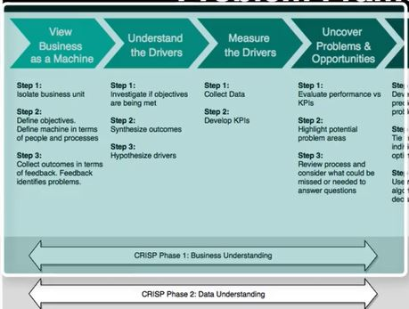

```{r setWD, echo=FALSE, message=FALSE, warning=FALSE}
setwd("~/GitHub/CourseWork/BusSciUniv/EeeAttrition")

options(scipen = 999)
options(digits = 2)

if(!require(easypackages)){install.packages("easypackages")}
library(easypackages)
packages("tidyverse", "readxl", prompt = FALSE)

# Load Data
path_train <- "00_Data/telco_train.xlsx"
train_raw_tbl <- read_excel(path_train, sheet = 1)

# Data Subset
dept_job_role_tbl <- train_raw_tbl %>% 
     select(EmployeeNumber, Department, JobRole, PerformanceRating, Attrition)
```

# Chapter 0: Getting Started
## True Cost of Emplyee Turnover

### Employee Turnover:  A $15M Problem

Differentiating between productive and non-productive employees is difficult and highly subjective. Some employees are in the top 20% (all stars), some are in the middle 60% (productive), and some are in the bottom 20%. The bottom 20% can be OK or can be poor depending on the overall level of talent in your organization. Sometimes just because they are bottom 20% they are still good employees because the organization is such a high performing organization that everyone they employee is good. However, most organizations do have bad employees. 

Now, in terms of defining productivity, if on a 1 to 4 scale with 1 being poor and 4 being the best that managers rate employees 3 to 4, you can usually be OK in viewing the 4's as productive. They may not always be all stars, especially if 50% of people reviewed get 4's but in reality only 20% should by the bell curve. However, if a manager rates someone as a 1, there is definitely a problem. These people need to either have immediate corrective actions taken or need to be cut loose. This is good attrition because the employee is a poor job/culture fit.

The analysis we are doing specifically looks at bad attrition, losing people that are 3's and 4's. I call them high performers, but in reality, I should be saying productive employees. This group is probably driving 80% of the business results. 

Non-profits will need to be handled based on what the business finds important. While maximizing profit may not be the goal, there are still goals. For example, one goal might be to increase high school graduation rates in schools. This could be set up showing that the percentage of student dropouts are much higher in the district of focus and that increasing graduation rates is expected to reduce crime and increase workforce productivity. Crime reduction would have a savings associated with it. Workforce productivity would have a financial benefit associated with it. These are possible ways we can show financial value for a non-profit.

Non-Profit Cost Analysis: https://www.bridgespan.org/bridgespan/Images/articles/nonprofit-cost-analysis-toolkit/NonprofitCostsAnalysisToolkit.pdf

Non-Profit Strategic Planning:
https://knowhownonprofit.org/organisation/strategy

The tools are quite similar to what you might find in a for-profit scenario. The maximization will be to maximize the financial delta between cost and benefit (to public) versus cost and revenue (for organization). 

### What Happens When Good Emplyees Leave

*You takeaway our top 20 employees and we become a mediocre company* --Bill Gates

- All emplyees turnover, some just faster
- Impact of Attrition
     - Varies based on employee productivity
     - Can be measured
- Bad turnover costs the organization

```{r, out.width = "600px", echo=FALSE}
knitr::include_graphics("./images/CostValueEmployee.JPG")
```

[Employee Retention Now a Big Issue: Why the Tide has Turned](https://www.linkedin.com/pulse/20130816200159-131079-employee-retention-now-a-big-issue-why-the-tide-has-turned/)

When a good employee quits, costs are incurred.

```{r, out.width = "600px", echo=FALSE}
knitr::include_graphics("./images/CostQuit.JPG")
```

- Quits
- Vacancy durinfg search
- Cost to train new employee

Not all attrition is bad

```{r, out.width = "600px", echo=FALSE}
knitr::include_graphics("./images/NotAllBad.JPG")
```

### Calculating the Cost of Turnover

- Direct Costs
     - Average Separation (Exit Interviews, Separation Pay, Admin Costs) ($500)
     - Average Vacancy (Temp Help & OT) ($10,000)
     - Average Acquisition (Ads, Travel, Interviews, Physicals, Drug Testing, Bonuses, Reference Checks, etc) ($4,900)
     - Average Placement (New Supplies, Onboarding, Training) ($3,500)
     
$$500+10,000+4,900+3,500=18,900$$

- Productivity Costs (Hidden Costs - only recognized when the problem becomes large. Much higher than direct costs.)
     - Annual revenue per Employee - less COGS (250,000)
     - Workdays per Year (240)
     - Average Workdays Position Open (40)
     - Average Onboarding/Training Period (60 ~ 12 weeks)
     - Effectiveness During Onboarding/Training (50%)
     
$$(250,000/240)*(40+(60*.5))=72,917$$  

- Salary & Benefits
     - Average Salary + Benefits (80,000)
     - Workdays per Year (240)
     - Average Workdays Position Open (40)
     
$$(80,000/240)*40=13,333$$
$$Total Costs = 18,900+72,917+13,333=78,483$$

If there 200 productive employees leave each year, then $200 * 78,483 = 15,000,000$ is the financial cost of turnover.

> Just a 10% reduction (using data science) saves the organization $1.6M/year!
  
## Chapter 0.3: What Tools Are In Our Toolbox? 
  
### Integrated Data Science Frameworks: BSPF & CRISP-DM

Business Science Problem Framework
```{r, out.width = "600px", echo=FALSE}

```

- Framwork provide
     - Consistency across projects
     - Critical Step Checklist
     - Clarity to stakeholders
     - Keeps project on track

BSPF is aligned with industry standard CRISP-DM

## Chapter 0.4 Frameworks 
  
### CRISP-DM

[CRISP-DM](https://www.the-modeling-agency.com/crisp-dm.pdf) is a high level indistry-standard framework for data mining.

```{r, out.width = "600px", echo=FALSE}

```

> A high level plan that is adapatable but lacks the detail to drive data science projects

CRISP-DM Process Cycle

1. Business Understanding
     - Critical - sets stage for all downstream events
     - Problem solving and project scope development with the business
     - Combines discovery and prject management
     - Documents current state and the business success metric
2. Data Understanding
     - 20% of project time typically consumed by data collection
3. Data Preparation
     - 60% of your time cleaning and organizing data
4. Modeling
     - information turned into insight
     - Model Understnading
     - Model Assessment
5. Evaluation
     - Assess degree which the data insights meet business objectives (ROI)
6. Deployment
     - REST API
     - Shiny App
     - Markdown file output
  
### Business Science Problem Framework

The goal is to make good decisions. Systematic decision making starts with measurement and analysis which leads to improvement.

The DSBF is based on [Principles by Ray Dalio](https://www.principles.com/)

BSPF has 7 steps:

```{r, out.width = "600px", echo=FALSE}

```

1. Business as a Machine

```{r, out.width = "600px", echo=FALSE}

```

Each part of the business has Objectives --> Machine --> Outcomes.

- Objectives are the goals that serve a inputs or isntructions to the machine
- Machine - performs the work and is made of people and processes
     - If People or process is not right, the machine produces questionable output
     - People have biases
     - Process issues abound in all organizations
     - People/process design fit may be poor
- Outcomes - what the machine produces
     - Provides feedback to determine is the objectives are being met

> Our goal is to understnad the machine using data

2. Understand the Drivers

- Start with business objectives
     - Are goals being met or are ther problems?
- Syntehsize outcomes
     - turn positive and negative results into data
- Hypothesize drivers
     - hypothesize the drivers using hte data generated and suject matter experts, customers, stakeholders, etc

3. Measure the Drivers

- Collect data
     - Is data available?
     - Treat information as assets
          - sometimes applicaitons need to collect information-rich data to support analytic analysis.  Becomes an organization asset.
     - Build stretgic data repositories
- Develop KPIs
     - Benchmark industry metrics
     - Develop internal metrics using goals
     
4. Uncover Problems & Opportunites

- Evaluate performance vs KPIs
     - Probem identification
     - Opportunites for data science & analytic decsion making
```{r, out.width = "600px", echo=FALSE}

```

> When you have exhausted all possibilities, remember this - you haven't.

- Thomas Jefferson

5. Encode Algorithms

- Develop algorithms
     - Predict target
     - Explain in terms of business levers
- Maximize profit
     - Optimization problem
     - Expected value framework - a method for making decisions based on the probability mutliplied by the expected finacial value of the decision
- Recommendation Systems

6. Measure the Results

- Capture outcomes
- Synthesize results - looking for progress
- Visualize over time

7. Report Financial Impact

- Every decsion has a financial value
- Change is only good if it improves financial performance
- Financial benefits **must** be reported on to justify any improvement

# Chapter 1: Business Understanding: BSPF & Code Workflows 
  
## Chapter 1.1 Problem Understanding With BSPF 
  
### Business Understanding

The BSPF includes the following steps of the the CRISP-DM Framework:

1. View the Business as a Machine
2. Underestnad the Drivers
3. Measure the Drivers
4. Uncover Problems & Opportunities

```{r, out.width = "600px", echo=FALSE}

```

### View The Business As A Machine 

> Review business_understanding.R file in 01_Business Understanding folder

Business Units:  Department and Job Role
Define Objectives:  Retain high performers
Assess Outcomes: TBD - Feedback from the business

*Known* - 16.1% attrition in the current state - is this a bad thing?

### Understand The Drivers, Part 1: By Dept 

Investigate the Objectives:  16% Attrition
Synthesize Outcomes:  High counts and high percentages (learned after hypothesizing drivers). See below under *Understnad the Drivers*.
Hypothesize Drivers:  Job Role and Departments

```{r echo=FALSE}
# By Department
dept_job_role_tbl <- train_raw_tbl %>% select(EmployeeNumber, Department, JobRole, PerformanceRating, Attrition)
dept_job_role_tbl %>% group_by(Department, Attrition) %>%  summarise(n = n()) %>%  ungroup() %>% group_by(Department) %>% mutate(pct = n/sum(n))
```
  
Department and Job Roles are common cohorts to evaluate.

HR has 24% attrition, Sales 21% - might be something going on by department.

### Understand The Drivers, Part 2: By Job Role

```{r}
dept_job_role_tbl %>% group_by(Department, JobRole, Attrition) %>%  summarise(n = n()) %>% ungroup() %>% 
     group_by(Department, JobRole) %>% mutate(pct = n/sum(n)) %>% ungroup() %>% filter(Attrition %in% c("Yes"))
# Used Attrition %in% instead of == because the former is more flexible - can add mutiple categories :  c("cat1", "cat2", . . .)
```

Note there are different roles with each department.  Perhaps certain roles have greater attrition issues than others?  
Note the HR 30%; Note Sales Excutive - only 18.3% but there are 50 leaving; Sales Representative may be a problem too.

### Measure The Drivers, Part 1: Collect Data

> Now in the BSPF - Measure the Drivers Step

This is an iterative task that is ongoing.

You may not have all the data initially. Further, you don't want all the data since many of the features are a distraction prior to understanding if a problem exists. During the Business Understanding phase we need to isolate the critical features that relate to business outcomes and determine if a problem exists such that when solved it provides real value in terms of financial benefit.

There are 35 features to consider:

```{r}
names(train_raw_tbl)
```

Some features related to one and other.  
 
 > It is always helpful to breakdown data collection activities in to strategic areas.
 
- Descriptive Features: 
     - Age, DistanceFromHome, Gebder, MaritalStatus, NumComaniesWorked, Over18
- Employment Features:
     - Department, EmploeeCount, EmployeeNumber, JobInvolement, JobLevel, JobRole, JobSatistfaction
- Compensation Features:
     - DailyRate, HourlyRate, MonthlyIncome, MonthlyRate, PercentSalaryHike, StockOptionLevel
- Survey Results:  
     - EnvironmentSatisfaction, JobSatisfaction, RelationshipSatisfaction, WorkLifeBalance
- Performance Data:
     - JobInvolvement, PerformanceRating
- Work-Life Balance
     - BusinessTravel, OverTime
- Training and Education
     - Education, EducationField, TrianingTimesLastYear
- Time-Based Features
     - TotalWorkingYears, YearsAtCompany, YearsInCurrentROle, YearsSinceLastPromotion, YearsWithCurrentManager

### Measure The Drivers, Part 2: Develop KPIs

Often review turnover statistics in your industry.  We know our is 16% but we do not know if this is good or bad without [research](http://www.air-prehire.com/blog/industries-high-employee-turnover-rates/.  
Perhaps it simply fails an internal KPI.  

Via web searching, *8.8% average turnover for utility companies* (useful for this data).  (Banking is around 17.2%)

```{r echo=FALSE}
dept_job_role_tbl %>% group_by(Department, JobRole, Attrition) %>%  summarise(n = n()) %>% ungroup() %>% group_by(Department, JobRole) %>% 
     mutate(pct = n/sum(n)) %>% ungroup() %>% filter(Attrition %in% c("Yes")) %>% arrange(desc(pct)) %>% mutate(above_industry_avg = case_when(
            pct > 0.088 ~ "Yes", TRUE ~ "No"))
```

Note the Dept and Job Role with high percentages and counts.  To make this more impactful, add cost to this table.

### Uncover Problems & Opportunities

#### Part 1: calculate_attrition_cost()

Create a function the mimics the Excel Calculator.

```{r calc_attrition_cost, echo=FALSE}
calculate_attrition_cost <-  function(
     
     n = 1,
     salary = 80000,
     
     # Direct Results
     separation_cost = 500,
     vacancy_cost = 10000,
     acquisition_cost = 4900,
     placement_cost = 3500,
     
     # Productivity Costs
     net_revenue_per_employee = 250000,
     workdays_per_year = 240,
     workdays_position_open = 40,
     workdays_onboarding = 60,
     onboarding_efficiency = 0.50
     
){
     # The code below is the R interpretation of the Excel Spreadsheet
     direct_cost <- sum(separation_cost, vacancy_cost, acquisition_cost, placement_cost)
     
     productivy_cost <- net_revenue_per_employee / workdays_per_year *
          (workdays_position_open + workdays_onboarding * onboarding_efficiency)
     
     salary_benefit_reduction <- salary / workdays_per_year * workdays_position_open
     
     cost_per_employee <- direct_cost + productivy_cost - salary_benefit_reduction
     
     total_cost <- n * cost_per_employee
     
     return(total_cost)
}

```

The function includes default values that equal the defaults that were introduced in *Calculating the Cost of Turnover*.  So if we call the custom function `calculate_attrition_cost` with the default values, it returns `r calculate_attrition_cost()`.  If we change the default value of `n = 1` (representing 1 employee) and change it to `n = 200` then the function returns `r calculate_attrition_cost(n=200)`.

#### Uncover Problems & Opportunities, Part 2: Calculating Cost By Job Level

Using code that we have already seen above and modified it slightly to focus on `JobRole` rather than `Department`, we can begin this part of the journey reviewing `JobRole` data.  Note the we reuse a cusomtom function - `calculate_attrition_cost` to return the cost_of_attrition column below.

```{r}
dept_job_role_tbl %>% count(JobRole, Attrition) %>% group_by(JobRole) %>% mutate(pct = n/sum(n)) %>% ungroup() %>% 
     filter(Attrition %in% c("Yes")) %>% arrange(desc(pct)) %>% mutate(above_industry_avg = case_when(pct > 0.088 ~ "Yes", TRUE ~ "No")) %>% 
     mutate(cost_of_attrition = calculate_attrition_cost(n = n, salary = 80000))
```

Note the costs associated with Sales Executive and Laboratory Technician.


Aside: Intro To Tidy Eval 
  
Start 
 Tidy Eval Primer 
1.2 Streamlining The Attrition Code Workflow 
  
 Attrition Code Workflow (1:55) 
  
 Streamlining The Counts (2:06) 
  
 Streamlining The Count To Percentage Calculation (8:01) 
  
 Streamlining The Attrition Assessment (7:54) 
  
 Attrition Workflow Recap (1:33) 
  
 Knowledge Check 
1.3 Visualizing Attrition With ggplot2 
  
 Visualizing Attrition Cost (0:47) 
  
 Data Manipulation For Visualization, Part 1 (2:38) 
  
 Data Manipulation For Visualization, Part 2 (5:41) 
  
 Visualization With ggplot2 (10:15) 
  
 Knowledge Check 
1.4 Making A Custom Plotting Function: plot_attrition() 
  
 Making A Custom Plotting Function (4:57) 
  
 Developing plot_attrition(), Part 1: Function Setup (3:37) 
  
 Developing plot_attrition() Part 2: Handling The Inputs (10:15) 
  
 Developing plot_attrition() Part 3: Data Manipulation (9:38) 
  
 Developing plot_attrition() Part 4: Visualization (8:43) 
1.5 Challenge #1: Cost Of Attrition 
  
 Challenge #1: Updating The Organization's Cost Of Attrition (1:18) 
  
 Knowledge Check 
  
 Solution (14:09) 
1.6 Chapter Code 
  
Start 
 Chapter 1 Business Understanding Code 
Chapter 2, Data Understanding: By Data Type & Feature-Target Interactions 
  
 Chapter Overview & .R File Download 
2.1 Setting Up For Data Understanding 
  
 Data Understanding (0:50) 
  
 Setting Up (4:10) 
  
 Reviewing The Data (5:42) 
2.2 EDA Part 1: Exploring Data By Data Type 
  
 EDA Part 1: Data Summarization (skimr) (4:38) 
  
 Exploring Character Data (8:30) 
  
 Exploring Numeric Data (4:57) 
  
 Knowledge Check 
2.3 EDA Part 2: Visualizing The Feature-Target Interactions 
  
 EDA Part 2: Feature Visualization (GGally) (3:49) 
  
 Using & Customizing ggpairs() (4:43) 
  
 Custom Function: plot_ggpairs() (6:27) 
  
 Visual Feature Exploration (7:46) 
2.4 Challenge #2: Assessing Feature Pairs 
  
 Challenge #2: Exploratory Data Analysis (0:29) 
  
 Knowledge Check 
2.5 Chapter Code 
  
 Chapter 2 Data Understanding Code 
Course Survey #1: Your Feedback Is Important! 
  
 Quick Course Survey 
Chapter 3, Data Preparation: Getting Data Ready For People & Machines 
  
 Chapter Overview & .R File Download 
3.1 Data Preparation Setup 
  
 Data Preparation (0:57) 
  
 Setup For Data Preparation (1:15) 
3.2 Data Preparation For People (Humans) 
  
 Processing Pipeline (For People Readability) (3:24) 
  
 Human Readable Script Setup (2:57) 
  
 Merging Data Part 1: Tidying The Data (8:09) 
  
 Merging Data Part 2: Mapping Over Lists (6:35) 
  
 Merging Data Part 3: Iterative Merge With Reduce (7:42) 
  
 Factoring The Character Data (8:38) 
  
 Making The Processing Pipeline (9:18) 
  
 Knowledge Check 
3.3 Data Preparation For Machines With Recipes! 
  
 Data Preparation With Recipes (0:57) 
  
 Machine Readable Script Setup (2:29) 
  
 Custom Function: plot_hist_facet(), Part 1 (2:57) 
  
 Custom Function: plot_hist_facet(), Part 2 (5:48) 
  
 recipes: Preprocessing Data For Machines (7:51) 
  
 Data Preprocessing Plan (6:37) 
  
 recipes: Zero Variance Features (6:13) 
  
 recipes: Transformations (13:47) 
  
 recipes: center & scale (10:02) 
  
 recipes: dummy variables (7:33) 
  
 recipes: Baking The Train & Test Data (4:55) 
  
 Knowledge Check 
3.4 Correlation Analysis 
  
 Pre-Modelling Correlation Analysis (1:10) 
  
 Correlation Analysis, Step 1: get_cor() (3:47) 
  
 Custom Function: Creating get_cor() (12:43) 
  
 Correlation Analysis, Step 2: plot_cor() (6:50) 
  
 Custom Function: Creating plot_cor() (15:09) 
  
 Reading The Correlation Analysis Plot (5:26) 
  
 Correlation Analysis Recap (2:33) 
3.5 Challenge #3: Correlation Analysis 
  
 Challenge #3: Correlation Analysis (0:41) 
  
 Knowledge Check 
3.6 Chapter Code 
  
 Chapter 3 Data Preparation Code 
Chapter 4, Modeling Churn: Using Automated Machine Learning With H2O 
  
 Chapter Overview & .R File Download 
4.1 Modeling Setup 
  
 Modeling With H2O AutoML (0:56) 
  
 Modeling Directory Setup (2:42) 
  
 H2O Script Setup, Part 1: Libraries, Data, & Preprocessing Pipeline (3:33) 
  
 H2O Script Setup, Part 2: Recipes (6:45) 
4.2 H2O Automated Machine Learning 
  
 H2O Documentation (5:22) 
  
 H2O Modeling, Part 1 (9:55) 
  
 H2O Modeling, Part 2 (5:32) 
  
 Inspecting The Leaderboard (5:51) 
  
 Extracting Models From The Leaderboard (2:51) 
  
 Custom Function: extract_h2o_model_by_position() (6:38) 
  
 Saving & Loading H2O Models (4:54) 
  
 Making Predictions (5:48) 
  
 Knowledge Check 
4.3 Advanced Concepts 
  
 Train, Validation, & Leaderboard Frames (3:07) 
  
 H2O AutoML Model Parameters (4:39) 
  
 Cross Validation (K-Fold CV) (4:16) 
  
 Grid Search (Hyperparameter Search) (1:53) 
  
 Knowledge Check 
4.4 Visualizing The Leaderboard 
  
 Leaderboard Visualization (3:42) 
  
 ggplot2 Data Transformation (6:13) 
  
 ggplot2 Visualization (4:19) 
  
 Custom Function: plot_h2o_leaderboard() (17:08) 
4.5 Bonus! Grid Search In H2O 
  
 H2O Grid Search With h2o.grid(), Part 1 (11:52) 
  
 H2O Grid Search With h2o.grid(), Part 2 (11:11) 
  
 Bonus Lecture Code 
4.6 Chapter Code 
  
 Chapter 4 H2O Modeling Code 
Chapter 5, Modeling Churn: Assessing H2O Performance 
  
 Chapter Overview & .R File Download 
5.1 Performance Overview & Setup 
  
 Chapter Overview (1:20) 
  
 Chapter Setup (1:35) 
5.2 H2O Performance For Binary Classification 
  
 H2o Performance: h2o.performance() (7:39) 
  
 H2O Summary Metrics: h2o.auc(), h2o.giniCoef(), h2o.logloss() (6:15) 
  
 H2O Metrics: h2o.metric() (4:11) 
  
 Precision, Recall, F1 & Effect Of Threshold (11:11) 
5.3 Performance Charts For Data Scientists 
  
 Performance Of Multiple Models: fs + purrr (11:19) 
  
 ROC Plot (9:37) 
  
 Precision vs Recall Plot (4:40) 
5.4 Performance Charts For Business People 
  
 Gain & Lift 101 (5:02) 
  
 Gain & Lift Calculations, Part 1 (6:53) 
  
 Gain & Lift Calculations, Part 2 (8:14) 
  
 H2O Gain & Lift: h2o:gainsLift() (6:02) 
  
 Gain Plot (7:22) 
  
Start 
 Lift Plot (7:24) 
5.5 Ultimate Model Performance Comparison Dashboard 
  
 Model Diagnostic Dashboard: plot_h2o_performance() (4:01) 
  
 plot_h2o_performance(): Overview & Inputs (7:33) 
  
 plot_h2o_performance(): Model Metrics (12:35) 
  
 plot_h2o_performance(): Gain & Lift (8:08) 
  
 plot_h2o_performance(): Combining Plots With cowplot (8:19) 
5.6 Chapter Code 
  
 Chapter 5 H2O Performance Code 
Chapter 6, Modeling Churn: Explaining Black-Box Models With LIME 
  
 Chapter Overview & File Download 
6.1 Chapter Overview & Setup 
  
 Chapter Overview (1:27) 
  
 Chapter Setup (2:32) 
  
 H2O Model Setup (2:51) 
6.2 Feature Explanation With LIME 
  
 LIME Documentation & Resources (5:31) 
  
 Investigating Predictions & The Case For LIME (5:25) 
  
 Lime For Single Explanation, Part 1: Making an explainer with lime() (7:13) 
  
 Lime For Single Explanation, Part 2: Making an explaination with explain() (10:13) 
  
 Visualizing Feature Importance For A Single Explanation: plot_features() (6:31) 
  
 Visualizing Feature Importance For Multiple Explanations: plot_explanations() (11:07) 
  
 Knowledge Check 
6.3 Challenge #4: Recreating plot_features() & plot_explanations() 
  
 Challenge #4: Recreating plot_features() & plot_explanations() (2:04) 
  
 Solution Part 1: plot_features_tq() (15:26) 
  
 Solution #2: plot_explanations_tq() (19:22) 
6.4 Chapter Code 
  
 Chapter 6 LIME Code 
Chapter 7, Evaluation: Calculating The Expected ROI (Savings) Of A Policy Change 
  
 Chapter Overview & File Download 
7.1 Overview & Setup 
  
 BSPF Update (0:54) 
  
 Expected Value Framework (18:16) 
  
 Chapter Setup (2:18) 
7.2 Calculating Expected ROI: No Over Time Policy 
  
 Policy Change: No Overtime For Anyone (0:39) 
  
 Setup: No OT Policy (3:31) 
  
 Expected Cost Of Baseline (With OT): Part 1 (5:56) 
  
 Expected Cost Of Baseline (With OT): Part 2 (9:51) 
  
 Expected Cost Of New State (Without OT): Part 1 (6:50) 
  
 Expected Cost Of New State (Without OT): Part 2 (8:41) 
  
 Expected Savings: No OT Policy (3:29) 
  
 Save Point: No OT Policy (0:57) 
7.3 Targeting By Threshold Primer 
  
 Policy Change: Targeted Overtime Reduction (1:02) 
  
 Setup: Targeted Overtime Policy (2:36) 
  
 Threshold Primer, Part 1: Confusion Matrix (4:00) 
  
 Threshold Primer, Part 2: Expected Rates (7:00) 
  
 Threshold Primer, Part 3: Visualizing Rates (6:50) 
  
 Threshold Primer, Part 4: Explaining Expected Rates (3:17) 
7.4 Calculating Expected ROI: Targeted Over Time Policy 
  
 Expected Cost Of Baseline (With OT) (4:06) 
  
 Expected Cost Of New State (Targeted OT): Part 1 (11:12) 
  
 Expected Cost Of New State (Targeted OT): Part 2 (4:03) 
  
 Expected Cost Of New State (Targeted OT): Part 3 (8:36) 
  
 Expected Cost Of New State (Targeted OT), Part 4 (7:39) 
  
 Expected Savings: Targeted OT Policy (3:05) 
7.5 Chapter Code 
  
 Chapter 7 Expected Value Of A Policy Change Code 
Chapter 8: Evaluation, Maximizing ROI (Savings) With Threshold Optimization & Sensitivity Analysis 
  
 Chapter Overview & File Download 
8.1 Setup 
  
 Chapter Setup (1:51) 
8.2 Threshold Optimization: Maximizing Expected ROI 
  
 Optimizing By Threshold Overview (1:06) 
  
 calculate_savings_by_threshold(), Part 1 (3:21) 
  
 calculate_savings_by_threshold(), Part 2 (5:09) 
  
 calculate_savings_by_threshold(), Part 3 (9:09) 
  
 Testing calculate_savings_by_threshold() (5:40) 
  
 Threshold Optimization With purrr (11:19) 
8.3 Threshold Optimization: Visualizing The Expected Savings At Various Thresholds 
  
 Visualizing Maximized Savings With ggplot2: Part 1 (7:56) 
  
 Visualizing Maximized Savings With ggplot2: Part 2 (4:35) 
  
 Visualizing Maximized Savings With ggplot2: Part 3 (7:13) 
  
 Visualizing Maximized Savings With ggplot2: Part 4 (6:03) 
  
 IMPORTANT: Explaining The Optimization Results (9:19) 
8.4 Sensitivity Analysis: Adjusting Parameters To Test Assumptions 
  
 Sensitivity Analysis Overview (1:48) 
  
 calculate_savings_by_thresh_2(), Part 1 (5:34) 
  
 calculate_savings_by_threshold_2(), Part 2 (5:46) 
  
 calculate_savings_by_threshold_2(), Part 3 (7:22) 
  
 Sensitivity Analysis, Part 1: Preloading Functions With partial() (9:07) 
  
 Sensitivity Analysis, Part 2: Parameter Combinations With cross_df() (5:09) 
  
 Sensitivity Analysis, Part 3: Iterating With pmap() (4:37) 
8.5 Sensitivity Analysis: Visualizing The Effect Of Scenarios & Breakeven 
  
 Visualizing The Sensitivity Analysis With ggplot2: Part 1 (5:28) 
  
 Visualizing The Sensitivity Analysis With ggplot2: Part 2 (6:22) 
  
 IMPORTANT: Explaining The Sensitivity Analysis Results (5:47) 
8.6 Challenge #5: Threshold Optimization For Stock Options 
  
 Challenge #5: Threshold Optimization For Stocks Options (3:31) 
  
 Challenge #5: Solution, Part 1 - With Downloadable Solution Code (11:45) 
  
 Challenge #5: Solution - Part 2 (11:26) 
  
 Challenge #5: Solution - Part 3 (9:16) 
8.7 Challenge #6: Sensitivity Analysis For Stock Options 
  
 Challenge #6: Sensitivity Analysis For Stock Options (1:57) 
  
 Challenge #6: Solution, Part 1 - With Downloadable Solution Code (7:59) 
  
 Challenge #6: Solution, Part 2 (6:36) 
8.8 Chapter Code 
  
 Chapter 8 Threshold Optimization & Sensitivity Analysis Code 
Chapter 9, Evaluation: Creating A Recommendation Algorithm 
  
 Chapter Overview & File Download 
9.1 Overview & Setup 
  
 Recommendation Algorithm Overview (1:24) 
  
 BSPF Update (1:00) 
  
 Setup (3:52) 
9.2 Recipes For Feature Discretization 
  
 Recipes For Discretization Overview (1:52) 
  
 Creating A Recipe (With Chapter 3 Recap) (6:09) 
  
 Binning With step_discretize() (4:01) 
  
 Dummy Variables & One Hot Encoding (2:39) 
  
 bake() the Recipe! (2:08) 
  
 Retrieving The Binning Strategy With tidy() (2:48) 
9.3 Discretized Correlation Visualization 
  
 Discretized Correlation Visualization (0:32) 
  
 Data Manipulation, Part 1: get_cor() (5:41) 
  
 Data Manipulation, Part 2: separate() Groups (7:01) 
  
 Visualize Discretized Correlation With ggplot2 (9:53) 
  
 Explaining The Discretized Correlation Visualization (1:57) 
Challenge #7: Custom Discretized Correlation Plotting Function 
  
Start 
 Coming Soon! 
9.4 Recommendation Strategy Worksheet 
  
 Strategy Development Worksheet (2:47) 
  
 Filling Out The Strategy Worksheet, Part 1 (8:10) 
  
 Filling Out The Strategy Worksheet, Part 2 (7:49) 
  
 Filling Out The Strategy Worksheet, Part 3 (7:23) 
  
 Filling Out The Strategy Worksheet, Part 4 (5:46) 
  
 Filling Out The Strategy Worksheet, Part 5 (5:55) 
9.5 Personal Development Recommendations 
  
 Recommendation Algorithm Process (1:46) 
  
 Setting Up: From Worksheet To Code (3:21) 
  
 How To Develop Recommendation Strategies, Part 1: Strategy Search (6:46) 
  
 How To Develop Recommendation Strategies, Part 2: Add Features (5:09) 
  
 Building The Recommendation Algorithm, Part 1: Code Framework (6:59) 
  
 Building The Recommendation Algorithm, Part 2: Create Personal Development Plan (4:32) 
  
 Building The Recommendation Algorithm, Part 3: Training And Formation (3:59) 
  
 Building The Recommendation Algorithm, Part 4: Mentorship (3:35) 
  
 Building The Recommendation Algorithm, Part 5: Leadership (2:11) 
  
 Personal Development Strategy: Algorithm Recap (3:29) 
9.6 Professional Development Recommendations 
  
 Professional Development Strategy Overview (with .R File) (5:55) 
  
 Strategy Development (3:20) 
  
 Code Framework (4:02) 
  
 Strategy Logic, Part 1 (5:39) 
  
 Strategy Logic, Part 2 (3:32) 
  
 Reviewing Results (2:08) 
Challenge #8: Work Environment Recommendations 
  
 Challenge: Creating A Work Environment Strategy (1:55) 
  
 Solution, Part 1: Developing The Strategy (6:28) 
  
 Solution, Part 2: Implementing The Strategy Into Code (9:29) 
9.7 Deployable Recommendation Function 
  
 Recommendation Function Overview (2:12) 
  
 Building The Recommendation Function, Part 1 (3:23) 
  
 Building The Recommendation Function, Part 2 (5:51) 

Testing Our Recommendation Function


