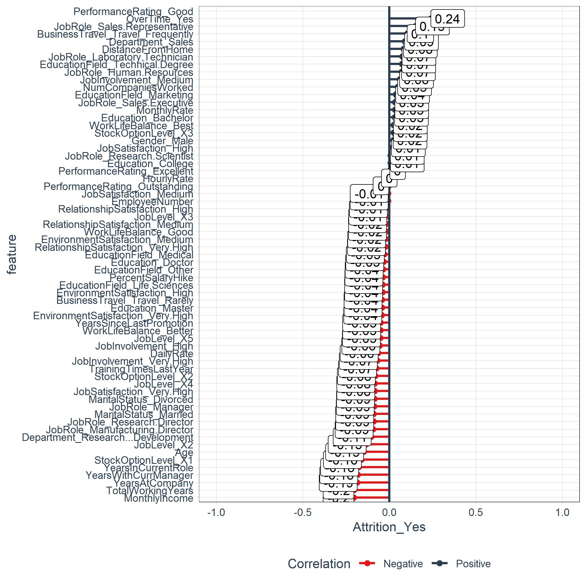
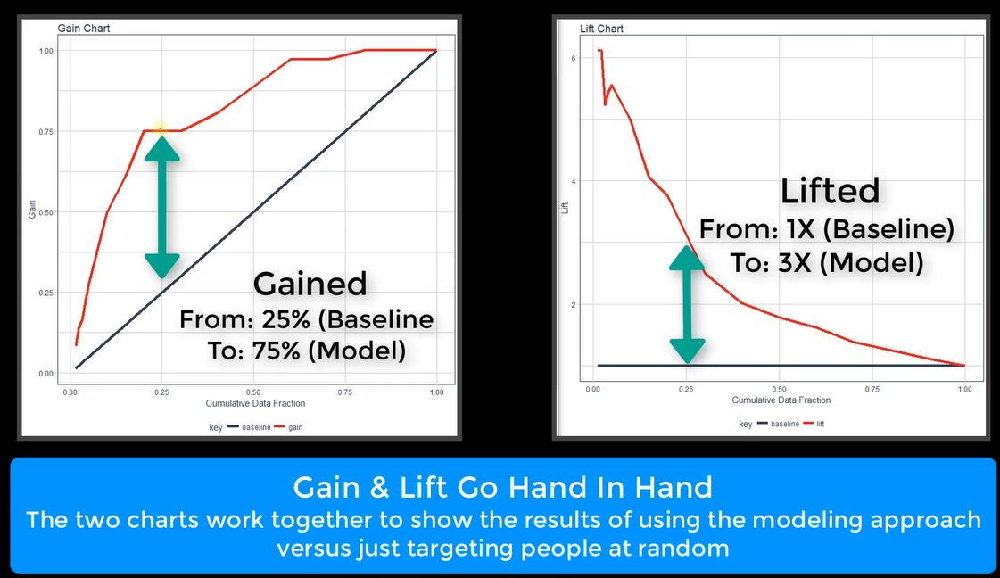

```{r setWD, echo=FALSE, message=FALSE, warning=FALSE}
setwd("~/GitHub/CourseWork/BusSciUniv/EeeAttrition")

options(scipen = 999)
options(digits = 2)

source("00_Scripts/required_packages.R")
packages("kableExtra", prompt = FALSE)

# Load Data
path_train <- "00_Data/telco_train.xlsx"
train_raw_tbl <- read_excel(path_train, sheet = 1)

# Data Subset
dept_job_role_tbl <- train_raw_tbl %>% 
     select(EmployeeNumber, Department, JobRole, PerformanceRating, Attrition)
```

# Functions TOC

A list of the functions created in this document.

```{r FunctionTOC}
plot_attrition_link <- paste0("[", "plot_attrition", "](", "#plot_attrition", ")")
plot_ggpairs_link <- paste0("[", "plot_ggpairs", "](", "#plot_ggpairs", ")")
plot_hist_link <- paste0("[", "plot_hist", "](", "#plot_hist", ")")
get_cor_link <- paste0("[", "get_cor", "](", "#get_cor", ")")
plot_cor_link <- paste0("[", "plot_cor", "](", "#plot_cor", ")")
extract_h2o_model_name_by_position <- paste0("[", "extract_h2o_model_name_by_position", "](", "#extract_model", ")")
plotH2oLeaderboard_link <- paste0("[", "plot_leaderboard", "](", "#plt_leaderboard", ")")
precisionrecallplot_link <- paste0("[", "Precision_Recall_plot", "](", "#precisionrecallplot", ")")
modelmetrics_fn <- paste0("[", "Model_Metrics", "](", "#modelmetrics", ")")
ROCplot_link <- paste0("[", "ROC_Plot", "](", "#ROCplot", ")")
ploth2operf_link <- paste0("[", "H2O_Performance_Plot", "](", "#ploth20perf", ")")


Artifact <- c(plot_attrition_link, plot_ggpairs_link, plot_hist_link, get_cor_link, plot_cor_link, 
              extract_h2o_model_name_by_position, plotH2oLeaderboard_link, precisionrecallplot_link, 
              modelmetrics_fn, ROCplot_link, ploth2operf_link,
               "plot_features_tq", "plot_explanations_tq", "", "Image1", "IMage2", "Image3")

Thumbnail <- c("{width=30%}",
               "{width=30%}",
               "{width=30%}", 
               "{width=30%}", 
               "{width=30%}", 
               "{width=30%}", 
               "{width=30%}", 
               "{width=30%}",
               "{width=30%}",
               "{width=30%}",
               "{width=30%}", "", "", "", "Image1Link", "Image2Link", "Image3Link")


DF_toc <- data.frame(Artifact, Thumbnail)

kable(DF_toc, caption = "") %>% kable_styling(bootstrap_options = c("striped", "hover", "condensed", "responsive"), full_width = F) %>% 
     group_rows("Functions", 1, 10, label_row_css = "background-color: #666; color: #fff;") %>% 
     group_rows("Visualizations", 11, 13, label_row_css = "background-color: #666; color: #fff;")
```

# Chapter 0: Getting Started
## True Cost of Employee Turnover

### Employee Turnover:  A $15M Problem

Differentiating between productive and non-productive employees is difficult and highly subjective. Some employees are in the top 20% (all stars), some are in the middle 60% (productive), and some are in the bottom 20%. The bottom 20% can be OK or can be poor depending on the overall level of talent in your organization. Sometimes just because they are bottom 20% they are still good employees because the organization is such a high performing organization that everyone they employee is good. However, most organizations do have bad employees. 

Now, in terms of defining productivity, if on a 1 to 4 scale with 1 being poor and 4 being the best that managers rate employees 3 to 4, you can usually be OK in viewing the 4's as productive. They may not always be all stars, especially if 50% of people reviewed get 4's but in reality only 20% should by the bell curve. However, if a manager rates someone as a 1, there is definitely a problem. These people need to either have immediate corrective actions taken or need to be cut loose. This is good attrition because the employee is a poor job/culture fit.

The analysis we are doing specifically looks at bad attrition, losing people that are 3's and 4's. I call them high performers, but in reality, I should be saying productive employees. This group is probably driving 80% of the business results. 

Non-profits will need to be handled based on what the business finds important. While maximizing profit may not be the goal, there are still goals. For example, one goal might be to increase high school graduation rates in schools. This could be set up showing that the percentage of student dropouts are much higher in the district of focus and that increasing graduation rates is expected to reduce crime and increase workforce productivity. Crime reduction would have a savings associated with it. Workforce productivity would have a financial benefit associated with it. These are possible ways we can show financial value for a non-profit.

Non-Profit Cost Analysis: https://www.bridgespan.org/bridgespan/Images/articles/nonprofit-cost-analysis-toolkit/NonprofitCostsAnalysisToolkit.pdf

Non-Profit Strategic Planning:
https://knowhownonprofit.org/organisation/strategy

The tools are quite similar to what you might find in a for-profit scenario. The maximization will be to maximize the financial delta between cost and benefit (to public) versus cost and revenue (for organization). 

### What Happens When Good Emplyees Leave

*You takeaway our top 20 employees and we become a mediocre company* --Bill Gates

- All emplyees turnover, some just faster
- Impact of Attrition
     - Varies based on employee productivity
     - Can be measured
- Bad turnover costs the organization

```{r, out.width = "600px", echo=FALSE}

```

[Employee Retention Now a Big Issue: Why the Tide has Turned](https://www.linkedin.com/pulse/20130816200159-131079-employee-retention-now-a-big-issue-why-the-tide-has-turned/)

When a good employee quits, costs are incurred.

```{r, out.width = "600px", echo=FALSE}
knitr::include_graphics("./images/CostQuit.JPG")
```

- Quits
- Vacancy durinfg search
- Cost to train new employee

Not all attrition is bad

```{r, out.width = "600px", echo=FALSE}

```

### Calculating the Cost of Turnover

- Direct Costs
     - Average Separation (Exit Interviews, Separation Pay, Admin Costs) ($500)
     - Average Vacancy (Temp Help & OT) ($10,000)
     - Average Acquisition (Ads, Travel, Interviews, Physicals, Drug Testing, Bonuses, Reference Checks, etc) ($4,900)
     - Average Placement (New Supplies, Onboarding, Training) ($3,500)
     
$$500+10,000+4,900+3,500=18,900$$

- Productivity Costs (Hidden Costs - only recognized when the problem becomes large. Much higher than direct costs.)
     - Annual revenue per Employee - less COGS (250,000)
     - Workdays per Year (240)
     - Average Workdays Position Open (40)
     - Average Onboarding/Training Period (60 ~ 12 weeks)
     - Effectiveness During Onboarding/Training (50%)
     
$$(250,000/240)*(40+(60*.5))=72,917$$  

- Salary & Benefits
     - Average Salary + Benefits (80,000)
     - Workdays per Year (240)
     - Average Workdays Position Open (40)
     
$$(80,000/240)*40=13,333$$
$$Total Costs = 18,900+72,917+13,333=78,483$$

If there 200 productive employees leave each year, then $200 * 78,483 = 15,000,000$ is the financial cost of turnover.

> Just a 10% reduction (using data science) saves the organization $1.6M/year!
  
## Chapter 0.3: What Tools Are In Our Toolbox? 
  
### Integrated Data Science Frameworks: BSPF & CRISP-DM

Business Science Problem Framework
```{r, out.width = "600px", echo=FALSE}
knitr::include_graphics("./images/DS_Framework.JPG")
```

- Framwork provide
     - Consistency across projects
     - Critical Step Checklist
     - Clarity to stakeholders
     - Keeps project on track

BSPF is aligned with industry standard CRISP-DM

## Chapter 0.4 Frameworks 
  
### CRISP-DM

[CRISP-DM](https://www.the-modeling-agency.com/crisp-dm.pdf) is a high level indistry-standard framework for data mining.

```{r, out.width = "600px", echo=FALSE}
knitr::include_graphics("./images/CRISP-DM.JPG")
```

> A high level plan that is adapatable but lacks the detail to drive data science projects

CRISP-DM Process Cycle

1. Business Understanding
     - Critical - sets stage for all downstream events
     - Problem solving and project scope development with the business
     - Combines discovery and prject management
     - Documents current state and the business success metric
2. Data Understanding
     - 20% of project time typically consumed by data collection
3. Data Preparation
     - 60% of your time cleaning and organizing data
4. Modeling
     - information turned into insight
     - Model Understnading
     - Model Assessment
5. Evaluation
     - Assess degree which the data insights meet business objectives (ROI)
6. Deployment
     - REST API
     - Shiny App
     - Markdown file output
  
### Business Science Problem Framework

The goal is to make good decisions. Systematic decision making starts with measurement and analysis which leads to improvement.

The DSBF is based on [Principles by Ray Dalio](https://www.principles.com/)

BSPF has 7 steps:

```{r, out.width = "600px", echo=FALSE}
knitr::include_graphics("./images/BSPF7Steps.JPG")
```

1. Business as a Machine

```{r, out.width = "600px", echo=FALSE}
knitr::include_graphics("./images/BusAsMachine.JPG")
```

Each part of the business has Objectives --> Machine --> Outcomes.

- Objectives are the goals that serve a inputs or isntructions to the machine
- Machine - performs the work and is made of people and processes
     - If People or process is not right, the machine produces questionable output
     - People have biases
     - Process issues abound in all organizations
     - People/process design fit may be poor
- Outcomes - what the machine produces
     - Provides feedback to determine is the objectives are being met

> Our goal is to understnad the machine using data

2. Understand the Drivers

- Start with business objectives
     - Are goals being met or are ther problems?
- Syntehsize outcomes
     - turn positive and negative results into data
- Hypothesize drivers
     - hypothesize the drivers using hte data generated and suject matter experts, customers, stakeholders, etc

3. Measure the Drivers

- Collect data
     - Is data available?
     - Treat information as assets
          - sometimes applicaitons need to collect information-rich data to support analytic analysis.  Becomes an organization asset.
     - Build stretgic data repositories
- Develop KPIs
     - Benchmark industry metrics
     - Develop internal metrics using goals
     
4. Uncover Problems & Opportunites

- Evaluate performance vs KPIs
     - Probem identification
     - Opportunites for data science & analytic decsion making
```{r, out.width = "600px", echo=FALSE}
knitr::include_graphics("./images/Audacious.JPG")
```

> When you have exhausted all possibilities, remember this - you haven't.

- Thomas Jefferson

5. Encode Algorithms

- Develop algorithms
     - Predict target
     - Explain in terms of business levers
- Maximize profit
     - Optimization problem
     - Expected value framework - a method for making decisions based on the probability mutliplied by the expected finacial value of the decision
- Recommendation Systems

6. Measure the Results

- Capture outcomes
- Synthesize results - looking for progress
- Visualize over time

7. Report Financial Impact

- Every decsion has a financial value
- Change is only good if it improves financial performance
- Financial benefits **must** be reported on to justify any improvement

# Chapter 1: Business Understanding: BSPF & Code Workflows 
  
## Chapter 1.1 Problem Understanding With BSPF 
  
### Business Understanding

The BSPF includes the following steps of the the CRISP-DM Framework:

1. View the Business as a Machine
2. Underestnad the Drivers
3. Measure the Drivers
4. Uncover Problems & Opportunities

```{r, out.width = "600px", echo=FALSE}
knitr::include_graphics("./images/BusUnderstanding.JPG")
```

### View The Business As A Machine 

> Review business_understanding.R file in 01_Business Understanding folder

Business Units:  Department and Job Role
Define Objectives:  Retain high performers
Assess Outcomes: TBD - Feedback from the business

*Known* - 16.1% attrition in the current state - is this a bad thing?

### Understand The Drivers, Part 1: By Dept 

Investigate the Objectives:  16% Attrition
Synthesize Outcomes:  High counts and high percentages (learned after hypothesizing drivers). See below under *Understnad the Drivers*.
Hypothesize Drivers:  Job Role and Departments

```{r echo=FALSE}
# By Department
dept_job_role_tbl <- train_raw_tbl %>% select(EmployeeNumber, Department, JobRole, PerformanceRating, Attrition)
dept_job_role_tbl %>% group_by(Department, Attrition) %>%  summarise(n = n()) %>%  ungroup() %>% group_by(Department) %>% mutate(pct = n/sum(n))
```
  
Department and Job Roles are common cohorts to evaluate.

HR has 24% attrition, Sales 21% - might be something going on by department.

### Understand The Drivers, Part 2: By Job Role

```{r}
dept_job_role_tbl %>% group_by(Department, JobRole, Attrition) %>%  summarise(n = n()) %>% ungroup() %>% 
     group_by(Department, JobRole) %>% mutate(pct = n/sum(n)) %>% ungroup() %>% filter(Attrition %in% c("Yes"))
# Used Attrition %in% instead of == because the former is more flexible - can add mutiple categories :  c("cat1", "cat2", . . .)
```

Note there are different roles with each department.  Perhaps certain roles have greater attrition issues than others?  
Note the HR 30%; Note Sales Excutive - only 18.3% but there are 50 leaving; Sales Representative may be a problem too.

### Measure The Drivers: Collect Data

> Now in the BSPF - Measure the Drivers Step

This is an iterative task that is ongoing.

You may not have all the data initially. Further, you don't want all the data since many of the features are a distraction prior to understanding if a problem exists. During the Business Understanding phase we need to isolate the critical features that relate to business outcomes and determine if a problem exists such that when solved it provides real value in terms of financial benefit.

There are 35 features to consider:

```{r}
names(train_raw_tbl)
```

#### Group Features

Some features related to one and other.  
 
 > It is always helpful to breakdown data collection activities in to strategic areas.
 
- Descriptive Features: 
     - Age, DistanceFromHome, Gebder, MaritalStatus, NumComaniesWorked, Over18
- Employment Features:
     - Department, EmploeeCount, EmployeeNumber, JobInvolement, JobLevel, JobRole, JobSatistfaction
- Compensation Features:
     - DailyRate, HourlyRate, MonthlyIncome, MonthlyRate, PercentSalaryHike, StockOptionLevel
- Survey Results:  
     - EnvironmentSatisfaction, JobSatisfaction, RelationshipSatisfaction, WorkLifeBalance
- Performance Data:
     - JobInvolvement, PerformanceRating
- Work-Life Balance
     - BusinessTravel, OverTime
- Training and Education
     - Education, EducationField, TrianingTimesLastYear
- Time-Based Features
     - TotalWorkingYears, YearsAtCompany, YearsInCurrentoOle, YearsSinceLastPromotion, YearsWithCurrentManager

### Measure The Drivers, Part 2: Develop KPIs

Often review turnover statistics in your industry.  We know our is 16% but we do not know if this is good or bad without [research](http://www.air-prehire.com/blog/industries-high-employee-turnover-rates/.  
Perhaps it simply fails an internal KPI.  

Via web searching, *8.8% average turnover for utility companies* (useful for this data).  (Banking is around 17.2%)

```{r echo=FALSE}
dept_job_role_tbl %>% group_by(Department, JobRole, Attrition) %>%  summarise(n = n()) %>% ungroup() %>% group_by(Department, JobRole) %>% 
     mutate(pct = n/sum(n)) %>% ungroup() %>% filter(Attrition %in% c("Yes")) %>% arrange(desc(pct)) %>% mutate(above_industry_avg = case_when(
            pct > 0.088 ~ "Yes", TRUE ~ "No"))
```

Note the Dept and Job Role with high percentages and counts.  To make this more impactful, add cost to this table.

### Uncover Problems & Opportunities

#### Part 1: calculate_attrition_cost()

Create a function the mimics the Excel Calculator.

```{r calc_attrition_cost, echo=FALSE}
calculate_attrition_cost <-  function(
     
     n = 1,
     salary = 80000,
     
     # Direct Results
     separation_cost = 500,
     vacancy_cost = 10000,
     acquisition_cost = 4900,
     placement_cost = 3500,
     
     # Productivity Costs
     net_revenue_per_employee = 250000,
     workdays_per_year = 240,
     workdays_position_open = 40,
     workdays_onboarding = 60,
     onboarding_efficiency = 0.50
     
){
     # The code below is the R interpretation of the Excel Spreadsheet
     direct_cost <- sum(separation_cost, vacancy_cost, acquisition_cost, placement_cost)
     
     productivy_cost <- net_revenue_per_employee / workdays_per_year *
          (workdays_position_open + workdays_onboarding * onboarding_efficiency)
     
     salary_benefit_reduction <- salary / workdays_per_year * workdays_position_open
     
     cost_per_employee <- direct_cost + productivy_cost - salary_benefit_reduction
     
     total_cost <- n * cost_per_employee
     
     return(total_cost)
}

```

The function includes default values that equal the defaults that were introduced in *Calculating the Cost of Turnover*.  So if we call the custom function `calculate_attrition_cost` with the default values, it returns `r calculate_attrition_cost()`.  If we change the default value of `n = 1` (representing 1 employee) and change it to `n = 200` then the function returns `r calculate_attrition_cost(n=200)`.

#### Uncover Problems & Opportunities, Part 2: Calculating Cost By Job Level

Using code that we have already seen above and modified it slightly to focus on `JobRole` rather than `Department`, we can begin this part of the journey reviewing `JobRole` data.  Note the we reuse a cusomtom function - `calculate_attrition_cost` to return the cost_of_attrition column below.

```{r}
dept_job_role_tbl %>% count(JobRole, Attrition) %>% group_by(JobRole) %>% mutate(pct = n/sum(n)) %>% ungroup() %>% 
     filter(Attrition %in% c("Yes")) %>% arrange(desc(pct)) %>% mutate(above_industry_avg = case_when(pct > 0.088 ~ "Yes", TRUE ~ "No")) %>% 
     mutate(cost_of_attrition = calculate_attrition_cost(n = n, salary = 80000))
```

Note the costs associated with Sales Executive and Laboratory Technician.

## Chapter 1.2 Streamlining The Attrition Code Workflow 

> This section is dedicated to streamlining the code developed above.
  
### Streamlining The Counts 

This is code commonly used:

```{r}
dept_job_role_tbl %>% 
     
     group_by(JobRole, Attrition) %>%  summarise(n = n())
```

The code above is replaced with this simpler code:

```{r}
dept_job_role_tbl %>% count(JobRole, Attrition) 
```

`count` is part of `dplyr`!

> Do not forget about the `dplyr::tally` function - very useful

*tally() is a convenient wrapper for summarise that will either call n() or sum(n) depending on whether you're tallying for the first time, or re-tallying. count() is similar but calls group_by() before and ungroup() after.*

### Streamlining The Count To Percentage Calculation

> Pay attention - this is really good code using tidy evaluation!

We have this code so far in streamlining the attrition code:

```{r}
dept_job_role_tbl %>% count(JobRole, Attrition) %>% group_by(JobRole) %>% mutate(pct = n/sum(n))
```

Calculating percentages from counts is a *common programming requirements*.  Why not create a function that generalizes this?

```{r}
count_to_pct <- function(data, ..., col = n){
     
     grouping_vars_expr <- quos(...)
     col_expr <- enquo(col)
     
     ret <- data %>% group_by(!!! grouping_vars_expr) %>% 
          mutate(pct = (!! col_expr)/sum(!! col_expr)) %>% ungroup()
                 
     return(ret)     
}
```

- tidy functions always requires the data to take the first position of the function
- `...` enables passing multiple, un-named arguments to a function
     - Because the dots are not preselected, the user can flexibly add variables and the function will adapt!
- The 3rd function argument is a column name, in this case n since we are claculating a percentage fron the counts in the `n` column

1. `...` must be enclosed on `quos` or `enquo` for mutiple columns or single columns, respectfully.  The saves the column names as unevalutated expressions.  They can be called later in the processing.  Use `quos` for multiple columns and `enquo` for the single column we have called `n`
2. `!!!` called bang-bang-bang splices multiple grouping variables and evaluating them.  (Use `!!` for single columns.)

Demo:

```{r}
dept_job_role_tbl %>% count(Department,JobRole, Attrition) %>% count_to_pct(Department, JobRole)
```

### Streamlining The Attrition Assessment

Continuing the development of a streamlined function, review where we are so far:

```{r}
dept_job_role_tbl %>% 
     
     count(Department, JobRole, Attrition) %>%
     
     count_to_pct(Department, JobRole) %>% 
     
     filter(Attrition %in% c("Yes")) %>% 
     arrange(desc(pct)) %>% 
     mutate(above_industry_avg = case_when(     # create assess_attrition()
          pct > 0.088 ~ "Yes",
          TRUE ~ "No"))
```

Generalize `filter` - `arrange` - `mutate` statements:

```{r}
assess_attrition <- function(data, attrition_col, attrition_value, baseline_pct){
     
     attrition_col_expr <- enquo(attrition_col)
     
     data %>% filter((!! attrition_col_expr) %in% attrition_value) %>% 
          arrange(desc(pct)) %>% 
          mutate(above_industry_avg = case_when(
               pct > baseline_pct ~ "Yes", 
               TRUE ~ "No"))
}
```

- As always, tidy eval starts with a data (tibble)
- Next argument is the name of the `Attrition` column - it may not always be called `Attrition`
- 3rd argument are the values of the `attrition_col` - in our case the values are `Yes` and `No`.
- `baseline_pct` is hopefully self-explanatory!

1. Recall `enquo` saves a single column nmae as an expression that can be evaluated later.  This way the name of the `Attrition` column can be whatever the user choses!
2. `pct` does not change because that is created consistently in the `count_to_pct` function.  (Of course this could be changed as an enhancement!)
3. Simple substitution for `0.088` to `baseline_pct`.

> Use parenthesis to give Tidy Eval evalauations prioirty!

> Function inputs in text format (attrition_value = "Yes") do not require Tidy Eval

Demo the new code:

```{r}
dept_job_role_tbl %>% 
     
     count(Department, JobRole, Attrition) %>% 
     count_to_pct(Department, JobRole) %>% 
     assess_attrition(Attrition, attrition_value = "Yes", baseline_pct = 0.088) %>% #New code line
     mutate(cost_of_attrition = calculate_attrition_cost(n = n, salary = 80000))
```

## Chapter 1.3 Visualizing Attrition With ggplot2 
  
### Visualizing Attrition Cost

Create impactful visualization like this:

```{r, out.width = "600px", echo=FALSE}
knitr::include_graphics("./images/CostAttrition.JPG")
```

- The plot above combines Department and JobRole together as labls for the y-axis.
- Need to change the type of the string manulated in #1 to a factor and order it from high to low based on cost_of_attrition to make the plot readable.
- Need to format the text labels to make the plot easy-to-read and professional!
  
### Data Manipulation For Visualization 

Here is the code so far plus some data manipulation so we can produce the plot.

```{r}
dept_job_role_tbl %>% 
     
     count(Department, JobRole, Attrition) %>% count_to_pct(Department, JobRole) %>% 
     assess_attrition(Attrition, attrition_value = "Yes", baseline_pct = 0.088) %>% 
     mutate(cost_of_attrition = calculate_attrition_cost(n = n, salary = 80000)) %>% 

     # Data Manipulation 
     mutate(name = str_c(Department, JobRole, sep = ": ") %>%  as_factor()) %>% #LINE 1
     mutate(name = fct_reorder(name, cost_of_attrition)) %>% # LINE 2
     mutate(cost_text = str_c("$", format(cost_of_attrition / 1e6, digits = 2), "M", sep = "")) # LINE 3
```

- LINE 1: `str_c` from `stringr` concatenates `Department` and `JobRole` with a colon in between them. 
     - factors are required in `ggplot` because they are used to order categorical variables (text will not work)
     - `as_factor` is part of `forcats`.  This function creates levels in the order in which they appear, which will be the same on every platform. (Base R sorts in the current locale which can vary from place to place.)
- LINE 2:  `fct_reorder` also from `forcats` reorders a factors numeric values by the magnitude of a different numberic value, in this case, `cost_of_attrition`.
- LINE 3:  `str_c` concatenation again - pretty simple - but effective!

### Visualization With ggplot2 (10:15) 

OK, the data manipulation to plot the cost or attrition is complete. Now review the `ggplt` code to produce the plot shown in the beginning on this section.  It is easy - provided you do one step at a time!

```{r}
dept_job_role_tbl %>% 
     
     count(Department, JobRole, Attrition) %>% count_to_pct(Department, JobRole) %>% 
     assess_attrition(Attrition, attrition_value = "Yes", baseline_pct = 0.088) %>% 
     mutate(cost_of_attrition = calculate_attrition_cost(n = n, salary = 80000)) %>% 

     # Data Manipulation 
     mutate(name = str_c(Department, JobRole, sep = ": ") %>%  as_factor()) %>% #must be factors to order
     mutate(name = fct_reorder(name, cost_of_attrition)) %>% # orders the names by cost
     mutate(cost_text = str_c("$", format(cost_of_attrition / 1e6, digits = 2), "M", sep = "")) %>% 
     
     # Plotting
     ggplot(aes(x = cost_of_attrition, y = name)) +
     geom_segment(aes(xend = 0, yend = name), color = palette_light()[[1]]) + # LINE 1
     geom_point(aes(size = cost_of_attrition), color = palette_light()[[1]]) + # LINE 2
     scale_x_continuous(label = scales::dollar) + # LINE 3
     geom_label(aes(label = cost_text, size = cost_of_attrition), hjust = "inward", color = palette_light()[[1]]) + # LINE 4
     theme_tq() + scale_size(name = c(4,5)) + # LINE 5
     labs(title = "Estimated Cost of Attrition: By Dept and Job Role", y = "", x = "Cost of Attrition") +
     theme(legend.position = "none")
```

- LINE 1: `geom_segment` adds lines to the plot canvas.  The first `ggplot` statement locates the end of the line - at the cost_of_attrition.  `xend` defines the start of the line segement at `x = 0`.  `yend` make sure the line segement aligns with the correct y-axis label. Simple!
     - `palette_light()[[1]]` defines the color [#2c3e5](http://www.color-hex.com/color/2c3e50) from the `tidyquant` package.
     - the other colors in `palette_light` are: `r palette_light()`
     
- LINE 2:  `size = cost_of_attrition` ajusts the size of the segement endpoint to the attrition cost magnitude (could have included this in the first aes statement)
- LINE 3: Formatting the x-labels with te `scales` package to get the values in dollar format.  Remeber the `scale_x_continuous` ggplot function!
- LINE 4: `geom_label` simply adds labels to points on the plot using cost_text` that was created easlier in the plot data manipulation.
     - Cool the label size can be dynamically set by the attrition cost.
- LINE 5: `theme_tq` from `tidyquant` is a genreal theme that adjusts background, facetting palette, legend position and more.  Works well for conservative business publications.
     - `scale_size` adjusts the max and min size of elements to prvent large/small values from becoming too large/small.  The label sizes are now limited to `size = 3` making the lower values label text now readable.  Cool!

## Chapter 1.4 Making A Custom Plotting Function
  
The goal is to replace the code below - copied from the last plotting exercise:

```{r results='hide'}

dept_job_role_tbl %>% 
     
     count(Department, JobRole, Attrition) %>% count_to_pct(Department, JobRole) %>% 
     assess_attrition(Attrition, attrition_value = "Yes", baseline_pct = 0.088) %>% 
     mutate(cost_of_attrition = calculate_attrition_cost(n = n, salary = 80000)) %>% 
###<b>
     #Data Manipulation 
     mutate(name = str_c(Department, JobRole, sep = ": ") %>%  as_factor()) %>%
     mutate(name = fct_reorder(name, cost_of_attrition)) %>% # orders the names by cost
     mutate(cost_text = str_c("$", format(cost_of_attrition / 1e6, digits = 2), "M", sep = "")) %>% 
     
     #Plotting
     ggplot(aes(x = cost_of_attrition, y = name)) +
     geom_segment(aes(xend = 0, yend = name), color = palette_light()[[1]]) +
     geom_point(aes(size = cost_of_attrition), color = palette_light()[[1]]) +
     scale_x_continuous(label = scales::dollar) +
     geom_label(aes(label = cost_text, size = cost_of_attrition), 
                hjust = "inward", color = palette_light()[[1]]) + 
     theme_tq() +
     scale_size(name = c(4,5)) +
     labs(title = "Estimated Cost of Attrition: By Dept and Job Role",
          y = "", x = "Cost of Attrition") +
     theme(legend.position = "none")
###</b>
```

Do no tbe intimidated - it is not as hard as it might appear initially!

### Developing plot_attrition() {#plot_attrition}

First, an explanation of quosures and tidy evaluation:

There are four functions:
- quo() and enquo(): singular, captures one variable, stored as unevaluated expression
- quos() and enquos(): plural, captures multiple variables, stored as list of mulitple unevaluated expressions

Explanation:
The enquo() function is singular and used inside a function. It is comparable to quo(), which is used outside of functions. Both functions do roughly the same thing, which is quote (meaning capturing the unevaluated variable as an expression before it gets updated). The "qouted" variable is stored for evaluation later. The main difference between quo() and enquo() is quo() should be used outside functions and enquo() should be used inside. The reason why is not important and really complex. 

The rlang library now has an enquos() function that is plural (rlang did not always have enquos(), which is why I used quos() in the lesson). Both capture multiple variables as expressions contained inside a list. This is useful when you don't know how many arguments the user will supply. For example several columns. The difference between quos() and enquos() is, again, that quos() is meant to be used external to functions whereas enquos() is meant to be used internal. However - This is not what the tutorial shows because of an inconsistency with early versions of rlang that did not include the enquos() function. 

In summary:
- Use quo() / enquo() when capturing one variable. 
- Use quos() / enquos() when capturing multiple variables. 
- Use quo() / quos() outside of functions. 
- Use enquo() / enquos() inside of functions.

```{r plot_attrition_fn}
plot_attrition <- function(data, ..., .value, # ... capture the departments - mutate(name = str_c(Department, JobRole....; .value - cost_of_attrition
                           fct_reorder = TRUE, # order the function by the .value argument
                           fct_rev = FALSE, # ascending vs descending y lables
                           include_lbl = TRUE,
                           color = palette_light()[[1]],
                           units = c("0", "K", "M")) { #sometimes the untis will not be in millions, defaul is 0 - no units
# Inputs

     group_vars_expr <- quos(...) #perhaps department and JobRoles
     if(length(group_vars_expr) == 0) # Then just use the first column name - these drive the y labels in the plot so there has to be something!
          group_vars_expr <- quos(rlang::sym(colnames(data)[[1]]))
          # rlang::sym turns a single character string into an expression.  
          # The expression is typically captured in enquo() or quos() to delay evaluation.
     #The sym() and syms() functions are only necessary when converting a string to a symbol. Generally the user will supply a symbol, such as a column name.        They don’t typically supply a string. Therefore, we only need to use sym/syms in this special case where we have a string that represents one or more           column names. Hopefully this explanation makes sense.
     
     value_expr <- enquo(.value)# for data manipulation (its cost_of_attrition - used in data manipulation and plotting)
     value_name <- quo_name(value_expr)# for ggplot - makes a character string in quotes (opposite of rlang::sym()); ggplot is not ready for tidy eval
     
     units_val <- switch(units[[1]], "M" = 1e6, "K" = 1e3, "0" = 1) #work like nested if functions
     if (units[[1]] == "0") units <- "" #Make it empty because it would get appended to labels in the plot
     
# Data Manipulation
     
     #Function factory - a function that produces a function, usd is the function factory - try it usd(1000)
     usd <- scales::dollar_format(prefix = "$", largest_with_cents = 1e3)

     data_manipulated <- data %>% 
          mutate(name = str_c(!!! group_vars_expr, sep = ": ") %>% as_factor()) %>% 
          #Above () removed around !!! group_vars_expr otherwise str_c sees it a single input - it is a psuedo bug in str_c
          mutate(value_text = str_c(usd(!! value_expr / units_val), units[[1]], sep = ""))
     
     if(fct_reorder){data_manipulated <- data_manipulated %>% 
          mutate(name = fct_reorder(name, (!! value_expr))) %>% 
          arrange(name)} # arrange() is used because fct_reorder() does not actually sort the data, arrange() does the sorting
     
     if(fct_rev){data_manipulated <- data_manipulated %>% 
          mutate(name = fct_rev(name)) %>% 
          arrange(name)}
          
# Visualization
# NOTE:  ggplot does not work with tidyeval framework - requires use of aes_string
     
     g <- data_manipulated %>% 
          ggplot(aes_string(x = value_name, y = "name")) +
          geom_segment(aes(xend = 0, yend = name), color = color) +
          geom_point(aes_string(size = value_name), color = color) +
          scale_x_continuous(label = scales::dollar) +
          theme_tq() +
          scale_size(name = c(4,5)) + #c(3,5) should work but I am not satifies with the output.
          theme(legend.position = "none")
     
     if(include_lbl){
          g <-  g + geom_label(aes_string(label = "value_text", size = value_name), hjust = "inward", color = color)
     }
     return(g)
} 
```

> A  potential problem with an error when trying to use this function on a grouped data set. The warning thrown looks like this:
mutate_impl(.data, dots) : binding character and factor vector, coercing into character vector.
The solution is to add ungroup() before the factoring within the Data Manipulation step. 

### More Realistic Attrition Cost

Using estimated average salary and average productivity (revenue) by Job Role and Department, create a more realistic attrition cost estimate.

> See homework_1_assignement.R for some relatively complex dplyr data code.

Here is a peek at the new Excel file that provides the source information.

```{r}
dept_jobrole_tbl <- train_raw_tbl %>%
    select(EmployeeNumber, Department, JobRole, PerformanceRating, Attrition)
kpi_industry_turnover_pct <- 0.088
# Productivity Cost by Role ----
productivity_cost_by_role_tbl <- read_excel("Challenges/productivity_cost_by_role.xlsx")
productivity_cost_by_role_tbl
```

```{r}
dept_jobrole_productivty_tbl <- dept_jobrole_tbl %>% 
     count(Department, JobRole, Attrition) %>% 
     count_to_pct(Department, JobRole) %>% 

     left_join(productivity_cost_by_role_tbl, by = c("Department", "JobRole")) %>% 
     
     assess_attrition(Attrition,attrition_value = 'Yes',baseline_pct = 0.088) %>%
     
     mutate(attrition_cost = calculate_attrition_cost(n = n, salary = Salary_Average,
                                                      net_revenue_per_employee = Revenue_Average))

dept_jobrole_productivty_tbl %>% plot_attrition(Department, JobRole, .value = attrition_cost)
```

```{r}

dept_productivty_tbl <- dept_jobrole_tbl %>% 
     count(Department, JobRole, Attrition) %>% 
     count_to_pct(Department, JobRole) %>% 
     assess_attrition(Attrition, "Yes", kpi_industry_turnover_pct) %>% 
     
     left_join(productivity_cost_by_role_tbl, by = c("Department", "JobRole")) %>% 
     
     group_by(Department) %>% 
     summarise(n = sum(n),
               Salary_Average = sum(Salary_Average),
               Revenue_Average = sum(Revenue_Average)) %>% 
     
     mutate(attrition_cost = 
                 calculate_attrition_cost(n = n, salary = Salary_Average, net_revenue_per_employee = Revenue_Average))

dept_productivty_tbl %>% plot_attrition(Department, .value = attrition_cost)

```

# Chapter 2: Data Understanding

This is the start of the 2nd phase of CRISP-DM - Data Understanding.

```{r, out.width = "600px", echo=FALSE}
knitr::include_graphics("./images/dataunderstanding1.JPG")
```

1. Collect Data is complete - the Excel files have been provided.
2. EDA to explore the critcal properties of the underlying features and potential relationships to attrition.

This section introduces `skimr` - a tool for feature exploration by data type.  `GGally` is also introduced to visulaize feature interaction relationships using `ggpairs`.

May want to review the feature grouping introduced earlier. [Group Features](#Group Features)

##2.2 EDA: Exploring Data By Data Type 
  
### Character Data

`skimr` does provide a good overview of the data automatically separating character and numeric data.  For character data, it is simple to see if any features have more thna perhaps 9 unique features, it might suggest binning.  The numeric data with histograms makes it easy to see which variable might be categorical data very quickly.

```{r}
skim(train_raw_tbl)
```

### Character Data

```{r}
train_raw_tbl %>% select_if(is.character) %>% glimpse()
```

Character data does not have levels so use `unique` instead.  `map` from `purrr` maps `unique` across each feature.
```{r}
train_raw_tbl %>% select_if(is.character) %>% map(unique)
```

This improves upon `unique` by including the counts for each character feature.

```{r}
train_raw_tbl %>% select_if(is.character) %>% map(table)
```

Counts are nice but proportions are better!  Below, `anonymous function` is used.

> The `~` indicates a formula starts

Also understand that `train_raw_tbl %>% select_if(is.character) %>% map(~ table(.))` is the sames as `train_raw_tbl %>% select_if(is.character) %>% map(table)`.

```{r}
# Anonymous function with ~  
train_raw_tbl %>% select_if(is.character) %>% map(~ table(.) %>% prop.table()) 
```

### Numeric Data

> map_df provides a much cleaner output!  Outputs a dataframe rather than a list.

```{r}
train_raw_tbl %>% select_if(is.numeric) %>% map_df(~ unique(.) %>% length())
```

```{r}
train_raw_tbl %>% select_if(is.numeric) %>% map_df(~ unique(.) %>% length()) %>% 
     gather() %>% arrange(value) %>% filter(value <= 10) # features with more than 10 might be nonessential or categorical
```

Numeric features that have fewer levels are likely to be discrete and numberic variavles withmore are likely continuous.  (Note above the features where `value = 1` may indicate non-essential oe zero-variance variables.)  Above are features that might be conversted to factors.  The table below suggests the features remain continuous.  

```{r}
train_raw_tbl %>% select_if(is.numeric) %>% map_df(~ unique(.) %>% length()) %>% 
     gather() %>% arrange(value) %>% filter(value > 10) # features with more than 10 might be nonessential or categorical
```

###Visualizing The Feature-Target Interactions 
  
To begin the visualization of the data, select the descriptive variables (serves as an example).  Tejre is a mix of character and continuous features.

```{r}
train_raw_tbl %>% select(Attrition, Age, Gender, MaritalStatus, NumCompaniesWorked, Over18, DistanceFromHome)
```

Apply `ggpair` function:

```{r message=FALSE, out.width="100%", out.width="100%"}
train_raw_tbl %>% select(Attrition, Age, Gender, MaritalStatus, NumCompaniesWorked, Over18, DistanceFromHome) %>% ggpairs()
```

[Customize](http://ggobi.github.io/ggally/#matrix_sections) the output to make it a bit easier to interpet.

 - It colors the Attrition to make it stand out
 - Removes the lower triangle - it is not quite as helpful or understandable
 - customizes what is shown on the diagonal and changes `alpha`

```{r message=FALSE, out.width="100%", out.width="100%"}
train_raw_tbl %>% select(Attrition, Age, Gender, MaritalStatus, NumCompaniesWorked, Over18, DistanceFromHome) %>% 
     ggpairs(aes(color = Attrition), lower = "blank", legend = 1, diag = list(continuous = wrap("densityDiag", alpha = 0.5))) +
     theme(legend.position = "bottom")
#ggsave("./images/plot_ggpairs.jpg")
```  

### Custom Function: plot_ggpairs {#plot_ggpairs}

Take the visualization above and create a function.

- `color= NULL` will output normal grey.  However, best to select a feature to highlight (typically the label)
     - `rlang::quo_is_null` simply tests for if `color_expr == NULL`.  Test by simply typing `color_expr` in the console
- Because color_name is a string after using `quo_name`, `aes_string` must be used

```{r}
plot_ggpairs <- function(data, color = NULL, density_alpha = 0.5){
     
     color_expr <- enquo(color)
     
     if(rlang::quo_is_null(color_expr)){gdata %>% ggpairs(lowe = "blank")
     } else {
          color_name <- quo_name(color_expr)
          g <- data %>%
               ggpairs(mapping = aes_string(color = color_name),
                       lower = "blank", legend = 1, diag = list(continuous = wrap("densityDiag", alpha = density_alpha))) + 
               theme(legend.position = "bottom")
     }
     return(g)}
```

### Evaluate ggpairs Output

Evalaute the data features by category and understnad the importance of the features using the new `ggpairs` function.  How great is that?
  
1. Decriptive Features: age, gender, marital status, etc
```{r message=FALSE}
train_raw_tbl  %>% select(Attrition, Age, Gender, MaritalStatus, NumCompaniesWorked, Over18, DistanceFromHome) %>% plot_ggpairs(Attrition)
```
**Observations**

- AgeYounger people seem to leave more than older workers.  
- DistanceFromHome appears skewed - further away leave more frequently
- Num Companies Worked appears more skewed for workers that have had more jobs
- Marital Status interesting:  No goes small large medium where Yes goes small medium large (height of histogram bars)

2. Employment Features
```{r message=FALSE}
train_raw_tbl %>% select(Attrition, contains("employee"), contains("department"), contains("job")) %>% plot_ggpairs(Attrition)
```

> Contains is NOT case sentitive.  Also provides `end_with` option

**Observations**

- EmployeeCount and EmployeeNumber are not useful - will not be used in model
- Department:  Higher proportion evident in Dept-Dept histogram in far right histogram bar
     - Recall there only only 3 departments in this data (HR, Research and Sales)
- JobInvolvement:  Density Plot shows higher 3rd spike and 4th to less extent - more likely to stay
- JobLevel:  Density plot shows deviation
- JobRoles - some roles appear to have higher attrition rate by evaluating the histogram
- JobStatisfaction:  1 - higher density of attrition than others

3. Compensation Features

```{r message=FALSE}
train_raw_tbl %>% select(Attrition, contains("income"), contains("rate"), contains("salary"), contains("stock")) %>% plot_ggpairs(Attrition)
```

**Observations**

- MonthlyRate: Those that are leaving have a lower Monthly Income
- PercentSalaryHike:  It's difficult to deduce anything based on the visualization
- StockOptionLevel:  Those that are staying have a higher stock option level 

4. Survey Results

```{r message=FALSE}
train_raw_tbl %>% select(Attrition, contains("satisfaction"), contains("life")) %>% plot_ggpairs(Attrition)
```

**Observations**

- EnvironmentSatisfaction:  A higher proportion of those leaving have a low environment satisfaction level 
- WorkLifeBalance:  Those that are staying have a higher density of 2's and 3's

5. Performance Data

```{r message=FALSE}
train_raw_tbl %>% select(Attrition, contains("performance"), contains("involvement")) %>% plot_ggpairs(Attrition)
```

- Observations:
- JobInvolvement:  Those that are leaving have a lower density of 3's and 4's

6. Work-Life Features

```{r message=FALSE}
train_raw_tbl %>% select(Attrition, contains("overtime"), contains("travel")) %>% plot_ggpairs(Attrition)
```

**Observations**

- Overtime:  The proportion of those leaving that are working Over Time are high compared to those that are not leaving

7. Training and Education

```{r message=FALSE}
train_raw_tbl %>% select(Attrition, contains("training"), contains("education")) %>% plot_ggpairs(Attrition)
```

**Observations**

- TrainingTimesLastYear:  People that leave tend to have less annual trainings

8. Time-Based Features

```{r message=FALSE}
train_raw_tbl %>% select(Attrition, contains("years")) %>% plot_ggpairs(Attrition)
```

**Observations**

- YearsAtCompany:  People that leave tend to have less working years at the company
- YearsSinceLastPromotion:  It's difficult to deduce anything based on the visualization 

# Chapter 3: Data Preparation

There are to goals for this section:

1. How does the data have to be formatted for people to visualize and understand?

- Prepare a preprocessing data pipeline for people.

2. How does the data have to be formatted for machine learning algortihms to process and for other types of analysis like correlation anaysis?

- Use `recipies` to build machine learning preprocessing templates.

## Chapter3.2 Data Preparation For People

Must merge the `telco-train.xlsx` and `telco_definitions.xlsx` files to present data in a meaninful way and that is the purpose of the processing pipline is.

Look at an example:

```{r}
train_raw_tbl %>% ggplot(aes(Education)) + geom_bar()
```

The plot above is not very readable.

- The Education numbers on the x-axis do not mean anything to most people.

The human readable pipeline will correct this and otehr pieces to make the plots more user-friendly.

### Tidying The Data

Explore teh data definitions file - note that many of the features are coded - numbers used as values for descriptions for categorical data.

```{r}
path_data_definitions <- "00_Data/telco_data_definitions.xlsx"
definitions_raw_tbl <- read_excel(path_data_definitions, sheet = 1, col_names = FALSE)
definitions_raw_tbl
```

> X__1 = Feature Name;  x__2 = Feature Code + Feature Description

Tidying this data will allow us to replace numbers with something more meaningful using tidyverse functions.

- `fill` replaces missing values (NAs) with the closet entry (previous if `.direction = "down"` or next if `.direction = "up"`)
     - For example, this will fill NAs in `Education` under `X__1` with `Education` - very cool!
- Remove NAs under X__2
- Break `X__2` into 2 columns:  one with the number, the other with the description
     - `separate` is from tidyr
     - `remove` simply removes the original `X__2` column
     -  **Need to start using this!**
- Rename columns to make them more friendly - X__1 does not mean anything!
- Remove the trailing tick mark from the new `value` column
     - `str_replace` replaces a matched pattern in a string with a replacement argument


```{r}
 definitions_tbl <- definitions_raw_tbl %>% fill(X__1, .direction = "down") %>% filter(!is.na(X__2)) %>% 
     separate(X__2, into = c("key", "value"), sep = " '", remove = TRUE) %>% 
     rename(column_name = X__1) %>% mutate(key = as.numeric(key)) %>%  mutate(value = value %>% str_replace(pattern = "'", replacement = ""))
definitions_tbl
```

### Mapping Over Lists

`definitions_tbl` has multiple datasets in one dataframe.  They will need to be integrated separately into the training and testing datasets.  This will make more sense in a bit.  This process starts by making `definitions_tbl` into a list.

> This concept is new - read and study carefully!

- `split` splits a dataframe into mutiple dataframes contained within a list.  Supply a column name as a vector (meaning `.$column_name`).  Therfore, `Education`, `EnvirnmentSatisfaction` and `JobInvolvement` will be separated into individual dataframes.  Example:

```
definitions_list[[3]]
# A tibble: 4 x 3
  column_name      key value    
  <chr>          <dbl> <chr>    
1 JobInvolvement     1 Low      
2 JobInvolvement     2 Medium   
3 JobInvolvement     3 High     
4 JobInvolvement     4 Very High
```

- Use `map` and an anonymous function (the `~`) to remove `column_name from each of the dataframes stored in the newly created list
     - Example:

```
> definitions_list[[3]]
# A tibble: 4 x 2
    key value    
  <dbl> <chr>    
1     1 Low      
2     2 Medium   
3     3 High     
4     4 Very High
```
- Use map again with an anonymous function to each entry in the column `value` into a factor

```{r}
definitions_list <- definitions_tbl %>% 
     split(.$column_name) %>% #split df into multiple dfs within a list
     map(~ select(., -column_name)) %>% # remove column_name col leaving key and value
     map(~ mutate(., value = as_factor(value)))# Creates factors in the order they appear - not alphabetically like as.factor
definitions_list[[3]]
```

> IMPORTANT:  **forcats::as_factor** is different from base::as.factor.  The former creates factor in the order in which they appear as opposed to alphabetically with base::as.factor

- Rename the names from `key` and `value` (`r colnames(definitions_list[[3]]))`) to something like `Education` and something like `Education_value`
     - first get the name of the dataframe in the list asd assign it the variable `list_name`
     - Then set the column names using `list_name` and making the value column into `list_name` pasted with `_value` - really not that hard!

```{r}
for(i in seq_along(definitions_list)){
     list_name <- names(definitions_list)[i]
     colnames(definitions_list[[i]]) <- c(list_name, paste0(list_name, "_value"))}
definitions_list[[3]]
```

This can now be merged with the training dataset!

Iteratively join the dataframes within the definitions list with the main dataframe (training data)

> This is new - study and learn!

- Make the `train_raw_tbl` at list and call it HRData - wierd, huh!
     - make a list but the original training DF is the only entry called HRData
- `append` addes elements to a vector or **list**
     - The list grows because the forst element is the training DF followed by all the elements in the definitions list
     - everything is in one list - **helpful to use lists to collect objects that need to be iterated over with `purrr`**
     - recall we are doing this so values are replaced by descriptions in the training data
- Use `reduce` which iteratively applies a user specified function to succesive binary sets of objects.  A 3-element vector would have a function appplied to the first 2 elements and that ouput would then have the function applied with the 3rd element
     - here it adds columns like `EducationField` joined on the `Education` numerical value - human readable!
     - watch the ouptut see see how it works:
```
Joining, by = "Education"
Joining, by = "EnvironmentSatisfaction"
Joining, by = "JobInvolvement"
Joining, by = "JobSatisfaction"
Joining, by = "PerformanceRating"
Joining, by = "RelationshipSatisfaction"
Joining, by = "WorkLifeBalance"
```
- Remove the original training data field names, like `Educatio` since we have just joined the more descriptive fileds like `Education_value`
     - Using negative `one_of` to remove them
- Rename the remaining fields like `Education_value` to a more useful nomenclature
     - using `set_names` from `base` to do this leverage `str_replace_all` to remove `_value`
- Resort the dataframe 

```{r message=FALSE}
data_merged_tbl <- list(HRData = train_raw_tbl) %>% append(definitions_list, after = 1) %>% 
     reduce(left_join) %>% 
     select(-one_of(names(definitions_list))) %>% 
     set_names(str_replace_all(names(.), pattern = "_value", replacement = "")) %>% 
     select(sort(names(.)))
glimpse(data_merged_tbl)
```

### Factoring Character Data

There are still some charater variables:

```{r}
data_merged_tbl %>% select_if(is.character) %>% glimpse()
```

Need to transformed into factors.  Evalaute if the features are ordered.

```{r}
data_merged_tbl %>% distinct(BusinessTravel)
```

The natural order should be:  Non_Travel --> Travel_Rarely --> Travel_Frequently.  Change it!

Evalaute the levels of the factors:

```{r}
# Reorder some factors
data_merged_tbl %>% mutate_if(is.character, as.factor) %>%  select_if(is.factor) %>% map(levels)
```

`BusinessTravel`  and `MartitalStatus` are the only factor that need to be releveled.

```{r}
data_processed_tbl <- data_merged_tbl %>% mutate_if(is.character, as.factor) %>%
     mutate(BusinessTravel = BusinessTravel %>% fct_relevel("Non-Travel", "Travel_Rarely", "Travel_Frequently"),
            MaritalStatus = MaritalStatus %>% fct_relevel("Single", "Married", "Divorced"))

data_processed_tbl %>% select(BusinessTravel, MaritalStatus) %>% map(levels)
```

### Making The Processing Pipeline

The pipeline below assumes the sourse files meet specific formats.  It is unlikely that other company data will be different.  Modify the code below as needed to fit your specific file format needs.

```{r}
process_hr_data_readable <- function(data, definitions_tbl){
     
     definitions_list <- definitions_tbl %>% fill(X__1, .direction = "down") %>% 
          filter(!is.na(X__2)) %>% 
          separate(X__2, into = c("key", "value"), sep =  " '", remove = TRUE) %>% 
          rename(column_name = X__1) %>% 
          mutate(key = as.numeric(key)) %>% 
          mutate(value = value %>% str_replace(pattern = "'", replacement = "")) %>% 
          split(.$column_name) %>% 
          map(~ select(., -column_name)) %>% 
          map(~ mutate(., value = as_factor(value)))
     
     for(i in seq_along(definitions_list)){
          list_name <- names(definitions_list)[i]
          colnames(definitions_list[[i]]) <- c(list_name, paste0(list_name, "_value")) }
     
     data_merged_tbl <- list(HRData = data) %>% append(definitions_list, after = 1) %>% 
          reduce(left_join) %>% 
          select(-one_of(names(definitions_list))) %>% 
          set_names(str_replace_all(names(.), pattern = "_value", replacement = "")) %>% 
          select(sort(names(.))) %>% 
          mutate_if(is.character, as.factor) %>%
          mutate(BusinessTravel = BusinessTravel %>% fct_relevel("Non-Travel", "Travel_Rarely", "Travel_Frequently"),
                 MaritalStatus = MaritalStatus %>% fct_relevel("Single", "Married", "Divorced"))
     
     return(data_merged_tbl)
}
```

## Chapter 3.3 Data Preparation With Recipes! 

This chapter is about preparing data for correlation analysis.  Correlation Analysis is a great way to determine if you are getting good features prior to modeling.  Always start with a correlation analysis.

```{r echo=FALSE}
rm(list = ls())
if(!require(easypackages)){install.packages("easypackages")}
library(easypackages)
pkgs <- c("tidyverse", "tidyquant", "stringr", "forcats", "readxl")   
packages(pkgs, prompt = FALSE)

# Load Data
path_train <- "00_Data/telco_train.xlsx"
path_test <- "00_Data/telco_test.xlsx"
path_data_definitions <- "00_Data/telco_data_definitions.xlsx"

train_raw_tbl <- read_excel(path_train, sheet = 1)
test_raw_tbl <- read_excel(path_test, sheet = 1)
definitions_raw_tbl <- read_excel(path_data_definitions, sheet = 1, col_names = FALSE)

# Processing Pipeline
source("00_Scripts/data_processing_pipeline.R")
train_readable_tbl <- process_hr_data_readable(train_raw_tbl, definitions_raw_tbl)
test_readable_tbl <- process_hr_data_readable(test_raw_tbl, definitions_raw_tbl)
```

### Custom Function: plot_hist_facet {#plot_hist}

To inspect feature distributions and identify transformations needed to make them properly formatted for correlation analysis.

- palette()[[3]] is just a hex code "18BC9C" 
- as.factor orders factors alphabetically (as_factor maintains the order in which they appear)
- using as.factor and as.numeric covers cases for characters and/or factors - noting special here
- gather does wide df to long df
- fact_rev simply reverses the order of the factors
- facet_wrap splits data into multiple graphs by a ctegorical columns - or set of columns -.  Use functional format to specify facets (~key)

```{r}
# Plot Faceted Histogram Function ----

plot_hist_facet <- function(data, bins = 10, ncol = 5, fct_reorder = FALSE, fct_rev = FALSE, fill = palette()[[3]], 
                            color = "white", scale = "free"){
     data_factored <- data %>% mutate_if(is.character, as.factor) %>% mutate_if(is.factor, as.numeric) %>% 
          gather(key = key, value = value, factor_key = TRUE)
     
     if(fct_reorder){data_factored <- data_factored %>% mutate(key = as.character(key) %>% as.factor())}
     
     if(fct_rev){data_factored <- data_factored %>% mutate(key = fct_rev(key))}
     
     g <- data_factored %>% ggplot(aes(x = value, group = key)) + geom_histogram(bins = bins, fill = fill, color = color) +
          facet_wrap(~ key, ncol = ncol, scale = scale) + theme_tq()
     return(g)}
```

Here is the output as an example:
```{r message=FALSE}
train_raw_tbl %>% select(Attrition, everything()) %>% plot_hist_facet(bins = 10, ncol =5, fct_rev = F)
#ggsave("./images/plot_hist.jpg")
``` 
> Useful to make the label the first plot

### recipes: Preprocessing Data For Machines

The idea of the [recipes package](https://tidymodels.github.io/recipes/) is to define a recipe or blueprint that can be used to sequentially define the encodings and preprocessing of the data (i.e. *feature engineering*). 

```{r, out.width = "200px", echo=FALSE}

```

```{r, out.width = "200px", echo=FALSE}
knitr::include_graphics("./images/recipes2.JPG")
```

```{r, out.width = "200px", echo=FALSE}

```

In recipes, there are no constraints related to the order in which steps are added to the recipe. However, there are some general suggestions that you should consider:

- If using a Box-Cox transformation, don’t center the data first or do any operations that might make the data non-positive. Alternatively, use the Yeo-Johnson transformation so you don’t have to worry about this.
- Recipes do not automatically create dummy variables (unlike most formula methods). If you want to center, scale, or do any other operations on all of the predictors, run step_dummy first so that numeric columns are in the data set instead of factors.
- You should make dummy variables before creating the interactions.
- If you are lumping infrequently categories together with step_other, call step_other before step_dummy.

Here is a suggested order of potential steps that should work for most problems:

1. Impute
2. Individual transformations 
     - changes to the data to remove skew (e.g. log), stabilize variance (e.g. Box Cox) or make stationary (e.g. difference for time series)
     - Normality is required for linear models that depend on correlation (correlation analysis, linear and logistic regression)
     - Non-linear models like random forest handle non-linear data because they depend on how the data can be segregated
3. Discretize (if needed and if you have no other choice)
     - discretation can hurt correlations.  Often best not to discretize unless there is a specific need to do so
          - Example:  Explain the difference between cohorts like Millenials vs Generation X
4. Create dummy variables
5. Create interactions
     - When 2 features have a relationship to each other there are said to *interact*.  Example:  The ratio between height and weight of a person is related to besity.  Height and weith *interact*.
     - Some advanced modeling - deep learnng - detect interactions automatically
6. Normalization steps (center, scale, range, etc) **Prefer to make this #4 before dummy variables**
     - Some ML algoritms (PCA, KNN, Deep Learning) require scaled data
7. Multivariate transformation (e.g. PCA, spatial sign, etc)
     - Useful when data is wide and can be susceptible to overfitting

For our data, here is the recipe plan we will implement:

- Plan:  Correlation Analysis
     - Always do correlation analysis before modeling
     - Impute/Zero Variance
          - Imputation:  The act of filling in missing values within features.  
          - Common methods are:  
               - filling in by recency - tidyr:  fill
               - filling by similarity - knn impute
     - Transformations
     - Center and scale
     Dummy Data

We do not have missing vaues in the current data. However there are features with no variance.

**recipes:  Setup**

First create a recipe from the original data and then specify the processing steps.  Recipes can be created manually by sequentially adding roles to variables in a data set. If the analysis only required outcomes and predictors, the easiest way to create the initial recipe is to use the standard formula method:

```{r}
recipe_obj <- recipe(Attrition ~., data = train_readable_tbl)
recipe_obj
```


The data contained in the data argument need not be the training set; this data is only used to catalog the names of the variables and their types (e.g. numeric, etc.).

**recipes: Zero Variance Features**

To add a step to repmove zero variance features, it is simple to do:

```{r}
recipe_obj %>% step_zv(all_predictors())
```

`prep()` prepares the recipe performing prelimianry calculations.  Useful to see what the step is doing.

- `prep()` does not transform the data - it just determines is is needed to transform
- `bake()` performs transformation in new data (even if it is the same data you have already used)
      - `bake` takes as its `newdata` aregument the name of the datset typically used in the setup: `recipe_obj <- recipe(Attrition ~., data = train_readable_tbl)`.  Useful to apply the recipe to any data set (commonly `test` and `train`)
- Essentially 3 steps:
     1. Create the instructions with thh recipe and steps
     2. Preparare teh recipe (`prep()`)
     3. bake the recipe (`bake(newdata = testdataname)')

```{r}
recipe_obj %>% step_zv(all_predictors()) %>% prep()
```

It is helpdul to know 3 features will be removed when the recipe is implemented.
  
**recipes: Transformations**

Identify which features have high skewness.  Could use the facet plot illustrate above or compute using code (helpful when you have many features):

> High Value --> fat tail on left | Low Value --> fat tail on right

`skewness` is a function from `PerformanceAnalytics` (package is loaded with `tidyquant`) computes the skewness of an univariate distribution.

> `factor_key` preserves the order of the variables

```{r}
train_readable_tbl %>% select_if(is.numeric) %>% map_df(skewness) %>% gather(factor_key = TRUE) %>% arrange(desc(value))
# NOTE:  high value --> fat tail on left, very low --> fat tail on right
```

Judgment is used to dtermine a custoff for what is/not skewed.  Evalaute the values from above:

- Appears to be a big difference between `YearsWithCurrManager = 0.802` and `TrainingTimesLastYear = 0.55`

The facet plot indicates this too.  `as.character` is used so we can plot. . . . 

```{r}
skewed_feature_names <- train_readable_tbl %>% select_if(is.numeric) %>% map_df(skewness) %>% gather(factor_key = TRUE) %>% 
     arrange(desc(value)) %>% filter(value >= 0.8) %>% pull(key) %>% as.character()
skewed_feature_names
```

With this information, plot the features:

```{r message=FALSE}
train_readable_tbl %>% select(skewed_feature_names) %>% plot_hist_facet()
```

> The plot shows `JobLevel` and `StockOptionLevel` are factors and therefore are not transformed here (wait for dummying)

```{r}
factor_names <- c("JobLevel", "StockOptionLevel")

skewed_feature_names <- train_readable_tbl %>% select_if(is.numeric) %>% map_df(skewness) %>% gather(factor_key = TRUE) %>% 
     arrange(desc(value)) %>% filter(value >= 0.8) %>% filter(!key %in% factor_names) %>% pull(key) %>% as.character()
```

We now have the information we need to continue building our recipe:

```{r}
recipe_obj <- recipe(Attrition ~., data = train_readable_tbl) %>% step_zv(all_predictors()) %>% 
     step_YeoJohnson(skewed_feature_names) %>% 
     step_num2factor(factor_names)
recipe_obj %>% prep()
```

> step_YeoJohnson - power transformation.  Instead of sqrt, looks for diff roots b/t -5 to 5 to eliminate skew

To make sure the recipe worked, facet plot the numeric features that were the target of teh `YeoJohnson` transformation:

```{r message=FALSE}
recipe_obj %>% prep() %>% bake(train_readable_tbl) %>% select(skewed_feature_names) %>% plot_hist_facet()
```

Skewness is significantly reduced!

**recipes: center & scale**

Required for algos that require scaling including kmeans, Deep Learning, PCA, SVMs.

> Scaling does not tpyically hurt algos - so do it

```{r message=FALSE}
train_readable_tbl %>% select_if(is.numeric) %>% plot_hist_facet()
```

> Note the x axis values are different from one and other - different ranges.  `DailyRate` would likely dominate!

> Must do in order:  Center then Scale (C before S)

Note - H2O does not require centering and scaling - more on this later.

```{r}
recipe_obj <- recipe(Attrition ~., data = train_readable_tbl) %>% step_zv(all_predictors()) %>% 
     step_YeoJohnson(skewed_feature_names) %>% step_num2factor(factor_names) %>% 
     step_center(all_numeric()) %>% 
     step_scale(all_numeric())
recipe_obj
```

The output from the recipe object is helpful but we are interested in understnading what it is really doing behind the scenes:

```{r}
recipe_obj %>% prep()#Note:  recipe output is a list
```
```{r}
recipe_obj %>% prep() %>% bake(newdata = train_readable_tbl) %>% select_if(is.numeric) %>% plot_hist_facet()
```

All the x-axis scales are updated for the independent features!

**recipes: dummy variables**

One hot encoding - expands categorical varibles into separate columns of 1/0.  Important to detect patterns in unordered data.

> `all_nominal()` selects only categorical/factor data

To see what output we will get, evalaute only `JobRole` as our example:

```{r}
dummied_recipe_obj <- recipe(Attrition ~., data = train_readable_tbl) %>% step_zv(all_predictors()) %>% step_YeoJohnson(skewed_feature_names) %>% 
     step_num2factor(factor_names) %>% step_center(all_numeric()) %>% step_scale(all_numeric()) %>% 
     step_dummy(all_nominal()) %>% prep() %>% bake(newdata = train_readable_tbl) %>% select(contains("JobRole")) %>% plot_hist_facet(ncol = 3)
```

`JobRole` has been expanded to 8 columns (1 less than the number of unique values in `JobRole`.  `Healthcare Representative Manager` was left out).

> `recipe::step_dummy` was updated with a new option - `one_hot`:  A logical. For C levels, should C dummy variables be created rather than C-1? Very useful for plotting!


```{r}
recipe_obj <- recipe(Attrition ~., data = train_readable_tbl) %>% step_zv(all_predictors()) %>% step_YeoJohnson(skewed_feature_names) %>% 
     step_num2factor(factor_names) %>% step_center(all_numeric()) %>% step_scale(all_numeric()) %>% 
     step_dummy(all_nominal())
```

**recipes: Final Recipe**

Transform the data. . .. first review what the recipe will do . . . .

```{r}
recipe_obj <- recipe_obj %>% prep()
recipe_obj
```

```{r}
train_tbl <- bake(recipe_obj, newdata = train_readable_tbl)
```
```{r}
test_tbl <- bake(recipe_obj, newdata = test_readable_tbl)
```

All of this effort is so we can perform a correlation analysis.

Note that the recipe changes our target label:

```{r}
class(train_tbl$Attrition_Yes)
```


## 3.4 Correlation Analysis 

Note:  Good introduction found [here](http://www.sthda.com/english/wiki/correlation-test-between-two-variables-in-r).  May also help expand this to include non-linear relationships.

> Correlation analysis only identifies linear relationships - if there is an exponential relationship

(A random forest will find the non-linear relationship.)

If there are no features with relatively strong correlation, it might be wise to collect more data.

> Correlation is a good barometer but not necessarily a definitve answer - it is a guide.

### get_cor {#get_cor}

A function to take data and measure correlation.

- `pairwise.complete.obs` is not the default but it is what you nearly always want to use
     - If you use the default - "everything" - risk of getting missing value errors
- fct_reorder reorders factor by another column. Changes the levels of a factor but not the DF - use arrange for that
- correlation analysis only works with numeric data
- `quo_name` changes the stored value to "Attrition_Yes" from a quosure
- `mutate_if(is.character, as.factor) %>% mutate_if(is.factor, as.numeric)` prevents function from failing is there is character data
- `cor` from `stats` returns a square correlation df correlating every feature against all the others.  The return is square meaning the $number of rows = number of columns$
     - `use` is an optional character string giving a method for computing covariances in the presence of missing values. 
          - This must be (an abbreviation of) one of the strings "everything", "all.obs", "complete.obs", "na.or.complete", or "pairwise.complete.obs"
          - If use is "everything", NAs will propagate conceptually, i.e., a resulting value will be NA whenever one of its contributing observations is NA.
          - If use is "all.obs", then the presence of missing observations will produce an error. If use is "complete.obs" then missing values are handled by casewise deletion (and if there are no complete cases, that gives an error). 
          - "na.or.complete" is the same unless there are no complete cases, that gives NA. 
          - If use has the value "pairwise.complete.obs" then the correlation or covariance between each pair of variables is computed using all complete pairs of observations on those variables. This can result in covariance or correlation matrices which are not positive semi-definite, as well as NA entries if there are no complete pairs for that pair of variables. 
- The `(.)` in the `names` function simply represents the data in the function.  This creates a new character column called `feature`.  this makes is square.
- `select(feature, !! feature_expr)` produces a tibblwe with 2 colums - the new `feature` column and the `Attrition_Yes` values
- `filter(!(feature == feature_name))` simply removes the value in the `feature` column that equals `Attrition_Yes` - it simply is not needed/redundant
- Recall `as_factor` maintains the order in which the values appear - not alphabeticized
- `fct_reorder` reorders a factor by another column.  In this case, reorder by the `Attrition_Yes` value.  Helpful!  Requires `arrange()` to update the df.
- `fct_rev` reverses the ordering from the previous line of code

> `fct_reorder` and `fct_rev` is useful for plotting

```{r}
get_cor <- function(data, target, use = "pairwise.complete.obs", fct_reorder = FALSE, fct_rev = FALSE){
     
     feature_expr <- enquo(target)
     feature_name <- quo_name(feature_expr)
     
     data_cor <- data %>%
          mutate_if(is.character, as.factor) %>% 
          mutate_if(is.factor, as.numeric) %>%
          cor(use = use) %>% 
          as.tibble() %>% 
          mutate(feature = names(.)) %>% 
          select(feature, !! feature_expr) %>% 
          filter(!(feature == feature_name)) %>%
          mutate_if(is.character, as_factor)
     
     if(fct_reorder){data_cor <- data_cor %>% mutate(feature = fct_reorder(feature, !! feature_expr)) %>% arrange(feature)}
     
     if(fct_rev){data_cor <- data_cor %>% mutate(feature = fct_rev(feature)) %>% arrange(feature)}
     
     return(data_cor)}
```

Example of `get_cor()`

```{r}
train_tbl %>% get_cor(Attrition_Yes, fct_reorder = T, fct_rev = T)
```

- Good correlation with real-world data could be +/-0.1 or greater. It just depends on the problem. It's very often that the data is messy, but if you get one good feature or a few moderately good features (e.g. 0.2 or more) then this could be good.
- The goal with the preprocessing is to help improve the correlation even if the relationship is nonlinear. For example that is why we do YeoJohnson on some of the skewed data. However, there may be other ways. *We could definitely run a random forest and that will pick up any non linearity. We could then try to get feature importance.*

### Note on Multicollinearity

Multicolinearity is when two features in a model are highly correlated because it relates to whether or not the coefficients are uniquely identified. This relates to explanatory power of the model. 

The goals are different for machine learning and traditional statistics, which is why multicolinearity is not traditionally checked for in ML but is in statistics. 

**Machine Learning**:
Assessing multicolinearity is not typically a concern in machine learning where the goal is to get a high performance prediction and more features helps in this pursuit. ML models can be linear or nonlinear and typically have regularization which fights overfitting, a situation that can be caused by many features that are correlated.  This enables extreme accuracy, but the feature weights (coefficients) get lost, which reduces the explainability of the model. 

In machine learning, we will have hundreds of features, but a few of the features will likely dominate for any given observation. This is where LIME comes in. LIME is a tool that allows us to cut through to the core of the features that are driving the explanation for any given model. It approximates nonlinear models locally, which enables us to detect which features are driving the prediction. It's not impervious to colinear features but this is why we need to understand what features are going into a model from a business-intuition standpoint and discuss features with Subject Matter Experts. See this resource for more discussion on the LIME topic: https://github.com/marcotcr/lime/issues/178

**Traditional Statistics**:
In traditional statistics it's very common to inspect for multicolinearity and remove features. This is because the goal is to build a model using few features that explain the majority of the variance. When removing features, we can assess multicolinearity 

**The Debate**:
Because of the two sides, it's debatable and it depends on your goals of high performance vs ability to explain with as few features as possible. 

**My Opinion**:
When it comes to modeling, my opinion is that we should strive for a high performing model once we know we have good features (features that have some predictive power based on a correlation assessment). When it comes to selecting features, we should meet with Subject Matter Experts and pick reasonable features to build a model around doing our best to not include the same feature twice, which is often where multicolinearity arises from (e.g. including birth year and age in the same model). When it comes to explaining, we should use tools like LIME that have the ability to hone in on the features that are contributing most to the prediction.  

For more on this topic: https://stats.stackexchange.com/questions/168622/why-is-multicollinearity-not-checked-in-modern-statistics-machine-learning

### plot_cor {#plot_cor}

The data produced by `get_cor()` is terrific, but understanding the data quickly is accomplished by creating a visualization.

The function below produces an informative visualization of the `get_cor()` output.  Do not be overwhelmed by the function.  Many of the parameters are simply `ggplot` parameters.

- The beginning of the function looks much like `get_cor()`
- `feature_name_text` is simply the `Attriiotion_Yes` value rounded to the number of digits specified by `lbl_precision`
- New feature named `Correlation` is created based on the value of `Attrition_Yes` and ouptuts a factor =  `Positive` or `Negative`
- Experiment with the `ggplot` code to understnad how it works.  (First set values for the function parameters.)

```{r message=FALSE, warning=FALSE}
plot_cor <- function(data, target, fct_reorder = FALSE, fct_rev = FALSE, include_lbl = TRUE, lbl_precision = 2, lbl_position = "outward",
                     size = 2, line_size = 1, vert_size = 1, color_pos = palette_light()[[1]], color_neg = palette_light()[[2]]) {
     
     feature_expr <- enquo(target)
     feature_name <- quo_name(feature_expr)
     
     data_cor <- data %>%
          get_cor(!! feature_expr, fct_reorder = fct_reorder, fct_rev = fct_rev) %>%
          mutate(feature_name_text = round(!! feature_expr, lbl_precision)) %>%
          mutate(Correlation = case_when((!! feature_expr) >= 0 ~ "Positive", TRUE ~ "Negative") %>% as.factor())
     
     g <- data_cor %>% ggplot(aes_string(x = feature_name, y = "feature", group = "feature")) +
          geom_point(aes(color = Correlation), size = size) +
          geom_segment(aes(xend = 0, yend = feature, color = Correlation), size = line_size) +
          geom_vline(xintercept = 0, color = palette_light()[[1]], size = vert_size) +
          expand_limits(x = c(-1, 1)) + theme_tq() + scale_color_manual(values = c(color_neg, color_pos)) 
     
     if (include_lbl) g <- g + geom_label(aes(label = feature_name_text), hjust = lbl_position)
     
     return(g)
}

train_tbl %>% plot_cor(target = Attrition_Yes, fct_reorder = T, fct_rev = F)
#ggsave("./images/plot_cor.jpg")
```

### Evaluating `plot_cor` Output

Data have been prepared and we developed a visualization function to easily evalaute feature correlations.  

1. Decriptive Features: age, gender, marital status, etc

```{r}
train_tbl %>% select(Attrition_Yes, Age, contains("Gender"), contains("MaritalStatus"), NumCompaniesWorked, contains("Over18"), DistanceFromHome) %>% 
     plot_cor(target = Attrition_Yes, fct_reorder = T, fct_rev = F)
```

Observations:

     - As age increases, less likely to leave company
     - DistanceFromHome has a relationship as dsitance from home supports someone more likely to leaeave the company

2. Employment Features

```{r}
train_tbl %>% select(Attrition_Yes, contains("employee"), contains("department"), contains("job")) %>% 
plot_cor(target = Attrition_Yes, fct_reorder = T, fct_rev = F)
# contains is NOT case sentitive
```

Observations:

     - Certain jobs either support or contradict the lieklihood to leave

3. Compensation Features

```{r}
train_tbl %>% select(Attrition_Yes, contains("income"), contains("rate"), contains("salary"), contains("stock")) %>% 
     plot_cor(target = Attrition_Yes, fct_reorder = T, fct_rev = F)
```

Observations:

     -`MonhtlyIncome` `StockOptionLevel` are impactful
     
4. Survey Results

```{r}
train_tbl %>% select(Attrition_Yes, contains("satisfaction"), contains("life")) %>% plot_cor(target = Attrition_Yes, fct_reorder = T, fct_rev = F)
```

5. Performance Data

```{r}
train_tbl %>% select(Attrition_Yes, contains("performance"), contains("involvement")) %>% plot_cor(target = Attrition_Yes, fct_reorder = T, fct_rev = F)
```

6. Work-Life Features

```{r}
train_tbl %>% select(Attrition_Yes, contains("overtime"), contains("travel")) %>% plot_cor(target = Attrition_Yes, fct_reorder = T, fct_rev = F)
```

7. Training and Education

```{r}
train_tbl %>% select(Attrition_Yes, contains("training"), contains("education")) %>% plot_cor(target = Attrition_Yes, fct_reorder = T, fct_rev = F)
```

8. Time-Based Features

```{r}
train_tbl %>% select(Attrition_Yes, contains("years")) %>% plot_cor(target = Attrition_Yes, fct_reorder = T, fct_rev = F)
```

# Chapter 4: Automated Machine Learning With H2O 
```{r echo=FALSE, message=FALSE}
rm(list = ls())
setwd("~/GitHub/CourseWork/BusSciUniv/EeeAttrition")

packages <- c("h2o", "recipes", "readxl", "tidyverse", "tidyquant", "stringr", "forcats", "cowplot", "fs", "glue")
if(!require(easypackages)){install.packages("easypackages")}
library(easypackages)
packages(packages, prompt = FALSE)

# Load Data
path_train            <- "00_Data/telco_train.xlsx"
path_test             <- "00_Data/telco_test.xlsx"
path_data_definitions <- "00_Data/telco_data_definitions.xlsx"

train_raw_tbl       <- read_excel(path_train, sheet = 1)
test_raw_tbl        <- read_excel(path_test, sheet = 1)
definitions_raw_tbl <- read_excel(path_data_definitions, sheet = 1, col_names = FALSE)

# Processing Pipeline
source("00_Scripts/data_processing_pipeline.R")
train_readable_tbl <- process_hr_data_readable(train_raw_tbl, definitions_raw_tbl)
test_readable_tbl  <- process_hr_data_readable(test_raw_tbl, definitions_raw_tbl)

# ML Preprocessing 

recipe_obj <- recipe(Attrition ~ ., data = train_readable_tbl) %>% step_zv(all_predictors()) %>% step_num2factor(JobLevel, StockOptionLevel) %>%
    prep()

train_tbl <- bake(recipe_obj, newdata = train_readable_tbl)
test_tbl  <- bake(recipe_obj, newdata = test_readable_tbl)
```

A few random H~2~O notes:

- H~2~O automatically centers and scales the data. Most transformations are unnecessary.
- The dummy variables are handled internally by H~2~O provided that the format supplied is a factor.
- H~2~O may not complain, but LIME certainly will. My rule on missing data (and outliers) - Don't ever leave missing data (or outliers) to chance, handle it yourself.
- Recommend doing feature engineering yourself because it's usually better to apply some business knowledge rather than leave up to an algorithm that supposedly handles feature engineering.
- AutoML performs cross validation and grid search automatically! (We will learn about it anyway because you must know this as a data scientist!)

H~2~O has great [documentation](http://docs.h2o.ai/h2o/latest-stable/h2o-docs/index.html).

```{r, out.width = "200px", echo=FALSE}

```

## H2O Modeling

**Update Since Original Modeling**
The `leaderboard_frame` is a legacy argument that is not necessary and the data is better served being used for the training and/or validation. Therefore, you should only perform one split (training and validation) as opposed to two (training, validation, test - used for leaderboard_frame). This should increase model performance on the data set. You can try it both ways to see what happens. The leaderboard rankings performed later will be made on the Cross Validation metrics.

The main issue is that it reduces the amount of training data unnecessarily by using the leaderboard. The leaderboard used to be used for creating the Stacked Ensemble models. Now it is a legacy because of using the cross validation as a ranking mechanism. So what happens is that if we split off a set for the leaderboard, then we lose data that could have been used for training.  Instead of doing the 70% training, 15% validation (test), and 15% leaderboard (test), we can now combine the leaderboard and training sets to get a higher accuracy model and just ranking by Cross Validation, which is performed on the training set internally within `h2o.automl()`.  The split should be between 85% training and 15% validation. Leave the leaderboard = NULL, which is the preferred approach now.

```{r}
h2o.init()

split_h2o <- h2o.splitFrame(as.h2o(train_tbl), ratios = c(0.85), seed = 1234)

train_h2o <- split_h2o[[1]]; valid_h2o <- split_h2o[[2]]
test_h2o  <- as.h2o(test_tbl)

y <- "Attrition"; x <- setdiff(names(train_h2o), y)

automl_models_h2o <- h2o.automl(x = x, y = y, training_frame = train_h2o, validation_frame = valid_h2o,
    leaderboard_frame = NULL, max_runtime_secs = 30, nfolds = 5)
```

- max_runtime_secs = 30: default is 3600 = 1 hour.  Once results look promising, increase run time to get more models with highly tuned parameters
- nfolds = 5: 10 folds more standard but trying to reduce model runtimes for this experiment

### Inspecting The Leaderboard

There is much data produced by the individual models - the leader is shown below:

```{r}
automl_models_h2o@leader
```
H~2~O even provides a leaderboard - how cool is that?

```{r}
automl_models_h2o@leaderboard
```

### Extracting Models From The Leaderboard

Getting the leader is pretty simple:

```{r}
automl_models_h2o@leader
```

To evalaute a model other than the leader, you must use the `model_id` in the leaderboard:

```{r}
#h2o.getModel("StackedEnsemble_AllModels_0_AutoML_20180924_162407")
```

The code above is commented only because when the RMD is knitted, different models will be built and the `model_id` will change.

### Custom Function: extract_h2o_model_by_position {#extract_model}

```{r}
extract_h2o_model_name_by_position <- function(h2o_leaderboard, position = 1, verbose = TRUE){
     
     model_name <- h2o_leaderboard %>% as.tibble() %>% slice(position) %>% pull(model_id)
     
     if(verbose) message(model_name)
     return(model_name)}
```

```{r}
# Test new function
extract_h2o_model_name_by_position(automl_models_h2o@leaderboard, position = 3, verbose = T) %>% h2o.getModel()
```

### Saving & Loading H2O Models

Saving models is simple.  First use `h2o.getModel` then save it by running `h2o.saveModel`.  Easy!
Below the code is commented because each time the RMD is knitted, the models will change.

```{r}
# Commented out to make the R file run as source
# h2o.getModel("GLM_grid_0_AutoML_20180827_113110_model_0") %>% 
#      h2o.saveModel(path = "04_Modeling/h2o_models/")
# 
# h2o.getModel("StackedEnsemble_BestOfFamily_0_AutoML_20180827_113110") %>% 
#      h2o.saveModel(path = "04_Modeling/h2o_models/")
```

Loaded as saved model is equally simple using `h2o.loadModel`:

```{r}
#h2o.loadModel("04_Modeling/h2o_models/GLM_grid_0_AutoML_20180827_113110_model_0")
```
> `getModel` returns a reference to an existing model in the H2O instance. `loadModel` loads a saved H2O model from disk. 

### Making Predictions

Load a model:
```{r}
stacked_ensemble_h2o <- h2o.loadModel("04_Modeling/h2o_models/GLM_grid_0_AutoML_20180827_113110_model_0")
```

Make predictions with the model using `test_tbl` and `h2o.predict` - again, simple!
```{r}
predictions <- h2o.predict(stacked_ensemble_h2o, newdata = as.h2o(test_tbl))
predictions_tbl <- predictions %>% as.tibble() 
predictions_tbl
```

For H~2~O Binary Classification, H~2~O provides 3 columns of data:

1. Class prediction
2. 1st class probability
3. 2nd class probability
  
## Advanced Concepts 
  
### Train, Validation, & Leaderboard Frames

The models are trained on the training data and tehn sends the results to the validation data set and learns from the differences.

**Repeated Note**:  The leaderboard_frame is a legacy argument that is not necessary and the data is better served being used for the training and/or validation. Therefore, you should only perform one split (training and validation) as opposed to two (training, validation, test - used for leaderboard_frame).

```{r, out.width = "200px", echo=FALSE}

```

### H2O AutoML Model Parameters

When extracting the model parameters, there sufficient information so the model can be run outside of the H2o framework.H2O automated ML model leaderboard returns a bunch of models. Each model can be extracted and the contents can be opened up to determine the exact model parameters. The only one that will be difficult to recreate is stacked ensemble since this is a combination of models. Others such as GLM, GBM, and Deep Learning can be inspected and recreated.  The Bonus Lecture on [Grid Search](#gridSearch). 

#### Deep Learneding Parameters

Use the `@parameters` option with the model:

```{r}
automl_models_h2o@leader@parameters
```

You can then select a parameter of interest:

```{r}
automl_models_h2o@leader@parameters$nfolds
```
 
H~2~O provides complete access to the model parameters so you can recreate the model or tweak model parameters easily.
 
### Cross Validation (K-Fold CV)

[H~2~O Documentation](http://docs.h2o.ai/h2o/latest-stable/h2o-docs/cross-validation.html)

`nfolds` is K-fold validation.  K-fold validation is used in model development to determine what parameters affect prediction performace by performing multiple sub-tests rather than just one test. The end result is parameter selections based on model performance stability that generalizes better with new data.

For example, for nfolds=5, 6 models are built. The first 5 models (cross-validation models) are built on 80% of the training data, and a different 20% is held out for each of the 5 models. Then the main model is built on 100% of the training data. This main model is the model you get back from H2O in R, Python and Flow (though the CV models are also stored and available to access later).

```{r, out.width = "200px", echo=FALSE}
knitr::include_graphics("./images/kfold.JPG")
```

All 5 cross-validation models contain training metrics (from the 80% training data) and validation metrics (from their 20% holdout/validation data). To compute their individual validation metrics, each of the 5 cross-validation models had to make predictions on their 20% of of rows of the original training frame, and score against the true labels of the 20% holdout.

For the main model, this is how the cross-validation metrics are computed: The 5 holdout predictions are combined into one prediction for the full training dataset (i.e., predictions for every row of the training data, but the model making the prediction for a particular row has not seen that row during training). This “holdout prediction” is then scored against the true labels, and the overall cross-validation metrics are computed.

Each cv-model produces a prediction frame pertaining to its fold. It can be saved and probed from the various clients if keep_cross_validation_predictions parameter is set in the model constructor.

These holdout predictions have some interesting properties. First they have names like:

`prediction_GBM_model_1452035702801_1_cv_1`

and they contain, unsurprisingly, predictions for the data held out in the fold. They also have the same number of rows as the entire input training frame with 0s filled in for all rows that are not in the hold out.

```{r, out.width = "200px", echo=FALSE}
knitr::include_graphics("./images/kfolds2.JPG")
```

Retrieve the AUC for a classifier with the `xval` argument to retrienve the average cross validation AUC:

```{r}
h2o.auc(automl_models_h2o@leader, train = T, valid = T, xval = T)# xval-cross-validation AUC
```


### Grid/Hyperparameter Search {#gridSearch}

[H~2~O Documetnation](http://docs.h2o.ai/h2o/latest-stable/h2o-docs/grid-search.html)

H2O supports two types of grid search – traditional (or “cartesian”) grid search and random grid search. In a cartesian grid search, users specify a set of values for each hyperparamter that they want to search over, and H2O will train a model for every combination of the hyperparameter values. This means that if you have three hyperparameters and you specify 5, 10 and 2 values for each, your grid will contain a total of 5*10*2 = 100 models.

In random grid search, the user specifies the hyperparamter space in the exact same way, except H2O will sample uniformly from the set of all possible hyperparamter value combinations. In random grid search, the user also specifies a stopping criterion, which controls when the random grid search is completed. The user can tell the random grid search to stop by specifying a maximum number of models or the maximum number of seconds allowed for the search. The user may also specify a performance-metric-based stopping criterion, which will stop the random grid search when the performance stops improving by a specified amount.

Once the grid search is complete, the user can query the grid object and sort the models by a particular performance metric (for example, “AUC”). All models are stored in the H2O cluster and are accessible by model id.

**Grid Search**

Note the use of `h2o.grid` and `hyper_params`

```{r eval=FALSE}
# GBM hyperparamters
gbm_params1 <- list(learn_rate = c(0.01, 0.1), max_depth = c(3, 5, 9), sample_rate = c(0.8, 1.0),
                    col_sample_rate = c(0.2, 0.5, 1.0))

# Train and validate a cartesian grid of GBMs
gbm_grid1 <- h2o.grid("gbm", x = x, y = y, grid_id = "gbm_grid1", training_frame = train, 
                      validation_frame = valid, ntrees = 100, seed = 1,
                      hyper_params = gbm_params1)

# Get the grid results, sorted by validation AUC
gbm_gridperf1 <- h2o.getGrid(grid_id = "gbm_grid1", sort_by = "auc", decreasing = TRUE)
print(gbm_gridperf1)

# Grab the top GBM model, chosen by validation AUC
best_gbm1 <- h2o.getModel(gbm_gridperf1@model_ids[[1]])

# Now let's evaluate the model performance on a test set
# so we get an honest estimate of top model performance
best_gbm_perf1 <- h2o.performance(model = best_gbm1,
                                  newdata = test)
h2o.auc(best_gbm_perf1)  # 0.7781932

# Look at the hyperparamters for the best model
print(best_gbm1@model[["model_summary"]])
```

**Random Grid Search**

Note the use of `seq`, `search_criteria`: `search_criteria <- list(strategy = "RandomDiscrete", max_models = 36, seed = 1)` and `hyper_parameters`
```{r eval=FALSE}
gbm_params2 <- list(learn_rate = seq(0.01, 0.1, 0.01), ax_depth = seq(2, 10, 1),
                    sample_rate = seq(0.5, 1.0, 0.1), col_sample_rate = seq(0.1, 1.0, 0.1))
search_criteria <- list(strategy = "RandomDiscrete", max_models = 36, seed = 1)

# Train and validate a random grid of GBMs
gbm_grid2 <- h2o.grid("gbm", x = x, y = y, grid_id = "gbm_grid2", training_frame = train,
                      validation_frame = valid, ntrees = 100, eed = 1,
                      hyper_params = gbm_params2, earch_criteria = search_criteria)

gbm_gridperf2 <- h2o.getGrid(grid_id = "gbm_grid2", srt_by = "auc", decreasing = TRUE)
print(gbm_gridperf2)

# Grab the top GBM model, chosen by validation AUC
best_gbm2 <- h2o.getModel(gbm_gridperf2@model_ids[[1]])

# Now let's evaluate the model performance on a test set
# so we get an honest estimate of top model performance
best_gbm_perf2 <- h2o.performance(model = best_gbm2,
                                  newdata = test)
h2o.auc(best_gbm_perf2)  # 0.7811332

# Look at the hyperparamters for the best model
print(best_gbm2@model[["model_summary"]])
```

> Specify the `RandomDiscrete` strategy to perform a random search of all the combinations of your hyperparameters. `RandomDiscrete` should be combined with at least one early stopping criterion, `max_models` and/or `max_runtime_secs`

Examples:

```{r eval=FALSE}
list(strategy = "RandomDiscrete", max_models = 10, seed = 1)
list(strategy = "RandomDiscrete", max_runtime_secs = 3600)
list(strategy = "RandomDiscrete", max_models = 42, max_runtime_secs = 28800)
list(strategy = "RandomDiscrete", stopping_tolerance = 0.001, stopping_rounds = 10)
list(strategy = "RandomDiscrete", 
     stopping_metric = "misclassification", stopping_tolerance = 0.0005, stopping_rounds = 5)
```

To learn everything about this topic, must visit this [tutorial](https://blog.h2o.ai/2016/06/h2o-gbm-tuning-tutorial-for-r/)

> H~2~O deep learning model sets `nfolds = 0` by default!

## Visualizing The Leaderboard 

Develop code to improve the output of H~2~O leaderboard:

```{r}
automl_models_h2o@leaderboard
```

`AUC` is a way of measuring the performance of a binary classifierby comparing the false positive rate to the true positive rate.
`Logloss` or logarithmic loss measures the performance of a classifier by comparing the class probability to acutal value (1 or 0)

> The `AUC` and `Logloss` metrics may suggest different models.

### Custom Function: plot_h2o_leaderboard {#plt_leaderboard}

- `str_split` `simplify` makes the output a matrix rather that a list.  Makes it easier to extract data `[,1]`.  This allows us to get the type of model from each model ID in the leaderboard.
- `rownames_to_column` adds row names of a data frame to a column.  Gives us a column with the row name as a `character`.  In this case it is very help becuase it identifies the order in which the models appear in the leaderboard.
- Note the use of `as_factor` and `as.factor`.  `'as_factor` allows us to oder the daat by `AUC`.  Recall `as.factor` would order alphabetically.
- Use `gather` to take advantage of `ggplot` color and group aethetics.  Data must be in long format.  Long format has each faceting values stacked on top of each other making the data frame long rather than wide.
      - the `key column will have the values `auc` and `logloss`.  The `value` column will have the values of `auc` and `log`loss`.  `gather` transposes `auc` and `logloss` from two columns to one - `key` and their associated values will be in the `value` column
      - Before:

```{r}
automl_models_h2o@leaderboard %>% as.tibble() %>% 
     mutate(model_type = str_split(model_id, "_", simplify = T)[,1]) %>% slice(1:10) %>% 
     rownames_to_column() %>% 
     mutate(model_id = as_factor(model_id) %>% reorder(auc), model_type = as.factor(model_type)) 
```
     - After:
```{r}
automl_models_h2o@leaderboard %>% as.tibble() %>% 
     mutate(model_type = str_split(model_id, "_", simplify = T)[,1]) %>% slice(1:10) %>% 
     rownames_to_column() %>% 
     mutate(model_id = as_factor(model_id) %>% reorder(auc), model_type = as.factor(model_type)) %>% 
     gather(key = key, value = value, -c(model_id, model_type, rowname), factor_key = T)
```

- `factor_rev()` reverses the factor levels.
     - Without `fct_rev`:

```{r, out.width = "100px", echo=FALSE}
knitr::include_graphics("./images/levels1.JPG")
```

     - With `fct_rev`:

```{r, out.width = "100px", echo=FALSE}

```

- `scales` in the `ggplot`: scales can be fixed ("fixed", the default), free ("free"), or free in one dimension ("free_x", "free_y")

> The course example used a deep learning model where only `auc` and `logloss` were availble mterics.  Other models may return those plus `mean_per_class_error`, `rmse`, and `mse`.  

```{r h2o_leaderboard}
# Visualize the H2O leaderboard to help with model selection
plot_h2o_leaderboard <- function(h2o_leaderboard, order_by = c("auc", "logloss"), 
                                 n_max = 20, size = 4, include_lbl = TRUE) {
     # Setup inputs
     order_by <- tolower(order_by[[1]])
     leaderboard_tbl <- h2o_leaderboard %>% as.tibble() %>%
          mutate(model_type = str_split(model_id, "_", simplify = T) %>% .[,1]) %>%
          rownames_to_column(var = "rowname") %>%
          mutate(model_id = paste0(rowname, ". ", as.character(model_id)) %>% as.factor())
     
     # Transformation
     if (order_by == "auc") {
          data_transformed_tbl <- leaderboard_tbl %>% slice(1:n_max) %>%
               mutate(
                    model_id   = as_factor(model_id) %>% reorder(auc),
                    model_type = as.factor(model_type)
               ) %>%
               gather(key = key, value = value, 
                      -c(model_id, model_type, rowname), factor_key = T)
          
     } else if (order_by == "logloss") {
          data_transformed_tbl <- leaderboard_tbl %>% slice(1:n_max) %>%
               mutate(
                    model_id   = as_factor(model_id) %>% reorder(logloss) %>% fct_rev(),
                    model_type = as.factor(model_type)
               ) %>%
               gather(key = key, value = value, -c(model_id, model_type, rowname), factor_key = T)
          
     } else {stop(paste0("order_by = '", order_by, "' is not a permitted option."))}
     
     # Visualization
     g <- data_transformed_tbl %>%
          ggplot(aes(value, model_id, color = model_type)) + geom_point(size = size) +
          facet_wrap(~ key, scales = "free_x") + theme_tq() + scale_color_tq() +
          labs(title = "Leaderboard Metrics", subtitle = paste0("Ordered by: ", toupper(order_by)),
               y = "Model Postion, Model ID", x = "")
     
     if (include_lbl) g <- g + geom_label(aes(label = round(value, 2), hjust = "inward"))
     return(g)}
```

```{r}
# Test Model Visualization
automl_models_h2o@leaderboard %>% plot_h2o_leaderboard(n_max = 10, order_by = "auc")
#ggsave("./images/plotH2oLeaderboard.jpg")
```

> The number of facets chabes with the model type.  Deep Learning models might provide AUC and Logloss.  Other models may return rmse, mse, etc.

#Chapter 5, Modeling Churn: Assessing H2O Performance

In this chapter, AUC, Logloss, Precision - Recall Plots, ROC Plots, Gain and Lift Charts.

A consolidated plot will also be created - one that is suitable for executive presentation.

## H2O Performance For Binary Classification 

Create an H~2~O performance object.  Could use `h2o.loadModel()` but it is simpler just to reuse the current leader.  Also, lets get a deep learning model too. 

```{r}
myModel_GLM <- automl_models_h2o@leader
myModel_Deep <- extract_h2o_model_name_by_position(automl_models_h2o@leaderboard, position = 4, verbose = F) %>% h2o.getModel()
```

`h2o.performance()` makes an H~2~O performance onject by providing a model and new data.

```{r}
perf_h2o_GLM <- h2o.performance(myModel_GLM, newdata = as.h2o(test_tbl))
perf_h2o_GLM
```

The perfromance object is verbose!

```{r}
perf_h2o_GLM@metrics
```

Accessing the information from the performance object is simple!

Some metrics are directly availble like `auc`: **A**rea **U**nder the **C**urve, referring to the **R**eciever **O**perating **C**haracteristics (ROC) plot that measures the true positive rate (TPR) and the false positive rate (FPR)
```{r}
h2o.auc(perf_h2o_GLM)
```

> `h2o.auc() provides options for returning values for train, validation, and cross validation.  However, these options are valid only for models, not performance objects.

This works:

```{r}
h2o.auc(myModel_GLM,train = T, valid = T, xval = T)
```

This does not return multiple values:

```{r}
h2o.auc(perf_h2o_GLM, train = Tt, valid = T, xval = T)
```

####Gini Coefficient:

$AUC = (GiniCoeff + 1)/2)$ | $Gini=(1-AUC)*2$

The Gini Coefficient is a popular metric on Kaggle, especially for imbalanced class values. 

The Gini coefficient is one of many to measure divergence, i.e. the difference in the distribution of two variables in a data set. Values range from -1 to 1 to indicate total divergence one direction or the other, and 0 percent representing no divergence.

```{r}
h2o.giniCoef(perf_h2o_GLM)# again gives result based on the test data
h2o.giniCoef(myModel_GLM, train = T, valid = T, xval = T)
```

#### Logloss

Logloss is a metric that measures the class probability from the model against the actual value in binary format (0/1).  See [this for more information](https://www.r-bloggers.com/making-sense-of-logarithmic-loss/).

Log Loss quantifies the accuracy of a classifier by penalising false classifications. Minimising the Log Loss is basically equivalent to maximising the accuracy of the classifier.  A perfect classifier would have a Log Loss of precisely zero. Less ideal classifiers have progressively larger values of Log Loss. 

Log Loss heavily penalises classifiers that are confident about an incorrect classification. For example, if for a particular observation, the classifier assigns a very small probability to the correct class then the corresponding contribution to the Log Loss will be very large indeed. Naturally this is going to have a significant impact on the overall Log Loss for the classifier. The bottom line is that it’s better to be somewhat wrong than emphatically wrong. Of course it’s always better to be completely right, but that is seldom achievable in practice! There are at least two approaches to dealing with poor classifications:

1. Examine the problematic observations relative to the full data set. Are they simply outliers? In this case, remove them from the data and re-train the classifier. 
2. Consider smoothing the predicted probabilities using, for example, [Laplace Smoothing](https://en.wikipedia.org/wiki/Additive_smoothing). This will result in a less “certain” classifier and might improve the overall Log Loss. 

```{r}
h2o.logloss(perf_h2o_GLM)
h2o.logloss(myModel_GLM, train = T, valid = T, xval = T)
```

#### Confusion Matrix

```{r}
h2o.confusionMatrix(perf_h2o_GLM)# test data
```
```{r}
h2o.confusionMatrix(myModel_GLM)#training data
```

Must understand threshold, precision and recall:

- Top Row - Predictions; Left Column - Actual
- Threshold is the value that determines which class probability is a 1 or 0
     - Example:  if a 1 is assigned if the probability is above the threshold value - which is a probability
- F1 is the optimal balance between precsion and recall.  The threshold  maximizes F1.  However,
this is not always the best case.  An expected vlaue optimization is required when the costs of
false positives and false negatives are known.
     - F1 = ( * (precision * recall))/ (precision + recall) - hence balances precision & recall
- PRECISION - Measures false positives (eg, predicted to leave but actually stay)
Precision = TP/(TP + FP) :  It detects how frequently the algo over-picks the YES class
- RECALL - Measures false negatives (eg, predicted to stay but actually leave)
     - Recall = TP/(TP + FN) - It provides a metric for under-picking YES
- Because there are different costs associated with FN and FP; FN often cost a company more.  
This is where Expected Value (EV) comes into play - this discussion is coming.

```{r, out.width = "400px", echo=FALSE}

```

### H2O Metrics: Analyze Confusion Matrix

Review the output from the confusion matrix.

```{r}
h2o.confusionMatrix(myModel_GLM)
```

How does the threshold max f1 affect the models?  Use the `h2o.metric`.  Make the metric easier to read by turning it into a tibble.

```{r}
performance_tbl <- perf_h2o_GLM %>% h2o.metric() %>% as.tibble()
performance_tbl
```
  
### Precision, Recall, F1 & Effect Of Threshold

**Precision**

$$Precision = TP/(TP + FP)$$

In other words, Precision detects how frequently we over-pick the `Yes` class.  In the confusion matrix above, `r h2o.confusionMatrix(myModel_GLM)[[1,2]]` records were over picked - these employees were predictied to leave but did not.  (No real harm in this - the company did not lose money.)

```{r}
118/(51+118)
```
This is the percent of time the algorithm predicted someone would leave correctly.

**Recall**

$$Recall = TP/(FN + TP)$$
Recall provides a metric for under-picking `Yes` class.

```{r}
118/(58 + 118)
```

This measures how often will miss pwople that leave by predicting they will stay.

Recall is typically more important than Precision because you usually would rather give up some false positives (inadvertently target stayers) to gain false negatives (accurately predict quitters).

**F1**

F1 balances precision and recall.

$$F1 = (2 * (Precision * Recall))/(Precision + Recall)$$
```{r}
(2 * (0.7 * 0.67))/(0.7 + 0.67)
```

The threshold is the limit that maximizes F1 across all posibilities.

**Threshold**{#precisionrecallplot}

Note the use of a new `H~2~O` function called `h2o.find_threshold_by_max_metric`.

```{r}
performance_tbl %>% ggplot(aes(x = threshold)) + 
     geom_line(aes(y = precision), color = "blue", size = 1) +
     geom_line(aes(y = recall), color = "red", size = 1) +
     geom_vline(xintercept = h2o.find_threshold_by_max_metric(perf_h2o_GLM, "f1")) +
     theme_tq() + labs(title = "Precision vs Recall", y = "value")
```

## 5.3 Performance Charts For Data Scientists 
  
### Performance Of Multiple Models {#modelmetrics}

To compare models, we need to load a few more models.  A Deep Model has already been saved.  Lets save one of the Stacked Models.

```{r}
automl_models_h2o@leaderboard
```

```{r}
myModel_stacked <- extract_h2o_model_name_by_position(automl_models_h2o@leaderboard, position = 2, verbose = F) %>% h2o.getModel()
```

Next collect the performance metrics for the Deep Learning and Stacked models.  Develop a new functions: `load_model_performance_metrics` and `Model_Metrics`.

```{r load_model_performance_metrics}
load_model_performance_metrics <- function(path, test_tbl){
     
     model_h2o <- h2o.loadModel(path)
     perf_h2o <- h2o.performance(model_h2o, newdata = as.h2o(test_tbl))
     perf_h2o %>% h2o.metric() %>% as.tibble() %>% mutate(auc = h2o.auc(perf_h2o)) %>% 
          select(tpr, fpr, auc)}
```
```{r model_metrics_tbl}
model_metrics_tbl <- fs::dir_info(path = "04_Modeling/h2o_models/") %>% 
     select(path) %>% 
     mutate(metrics = map(path, load_model_performance_metrics, test_tbl)) %>% 
     unnest()#it was a list now its flat
```

```{r echo=FALSE}
#Code to provide fewer results than we would get from using the function above.  Makes maintaining the RMD easier.
model_metrics_tbl_GLM <- perf_h2o_GLM %>% h2o.metric() %>% as.tibble() %>% 
     mutate(auc = h2o.auc(perf_h2o_GLM)) %>% select(tpr, fpr, auc) %>% mutate(model = "GLM") %>% select(model, everything())

perf_h2o_DEEP <- h2o.performance(myModel_Deep, newdata = as.h2o(test_tbl))
perf_h2o_STACKED <- h2o.performance(myModel_stacked, newdata = as.h2o(test_tbl))

model_metrics_tbl_DEEP <- perf_h2o_DEEP %>% h2o.metric() %>% as.tibble() %>% 
     mutate(auc = h2o.auc(perf_h2o_DEEP)) %>% select(tpr, fpr, auc) %>% mutate(model = "DEEP") %>% select(model, everything())
model_metrics_tbl_STACKED <- perf_h2o_STACKED %>% h2o.metric() %>% as.tibble() %>% 
     mutate(auc = h2o.auc(perf_h2o_STACKED)) %>% select(tpr, fpr, auc) %>% mutate(model = "STACKED") %>% select(model, everything())
model_metrics_tbl <- rbind(model_metrics_tbl_GLM, model_metrics_tbl_DEEP, model_metrics_tbl_STACKED)

```

### ROC Plot {#ROCplot}

The ROC Plot compares the TPR (y-axis) against the FPR (x-axis).  TPR is the rate which people are leaving coreectly identified as leaving.  FPR is the rate people that stay are inccorectly identified as leaving.

```{r eval=FALSE}
# Data prep for plotting; # recall numeric to factor must first convert to character
model_metrics_tbl %>% mutate(
     path = str_split(path, pattern = "/", simplify = T)[, 3] %>% as_factor(),
     auc = auc %>% round(3) %>% as.character() %>% as_factor()) %>% 
     
     ggplot(aes(x = fpr, y = tpr, color = path, linetype = auc)) + geom_line(size = 1) + theme_tq() + scale_color_tq()+
     theme(legend.direction = "vertical") + labs(title ="ROC Plot",   subtitle = "Performance of Top Performing Models") +
     annotate(geom = "text", x = 0.6, y = 0.25, label = "TPR - Rate people correctly identified as leaving") +
     annotate(geom = "text", x = 0.6, y = 0.20, label = "FPR - Rate people that stay incorrectly identified as leaving")
```

```{r echo=FALSE, fig.height=6}
#This replicates the output from above but maintains the ability to build the RMD
model_metrics_tbl %>% 
     mutate(auc = auc %>% round(3) %>% as.character() %>% as_factor()) %>% 
     
     ggplot(aes(x = fpr, y = tpr, color = model, linetype = auc)) +
     geom_line(size = 1) + theme_tq() + scale_color_tq() + theme(legend.direction = "vertical") + 
     labs(title ="ROC Plot",   subtitle = "Performance of Top Performing Models") +
     annotate(geom = "text", x = 0.6, y = 0.25, label = "TPR - Rate people correctly identified as leaving") +
     annotate(geom = "text", x = 0.6, y = 0.20, label = "FPR - Rate people that stay incorrectly identified as leaving")
```

### Precision vs Recall Plot

Turn precision / recall tradeoff into performance.  This is anoterh mutiple model evaluation.

```{r eval=FALSE}
load_model_performance_metrics <- function(path, test_tbl){
     
     model_h2o <- h2o.loadModel(path)
     perf_h2o <- h2o.performance(model_h2o, newdata = as.h2o(test_tbl))
     
     perf_h2o %>% h2o.metric() %>% as.tibble() %>% mutate(auc = h2o.auc(perf_h2o)) %>% 
          select(tpr, fpr, auc, precision, recall)}
```

```{r echo=FALSE}
#Code to provide fewer results than we would get from using the function above.  Makes maintaining the RMD easier.
model_metrics_tbl_GLM <- perf_h2o_GLM %>% h2o.metric() %>% as.tibble() %>% 
     mutate(auc = h2o.auc(perf_h2o_GLM)) %>% select(tpr, fpr, auc, precision, recall) %>% mutate(model = "GLM") %>% select(model, everything())

model_metrics_tbl_DEEP <- perf_h2o_DEEP %>% h2o.metric() %>% as.tibble() %>% 
     mutate(auc = h2o.auc(perf_h2o_DEEP)) %>% select(tpr, fpr, auc, precision, recall) %>% mutate(model = "DEEP") %>% select(model, everything())
model_metrics_tbl_STACKED <- perf_h2o_STACKED %>% h2o.metric() %>% as.tibble() %>% 
     mutate(auc = h2o.auc(perf_h2o_STACKED)) %>% select(tpr, fpr, auc, precision, recall) %>% mutate(model = "STACKED") %>% select(model, everything())
model_metrics_tbl <- dplyr::bind_rows(model_metrics_tbl_GLM, model_metrics_tbl_DEEP, model_metrics_tbl_STACKED)
```

```{r eval=FALSE}
# Data prep for plotting; # recall numeric to factor must first convert to character
model_metrics_tbl %>% mutate(
     path = str_split(path, pattern = "/", simplify = T)[, 3] %>% as_factor(),
     auc = auc %>% round(3) %>% as.character() %>% as_factor()) %>% 
     
     ggplot(aes(x = recall, y = precision, color = path, linetype = auc)) + geom_line(size = 1) + theme_tq() + scale_color_tq()+
     theme(legend.direction = "vertical") + labs(title ="Precision vs Recall Plot",  
                                                 subtitle = "Performance of Top Performing Models") +
     annotate(geom = "text", x = 0.6, y = 0.25, label = "Precision - Predicting employees to leave buy actually stay") +
     annotate(geom = "text", x = 0.6, y = 0.20, label = "Recall - Predicting employee to stay but actually leaves")
```

```{r echo=FALSE, fig.height=6}
#This replicates the output from above but maintains the ability to build the RMD
model_metrics_tbl %>% 
     mutate(auc = auc %>% round(3) %>% as.character() %>% as_factor()) %>% 
     
     ggplot(aes(x = recall, y = precision, color = model, linetype = auc)) +
     geom_line(size = 1) + theme_tq() + scale_color_tq() + theme(legend.direction = "vertical") + 
     labs(title ="Precision vs Recall Plot",   subtitle = "Performance of Top Performing Models") +
     annotate(geom = "text", x = 0.25, y = 0.25, label = "Precision - Predicting employees to leave buy actually stay") +
     annotate(geom = "text", x = 0.25, y = 0.20, label = "Recall - Predicting eployee to stay but actually leaves")
```
> Goal is to reduce the under-prediction i.e., employees predicted to stay but actually leave (Recall)

## 5.4 Performance Charts For Business People 

Gain and Lift charts are used to evaluate performance of classification model. They measure how much better one can expect to do with the predictive model comparing without a model. It's a very popular metrics in marketing analytics. It's not just restricted to marketing analysis. It can be used in other domains as well such as risk modeling, supply chain analytics etc. It also helps to find the best predictive model among multiple challenger models. 

See https://www.listendata.com/2014/08/excel-template-gain-and-lift-charts.html - seems to follow the same process as the one below.  The goal is to make a Gain-Lift Table:

```{r, out.width = "300px", echo=FALSE}

```

1. Below is a `score file` in descending order by estimated probability.  By ranking by class probability of `Yes`, we assess the models ability to detect someone that is leaving.

- Note the use of `bind_cols` which is part of `dplyr`
```{r}
ranked_predictions_tbl <- predictions_tbl %>% bind_cols(test_tbl) %>% select(predict:Yes, Attrition) %>% 
     arrange(desc(Yes))
ranked_predictions_tbl
```

### Gain & Lift Tables

Steps:

2.  Split the ranked file into 10 sections (deciles). Grouping into cohorts of most likely groups to leaset likely groups is at the heart of gain/lift.  When we do this, we can immdeately show that if a candidate has a high probability of leaving, how likely they are to leave.

3. Number of observations in each decile: `group = row_number()`
4. Number of actual events in each decile: `responses = sum(Attrition == "Yes")`

```{r}
ranked_predictions_tbl %>% mutate(ntile = ntile(Yes, n = 10)) %>% group_by(ntile) %>% 
     summarise(cases = n(), responses = sum(Attrition == "Yes")) %>% arrange(desc(ntile))
```

In `ntile = 10`, 17 people actucally left out of 22 employees! 8 of 22 actually left in the next `ntile`.

- note the use of `ntile` also from `dplyr`.  We simply group records into 10 groups.  Note the 10th group has the highest values for `Yes`.  Makes the continuous variable `Yes` into a discrete varible using the new groups called `ntile`.
- `dpplyr::row_numer` is useful for calculations to simply make the row number sof a tibble into a column

```{r}
ranked_predictions_tbl %>% mutate(ntile = ntile(Yes, n = 10)) %>% group_by(ntile) %>% 
     summarise(cases = n(), responses = sum(Attrition == "Yes")) %>% arrange(desc(ntile)) %>% mutate(group = row_number())
```

Now `group` - the row numbers - now help.  The first `group` has the highest number of employees that actually left.  No longer the the `ntile` column.

Time to calculate the gain and lift.

5. *Cummulative responses*:  Number of cumulative actual events in each decile: `cumulative_responses = cumsum(responses)`
6. *Precentage responses*:  `pct_responses = responses / sum(responses)`
7. *Cummulative gain*:  Cummulatively sum the `pct_responses`.  `gain = cumsum(pct_responses)`
     - Think of this as what we gained by using the model.  If we focused on the first 2 groups, we *gain* the ability to target ~70% of our quitters using the model.  Remeber, this is measuring employees that actual left and the model is identifying 70% of them!
     - gain is really the cumulative_capture_rate
8. A calculation is needed before we can measure `lift`.  `cumulative_pct_cases = cumsum(cases)/sum(cases)`.  This is a simple calculation.  Since we have 10 groups, this calculation will start at 0.100 and end with 1.00 step by 0.100 so: .1, .2, 3. . .
9. Calculate `lift`.  Think `lift` as a mutlplier between what we gained divided by what we expected to gain with no model.  For example, if we focused on the first 2 decile groups, we gained the ability to target ~70% of our quitter but we expected to be able to target only 20% (2 deciles (`cummulative_pct_cases`) = 20%)
     - `lift` is just another way to show the `gain`
     - Below, `lift = 4.7` simply means you are 4.7X more likely to identify quitters using the model

```{r}
calculated_gain_lift_tbl <-  ranked_predictions_tbl %>% mutate(ntile = ntile(Yes, n = 10)) %>% group_by(ntile) %>% 
     summarise(cases = n(), responses = sum(Attrition == "Yes")) %>% arrange(desc(ntile)) %>% 
     mutate(group = row_number()) %>% select(group, cases, responses) %>% 
     mutate(cumulative_responses = cumsum(responses), pct_responses = responses / sum(responses),
          gain = cumsum(pct_responses),
          # we gain ability to target 75% of quitter focused on 1st 3 groups
          cumulative_pct_cases = cumsum(cases)/sum(cases), lift = gain/cumulative_pct_cases,
          gain_baseline = cumulative_pct_cases, lift_baseline = gain_baseline / cumulative_pct_cases)
calculated_gain_lift_tbl %>% glimpse()
```

Above, uncertain why `gain_baseline` and `lift_baseline` were added.  (BTW, `lift_baseline is always = 1.)

### h2o:gainsLift()

`h2o.gainsLift` streamline the maunal gain-lift code above.  `h2o.performance()` is the starting point for the H~2~O fain and lift function.

```{r}
gain_lift_tbl  <-  perf_h2o_GLM %>% h2o.gainsLift() %>% as.tibble()

gain_lift_tbl %>% glimpse()

```

- group = ntiles by 16:  220 leave /16 ntiles = 13.75 employees/group (manual calculation set `ntile = 10`)

Only a subset of the H~2~O data is needed:

```{r}
gain_lift_tbl  <-  perf_h2o_GLM %>% h2o.gainsLift() %>% select(group, cumulative_data_fraction, cumulative_capture_rate, cumulative_lift) %>%  as.tibble()
gain_lift_tbl
```

This is all that is needed to create out gain and lift plot.

### Gain Plot

- Use `gather()` to stack the data to use ggplot color, group aesthetics or facet_wrap
- for the gain data, `cumumalitive_lift` is not needed (but it is later for `lift`)

```{r}
gain_transformed_tbl <-  gain_lift_tbl %>% 
     select(group, cumulative_data_fraction, cumulative_capture_rate) %>% mutate(baseline = cumulative_data_fraction) %>% 
     rename(gain = cumulative_capture_rate) %>% gather(key = key, value = value, gain, baseline)
gain_transformed_tbl
```


```{r}
gain_transformed_tbl %>% ggplot(aes(x = cumulative_data_fraction, y = value, color = key)) +
     geom_line(size = 1.5) + theme_tq() + scale_color_tq() +
     labs(title = "Gain Chart", x = "Cumulative Data Fraction", y = "Gain")
```

### Lift Chart

- Do not need `cumulative_capture_rate`
- lift-Baseline always = 1

```{r}
lift_transformed_tbl <-  gain_lift_tbl %>% 
     select(group, cumulative_data_fraction, cumulative_lift) %>% mutate(baseline = 1) %>% 
     rename(lift = cumulative_lift) %>% gather(key = key, value = value, lift, baseline)
lift_transformed_tbl
```

```{r}
lift_transformed_tbl %>% ggplot(aes(x = cumulative_data_fraction, y = value, color = key)) +
     geom_line(size = 1.5) + theme_tq() + scale_color_tq() +
     labs(title = "Lift Chart", x = "Cumualtive Data Fraction", y = "Lift")
```

### Explain Gain/Lift Plots

NOTE:  The plots used for explanation differ from the calculated plots in the RMD slightly.

Below, doing nothing - not using the model - 25% of emplyees would be targetted to leave.  With the model, 75% employees would be captured - 3X more!  

Strategically targeting 25% of _high probability_ customers should yield 75% of potential posivitive responses!

Lift is a multiplier:  How many positive repsonses would you get at random X Lift = How many would you get with the model?  3X shown below.

Example:  How does lift apply to attrition?
     - Providing stock options strategically to high performers that are at high risk.  Could strategically focus on those in the high risk category that are working overtime.  Stock options would cost overall elss when compared to offering stock options randomly.  Reduces cost by 33%!

Always explain in terms of more customers, less churn, better quality, reduced lead times, or anything else executives care about.

```{r, out.width = "600px", echo=FALSE}

```

## 5.5 Model Performance Comparison Dashboard{#ploth20perf}

`plot_h2o_performance` brings together the model and business plots into one function: ROC, Precision vs Recall, Gain and Lift plots.

- `order_by <- tolower(order_by[[1]])` simply selects the first in the list in argument `order_by = c("auc", "logloss")`.  If user does not select one, `auc` will be used as default.
- `rlang::sym(order_by)` converts a string stored within a variable to a column name (symbol) that is unevaluated so we can use it later using !! (bang bang)
- `h2o.getModel` gets a model from the current session.  `loadModel` retrieves a model that was previously saved to disk.
- `mutate` and `map` is a powerful combination enabling rowwise iteration in a tidy way.  _Use this pattern!_
- `fct_reorder(!! order_by_expr, .desc = ifelse(order_by =="auc", TRUE, FALSE))` is cool.  If the selected mteric is `auc`, the code will order highest to lowest.  If the metric is `logloss`, it sorts the data lowest to highest.  _Very cool!_
- `fct_reorder` requires numeric value
- Combine plots using cowplot
- `glue` is used - a better method of pastin strings than `paste0`.  
     - Uses {} to mix  code with text.  Uses only one string rather than many strings - just easier than `paste0`

```{r}
plot_h2o_performance <- function(h2o_leaderboard, newdata, order_by = c("auc", "logloss"), max_models = 3, size = 1.5){
# Inputs
     leaderboard_tbl <- h2o_leaderboard %>%  as.tibble() %>% slice(1:max_models)
     newdata_tbl <- newdata %>% as.tibble()
     order_by <- tolower(order_by[[1]])
     order_by_expr <- rlang::sym(order_by)
     h2o.no_progress()
     
# 1. Model Metrics
     get_model_performance_metrics <- function(model_id, test_tbl){
          model_h2o <- h2o.getModel(model_id)
          perf_h2o <- h2o.performance(model_h2o, newdata = as.h2o(test_tbl))
          perf_h2o %>% h2o.metric() %>% as.tibble() %>% select(threshold, tpr, fpr,
                                                               precision, recall)}
     
     model_metrics_tbl <- leaderboard_tbl %>% 
          mutate(metrics = map(model_id, get_model_performance_metrics, newdata_tbl)) %>% 
          unnest() %>% 
          mutate(
               model_id = as_factor(model_id) %>% 
                    fct_reorder(!! order_by_expr, .desc = ifelse(order_by =="auc", TRUE, FALSE)),
               
               auc = auc %>% round(3) %>% as.character() %>% as_factor() %>% 
                    fct_reorder(as.numeric(model_id)),
               
               logloss = logloss %>% round(4) %>% as.character() %>% as_factor() %>% 
                    fct_reorder(as.numeric(model_id)))
     
     # 1A. ROC Plot
     p1 <- model_metrics_tbl %>% ggplot(aes_string(x = "fpr", 
          y = "tpr", color = "model_id", linetype = order_by)) + geom_line(size = size) +
          theme_tq() + scale_color_tq() + labs(title = "ROC", x = "FPR", y = "TPR") + 
          theme(legend.direction = "vertical") +
          annotate(geom = "text", x = 0.4, y = 0.25, size = 3, color = "DarkSlateGrey",
                label = "TPR - Rate people correctly identified as leaving") +
          annotate(geom = "text", x = 0.4, y = 0.20, size = 3, color = "DarkSlateGrey",
                label = "FPR - Rate people that stay incorrectly identified as leaving")
     
     # 1B. Precision vs Recall Plot
     p2 <- model_metrics_tbl %>% 
          ggplot(aes_string(x = "recall", y = "precision", color = "model_id", linetype = order_by)) + 
          geom_line(size = size) +
          theme_tq() + scale_color_tq() + labs(title = "Precision vs Recall", 
               x =  "Recall", y = "Precision") +
          theme(legend.position = "none") + 
          annotate(geom = "text", x = 0.4, y = 0.25, size = 3, color = "DarkSlateGrey",
               label = "Precision - Predicting employees to leave buy actually stay") +
          annotate(geom = "text", x = 0.4, y = 0.20, size = 3, color = "DarkSlateGrey",
               label = "Recall - Predicting employee to stay but actually leaves")

# 2. Gain / Lift
     get_gain_lift <- function(model_id, test_tbl){
          model_h2o <- h2o.getModel(model_id)
          perf_h2o <- h2o.performance(model_h2o, newdata = as.h2o(test_tbl))
          perf_h2o %>% h2o.gainsLift() %>% as.tibble() %>% 
               select(group, cumulative_data_fraction, cumulative_capture_rate, cumulative_lift)} 
     
     gain_lift_tbl <- leaderboard_tbl %>% 
          mutate(metrics = map(model_id, get_gain_lift, newdata_tbl)) %>% unnest() %>% 
          mutate(
               model_id = as_factor(model_id) %>% 
                    fct_reorder(!! order_by_expr, .desc = ifelse(order_by == "auc", TRUE, FALSE)),
               
               auc = auc %>% round(3) %>%  as.character() %>% as_factor() %>%
                    fct_reorder(as.numeric(model_id)),
               
               logloss = logloss %>% round(4) %>% as.character() %>% as_factor() %>% 
                    fct_reorder(as.numeric(model_id))) %>% 
          
          rename(gain = cumulative_capture_rate, lift = cumulative_lift)
     # 2A. Gain Plot
     
     p3 <- gain_lift_tbl %>% ggplot(aes_string(x = "cumulative_data_fraction", y = "gain", 
               color= "model_id", linetype = order_by)) + geom_line(size = size) +
          geom_segment(x = 0, y = 0, xend = 1, yend = 1, color = "black", size = size) + theme_tq() + scale_color_tq() +
          expand_limits(x = c(0, 1), y = c(0, 1)) + labs(title = "Gain", x = "Cumulative Data Fraction", y = "Gain") +
          theme(legend.position = "none")
     
     # 2B. Lift Plot
     p4 <- gain_lift_tbl %>% ggplot(aes_string(x = "cumulative_data_fraction", y = "lift", 
               color= "model_id", linetype = order_by)) + geom_line(size = size) +
          geom_segment(x = 0, y = 1, xend = 1, yend = 1, color = "black", size = size) + theme_tq() + scale_color_tq() +
          expand_limits(x = c(0, 1), y = c(0, 1)) + labs(title = "Lift", x = "Cumulative Data Fraction", y = "Lift") +
          theme(legend.position = "none")
# Cow Plot     
     p_legend <- cowplot::get_legend(p1)
     p1 <- p1 + theme(legend.position = "none")
     
     p <- cowplot::plot_grid(p1, p2, p3, p4, ncol=2)
     
     p_title <- ggdraw() + draw_label("H2O Model Metrics", size = 18, fontface = "bold",
                     colour = palette_light()[[1]])#MUST use COLOUR
     p_subtitle <- ggdraw() + draw_label(glue("Ordered by {toupper(order_by)}"), size = 10, 
                    colour = palette_light()[[1]])
     ret <- plot_grid(p_title, p_subtitle, p, p_legend, ncol = 1, rel_heights = c(0.05, 0.05, 1, 0.05 * max_models))
     h2o.show_progress()
     return(ret)}
```
  
 Test the new function.
 
```{r fig.height=7}
automl_models_h2o@leaderboard %>% 
     plot_h2o_performance(newdata = test_tbl, order_by = "auc", max_models = 3)
```
```{r}
automl_models_h2o@leaderboard %>% 
     plot_h2o_performance(newdata = test_tbl, order_by = "logloss", max_models = 2)
```
 
# Chapter 6: Explaining Models With LIME 

```{r Ch6Setup, echo=FALSE}
rm(list = ls(all=TRUE))

setwd("~/GitHub/CourseWork/BusSciUniv/EeeAttrition")

options(scipen = 999)
options(digits = 3)

# Load Libraries 
if(!require(easypackages)){install.packages("easypackages")}
library(easypackages)
packages("h2o", "recipes", "readxl", "tidyverse", "tidyquant", "lime", prompt = TRUE)

# Load Data
path_train            <- "00_Data/telco_train.xlsx"
path_test             <- "00_Data/telco_test.xlsx"
path_data_definitions <- "00_Data/telco_data_definitions.xlsx"

train_raw_tbl       <- read_excel(path_train, sheet = 1)
test_raw_tbl        <- read_excel(path_test, sheet = 1)
definitions_raw_tbl <- read_excel(path_data_definitions, sheet = 1, col_names = FALSE)

rm(path_train, path_test, path_data_definitions)

# Processing Pipeline
source("00_Scripts/data_processing_pipeline.R")
train_readable_tbl <- process_hr_data_readable(train_raw_tbl, definitions_raw_tbl)
test_readable_tbl  <- process_hr_data_readable(test_raw_tbl, definitions_raw_tbl)

# ML Preprocessing Recipe 
recipe_obj <- recipe(Attrition ~ ., data = train_readable_tbl) %>%
    step_zv(all_predictors()) %>%
    step_num2factor(JobLevel, StockOptionLevel) %>%
    prep()

train_tbl <- bake(recipe_obj, newdata = train_readable_tbl)
test_tbl  <- bake(recipe_obj, newdata = test_readable_tbl)

# 2. Models ----
h2o.init()
automl_leader <- h2o.loadModel("04_Modeling/h2o_models/StackedEnsemble_BestOfFamily_0_AutoML_20180827_113110")
```

 

```{r, out.width = "100px", echo=FALSE}
knitr::include_graphics("./images/BSPFLime1.jpg")
```
  
```{r, out.width = "200px", echo=FALSE}

```

Take the developed H2O models and show how to explain localized prediction results using a special technique called `LIME` (Local Interpretable Model-Agnostic Explanations). 

- How to make an explainer using the `lime()` function for single and multiple employees
- How to make an explanation using the `explain()` function for single and multiple employees
- How to visualize model explanations using `plot_features()` (one or a small number of observations) and `plot_explanations()` (for many observations)

This section answers the question WHY something happens - at the record level.
 
## Feature Explanation With LIME 
  
### LIME Documentation & Resources

- The [primary LIME documentation is found here]()http://uc-r.github.io/lime)
- [Understanding lime Viginette is good](https://cran.r-project.org/web/packages/lime/vignettes/Understanding_lime.html)  This includs a good multiclass classification example.  Also has a textual example.
  
### Investigating Predictions
  
### Lime For Single Explanation: explainer with lime()
  

### Visualizing Feature Importance For A Single Explanation: plot_features()
  
### Visualizing Feature Importance For Multiple Explanations: plot_explanations()
  

6.3 Challenge #4: Recreating plot_features() & plot_explanations() 
  
 Challenge #4: Recreating plot_features() & plot_explanations() (2:04) 
  
 Solution Part 1: plot_features_tq() (15:26) 
  
 Solution #2: plot_explanations_tq() (19:22) 
6.4 Chapter Code 
  
 Chapter 6 LIME Code 
Chapter 7, Evaluation: Calculating The Expected ROI (Savings) Of A Policy Change 
  
 Chapter Overview & File Download 
7.1 Overview & Setup 
  
 BSPF Update (0:54) 
  
 Expected Value Framework (18:16) 
  
 Chapter Setup (2:18) 
7.2 Calculating Expected ROI: No Over Time Policy 
  
 Policy Change: No Overtime For Anyone (0:39) 
  
 Setup: No OT Policy (3:31) 
  
 Expected Cost Of Baseline (With OT): Part 1 (5:56) 
  
 Expected Cost Of Baseline (With OT): Part 2 (9:51) 
  
 Expected Cost Of New State (Without OT): Part 1 (6:50) 
  
 Expected Cost Of New State (Without OT): Part 2 (8:41) 
  
 Expected Savings: No OT Policy (3:29) 
  
 Save Point: No OT Policy (0:57) 
7.3 Targeting By Threshold Primer 
  
 Policy Change: Targeted Overtime Reduction (1:02) 
  
 Setup: Targeted Overtime Policy (2:36) 
  
 Threshold Primer, Part 1: Confusion Matrix (4:00) 
  
 Threshold Primer, Part 2: Expected Rates (7:00) 
  
 Threshold Primer, Part 3: Visualizing Rates (6:50) 
  
 Threshold Primer, Part 4: Explaining Expected Rates (3:17) 
7.4 Calculating Expected ROI: Targeted Over Time Policy 
  
 Expected Cost Of Baseline (With OT) (4:06) 
  
 Expected Cost Of New State (Targeted OT): Part 1 (11:12) 
  
 Expected Cost Of New State (Targeted OT): Part 2 (4:03) 
  
 Expected Cost Of New State (Targeted OT): Part 3 (8:36) 
  
 Expected Cost Of New State (Targeted OT), Part 4 (7:39) 
  
 Expected Savings: Targeted OT Policy (3:05) 
7.5 Chapter Code 
  
 Chapter 7 Expected Value Of A Policy Change Code 
Chapter 8: Evaluation, Maximizing ROI (Savings) With Threshold Optimization & Sensitivity Analysis 
  
 Chapter Overview & File Download 
8.1 Setup 
  
 Chapter Setup (1:51) 
8.2 Threshold Optimization: Maximizing Expected ROI 
  
 Optimizing By Threshold Overview (1:06) 
  
 calculate_savings_by_threshold(), Part 1 (3:21) 
  
 calculate_savings_by_threshold(), Part 2 (5:09) 
  
 calculate_savings_by_threshold(), Part 3 (9:09) 
  
 Testing calculate_savings_by_threshold() (5:40) 
  
 Threshold Optimization With purrr (11:19) 
8.3 Threshold Optimization: Visualizing The Expected Savings At Various Thresholds 
  
 Visualizing Maximized Savings With ggplot2: Part 1 (7:56) 
  
 Visualizing Maximized Savings With ggplot2: Part 2 (4:35) 
  
 Visualizing Maximized Savings With ggplot2: Part 3 (7:13) 
  
 Visualizing Maximized Savings With ggplot2: Part 4 (6:03) 
  
 IMPORTANT: Explaining The Optimization Results (9:19) 
8.4 Sensitivity Analysis: Adjusting Parameters To Test Assumptions 
  
 Sensitivity Analysis Overview (1:48) 
  
 calculate_savings_by_thresh_2(), Part 1 (5:34) 
  
 calculate_savings_by_threshold_2(), Part 2 (5:46) 
  
 calculate_savings_by_threshold_2(), Part 3 (7:22) 
  
 Sensitivity Analysis, Part 1: Preloading Functions With partial() (9:07) 
  
 Sensitivity Analysis, Part 2: Parameter Combinations With cross_df() (5:09) 
  
 Sensitivity Analysis, Part 3: Iterating With pmap() (4:37) 
8.5 Sensitivity Analysis: Visualizing The Effect Of Scenarios & Breakeven 
  
 Visualizing The Sensitivity Analysis With ggplot2: Part 1 (5:28) 
  
 Visualizing The Sensitivity Analysis With ggplot2: Part 2 (6:22) 
  
 IMPORTANT: Explaining The Sensitivity Analysis Results (5:47) 
8.6 Challenge #5: Threshold Optimization For Stock Options 
  
 Challenge #5: Threshold Optimization For Stocks Options (3:31) 
  
 Challenge #5: Solution, Part 1 - With Downloadable Solution Code (11:45) 
  
 Challenge #5: Solution - Part 2 (11:26) 
  
 Challenge #5: Solution - Part 3 (9:16) 
8.7 Challenge #6: Sensitivity Analysis For Stock Options 
  
 Challenge #6: Sensitivity Analysis For Stock Options (1:57) 
  
 Challenge #6: Solution, Part 1 - With Downloadable Solution Code (7:59) 
  
 Challenge #6: Solution, Part 2 (6:36) 
8.8 Chapter Code 
  
 Chapter 8 Threshold Optimization & Sensitivity Analysis Code 
Chapter 9, Evaluation: Creating A Recommendation Algorithm 
  
 Chapter Overview & File Download 
9.1 Overview & Setup 
  
 Recommendation Algorithm Overview (1:24) 
  
 BSPF Update (1:00) 
  
 Setup (3:52) 
9.2 Recipes For Feature Discretization 
  
 Recipes For Discretization Overview (1:52) 
  
 Creating A Recipe (With Chapter 3 Recap) (6:09) 
  
 Binning With step_discretize() (4:01) 
  
 Dummy Variables & One Hot Encoding (2:39) 
  
 bake() the Recipe! (2:08) 
  
 Retrieving The Binning Strategy With tidy() (2:48) 
9.3 Discretized Correlation Visualization 
  
 Discretized Correlation Visualization (0:32) 
  
 Data Manipulation, Part 1: get_cor() (5:41) 
  
 Data Manipulation, Part 2: separate() Groups (7:01) 
  
 Visualize Discretized Correlation With ggplot2 (9:53) 
  
 Explaining The Discretized Correlation Visualization (1:57) 
Challenge #7: Custom Discretized Correlation Plotting Function 
  
Start 
 Coming Soon! 
9.4 Recommendation Strategy Worksheet 
  
 Strategy Development Worksheet (2:47) 
  
 Filling Out The Strategy Worksheet, Part 1 (8:10) 
  
 Filling Out The Strategy Worksheet, Part 2 (7:49) 
  
 Filling Out The Strategy Worksheet, Part 3 (7:23) 
  
 Filling Out The Strategy Worksheet, Part 4 (5:46) 
  
 Filling Out The Strategy Worksheet, Part 5 (5:55) 
9.5 Personal Development Recommendations 
  
 Recommendation Algorithm Process (1:46) 
  
 Setting Up: From Worksheet To Code (3:21) 
  
 How To Develop Recommendation Strategies, Part 1: Strategy Search (6:46) 
  
 How To Develop Recommendation Strategies, Part 2: Add Features (5:09) 
  
 Building The Recommendation Algorithm, Part 1: Code Framework (6:59) 
  
 Building The Recommendation Algorithm, Part 2: Create Personal Development Plan (4:32) 
  
 Building The Recommendation Algorithm, Part 3: Training And Formation (3:59) 
  
 Building The Recommendation Algorithm, Part 4: Mentorship (3:35) 
  
 Building The Recommendation Algorithm, Part 5: Leadership (2:11) 
  
 Personal Development Strategy: Algorithm Recap (3:29) 
9.6 Professional Development Recommendations 
  
 Professional Development Strategy Overview (with .R File) (5:55) 
  
 Strategy Development (3:20) 
  
 Code Framework (4:02) 
  
 Strategy Logic, Part 1 (5:39) 
  
 Strategy Logic, Part 2 (3:32) 
  
 Reviewing Results (2:08) 
Challenge #8: Work Environment Recommendations 
  
 Challenge: Creating A Work Environment Strategy (1:55) 
  
 Solution, Part 1: Developing The Strategy (6:28) 
  
 Solution, Part 2: Implementing The Strategy Into Code (9:29) 
9.7 Deployable Recommendation Function 
  
 Recommendation Function Overview (2:12) 
  
 Building The Recommendation Function, Part 1 (3:23) 
  
 Building The Recommendation Function, Part 2 (5:51) 

Testing Our Recommendation Function


