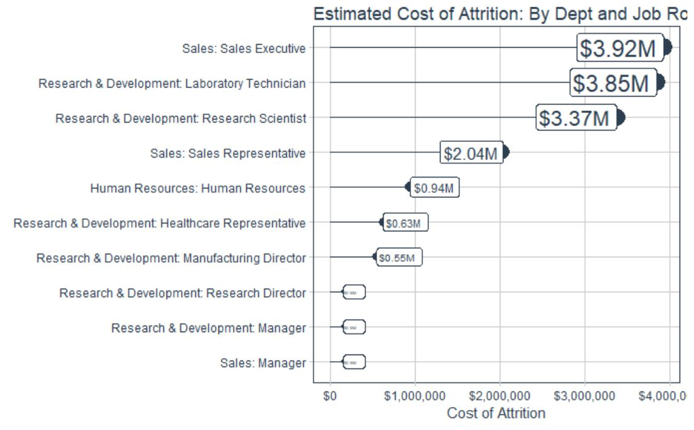

<style type="text/css">
img.resize {
  max-width:50%;
  max-height:50%;
}
</style>


```{r setWD, echo=FALSE, message=FALSE, warning=FALSE, eval=FALSE}
setwd("~/GitHub/CourseWork/BusSciUniv/EeeAttrition")

options(scipen = 999)
options(digits = 2)

library(dplyr)
library(kableExtra)
library(readxl)

# Load Data
path_train <- "00_Data/telco_train.xlsx"
train_raw_tbl <- read_excel(path_train, sheet = 1)

# Data Subset
dept_job_role_tbl <- train_raw_tbl %>% 
     select(EmployeeNumber, Department, JobRole, PerformanceRating, Attrition)
```

# Functions TOC

A list of the functions created in this document.

```{r FunctionTOC}
library(dplyr)
library(kableExtra)

setwd("C:/Users/czwea/Documents/GitHub/CourseWork/BusSciUniv/EeeAttrition")

plot_attrition <- paste0("[", "plot_attrition", "](", "www.bing.com", ")")

Artifact <- c(plot_attrition, "plot_ggpairs", "plot_hist_facet", "get_cor", "plot_cor", 
              "plot_h2o_leaderboard", "plot_h2o_performance", "plot_features_tq", "plot_explanations_tq", 
              "calculate_savings_by_threshold_2", "Image1", "IMage2", "Image3")

Thumbnail <- c("{width=30%}", "", "", "", "", "", "", "", "", "", "Image1Link", "Image2Link", "Image3Link")

DF_toc <- data.frame(Artifact, Thumbnail)

kable(DF_toc, caption = "") %>% kable_styling(bootstrap_options = c("striped", "hover", "condensed", "responsive"), full_width = F) %>% 
     group_rows("Functions", 1, 10, label_row_css = "background-color: #666; color: #fff;") %>% 
     group_rows("Visualizations", 11, 13, label_row_css = "background-color: #666; color: #fff;")


#https://www.zevross.com/blog/2017/06/19/tips-and-tricks-for-working-with-images-and-figures-in-r-markdown-documents/

#mtcars$mpg <- paste0("[", mtcars$mpg, "](", urls, ")")
```


Test 1
```{r results='asis', eval=F}
library(kableExtra)
library(dplyr)
dat <- data.frame(country = c('Canada', 'United Kindom'),  abbr = c('plot_attrition', 'plot_attrition2'),  var1 = c(1, 2),  var2 = rnorm(2))
dat$flag <- sprintf('', dat$abbr)
library(knitr)
kable(dat) %>% kable_styling(bootstrap_options = c("striped", "hover", "condensed"))
```

Test 2

```{r eval=F}
# some urls
urls <- rep("https://stackoverflow.com/", 10)
# use paste0 to compose markdown-formatted hyperlinks
mtcars$mpg <- paste0("[", mtcars$mpg, "](", urls, ")")
# print the table, with hyperlinked text
knitr::kable(head(mtcars))
```

Test 3

```{r eval=F}
dat <- data.frame(country = c('Canada', 'United Kindom'),  abbr = c('plot_attrition.png', 'plot_attrition2.png'),  var1 = c(1, 2),  var2 = rnorm(2), flag = 0)
#dat$flag <- sprintf("", dat$abbr)
dat$flag[1] <- ""
dat$flag[1]

#dat$flag <- sprintf('', dat$abbr)

library(knitr)
kable(dat) %>% kable_styling(bootstrap_options = c("striped", "hover", "condensed"))

```

##Original 


##30% - works

{width=30%}

## Last one - works


