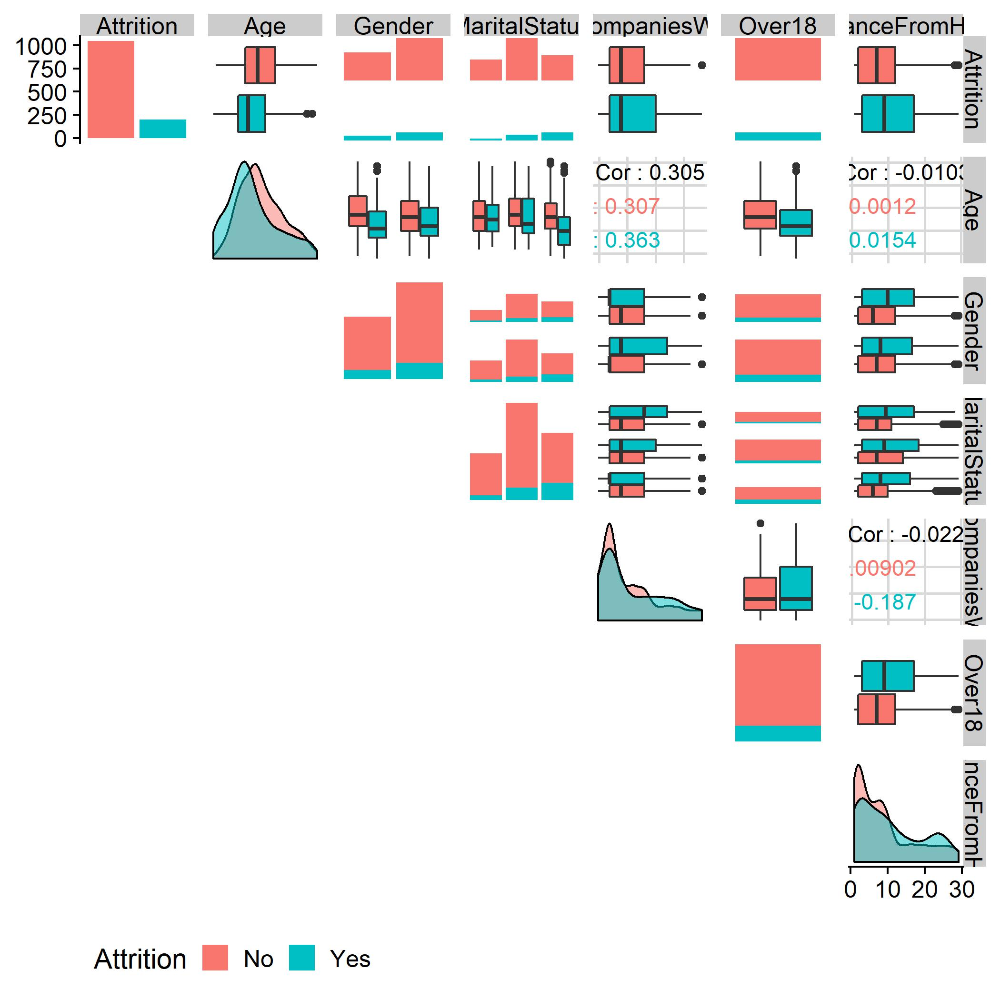
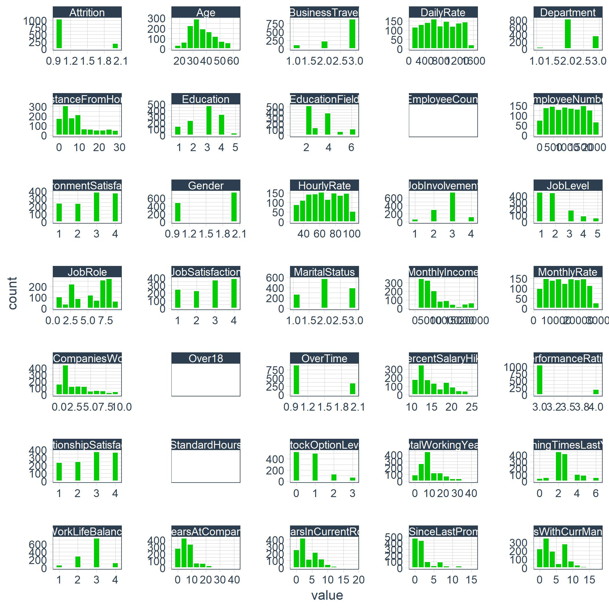
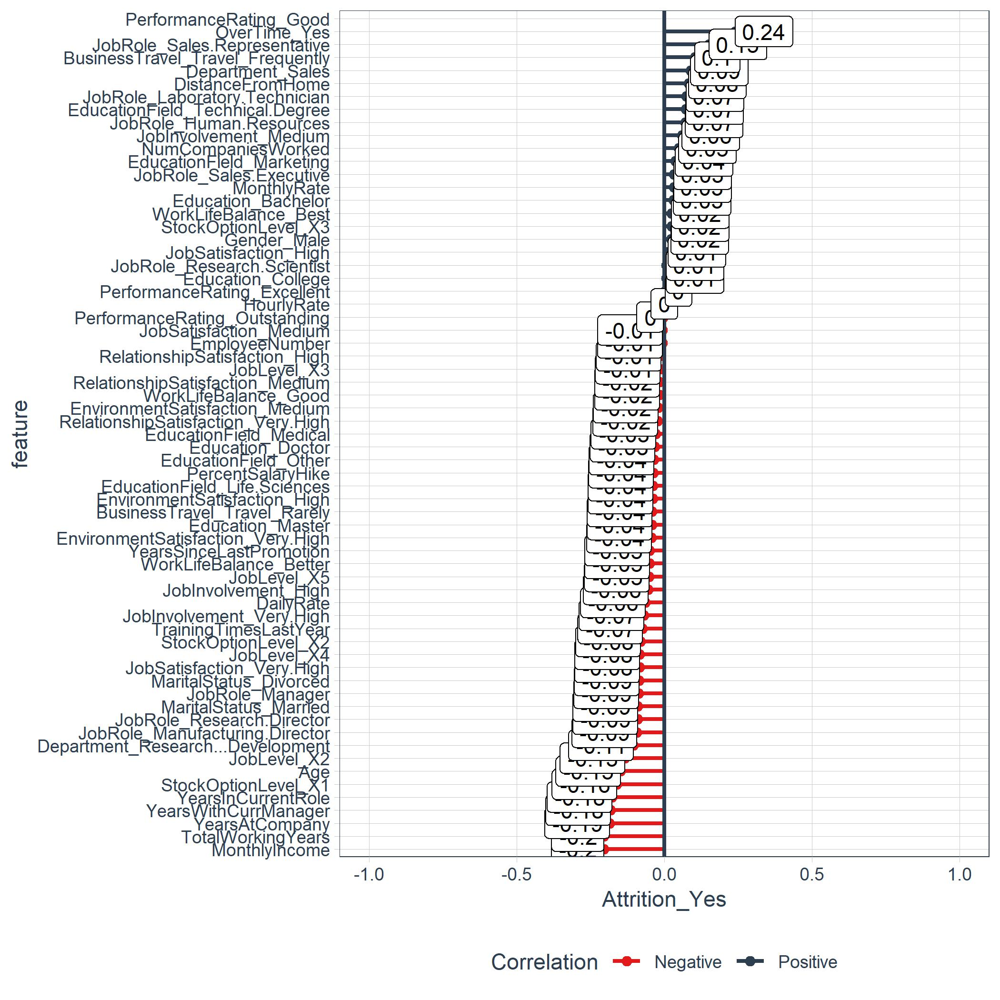

```{r setWD, echo=FALSE, message=FALSE, warning=FALSE}
setwd("~/GitHub/CourseWork/BusSciUniv/EeeAttrition")

options(scipen = 999)
options(digits = 2)

source("00_Scripts/required_packages.R")
packages("kableExtra", prompt = FALSE)

# Load Data
path_train <- "00_Data/telco_train.xlsx"
train_raw_tbl <- read_excel(path_train, sheet = 1)

# Data Subset
dept_job_role_tbl <- train_raw_tbl %>% 
     select(EmployeeNumber, Department, JobRole, PerformanceRating, Attrition)
```

# Functions TOC

A list of the functions created in this document.

```{r FunctionTOC}
plot_attrition_link <- paste0("[", "plot_attrition", "](", "#plot_attrition", ")")
plot_ggpairs_link <- paste0("[", "plot_ggpairs", "](", "#plot_ggpairs", ")")
plot_hist_link <- paste0("[", "plot_hist", "](", "#plot_hist", ")")
get_cor_link <- paste0("[", "get_cor", "](", "#get_cor", ")")
plot_cor_link <- paste0("[", "plot_cor", "](", "#plot_cor", ")")


Artifact <- c(plot_attrition_link, plot_ggpairs_link, plot_hist_link, get_cor_link, plot_cor_link, 
              "plot_h2o_leaderboard", "plot_h2o_performance", "plot_features_tq", "plot_explanations_tq", 
              "", "Image1", "IMage2", "Image3")

Thumbnail <- c("{width=30%}",
               "{width=30%}",
               "{width=30%}", 
               "{width=30%}", 
               "{width=30%}", "", "", "", "", "", "Image1Link", "Image2Link", "Image3Link")

DF_toc <- data.frame(Artifact, Thumbnail)

kable(DF_toc, caption = "") %>% kable_styling(bootstrap_options = c("striped", "hover", "condensed", "responsive"), full_width = F) %>% 
     group_rows("Functions", 1, 10, label_row_css = "background-color: #666; color: #fff;") %>% 
     group_rows("Visualizations", 11, 13, label_row_css = "background-color: #666; color: #fff;")
```