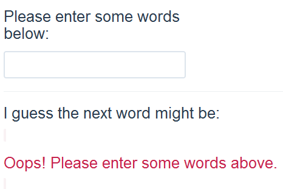
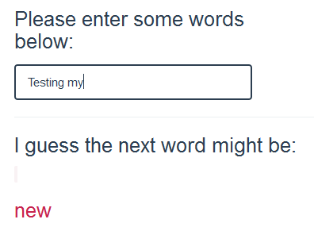

##Welcome!

This application was written to satisfy the requirements of the Capstone Project for the [Johns Hopkins Data Science Specialization](http://www.coursera.org/specializations/jhu-data-science) hosted by [Coursera](http://www.coursera.org).  If you have not considered this Coursera Course, I *strongly* suggest if you have any interest in data science, take a look.  It is a lot of work but it is worth it.

##How To

While there is a lot of thought and code behind this application, it is really simple to use.  When you first open my application, you are presented with this screen:

Because no words have been typed into the top dialog box, an **Oops message** is presented asking you to enter some words.  Note, if your spelling is not correct, the application might not suggest a word since it would not understand the spelling error.

Once some words are entered, the application will guess what the next word might be.  Below, I entered *Testing my* and the application guess - correctly in this case :) - the next word to be *new*:

**Go ahead and try it**.  I hope you find it interesting.

Don't forget to look at some of the documentation in the other tabs if you are really curious about the application, the data and the technology supporting it.
