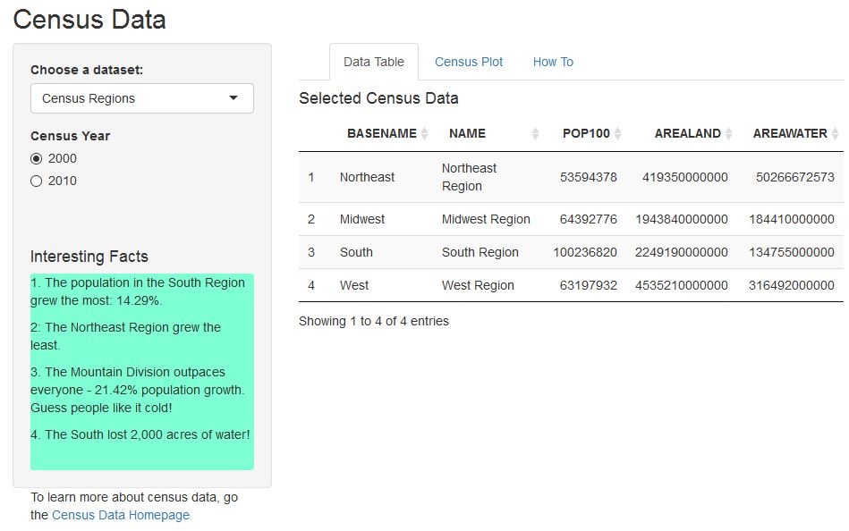
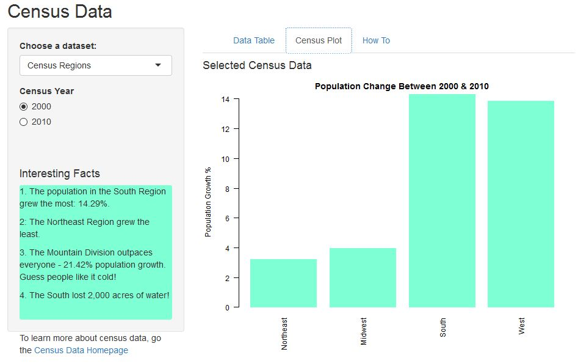
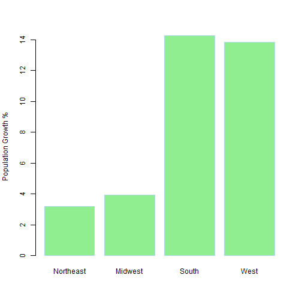

Population Changes Between 2000 & 2010 Census
========================================================
author: Cliff Weaver
date: Jan 17, 2016

Introduction
========================================================

The 9th course in the Coursera Data Science Specialization Certification requires the following:

1. 5 slides to pitch our idea done in Slidify or Rstudio Presenter 
2. Your presentation pushed to github or Rpubs
3. A link to your github or Rpubs presentation pasted into the provided text box
4. It must contained some embedded R code that gets run when slidifying the document

THe Shiny app I created compares census data between the 2000 and 2010 Census.

The application can be used [here](https://zellw.shinyapps.io/shiny2/)

What to Expect
========================================================

The default view shows the population of the 4 U.S. Regions for the 2000 Census

This is easily changed by selecting the 2010 radio button and/or change the data to U.S. Divisions - a more granualr approach.

***

 

Slide With Plot
========================================================

 
