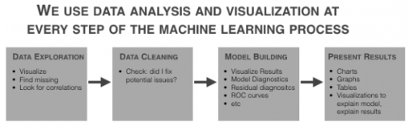

##Introduction

Data scientists spend an inordinate amount of time on data analysis. The traditional statement is that data scientists “spend 80% of their time on data preparation.” While I think that this statement is essentially correct, a more precise statement is that you’ll spend 80% of your time on getting data, cleaning data, aggregating data, reshaping data, and exploring data using exploratory data analysis and data visualization. (From this point forward, I’ll use the term “data analysis” as a shorthand for getting data, reshaping it, exploring it, and visualizing it.)

And ultimately, the importance of data analysis applies not only to data science generally, but machine learning specifically. 

The fact is, if you want to build a machine learning model, you’ll spend huge amounts of time just doing data analysis as a precursor to that process. 

Moreover, you’ll use data analysis to explore the results of your model after you’ve applied an ML algorithm. 

Additionally, in industry, you’ll also need to rely heavily on data visualization techniques to present the results after you’ve finalized them. This is one of the practical details of working as a data scientist that many courses and teachers never tell you about. Creating presentations to communicate your results will take large amounts of your time. And to create these presentations, you should rely heavily data visualization to communicate the model results visually.



Data analysis and data visualization are critical at almost every part of the machine learning workflow. 

So, to get started with ML (and to eventually master it) you need to be able to apply visualization and analysis.

In this post, I’ll show you some of the basic data analysis and visualization techniques you’ll need to know to build a machine learning model. 

We’ll work on a toy problem, for simplicity and clarity

One note before we get started: the problem that we’ll work through is just linear regression and we’ll be using an easy-to-use, off-the-shelf dataset. It’s a “toy problem,” which is intentional. Whenever you try to learn a new skill, it is extremely helpful to isolate different details of that skill. 

The skill that I really want you to focus on here is data visualization (as it applies to machine learning).

We’ll also be performing a little bit of data manipulation, but it will be in service of analyzing and visualizing the data. We won’t be doing any data manipulation to “clean” the data.

So just keep that in mind. We’re working on a very simplified problem. I’m removing or limiting several other parts of the ML workflow so we can strictly focus on preliminary visualization and analysis for machine learning.

##Step 1: get the data

The first step almost of any analysis or model building effort is getting the data. 

For this particular analysis, we’ll use a relatively “off the shelf” dataset that’s available in R within the MASS package.
```{r}
data(Boston, package = "MASS")
```

The Boston dataset contains data on median house price for houses in the Boston area. The variable that we’ll try to predict is the medv variable (median house price). The dataset has roughly a dozen other predictors that we’ll be investigating and using in our model. 

This is a simplified “toy example” data doesn’t require much cleaning

As I already mentioned, the example we’ll be working through is a bit of a “toy” example, and as such, we’re working with a dataset that’s relatively “easy to use.” What I mean is that I’ve chosen this dataset because it’s easy to obtain and it doesn’t require much data cleaning.

However, keep in mind that in a typical business or industry setting, you’ll probably need to get your data from a database using SQL or possibly from a spreadsheet or other file.

Moreover, it’s very common for data to be “messy.” The data may have lots of missing values; variable names and class names that need to be changed; or other details that need to be altered.

Again, I’m intentionally leaving “data cleaning” out of this blog post for the sake of simplicity.

Just keep in mind that in many cases, you’ll have some data cleaning to do.

##Step 2: basic data exploration

After getting the dataset, the next step in the model building workflow is almost always data visualization. Specifically, we’ll perform exploratory data analysis on the data to accomplish several tasks:

1. View data distributions
2. Identify skewed predictors
3. Identify outliers

###Visualize data distributions

Let’s begin our data exploration by visualizing the data distributions of our variables.

We can start by visualizing the distribution of our target variable, medv.

To do this, we’ll first use a basic histogram. 

I strongly believe that the histogram is one of the “core visualization techniques” that every data scientists should master. If you want to be a great data scientist, and if you ultimately want to build machine learning models, then mastering the histogram is one of your “first steps.” 

By “master”, I mean that you should be able to write this code “with your eyes closed.” A good data scientist should be able to write the code to create a histogram (or scatterplot, or line chart ….) from scratch, without any reference material and without “copying and pasting.” You should be able to write it from memory almost as fast as you can type. 

One of the reasons that I believe the histogram is so important is because we use it frequently in this sort of exploratory data analysis. When we’re performing an analysis or building a model, it is extremely common to examine the distribution of a variable. Because it’s so common to do this, you should know this technique cold.

Here’s the code to create a histogram of our target variable medv.
```{r message=FALSE, warning=FALSE}
require(ggplot2)
ggplot(data = Boston, aes(x = medv)) +  geom_histogram()
```

The density plot is essentially a variation of the histogram. The code to create a density plot is essentially identical to the code for a histogram, except that the second line is changed from geom_histogram() to stat_density(). Speaking in terms of ggplot2 syntax, we’re replacing the histogram geom with a statistical transformation.
```{r}
ggplot(data = Boston, aes(x = medv)) +  stat_density()
```

Between histograms and density plots, some people strongly prefer histograms. The primary reason for this is that histograms tend to “provide better information on the exact location of data” (which is good for detecting outliers). This is true in particular when you use a relatively larger number of histogram bins; a histogram with a sufficiently large number of bins can show you peaks and unusual data details a little better, because it doesn’t smooth that information away. (Density plots and histograms with a small number of bins can smooth that information out too much.) So, when we’re visualizing a single variable, the histogram might be the better option.

However, when we’re visualizing multiple variables at a time, density plots are easier to work with. If you attempt to plot several histograms at the same time by using a small multiple chart, it can be very difficult to select a single binwidth that properly displays all of your variables. Because of this, **density plots are easier to work with when you’re visualizing multiple variables** in a small multiple chart. Density plots show the general shape of the data and we don’t have to worry about choosing the number of bins.

Let’s examine the plots. We can immediately see a few important details:

1. It’s not perfectly normal. 

This is one of the things we’re looking for when we visualize our data (particularly for linear regression). I’ll save a complete explanation of why we test for normality in linear regression and machine learning, but in brief, we are examining this because many machine learning techniques require normally distributed variables. 

2. It appears that there may be a few minor outliers in the far right tail of the distribution. For the sake of simplicity, we’re not going to deal with those outliers here; we’ll be able to build a model (imperfect though it might be) without worrying about those outliers right now. 

Keep in mind, however, that you’ll be looking for them when you plot your data, and in some cases, they may be problematic enough to warrant some action.

Now that we’ve examined our target variable, let’s look at the distributions of all of the variables in our dataset. 

####Trellis Chart
We’re going to visualize all of our predictors in a single chart. This is known as a small multiple chart (sometimes also called a “trellis chart”). Basically, the small multiple chart allows you to plot many charts in a grid format, side by side. It allows you to use the same basic graphic or chart to display different slices of a data set. In this case, we’ll use the small multiple to visualize different variables.

You might be tempted to visualize each predictor individually – one chart at a time – but that can get cumbersome and tedious very quickly. When you’re working with more than a couple of variables, the small multiple will save you lots of time. This is particularly true if you work with datasets with dozens, even hundreds of variables.

Although the small multiple is perfect for a task like this, we’ll have to do some minor data wrangling to use it.

####Reshape the data for Trellis

To use the small multiple design to visualize our variables, we’ll have to manipulate our data into shape. 

Before we reshape the data, let’s take a look at the data as it currently exists:
```{r}
head(Boston)
```

Notice that the variables are currently located as columns of the data frame. For example, the crim variable is the first column. This is how data is commonly formatted in a data frame; typical data frames have variables as columns, and data observations as rows. This format is commonly called “wide-format” data.

However, to create a “small multiple” to plot all of our variables, we need to reshape our data so that the variables are along the rows; we need to reshape our data into “long-format.’

To do this, we’re going to use the melt() function from the `reshape2` package. This function will change the shape of the data from wide-format to long-format.
```{r message=FALSE, warning=FALSE}
require(reshape2)
melt.boston <- melt(Boston)
head(melt.boston)
```

After using melt(), notice that the crim variable (which had been a column) is now dispersed along the rows of our reshaped dataset, melt.boston. In fact, if you examine the whole dataset, all of our dataset features are now along rows.

Now that we’ve melted our data into long-format, we’re going to use ggplot2 to create a small multiple chart. Specifically, we’ll  use facet_wrap() to implement the small-multiple design.
```{r}
ggplot(data = melt.boston, aes(x = value)) +  stat_density() +  facet_wrap(~variable, scales = "free")
```

So now that we’ve visualized the distributions of all of our variables, what are we looking for?

We’re looking primarily for a few things:

1. Outliers
2. Skewness
3. Other deviations from normality

Let’s examine skewness first (simply because that seems to be one of the primary issues with these features).

Just to refresh your memory, skewness is a measure of asymmetry of a data distribution. 

You can immediately see that several of the variables are highly skewed . 

In particular, crim, zn, chaz, dis, and black are highly skewed. Several of the others appear to have moderate skewness.

We’ll quickly confirm this by calculating the skewness:
```{r message=FALSE, warning=FALSE}
#~~~~~~~~~~~~~~~~~~~~
# calculate skewness
#~~~~~~~~~~~~~~~~~~~~
require(e1071)
sapply(Boston, skewness)
```
To be clear, skewness can be a bit of a slippery concept, but note that a skewness of zero indicates a symmetrical distribution. Ideally, we’re looking for variables with a skewness of zero.

Also, a very rough rule of thumb is if the absolute value of skewness is above 1, then the variable has high skewness.

Looking at these numbers, a few of the variables have relatively low skewness, including rm, indus, and age (although rm is much more symmetrical).

###Note: how we (normally) use this info

Part of the task of data exploration for ML is knowing what to do with the information uncovered in the data exploration process. That is, once you’ve identified potential problems and salient characteristics of your data, you need to be able to transform your data in ways that will make the machine learning algorithms work better. As I said previously, “data transformation” is a separate skill, and because we’re focusing on the pure “data exploration” process in this post, we won’t discussing data transformations. (Transformations are a big topic.)

Be aware, however, that in a common ML workflow, your learnings from EDA will serve as an input to the “data transformation” step of your workflow. 

##Recap

Let’s recap what we just did:

1. Plotted a histogram of our target variable using ggplot2
2. Reshaped our dataset using melt()
3. Plotted the variables using the small multiple design
4. Examined our variables for skewness and outliers

To be honest, this was actually an abbreviated list of things to do. We could also have looked at correlation, among other things. 

This is more than enough to get you started though. 

Tools that we leveraged.

By now, you should have some indication of what skills you need to know to get started with practical machine learning in R:

1. Learn ggplot2
 – master basic techniques like the histogram and scatterplot
 – learn how to facet your data in ggplot2 to perform multivariate data exploration

2. Learn basic data manipulation. I’ll suggest dplyr (which we didn’t really use here), and also reshape.


