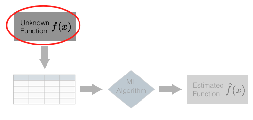
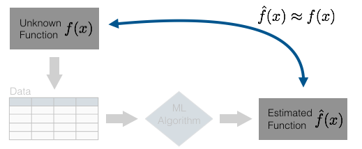

##The one machine learning concept you need to know


###Machine learning is hard. 

Some people spend weeks, months, even years trying to learn machine learning without any success. They play around with datasets, buy books, compete on Kaggle, but ultimately make little progress. 

One of the big problems, is that many people just want to “dive in and build something.” 

I admire the ambition of these students, but I absolutely think that the “just build something” method of learning a new subject is vastly overrated. In order to learn a technical subject, it pays off to have a solid understanding of the conceptual framework that underlies that subject. 

To quote Cal Newport: “to master a technical subject, you need to develop intuition for every major concept.”

Machine learning is no exception.

And ultimately, in order to build your understanding, you need to start at the beginning with the most fundamental concepts. 

But don’t take my word for it. I think that Elon Musk said it best : “It is important to view knowledge as sort of a semantic tree. Make sure you understand the fundamental principles … before you get into the details.” Read that again (and consider who said it): start with the fundamental principals before you move on to the details. Start at the “trunk” of a subject before you climb out towards the “branches and leaves.”

The most fundamental thing you need to understand in almost any applied subject, is what you’re actually trying to accomplish. What I’m suggesting, is that before you really dive into the details, you need to have a solid, intuitive understanding of what you’re actually trying to do when you apply a machine learning algorithm.

So before you learn the syntax, techniques, “rules of thumb,” math, or advanced concepts, you need to have a firm understanding of the core task of machine learning. 

So, let’s start at the beginning.

If I asked you to distill the core problem of supervised machine learning down to a single thing, do you know what it would be? 

Not sure? Keep reading.

###I’m going to give you a dataset … 

You can get the data right here:
```{r getData}
df.unknown_fxn_data <- read.csv(url("http://www.sharpsightlabs.com/wp-content/uploads/2016/04/unknown_fxn_data.txt"))
```
We’re going to perform some basic machine learning with this data, and in doing this, I want to help you understand an important concept.

###Preliminary data exploration 

Ok, just like any data scientist that’s worth his $150,000 salary, let’s take a look the data first. We’ll perform some basic data exploration.

First, we’ll use str() to examine the “structure” of the data:
```{r}
str(df.unknown_fxn_data)
```
You’ll notice that there are two variables, input_var, and target_var. 

####A quick side-note about terminology

In machine learning, the variables that we use as inputs to our machine learning algorithms are commonly called inputs, but they are also frequently referred to as predictors or features (the terms are more or less interchangeable). Inputs/predictors are independent variables. In a simple 2-d space, you can think of an input as x-axis variable.

In ML, the variable that we’re trying to predict is commonly called a target variable, but they are also called output variables or response variables (again, the terms are largely interchangeable). Ultimately, you can think of the target as the dependent variable; visually, in a 2-dimensional graph, the target variable is the variable on the y-axis.

For the purposes of this exercise, input_var is the input/feature, and target_var is the variable we’re going to predict. 

Ok, let’s get back to our data exploration; let’s print out the first few rows of the dataset using the head() function.
```{r}
head(df.unknown_fxn_data)
```
As I just mentioned, input_var is the independent input variable and target_var is the dependent target variable that we’re going to predict. Because we have only two variables, you can think of each row of data as a simple (x, y) pair.

####Visually exploring the dataset

Now, let’s examine the data visually.

Because input_var is an independent variable, we can plot it on the x-axis, and target_var should be on the y-axis.

Because these are discrete (x, y) pairs, we’ll use a scatterplot to visualize the data. To create a scatterplot with R’s ggplot2, we’ll use geom_point().

(Note: if you’re not familiar with how ggplot works, and how to create scatterplots in ggplot, you can find out more information in a separate blog post. To be honest, knowledge of data visualization and exploratory data analysis is a prerequisite for doing machine learning. If you don’t know data visualization and EDA, you might want to start there …)

Ok, here’s the code to create a scatterplot of our data using ggplot:
```{r plot1}
require(ggplot2)
ggplot(data = df.unknown_fxn_data, aes(x = input_var, y = target_var)) +
  geom_point()
```

By plotting the data visually, we can visually detect a pattern. Ultimately, we’re going to try to build a model that can replicate and predict that pattern.

####A hint about the one thing you need to know about ML 

I want to pause here for a moment and bring us back to our original question: “what is the core task of machine learning?” 

When I just stated that we’re trying to “replicate and predict” the pattern that we plotted, this is a big clue. Again, if you’re still not sure what the answer is, keep reading …

###Creating a linear model using r caret

Now that we’ve explored our data, we’ll create a very simple linear model using caret.
```{r message=FALSE, warning=FALSE}
require(caret)

mod.lm <- train( target_var ~ input_var, data = df.unknown_fxn_data, method = "lm")
```
The train() function is the “core” function of the caret package; it is the R function that we use to build a machine learning model.

Inside of the train() function, we’re using several parameters.

r data =  indicates that we’re going to be building a model with training observations in the  df.unknown_fxn_data dataset.

target_var ~ input_var specifies the “formula” of our model. It indicates the target variable that we’re trying to predict as well as the predictor we’ll use as an input. (Note that caret also allows you to use multiple predictors. If you had a dataset with several predictor variables, you could use several of them by separating each predictor with a + sign.)

Finally, method = “lm” indicates that we want to build a linear regression model. That is, we’re going to fit a straight line to these data of the form y = \beta_0 + \beta_1x_1, where \beta_1 is the slope and \beta_0 is the intercept.

####Plotting the model, and the data

Ok. Now that we’ve built a simple linear model using the train() function, let’s plot the data and plot the linear model on top of it.

To do this, we’ll extract the slope and the intercept of our linear model using the coef() function. (To speak a little more technically, what we’re doing here is extracting \beta_0 and \beta_1.)
```{r}
#~~~~~~~~~~~~~~~~~
# get coefficients
#~~~~~~~~~~~~~~~~~
coef.icept <- coef(mod.lm$finalModel)[1]
coef.slope <- coef(mod.lm$finalModel)[2]

#~~~~~~~~~~~~~~
# plot the data
#~~~~~~~~~~~~~~
ggplot(data = df.unknown_fxn_data, aes(x = input_var, y = target_var)) geom_point() +
  geom_abline(intercept = coef.icept, slope = coef.slope, color = "red")
```

Using train(), we’ve essentially fit a mathematical function, which we’ll call \hat{f}(x), to the data. 

To be exact, the algorithm fit the following linear function to the data: \hat{f}(x) = .02 + .38x. We can use this to predict target_var as target_var \approx \hat{f}(input_var). 

###What we’ve actually done here: a quick recap

Ok, let’s quickly recap. What did we just do here?

1. I gave you a set of data points.
2. We used an algorithm to fit a line to these data points. (Note: I haven’t explicitly discussed the exact algorithm. However, “behind the scenes” the train() function is executing an algorithm to find the “best fit” line for the data points.)
3. The output of this process is our function \hat{f}(x), which we can use as a model to make rough predictions about the relationship between input_var and target_var.


###Here’s the part that I didn’t tell you at the beginning …

What I didn’t tell you at the beginning, is that there is a function that underlies the data points in our dataset.



The data points were created with the sine function, and a little bit of random noise.
```{r}
set.seed(9877)
input_var <- seq(-2.75,2.75, by = .2)
target_var <- sin(input_var) + rnorm(length(input_var), mean = 0, sd = .2)

df.unknown_fxn_data <- data.frame(input_var, target_var)

ggplot(data = df.unknown_fxn_data, aes(x = input_var, y = target_var)) geom_point() +
  stat_function(fun = sin, color = "navy", size = 1)
```

So ultimately, when we began this exercise, there was a hidden function that generated the data, and we used machine learning to estimate that function. The machine learning method used only the 28 data points in our dataset to select an estimated function \hat{f}(x) that approximates the underlying function, f(x).

n

Said differently, machine learning allowed us to estimate the underlying function, while being effectively blind to that underlying function.

##This is the one concept you need to understand before moving on… 

This is the core concept that you need to understand: the essential problem of machine learning is function estimation.

When you’re doing machine learning (specifically, supervised learning), you’re essentially using computational techniques to reverse engineer the underlying function from the data points alone. You’re estimating an underlying function based only on training observations in a dataset.

In the exercise in this blog post, I intentionally kept the underlying function hidden from you, because we never know the underlying function (I only revealed it at the end to help drive home the concept). In practice, when you apply machine learning, you’ll never know the underlying structure; your task will be to reverse engineer the underlying pattern in the data. Machine learning allows you to do this.

I’ll say it again: machine learning provides us with a set of computational and statistical tools for estimating f(x); for figuring out the underlying function with only a set of data points.

This might sound easy, but it’s fraught with pitfalls, challenges, and tradeoffs. 

##Next steps: more concepts to learn

As I mentioned in the beginning of the blog post, the real secret to mastering a technical subject is developing intuition for each major concept. 

Here are a few of topics that you’ll need to learn more about:

– Why do we need to estimate f(x)?
– How exactly do we assess how well \hat{f}(x) approximates f(x) ?
– The Bias/Variance tradeoff
– Training a model vs testing a model

Having said that, understanding “machine learning as function estimation” will help you develop your understanding of these additional concepts. 

To return to Musk’s analogy at the beginning of the blog post, if you think of the topics of ML as sort of a semantic tree, these additional topics are some of the “branches” of the tree. However, you can think of the topic of this blog post – machine learning as function estimation – as the “trunk” of the tree. Once you understand this, you can begin to learn the other foundational concepts of machine learning.
