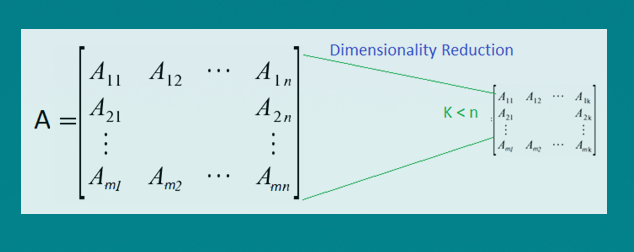
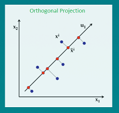
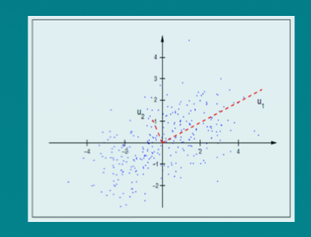

```{r echo=FALSE, results='hide'}
library(caret)
```
See http://www.dataperspective.info/2016/02/principal-component-analysis-using-r.html

###Principal Component Analysis using R 

####Curse of Dimensionality:
One of the most commonly faced problems while dealing with data analytics problem such as recommendation engines, text analytics is high-dimensional and sparse data. At many times, we face a situation where we have a large set of features and fewer data points, or we have data with very high feature vectors. In such scenarios, fitting a model to the dataset, results in lower predictive power of the model. This scenario is often termed as the curse of dimensionality. In general, adding more data points or decreasing the feature space, also known as dimensionality reduction, often reduces the effects of the curse of dimensionality. 

PCA is a useful statistical method that has found application in a variety of fields and is a common technique for finding patterns in data of high dimension.

<p style="text-align:center;"></p>

Consider below scenario:

The data, we want to work with, is in the form of a matrix A of mXn dimension, shown as below, where Ai,j represents the value of the i-th observation of the j-th variable. 

<p style="text-align:center;"></p>

Thus the N members of the matrix can be identified with the M rows, each variable corresponding to N-dimensional vectors. If N is very large it is often desirable to reduce the number of variables to a smaller number of variables, say k variables as in the image below, while losing as little information as possible. 

<p style="text-align:center;"></p>

Mathematically spoken, PCA is a linear orthogonal transformation that transforms the data to a new coordinate system such that the greatest variance by any projection of the data comes to lie on the first coordinate (called the first principal component), the second greatest variance on the second coordinate, and so on.

<p style="text-align:center;"></p>

The algorithm when applied linearly transforms m-dimensional input space to n-dimensional (n < m) output space, with the objective to minimize the amount of information/variance lost by discarding (m-n) dimensions. PCA allows us to discard the variables/features that have less variance.

Technically speaking, PCA uses orthogonal projection of highly correlated variables to a set of values of linearly uncorrelated variables called principal components. The number of principal components is less than or equal to the number of original variables. This linear transformation is defined in such a way that the first principal component has the largest possible variance. It accounts for as much of the variability in the data as possible by considering highly correlated features. Each succeeding component in turn has the highest variance using the features that are less correlated with the first principal component and that are orthogonal to the preceding component.

<p style="text-align:center;"></p>

In the above image, u1 & u2 are principal components wherein u1 accounts for highest variance in the dataset and u2 accounts for next highest variance and is orthogonal to u1.

####PCA implementation in R:

For today’s post we use crimtab dataset available in R. Data of 3000 male criminals over 20 years old undergoing their sentences in the chief prisons of England and Wales. The 42 row names ("9.4", 9.5" ...) correspond to midpoints of intervals of finger lengths whereas the 22 column names ("142.24", "144.78"...) correspond to (body) heights of 3000 criminals, see also below. 

```{r highlight=TRUE}
head(crimtab)
dim(crimtab)
str(crimtab)
sum(crimtab)
colnames(crimtab)
```

Use apply() to the crimtab dataset row wise to calculate the variance to see how each variable is varying.
```{r}
apply(crimtab,2,var)
```
We observe that column “165.1” contains maximum variance in the data. Applying PCA using prcomp(). 
```{r}
#Performs a principal components analysis on the given data matrix and returns the results 
#as an object of class prcomp.
pca =prcomp(crimtab)
```
Here is a snippet of the data returned by pca:

<p style="text-align:center;"></p>

>Note: the resultant components of pca object from the above code corresponds to the standard deviations and Rotation. From the above standard deviations we can observe that the 1st PCA explained most of the variation, followed by other pcas’.  Rotation contains the principal component loadings matrix values which explains /proportion of each variable along each principal component.

Let’s plot all the principal components and see how the variance is accounted with each component.
```{r}
par(mar = rep(2, 4))
plot(pca)
```

Clearly the first principal component accounts for maximum information.

Let us interpret the results of pca using biplot graph. Biplot is used to show the proportions of each variable along the two principal components.
```{r message=FALSE, warning=FALSE}
#below code changes the directions of the biplot, if we donot include the below two lines the plot will be mirror image to the below one.
pca$rotation=-pca$rotation
pca$x=-pca$x
biplot (pca , scale =0)
```

In the preceding image, known as a biplot, we can see the two principal components (PC1 and PC2) of the crimtab dataset. The red arrows represent the loading vectors, which represent how the feature space varies along the principal component vectors.

From the plot, we can see that the first principal component vector, PC1, more or less places equal weight on three features: 165.1, 167.64, and 170.18. This means that these three features are more correlated with each other than the 160.02 and 162.56 features. 

In the second principal component, PC2 places more weight on 160.02, 162.56 than the 3 features, "165.1, 167.64, and 170.18" which are less correlated with them. 

Complete Code for PCA implementation in R: 
```{r echo=TRUE, results='hide', eval=FALSE}
library(caret)
data("crimtab") #load data
head(crimtab) #show sample data
dim(crimtab) #check dimensions
str(crimtab) #show structure of the data
sum(crimtab) 
colnames(crimtab)
apply(crimtab,2,var) #check the variance accross the variables
pca =prcomp(crimtab) #applying principal component analysis on crimtab data
par(mar = rep(2, 4)) #plot to show variable importance
plot(pca) 
'below code changes the directions of the biplot, if we donot include
the below two lines the plot will be mirror image to the below one.'
pca$rotation=-pca$rotation
pca$x=-pca$x
biplot (pca , scale =0) #plot pca components using biplot in r
```

So by now we understood how to run the PCA, and how to interpret the principal components, where do we go from here? How do we apply the reduced variable dataset? In our next post we shall answer the above questions. 