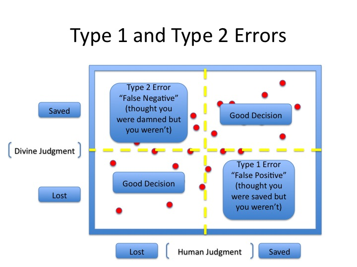

```{r setup, include=FALSE}
knitr::opts_chunk$set(echo = TRUE)

```

The difference between a confidence interval and a capture percentage 

Let's discuss a perfect real life example of a common error people make when interpreting confidence intervals:  misinterpretation of confidence intervals.

Lets assume a Harvard professor and two Science editors make the following statement: 

> If you take 100 original studies and replicate them, then sampling error alone should cause 5% of the replication studies to *fail* by producing results that fall outside the 95% confidence interval of the original study.

The formal meaning of a confidence interval is that 95% of the confidence intervals should, in the long run, contain the true population parameter. See Kristoffer Magnussons [excellent visualization](http://rpsychologist.com/d3/CI/), where you can see how 95% of the confidence intervals include the true population value. (Really should read this - great article.) Remember that confidence intervals are a statement about where future confidence intervals will fall. 

Single confidence intervals are not a statement about where the means of future samples will fall. The percentage of means in future samples that falls within a single confidence interval is called the capture percentage. The percentage of future means that fall within a single unbiased confidence interval depends upon which single confidence interval you happened to observe, but in the long run, 95% confidence intervals have a 83.4% capture percentage (Cumming & Maillardet, 2006). In other words, in a large number of unbiased original studies, 16.6% (not 5%) of replication studies will observe a parameter estimate that falls outside of a single confidence interval. (Note that this percentage assumes an equal sample size in the original and replication study if sample sizes differ, you would need to simulate the capture percentages for each study.) 

Lets experience this through simulation. Simulate a single sample with a true population mean of 100 and standard deviation of 15 (the mean and SD of an IQ test) and create a plot. Samples drawn from this true population will show variation, as you can see from the mean and standard deviation of the sample in the plot. The black dotted line illustrates the true mean of 100. The orange area illustrates the 95% confidence interval around the sample mean, and 95% of orange bars will contain the black dotted line.

```{r message=FALSE, warning=FALSE}
if(!require(ggplot2)){install.packages('ggplot2')}
library(ggplot2)

n=20 #set sample size
nSims<-100000 #set number of simulations

x<-rnorm(n = n, mean = 100, sd = 15) #create sample from normal distribution

#95%CI
CIU<-mean(x)+qt(0.975, df = n-1)*sd(x)*sqrt(1/n)
CIL<-mean(x)-qt(0.975, df = n-1)*sd(x)*sqrt(1/n)

#plot data
#png(file="CI_mean.png",width=2000,height=2000, res = 300)
ggplot(as.data.frame(x), aes(x))  + 
  geom_rect(aes(xmin=CIL, xmax=CIU, ymin=0, ymax=Inf), fill="#E69F00") +
  geom_histogram(colour="black", fill="grey", aes(y=..density..), binwidth=2) +
  xlab("IQ") + ylab("number of people")  + ggtitle("Data") + theme_bw(base_size=20) + 
  theme(panel.grid.major.x = element_blank(), axis.text.y = element_blank(), panel.grid.minor.x = element_blank()) + 
  geom_vline(xintercept=100, colour="black", linetype="dashed", size=1) + 
  coord_cartesian(xlim=c(50,150)) + scale_x_continuous(breaks=c(50,60,70,80,90,100,110,120,130,140,150)) +
  annotate("text", x = mean(x), y = 0.02, label = paste("Mean = ",round(mean(x)),"\n","SD = ",round(sd(x)),sep=""), size=6.5)
dev.off()
```

The simulation also generates a large number of additional samples, after the initial one that was plotted. The simulation returns the number of confidence intervals from these simulations that contain the mean (which should be 95% in the long run). The simulation also returns the % of sample means from future studies that fall within the 95% of the original study. This is the capture percentage. It differs from (and is typically lower than) the confidence interval. 

Q1: Run the simulations multiple times (the 100000 simulations take a few seconds). (Look at the output you will get in the R console.)I did this is the plot above.) For example: 95.077% of the 95% confidence intervals contained the true mean and *The capture percentage for the plotted study, or the % of values within the observed confidence interval from 88.17208 to 103.1506 is: 82.377%.* While running the simulations multiple times, look at the confidence interval around the sample mean, and relate this to the capture percentage. Which statement is true?

A) The further the sample mean in the original study is from the true population mean, the lower the capture percentage.
B) The further the sample mean in the original study is from the true population mean, the higher the capture percentage.
C) The wider the confidence interval around the mean, the higher the capture percentage.
D) The narrower the confidence interval around the mean, the higher the capture percentage.

Q2: Simulations in R are randomly generated, but you can make a specific simulation reproducible by setting the seed of the random generation process. Copy-paste set.seed(123456) is used below. The sample mean is 108 (see the picture below). This is a clear overestimate of the true population parameter. Indeed, the just by chance, this simulation yielded a result that is significantly different from the null hypothesis (the mean IQ of 100), even though it is a Type 1 error. Such overestimates are common in a literature rife with publication bias. A recent large scale replication project revealed that even for studies that replicated (according to a p < 0.05 criterion), the effect sizes in the original studies were substantially inflated. Given the true mean of 100, many sample means should fall to the left of the orange bar, and this percentage is clearly much larger than 5%. What is the capture percentage in this specific situation where the original study yielded an upwardly biased estimate?

```{r message=FALSE, warning=FALSE}
if(!require(ggplot2)){install.packages('ggplot2')}
library(ggplot2)
set.seed(123456)
n=20 #set sample size
nSims<-100000 #set number of simulations

x<-rnorm(n = n, mean = 100, sd = 15) #create sample from normal distribution

#95%CI
CIU<-mean(x)+qt(0.975, df = n-1)*sd(x)*sqrt(1/n)
CIL<-mean(x)-qt(0.975, df = n-1)*sd(x)*sqrt(1/n)

#plot data
#png(file="CI_mean.png",width=2000,height=2000, res = 300)
ggplot(as.data.frame(x), aes(x))  + 
  geom_rect(aes(xmin=CIL, xmax=CIU, ymin=0, ymax=Inf), fill="#E69F00") +
  geom_histogram(colour="black", fill="grey", aes(y=..density..), binwidth=2) +
  xlab("IQ") + ylab("number of people")  + ggtitle("Data") + theme_bw(base_size=20) + 
  theme(panel.grid.major.x = element_blank(), axis.text.y = element_blank(), panel.grid.minor.x = element_blank()) + 
  geom_vline(xintercept=100, colour="black", linetype="dashed", size=1) + 
  coord_cartesian(xlim=c(50,150)) + scale_x_continuous(breaks=c(50,60,70,80,90,100,110,120,130,140,150)) +
  annotate("text", x = mean(x), y = 0.02, label = paste("Mean = ",round(mean(x)),"\n","SD = ",round(sd(x)),sep=""), size=6.5)
```
```{r echo=FALSE}
dev.off()
```



A) 95% (because I believe Harvard Professors and Science editors over you and your simulations!)
B) 42.2%
C) 84.3%
D) 89.2%

I always find it easier to see how statistics work, if you can simulate them. I hope this example makes it clear what the difference between a confidence interval and a capture percentage is.

