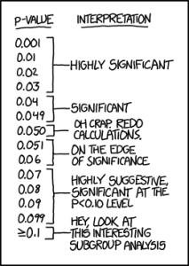

```{r echo=FALSE, message=FALSE}
if(!require(easypackages)){
    install.packages("easypackages")
    library(easypackages)
}
packages("dplyr", "tidyr", prompt = FALSE)
```

See:

https://matloff.wordpress.com/2016/03/07/after-150-years-the-asa-says-no-to-p-values/  
https://matloff.wordpress.com/2016/03/09/further-comments-on-the-asa-manifesto/  
http://www.r-statistics.com/2016/03/its-not-the-p-values-fault-reflections-on-the-recent-asa-statement/  

###Original Article

Sadly, the concept of p-values and significance testing forms the very core of statistics. A number of us have been pointing out for decade that p-values are at best underinformative and often misleading. Almost all statisticians agree on this, yet they all continue to use it and, worse, teach it. I recall a few years ago, when Frank Harrell and I suggested that R place less emphasis on p-values in its output, there was solid pushback. One can’t blame the pusherbackers, though, as the use of p-values is so completely entrenched that R would not be serving its users well with such a radical move.

And yet, wonder of wonders, the American Statistical Association has finally taken a [position against p-values](http://amstat.tandfonline.com/doi/abs/10.1080/00031305.2016.1154108). I never thought this would happen in my lifetime, or in anyone else’s, for that matter, but I say, Hooray for the ASA!

To illustrate the problem, consider the  one of the [MovieLens data sets](http://grouplens.org/datasets/movielens/100k/), consisting of user ratings of movies. There are 949 users. Here is an analysis in which I regress average rating per user against user age and gender:

------
```{r eval=FALSE}
head(uu)
  userid age gender      occup   zip  avg_rat
1      1  24      0 technician 85711 3.610294
2      2  53      0      other 94043 3.709677
3      3  23      0     writer 32067 2.796296
4      4  24      0 technician 43537 4.333333
5      5  33      0      other 15213 2.874286
6      6  42      0  executive 98101 3.635071
q  summary(q)
...
Coefficients:
             Estimate Std. Error t value Pr(>|t|)    
(Intercept) 3.4725821  0.0482655  71.947  < 2e-16 ***
age         0.0033891  0.0011860   2.858  0.00436 ** 
gender      0.0002862  0.0318670   0.009  0.99284    
...
Multiple R-squared:  0.008615,  Adjusted R-squared:  0.006505 
```
------

Woohoo! Double-star significance on age! P-value of only 0.004! Age is a highly-significant predictor of movie ratings! Older people give higher ratings!

Well, no. A 10-year age difference corresponds to only a 0.03 difference in ratings — quite minuscule in light of the fact that ratings take values between 1 and 5.

The problem is that with large samples, significance tests pounce on tiny, unimportant departures from the null hypothesis, in this case H0: βage = 0, and ironically declare this unimportant result “significant.” We have the opposite problem with small samples: The power of the test is low, and we will announce that there is “no significant effect” when in fact we may have too little data to know whether the effect is important.

In addition, there is the hypocrisy aspect. Almost no null hypotheses are true in the real world, so performing a significance test on them is absurd and bizarre.

Speaking of hypocrisy: As noted above, instructors of statistics courses all know of the above problems, and yet teach testing anyway, with little or (likely) no warning about this dangerous method. Those instructors also do testing in their own work.

###Follow-Up Blog Post

Further Comments on the ASA Manifesto

On Tuesday I commented here on the ASA (in their words) “Position on p-values:  context, process, and purpose.” A number of readers replied, some of them positive, some mistakenly thinking I don’t think statistical inferences are needed, and some claiming I overinterpreted the ASA’s statement. I’ll respond in the current post, and will devote most of it to what I believe are the proper alternatives.

First, though, in order to address the question, “What did the ASA really mean?”, I think it may be helpful discuss why the ASA suddenly came out with a statement. What we know is that the ASA statement itself opens with George Cobb’s wonderfully succinct complaint about the vicious cycle we are caught in: “We teach [significance testing] because it’s what we do; we do it because it’s what we teach.” The ASA then cites deep concerns in the literature, with quotes such as “[Significance testing] is science’s dirtiest secret” with “numerous deep flaws.”

As the ASA also points out, none of this is new. However, there is renewed attention, in a more urgent tone than in the past. The ASA notes that part of this is due to the “replicability crisis,” sparked by the Ionnidis paper., which among other things led the ASA to set up a last-minute (one might even say “emergency”) session at JSM 2014. Another impetus was a ban on p-values by a psychology journal (though I’d add that the journal’s statement led some to wonder whether their editorial staff was entirely clear on the issue).

But I also speculate that the ASA’s sudden action came in part because of a deep concern that the world is passing Statistics by, with our field increasingly being seen as irrelevant. I’ve commented on this as being sadly true, and of course many of you will recall then-ASA president Marie Davidian’s plaintive column title, “Aren’t WE Data Science?” I suspect that one of the major motivations for the ASA’s taking a position on p-values was to dispel the notion that statistics is out of data and irrelevant.

In that light, I stand by the title of my blog post on the matter. Granted, I might have used language like “ASA Says [Mostly] No to P-values,” but I believe it was basically a No. Like any statement that comes out of a committee, the ASA phrasing adopts the least common (read most status quo) denominator and takes pains not to sound too extreme, but to me the main message is clear. For example, I believe my MovieLens data example captures the essence of what the ASA said.

What is especially telling is that the ASA gave no examples in which p-values might be profitably used. Their Principle 1 is no more than a mathematical definition, not a recommendation. This is tied to the issue I brought up, that the null hypothesis is nearly always false a priori, which I will return to later in this blog.

Well, then, what should be done instead? Contrary to the impression I seem to have given some readers, I certainly do not advocate using visualization techniques and the like instead of statistical inference. I agree with the classical (though sadly underemphasized) alternative to testing, which is to form confidence intervals.

Let’s go back to my MovieLens example:

----
```{r eval=FALSE}
Coefficients:
             Estimate Std. Error t value Pr(>|t|)
(Intercept) 3.4725821  0.0482655  71.947  < 2e-16 ***
age         0.0033891  0.0011860   2.858  0.00436 **
gender      0.0002862  0.0318670   0.009  0.99284
...
```

--------

The age factor is found to have a “highly significant ” impact on movie rating, but in fact the point estimate, 0.0033891, shows that the impact is negligible; a 10-year difference in age corresponds to about 0.03 point in mean rating, minuscule in view of the fact that ratings range from 1 to 5.

A confidence interval for the true beta coefficient, in this case, (0.0011,0.0057), shows that. Tragically, a big mistake made by many who teach statistics is to check whether such an interval contains 0 — which entirely defeats the purpose of the CI. The proper use of this interval is to note that the interval is near 0, in fact even at its upper bound.

So slavish use of p-values would have led to an inappropriate conclusion here (the ASA’s point), and moreover, once we have that CI, the p-value is useless (my point).

My point was also that we knew a priori that H0: β1 = 0 is false. The true coefficient is not 0.0000000000… ad infinitum. In other words, the fundamental problem — “statistics’ dirtiest secret” — is that the hypothesis test is asking the wrong question.  (I know that some of you have your favorite settings in which you think the null hypothesis really can be true, but I would claim that closer inspection would reveal that that is not the case.) So, not only is the test providing no additional value, once we have a point estimate and standard error, it is often worse than useless, i.e. harmful.

Problems like the above can occur with large samples (though there were only 949 users in the version of the movie data that I used). The opposite can occur with small samples. Let’s use the current U.S. election season. Say a staffer for Candidate X commissions a small poll, and the result is that a CI for p, the population proportion planning to vote for X, is (0.48,0.65). Yes, this contains 0.50, but I submit that the staffer would be remiss in telling X, “There is no significant difference in support between you and your opponent.” The interval is far more informative, in this case more optimistic, than that,

One of the most dramatic examples of how harmful testing can be is a Wharton study in which the authors took real data and added noise variables. In the ensuing regression analysis, lo and behold, the fake predictors were found to be “significant.”

Those of us who teach statistics (which I do, in a computer science context, as well as a member of a stat department long ago) have a responsibility to NOT let our students and our consulting clients follow their natural desire for simple, easy, pat answers, in this case p-values. Interpreting a confidence interval takes some thought, unlike p-values, which automatically make our decisions for us.

All this is fine for straightforward situations such as estimation of a single mean or a single regression coefficent. Unfortunately, though, developing alternatives to testing in more advanced settings can be challenging, even in R.  I always praise R as being “Statistically Correct, written by statisticians for statisticians,” but regrettably, those statisticians are the ones George Cobb complained about, and R is far too testing-oriented.

Consider for instance assessing univariate goodness of fit for some parametric model. Note that I use the word assessing rather than testing, especially important in that the basic R function for the Kolmogorov-Smirnov procedure, ks.test(), is just what its name implies, a test. The R Core Team could easily remedy that, by including an option to return a plottable confidence band for the true CDF. And once again, the proper use of such a band would NOT be to check whether the fitted parametric CDF falls entirely within the band; the model might be quite adequate even if the fitted CDF strays outside the band somewhat in some regions.

Another example is that of log-linear models. This methodology is so fundamentally test-oriented that it may not be clear to some what might be done instead. But really, it’s the same principle: Estimate the parameters and obtain their standard errors. If for example you think a  model with two-way interactions might suffice, estimate the three-way interactions; if they are small relative to the lower-order ones, you might stop at two. (Putting aside here the issue of after-the-fact inference, a problem in any case.)

But even that is not quite straightforward in R (I’ve never used SAS, etc. but they are likely the same).  The loglin() function, for instance,  doesn’t even report the point estimates unless one pro-actively requests them — and even if requested, no standard errors are available. If one wants the latter, one must use glm() with the “Poisson trick.”

In the log-linear situation, one might just informally look at standard errors, but if one wants formal CIs on many parameters, one must use simultaneous inference techniques, which brings me to my next topic.

The vast majority of those techniques are, once again, test-oriented.  One of the few, the classic Scheffe’ method, is presented in unnecessarily restrictive form in textbooks (linear model, normality of Y, homoscedasticity, F-statistic and so on).  But with suitable centering and scaling, quadratic forms of asymptotically normally distributed vectors have an asymptotic chi-squared distribution, which can be used to get approximate simultaneous confidence intervals.  R should add a function to do this on vcov() output.

In short, there is a lot that could be done, in our teaching, practice and software. Maybe the ASA statement will inspire some in that direction.

####Another Blog Article

#####It's not the p-values' fault - reflections on the recent ASA statement (+relevant R resources)

#####Summary

The ASA statement about the misuses of the p-value singles it out. It is just as well relevant to the use of most other statistical methods: context matters, no single statistical measure suffices, specific thresholds should be avoided and reporting should not be done selectively. The latter problem is discussed mainly in relation to omitted inferences. We argue that the selective reporting of inferences problem is serious enough a problem in our current industrialized science even when no omission takes place. Many R tools are available to address it, but they are mainly used in very large problems and are grossly underused in areas where lack of replicability hits hard.



#####Preface - the ASA released a statement about the p-value

A few days ago the ASA released a statement titled "on p-values: context, process, and purpose". It was a way for the ASA to address the concerns about the role of Statistics in the Reproducibility and Replicability (R&R) crisis. In the discussions about R&R the p-value has become a scapegoat, being such a widely used statistical method. The ASA statement made an effort to clarify various misinterpretations and to point at misuses of the p-value, but we fear that the result is a statement that might be read by the target readers as expressing very negative attitude towards the p-value. And indeed, just two days after the release of the ASA statement, a blog post titled "After 150 Years, the ASA Says No to p-values" was published (by Norman Matloff), even though the ASA (as far as we read it) did not say "no to P-values" anywhere in the statement. Thankfully, other online reactions to the ASA statements, such as the article in Nature, and other posts in the blogosphere (see [1], [2], [3], [4], [5]), did not use an anti-p-value rhetoric.

#####Why the p-value was (and still is) valuable

In spite of its misinterpretations, the p-value served science well over the 20th century. Why? Because in some sense the p-value offers a first defense line against being fooled by randomness, separating signal from noise. It requires simpler (or fewer) models than those needed by other statistical tool. The p-value requires (in order to be valid) only a statistical model for the behavior of a statistic under the null hypothesis to hold. Even if a model of an alternative hypothesis is used for choosing a "good" statistic (which would be used for constructing a p-value with decent power for an alternative of interest), this alternative model does not have to be correct in order for the p-value to be valid and useful (i.e.: control type I error at the desired level while offering some power to detect a real effect). In contrast, other (wonderful, useful and complementary) statistical methods such as Likelihood ratios, effect size estimation, confidence intervals, or Bayesian methods all need the assumed models to hold over a wider range of situations, not merely under the tested null.  In the context of the "replicability crisis" in science, the type I error control of the p-value under the null hypothesis is an important property. And most importantly, the model needed for the calculation of the p-value may be guaranteed to hold under an appropriately designed and executed randomized experiment.

The p-value is a very valuable tool, but it should be complemented - not replaced - by confidence intervals and effect size estimators (as is possible in the specific setting). The ends of a 95% confidence interval indicates a range of potential null hypothesis that could be rejected. An estimator of effect size (supported by an assessment of uncertainty) is crucial for interpretation and for assessing the scientific significance of the results.

While useful, all these types of inferences are also affected by similar problems as the p-values do. What level of likelihood ratio in favor of the research hypothesis will be acceptable to the journal? or should scientific discoveries be based on whether posterior odds pass a specific threshold? Does either of them measure the size of the effect? Finally, 95% confidence intervals or credence intervals offer no protection against selection when only those that do not cover 0, are selected into the abstract. The properties each method has on the average for a single parameter (level, coverage or unbiased) will not necessarily hold even on the average when a selection is made.

#####The p-value (and other methods) in the new era of "industrialized science"

What, then, went wrong in the last decade or two? The change in the scale of the scientific work, brought about by high throughput experimentation methodologies, availability of large databases and ease of computation, a change that parallels the industrialization that production processes have already gone through. In Genomics, Proteomics, Brain Imaging and such, the number of potential discoveries scanned is enormous so the selection of the interesting ones for highlighting is a must. It has by now been recognized in these fields that merely "full reporting and transparency" (as recommended by ASA) is not enough, and methods should be used to control the effect of the unavoidable selection. Therefore, in those same areas, the p-value bright-line is not set at the traditional 5% level. Methods for adaptively setting it to directly control a variety of false discovery rates or other error rates are commonly used.

Addressing the effect of selection on inference (be it when using p-value, or other methods) has been a very active research area; New strategies and sophisticated selective inference tools for testing, confidence intervals, and effect size estimation, in different setups are being offered. Much of it still remains outside the practitioners' active toolset, even though many are already available in R, as we describe below. The appendix of this post contains a partial list of R packages that support simultaneous and selective inference.

In summary, when discussing the impact of statistical practices on R&R, the p-value should not be singled out nor its usage discouraged: it's more likely the fault of selection, and not the p-values' fault.

$$$$$Appendix - R packages for Simultaneous and Selective Inference ("SASI" R packages)

Extended support for classical and modern adjustment for Simultaneous and Selective Inference (also known as "multiple comparisons") is available in R and in various R packages. Traditional concern in these areas has been on properties holding simultaneously for all inferences. More recent concerns are on properties holding on the average over the selected, addressed by varieties of false discovery rates, false coverage rates and conditional approaches. The following is a list of relevant R resources. If you have more, please mention them in the comments.

Every R installation offers functions (from the {stats} package) for dealing with multiple comparisons, such as: 

- adjust - that gets a set of p-values as input and returns p-values adjusted using one of several methods: Bonferroni, Holm (1979), Hochberg (1988), Hommel (1988), FDR by Benjamini & Hochberg (1995), and Benjamini & Yekutieli (2001),
- t.test, pairwise.wilcox.test, and pairwise.prop.test - all rely on p.adjust and can calculate pairwise comparisons between group levels with corrections for multiple testing.
- TukeyHSD- Create a set of confidence intervals on the differences between the means of the levels of a factor with the specified family-wise probability of coverage. The intervals are based on the Studentized range statistic, Tukey's 'Honest Significant Difference' method.

Once we venture outside of the core R functions, we are introduced to a wealth of R packages and statistical procedures. What follows is a partial list (if you wish to contribute and extend this list, please leave your comment to this post):

- multcomp - Simultaneous tests and confidence intervals for general linear hypotheses in parametric models, including linear, generalized linear, linear mixed effects, and survival models. The package includes demos reproducing analyzes presented in the book "Multiple Comparisons Using R" (Bretz, Hothorn, Westfall, 2010, CRC Press).
- coin (+RcmdrPlugin.coin)- Conditional inference procedures for the general independence problem including two-sample, K-sample (non-parametric ANOVA), correlation, censored, ordered and multivariate problems.
- SimComp - Simultaneous tests and confidence intervals are provided for one-way experimental designs with one or many normally distributed, primary response variables (endpoints).
- PMCMR - Calculate Pairwise Multiple Comparisons of Mean Rank Sums
- mratios - perform (simultaneous) inferences for ratios of linear combinations of coefficients in the general linear model.
- mutoss (and accompanying mutossGUI) - are designed to ease the application and comparison of multiple hypothesis testing procedures.
- nparcomp - compute nonparametric simultaneous confidence intervals for relative contrast effects in the unbalanced one way layout. Moreover, it computes simultaneous p-values.
- ANOM - The package takes results from multiple comparisons with the grand mean (obtained with 'multcomp', 'SimComp', 'nparcomp', or 'MCPAN') or corresponding simultaneous confidence intervals as input and produces ANOM decision charts that illustrate which group means deviate significantly from the grand mean.
- gMCP - Functions and a graphical user interface for graphical described multiple test procedures.
- MCPAN - Multiple contrast tests and simultaneous confidence intervals based on normal approximation.
- mcprofile - Calculation of signed root deviance profiles for linear combinations of parameters in a generalized linear model. Multiple tests and simultaneous confidence intervals are provided.
- factorplot - Calculate, print, summarize and plot pairwise differences from GLMs, GLHT or Multinomial Logit models. Relies on stats::p.adjust
- multcompView - Convert a logical vector or a vector of p-values or a correlation, difference, or distance matrix into a display identifying the pairs for which the differences were not significantly different. Designed for use in conjunction with the output of functions like TukeyHSD, dist{stats}, simint, simtest, csimint, csimtest{multcomp}, friedmanmc, kruskalmc{pgirmess}.
- discreteMTP - Multiple testing procedures for discrete test statistics, that use the known discrete null distribution of the p-values for simultaneous inference.
- someMTP - a collection of functions for Multiplicity Correction and Multiple Testing.
- hdi - Implementation of multiple approaches to perform inference in high-dimensional models
- ERP - Significance Analysis of Event-Related Potentials Data
- TukeyC - Perform the conventional Tukey test from aov and aovlist objects
- qvalue - offers a function which takes a list of p-values resulting from the simultaneous testing of many hypotheses and estimates their q-values and local FDR values. (reading this discussion thread might be helpful)
.fdrtool - Estimates both tail area-based false discovery rates (Fdr) as well as local false discovery rates (fdr) for a variety of null models (p-values, z-scores, correlation coefficients, t-scores).
- cp4p - Functions to check whether a vector of p-values respects the assumptions of FDR (false discovery rate) control procedures and to compute adjusted p-values.
- multtest - Non-parametric bootstrap and permutation resampling-based multiple testing procedures (including empirical Bayes methods) for controlling the family-wise error rate (FWER), generalized family-wise error rate (gFWER), tail probability of the proportion of false positives (TPPFP), and false discovery rate (FDR).
- selectiveInference - New tools for post-selection inference, for use with forward stepwise regression, least angle regression, the lasso, and the many means problem.
- PoSI (site) - Valid Post-Selection Inference for Linear LS Regression
.HWBH- A shiny app for hierarchical weighted FDR testing of primary and secondary endpoints in Medical Research. By Benjamini Y & Cohen R, 2013. Top of Form
- repfdr(@github)-  estimation of Bayes and local Bayes false discovery rates for replicability analysis.  Heller R, Yekutieli D, 2014
- SelectiveCI : An R package for computing confidence intervals for selected parameters as described in Asaf Weinstein, William Fithian & Yoav Benjamini,2013 and Yoav Benjamini, Daniel Yekutieli,2005
- Rvalue- Software for FDR testing for replicability in primary and follow-up endpoints.  Heller R, Bogomolov M, Benjamini Y, 2014   "Deciding whether follow-up studies have replicated findings in a preliminary large-scale "omics' study", under review and available upon request from the first author. Bogomolov M, Heller R, 2013

Other than Simultaneous and Selective Inference, one should also mention that there are many R packages for reproducible research, i.e.: the connecting of data, R code, analysis output,  and interpretation - so that scholarship can be recreated, better understood and verified. As well as for meta analysis, i.e.: the combining of findings from independent studies in order to make a more general claim.


